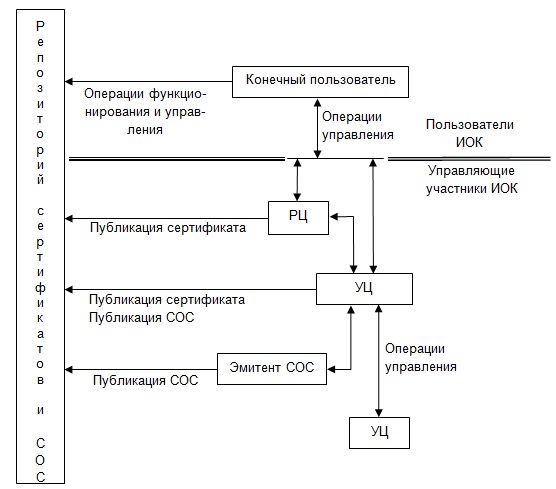
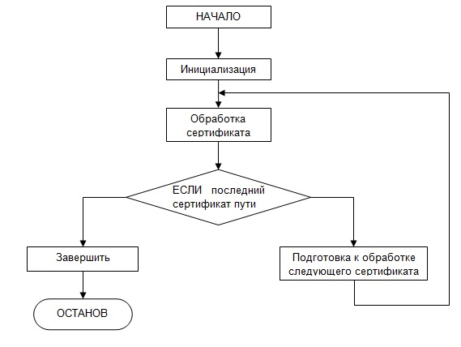

-------------------------------------------------------------------------------
**СТБ 34.101.19-2012**

**Информационные технологии и безопасность**

**ФОРМАТЫ СЕРТИФИКАТОВ И СПИСКОВ ОТОЗВАННЫХ СЕРТИФИКАТОВ ИНФРАСТРУКТУРЫ 
ОТКРЫТЫХ КЛЮЧЕЙ**

**Information technology and security**

**Public key infrastructure certificate and certificate revocation list 
profile**

-------------------------------------------------------------------------------
      
# Содержание

[1 Область применения](#logo)

[2 Нормативные ссылки](#refs)

[3 Термины и определения](#terms)

[4 Обозначения и сокращения](#defs)

[5 Общие положения](#common)

[5.1 Обзор инфраструктуры открытых ключей](#common1)

[5.2 Маршруты сертификации и доверие](#common2)

[5.3 Отзыв сертификатов](#common3)

[5.4 Протоколы управления](#common4)

[6 Описание формата сертификата и расширений сертификата](#cert)

[6.1 Базовые компоненты сертификата](#cert1)

[6.2 Расширения сертификатов](#cert2)

[7 Описание списка отозванных сертификатов и его расширений](#crl)

[7.1 Компоненты списка отозванных сертификатов](#crl1)

[7.2 Расширения СОС](#crl2)

[7.3 Расширения записей СОС](#crl3)

[8 Верификация маршрута сертификации](#path)

[8.1 Базовая верификация маршрута](#path1)

[8.2 Использование алгоритма верификации маршрута](#path2)

[8.3 Верификация СОС](#path3)

[9 Правила обработки интернационализированных имен](#9)

[9.1 Интернационализированные имена в уникальных именах](#names1)

[9.2 Интернационализированные доменные имена в GeneralName](#names2)

[9.3 Интернационализированные доменные имена в уникальных именах](#names3)

[9.4 Интернационализированные идентификаторы ресурсов](#names4)

[9.5 Интернационализированные адреса электронной почты](#names5)

[10 Рассмотрение вопросов безопасности](#sec)

[Приложение А (обязательное) Модуль АСН.1](#app1)

[Приложение Б (обязательное) Примечания АСН.1](#app2)

[Приложение В (обязательное)  Трактование ключевых слов](#app3)

[Приложение Г (справочное) Типы АСН.1 для СТБ 1176.2](#app4)

[Приложение Д (справочное) Примеры](#app5)

[Библиография](#bib)
        
# 1 <a name="logo"></a>Область применения

Настоящий стандарт устанавливает форматы сертификатов и списков отозванных 
сертификатов инфраструктуры открытых ключей и определяет процедуры 
проверки их подлинности. 

Настоящий стандарт применяется при разработке, испытаниях и эксплуатации 
систем управления открытыми ключами. 

# 2 <a name="refs"></a>Нормативные ссылки

В настоящем стандарте использованы ссылки на следующие технические 
нормативные правовые акты в области технического нормирования и 
стандартизации (далее – ТНПА): 

СТБ 34.101.26-2012 Информационные технологии и безопасность. Онлайновый 
протокол проверки статуса сертификата (OCSP) 

СТБ 34.101.31-2011 Информационные технологии. Защита информации. 
Криптографические алгоритмы шифрования и контроля целостности 

СТБ 1176.1-99 Информационная технология. Защита информации. Функция 
хэширования 

СТБ 1176.2-99 Информационная технология. Защита информации. Процедуры 
выработки и проверки электронной цифровой подписи 

ГОСТ 34.973-91 (ИСО 8824-87) Информационная технология. Взаимосвязь 
открытых систем. Спецификация абстрактно-синтаксической нотации версии 1 
(АСН.1) 

ГОСТ 34.974-91 (ИСО 8825-87) Информационная технология. Взаимосвязь 
открытых систем. Описание базовых правил кодирования для 
абстрактно-синтаксической нотации версии 1 (АСН.1) 

>Примечание – При пользовании настоящим стандартом целесообразно проверить 
действие ТНПА по каталогу, составленному по состоянию на 1 января текущего 
года, и по соответствующим информационным указателям, опубликованным в 
текущем году. 
Если ссылочные ТНПА заменены (изменены), то при пользовании настоящим 
стандартом следует руководствоваться замененными (измененными) ТНПА. Если 
ссылочные ТНПА отменены без замены, то положение, в котором дана ссылка на 
них, применяется в части, не затрагивающей эту ссылку. 

# 3 <a name="terms"></a>Термины и определения

В настоящем стандарте применяют термины, установленные в ГОСТ 34.973 и 
ГОСТ 34.974, а также следующие термины с соответствующими определениями: 

**3.1 базовый список отозванных сертификатов:** Список отозванных 
сертификатов, выпущенный в качестве основы для генерации приращений списка 
отозванных сертификатов. 

**3.2 верификация маршрута сертификации; проверка сертификата:** Процесс 
проверки того, что сертификат был действителен в заданный момент времени, 
включающий создание и обработку маршрута сертификации и проверку того, что 
все сертификаты в данном маршруте были действительны (в том числе не были 
просрочены или отозваны) в указанный момент времени. 

**3.3 владелец личного ключа:** Организация или физическое лицо, осуществившие 
надлежащую выработку личного ключа и соответствующего открытого ключа. 

**3.4 инфраструктура открытых ключей:** Инфраструктура, позволяющая управлять 
открытыми ключами для поддержки услуг аутентификации, контроля 
целостности, обеспечения конфиденциальности и (или) невозможности отказа 
от авторства. 

**3.5 конечный пользователь:** Субъект сертификата открытого ключа, 
использующий свой личный ключ для целей, отличных от подписания 
сертификатов. 

**3.6 косвенный список отозванных сертификатов:** Список отозванных 
сертификатов, содержащий записи об отозванных сертификатах, выпущенных 
удостоверяющими центрами, отличными от эмитента списка отозванных 
сертификатов. 

**3.7 криптографический алгоритм:** Алгоритм преобразования объектов, 
направленный на обеспечение их конфиденциальности, контроля целостности 
или подлинности, в том числе алгоритм управления криптографическими 
ключами. 

**3.8 криптографический ключ:** Параметр, используемый вместе с 
криптографическим алгоритмом для управления операциями зашифрования и 
расшифрования, вычисления и проверки электронной цифровой подписи, 
выработки и проверки имитовставки, выработки псевдослучайных данных, 
выработки совместно используемой конфиденциальной информации. 

**3.9 кросс-сертификат:** Сертификат удостоверяющих центров, в которых эмитент 
и субъект сертификата являются двумя разными удостоверяющими центрами; 
кросс-сертификаты указывают на доверенные отношения между двумя 
удостоверяющими центрами. 

**3.10 личный ключ:** Криптографический ключ, используемый вместе с 
криптографическим алгоритмом с открытым ключом, который однозначно связан 
с конкретной стороной (организацией или физическим лицом) и не является 
общедоступным. 

**3.11 маршрут сертификации:** Упорядоченная последовательность (цепочка) 
сертификатов, которая начинается в точке доверия и заканчивается на 
сертификате, подлежащем проверке; эмитентом каждого сертификата в цепочке 
является субъект сертификата, предыдущего в цепочке. 

**3.12 открытый ключ:** Криптографический ключ, используемый вместе с 
криптографическим алгоритмом с открытым ключом, который однозначно связан 
с конкретной стороной (организацией или физическим лицом) и является 
общедоступным. 

**3.13 приращение списка отозванных сертификатов:** Список отозванных 
сертификатов, содержащий только записи о сертификатах, статус отзыва 
которых был изменен с момента выдачи соответствующего базового списка 
отозванных сертификатов. 

**3.14 полный список отозванных сертификатов:** Список отозванных 
сертификатов, содержащий записи обо всех отозванных сертификатах из 
области применения списка отозванных сертификатов. 

**3.15 пользователь сертификата; доверяющая сторона; проверяющая сторона:** 
Организация или физическое лицо, которым необходимо достоверно знать 
атрибуты или открытый ключ другой стороны и которым владелец 
соответствующего открытого ключа или удостоверяющий центр предоставил 
сертификат для проверки. 

**3.16 регистрационный центр:** Поставщик услуг достоверного подтверждения 
принадлежности открытого ключа определенным организации или физическому 
лицу. 

**3.17 репозиторий:** Информационная система, в которой хранятся сертификаты и 
списки отозванных сертификатов, предназначенная для их распространения 
конечным пользователям. 

**3.18 самоизданный сертификат:** Сертификат удостоверяющего центра, в котором 
эмитент и субъект являются одной и той же стороной. 

**3.19 самоподписанный сертификат:** Самоизданный сертификат, электронная 
цифровая подпись которого может быть проверена с помощью открытого ключа 
из данного сертификата. 

**3.20 сертификат конечного пользователя:** Сертификат открытого ключа, 
выданный конечному пользователю. 

**3.21 сертификат открытого ключа:** Структура данных, содержащая информацию, 
подтверждающую принадлежность указанного в ней открытого ключа 
определенной стороне, а также иную информацию, и подписанная электронной 
цифровой подписью с использованием личного ключа издавшего его 
удостоверяющего центра. 

**3.22 сертификат удостоверяющего центра:** Сертификат, выданный 
удостоверяющему центру другим удостоверяющим центром. 

**3.23 список отозванных сертификатов:** Подписанный электронной цифровой 
подписью список, в котором указаны сертификаты, действие которых 
прекращено досрочно. 

**3.24 субъект сертификата:** Владелец личного ключа, связанного с открытым 
ключом, указанным в сертификате. 

**3.25 точка доверия:** Совокупность следующей информации: доверенное значение 
открытого ключа, уникальное имя владельца соответствующего личного ключа 
(например, субъект удостоверяющего центра), идентификатор алгоритма 
электронной цифровой подписи, параметры открытого ключа (если они имеются) 
и период действия ключа (если он установлен). 

>Примечание – Точка доверия может быть представлена в форме 
самоподписанного сертификата. Пользователь сертификата доверяет указанной 
информации и использует ее для верификации других сертификатов в маршруте 
сертификации. 

**3.26 удостоверяющий центр:** Поставщик услуг издания, распространения и 
хранения сертификатов открытых ключей и списков отозванных сертификатов. 

**3.27 хэширование:** Выработка хэш-значений. 

**3.28 хэш-значение:** Контрольная характеристика, которая определяется без 
использования ключа и служит для контроля целостности данных и для 
представления данных в сжатой форме. 

**3.29 электронная цифровая подпись:** Контрольная характеристика, которая 
определяется с использованием личного ключа, проверяется с использованием 
открытого ключа и служит для контроля целостности и подлинности данных и 
обеспечивает невозможность отказа от авторства. 

**3.30 эмитент:** Сторона, которая издала сертификат или список отозванных 
сертификатов. 

# 4 <a name="defs"></a>Обозначения и сокращения

В настоящем стандарте применяют следующие сокращения:

ИО – идентификатор объекта АСН.1;

ИОК – инфраструктура открытых ключей;

ОК – открытый ключ;

ПР – пункт распространения;

ПСОС – приращение списка отозванных сертификатов;

РЦ – регистрационный центр;

СОК – сертификат открытого ключа;

СОС – список отозванных сертификатов;

УИ – уникальное имя;

УЦ – удостоверяющий центр;

ЭЦП – электронная цифровая подпись.

Для определения типов АСН.1 применяются обозначения, заданные в ГОСТ 
34.973. 

В настоящем стандарте ключевые слова «ДОЛЖЕН», «НЕЛЬЗЯ», «ТРЕБУЕТСЯ», 
«БУДЕТ», «НЕ БУДЕТ», «СЛЕДУЕТ», «НЕ СЛЕДУЕТ», «РЕКОМЕНДУЕТСЯ», «МОЖЕТ» и 
«НЕОБЯЗАТЕЛЬНО», выделенные прописными буквами, должны интерпретироваться, 
как описано в приложении [В](#app3). 

# 5 <a name="common"></a>Общие положения

## 5.1 <a name="common1"></a>Обзор инфраструктуры открытых ключей

ИОК может использоваться программным обеспечением, требующим проведения 
аутентификации, контроля целостности, обеспечения конфиденциальности и 
(или) невозможности отказа от авторства. 

Связь открытого ключа с его владельцем обеспечивает УЦ при помощи 
структуры данных с ЭЦП, называемой сертификатом открытого ключа. Проверка 
УЦ того, что пользователь владеет личным ключом, соответствующим открытому 
ключу, может основываться на применении протоколов (также известных как 
алгоритмы доказательства владения), на предъявлении личного ключа или на 
утверждении владельца открытого и личного ключа. Сертификат имеет 
ограниченный срок действия, который указан в его содержимом. Поскольку ЭЦП 
сертификата и срок его действия могут быть самостоятельно проверены 
пользователем, использующим СОК, сертификаты могут передаваться по 
небезопасным каналам передачи данных и храниться в незащищенных 
хранилищах. В настоящем стандарте определяется формат СОК, включая способ 
его расширения и совокупность стандартных расширений. Если по какой-либо 
причине УЦ отзывает ранее выданный СОК, пользователи должны иметь 
возможность узнать о том, что отзыв имел место, чтобы не использовать 
сертификат, к которому отсутствует доверие. СОС являются одним из 
способов, которые могут быть использованы для уведомления пользователей об 
отзыве. В настоящем стандарте определяется формат СОС, включая способ его 
расширения и совокупность расширений СОС. Как для СОК, так и для СОС могут 
также определяться дополнительные расширения, которые окажутся полезными в 
конкретных приложениях. 

Пользователь, использующий СОК, должен осуществлять проверку подлинности 
сертификата перед его использованием. Настоящий стандарт определяет 
процедуры для выполнения этой проверки, включая контроль целостности 
сертификата, проверку его статуса и соответствия планируемой области 
использования. 

На рисунке [1](#fig1) приведены основные операции взаимодействия объектов ИОК.



**Рисунок 1<a name="fig1"></a> – Основные операции взаимодействия объектов 
ИОК**

## 5.2 <a name="common2"></a>Маршруты сертификации и доверие

Пользователь, которому требуется информация об открытом ключе, должен 
проверить подлинность сертификата, содержащего требуемый открытый ключ. 
Если у пользователя нет доверенного значения открытого ключа УЦ, который 
подписал сертификат, названия УЦ и связанной с ним информации (такой как 
срок действия или ограничения, накладываемые на имена), то для проверки 
СОК может понадобиться дополнительный сертификат. В общем случае 
необходима цепочка сертификатов, включающая проверяемый сертификат, 
подписанный одним из УЦ, и, возможно, дополнительные сертификаты УЦ, 
подписанные другими УЦ. Такие цепочки, называемые маршрутами сертификации, 
требуются потому, что пользователь открытого ключа изначально имеет только 
ограниченное число доверенных значений открытых ключей, принадлежащих УЦ. 

Настоящий стандарт определяет два класса сертификатов: сертификаты УЦ и 
сертификаты конечных пользователей. Сертификаты УЦ, в свою очередь, могут 
быть подразделены на три класса: кросс-сертификаты, самоизданные 
сертификаты и самоподписанные сертификаты. Кросс-сертификаты – это 
сертификаты УЦ, в которых эмитент и субъект СОК являются двумя разными 
сторонами. Кросс-сертификаты указывают на доверенные отношения между двумя 
УЦ. Самоизданные сертификаты – это сертификаты УЦ, в которых эмитент и 
субъект являются одной и той же стороной. Такие сертификаты выдаются для 
внесения изменений в политику или деятельность УЦ. Самоподписанные 
сертификаты – это самоизданные сертификаты, ЭЦП которых может быть 
проверена с помощью открытого ключа из данного сертификата. 
Самоподписанные сертификаты служат для использования открытого ключа в 
качестве начала маршрута сертификации, т. е. точки доверия. Сертификаты 
конечных пользователей выдаются субъектам, не уполномоченным выдавать 
сертификаты. 

## 5.3 <a name="common3"></a>Отзыв сертификатов

При выдаче сертификата предполагается, что сертификат может быть 
использован на протяжении всего срока его действия. Однако вследствие 
различных обстоятельств сертификат может стать недействительным до 
истечения срока его действия. Такими обстоятельствами могут быть смена 
имени, изменение характера связи субъекта с УЦ (например, служащий 
разрывает контракт с организацией), а также компрометация или подозрение 
на компрометацию соответствующего личного ключа. При таких обстоятельствах 
УЦ должен отозвать сертификат. 

В настоящем стандарте представлен один способ отзыва сертификатов – каждый 
УЦ периодически выпускает подписанную структуру данных, которая называется 
списком отозванных сертификатов. СОС – это общедоступный список с отметкой 
времени, подписанный УЦ или эмитентом СОС, в котором указаны отозванные 
сертификаты. Каждый отозванный сертификат может быть найден в СОС по 
своему серийному номеру. Каждая информационная система, использующая 
сертификат, не только проверяет целостность и срок действия сертификата, 
но и обращается к допустимому по сроку действия СОС для подтверждения 
того, что серийный номер сертификата отсутствует в данном списке. Значение 
«допустимый по сроку действия» может отличаться в разных системах, но 
обычно оно означает самый последний выпущенный СОС. Новый СОС выпускается 
периодически (например, ежечасно, ежедневно, еженедельно). Запись 
добавляется в СОС при следующем обновлении списка после уведомления о 
необходимости отзыва СОК. Запись об отзыве НЕ ДОЛЖНА удаляться из СОС до 
того, пока она не появится в одном СОС, выпущенном после окончания срока 
действия отозванного сертификата. 

Достоинством такого способа отзыва является то, что СОС могут 
распространяться таким же образом, что и сертификаты: через небезопасные 
каналы передачи данных и незащищенные хранилища. 

Ограничением для способа отзыва с помощью СОС является то, что 
периодичность процесса отзыва ограничена периодичностью выпуска СОС. 
Например, если отзыв зарегистрирован в данный момент, системы, 
использующие сертификаты, не получат сообщения о нем, пока все выпущенные 
списки СОС не будут обновлены; это может занять час, день, неделю – в 
зависимости от частоты выпуска СОС. 

Настоящий стандарт не накладывает ограничений на выпуск СОС. В других 
стандартах ИОК, например в СТБ 34.101.26, описаны форматы сообщений и 
протоколы, поддерживающие онлайн-сообщения об отзывах, которые могут 
применяться в качестве альтернативы СОС. Интерактивная проверка отзывов 
СОК может значительно сократить период между регистрацией отзыва и 
передачей информации о нем другим сторонам. Как только УЦ признает 
подлинность и действительность отзыва, любой запрос в интерактивную службу 
точно отразит статус сертификата. Однако альтернативные способы 
накладывают новые требования к безопасности: при интерактивной проверке 
действительности сертификата необходимо доверять интерактивной службе 
верификации, тогда как репозиторий не обязательно должен быть доверенным. 

## 5.4 <a name="common4"></a>Протоколы управления

Протоколы управления необходимы для поддержки интерактивного 
взаимодействия между пользователями ИОК и системами управления ключами. 
Например, протокол управления может использоваться между УЦ и клиентским 
программным обеспечением или между двумя УЦ, выпустившими 
кросс-сертификаты друг для друга. Протоколы управления поддерживают 
следующие функции: 

а) регистрация: процесс, когда пользователь впервые предоставляет УЦ 
данные о себе (напрямую или через РЦ) прежде, чем УЦ выдаст данному 
пользователю сертификат(ы); 

б) инициализация: прежде, чем клиентское программное обеспечение сможет 
работать безопасно, необходимо инсталлировать ключевую информацию, которая 
связана с ключами ИОК. Например, пользователь должен безопасно 
инициализировать открытый ключ УЦ и другую достоверную информацию о 
доверенном УЦ для использования их в процессе верификации маршрута 
сертификации. Более того, пользователю обычно требуется инициализация 
собственной пары личный-открытый ключ. 

в) выпуск СОК: УЦ выдает сертификат для ОК пользователя, возвращает этот 
сертификат в клиентское программное обеспечение пользователя и/или 
размещает этот сертификат в репозитории; 

г) восстановление пары ключей: существует возможность резервного 
копирования ключевой информации пользователя (например, личного ключа 
пользователя для шифрования) УЦ или системой резервного копирования 
ключей; 

д) обновление пар ключей: необходимо периодически обновлять все пары 
ключей, т. е. заменять их новыми парами и выпускать новые сертификаты; 

е) запрос на отзыв: уполномоченное лицо извещает УЦ о непредвиденной 
ситуации и запрашивает отзыв сертификата; 

ж) выпуск кросс-сертификатов: два УЦ обмениваются информацией, необходимой 
для создания кросс-сертификата. Кросс-сертификат выдается одним УЦ другому 
УЦ и содержит открытый ключ ЭЦП, используемый для выдачи сертификатов. 

Онлайновые протоколы не являются единственным способом выполнения 
вышеописанных функций. Для выполнения всех функций могут применяться 
способы, которые позволяют достичь тех же результатов без интерактивного 
взаимодействия. Настоящий стандарт не обязывает использовать онлайновые 
протоколы. Например, при использовании аппаратно-программных средств 
криптографической защиты информации (токенов) многие функции могут быть 
выполнены при физической доставке токена. Кроме того, некоторые из 
описанных выше функций могут быть совмещены в одном протоколе. 

# 6 <a name="cert"></a>Описание формата сертификата и расширений сертификата

В настоящем разделе содержится описание формата сертификата открытого 
ключа. Использование данного формата обеспечивает совместимость 
информационных систем и позволяет многократно использовать программное 
обеспечение ИОК в различных приложениях. 

## 6.1 <a name="cert1"></a>Базовые компоненты сертификата

В настоящем подразделе определен формат СОК, соответствующий третьей 
версии сертификатов X.509 [[1]](#bib1). Для вычисления ЭЦП данные, которые должны 
быть подписаны, кодируются с использованием правил кодирования, заданных в 
ГОСТ 34.974, [[4]](#bib4) и уточненных в приложении [Б](#app2). 

 
    Certificate ::= SEQUENCE {
        tbsCertificate      TBSCertificate,
        signatureAlgorithm  AlgorithmIdentifier,
        signatureValue      BIT STRING }
        
    TBSCertificate ::= SEQUENCE {
        version             [0] EXPLICIT Version DEFAULT v1,
        serialNumber            CertificateSerialNumber,
        signature               AlgorithmIdentifier,
        issuer                  Name,
        validity                Validity,
        subject                 Name,
        subjectPublicKeyInfo    SubjectPublicKeyInfo,
        issuerUniqueID      [1] IMPLICIT UniqueIdentifier OPTIONAL,
        -- Если присутствует версия, она ДОЛЖНА БЫТЬ v2 или v3
        subjectUniqueID     [2] IMPLICIT UniqueIdentifier OPTIONAL,
        -- Если присутствует версия, она ДОЛЖНА БЫТЬ v2 или v3
        extensions          [3] EXPLICIT Extensions OPTIONAL
        -- Если присутствует версия, она ДОЛЖНА БЫТЬ v3
    }
        
    Version ::= INTEGER { v1(0), v2(1), v3(2) }

    CertificateSerialNumber ::= INTEGER

    Validity ::= SEQUENCE {
        notBefore  Time,
        notAfter  Time }

    Time ::= CHOICE {
        utcTime  UTCTime,
        generalTime  GeneralizedTime }

    UniqueIdentifier ::= BIT STRING

    SubjectPublicKeyInfo ::= SEQUENCE {
        algorithm    AlgorithmIdentifier,
        subjectPublicKey  BIT STRING }

    Extensions ::= SEQUENCE SIZE (1..MAX) OF Extension

    Extension ::= SEQUENCE  {
        extnID    OBJECT IDENTIFIER,
        critical  BOOLEAN DEFAULT FALSE,
        extnValue  OCTET STRING
        -- содержит `DER` представление ASN.1 значения,
        -- соответствующего типу расширения, заданного extnID }
       
### <a name="cert11"></a>6.1.1 Компоненты сертификата

Сертификат имеет тип `SEQUENCE` и представляет собой последовательность 
трех обязательных компонентов. Эти компоненты описаны ниже в следующих 
пунктах. 

#### <a name="cert111"></a>6.1.1.1 Компонент `tbsCertificate` 

Данный компонент содержит названия субъекта и эмитента, открытый ключ 
субъекта, период действия и иную информацию. В [6.1.2](#cert12) содержится подробное 
описание данных компонентов. Компонент `tbsCertificate` обычно включает в 
себя расширения, описанные в [6.2](#cert2). 

#### <a name="cert112"></a>6.1.1.2 Компонент `signatureAlgorithm` (идентификатор алгоритма ЭЦП)

Данный компонент содержит идентификатор криптографического алгоритма, 
который УЦ использовал для подписи сертификата. Данный стандарт включает 
приложения, в которых определяются поддерживаемые криптографические 
алгоритмы ЭЦП, однако МОГУТ поддерживаться и другие алгоритмы ЭЦП. 

Идентификатор алгоритма определяется следующим типом АСН.1:

    AlgorithmIdentifier ::= SEQUENCE {
              algorithm  OBJECT IDENTIFIER,
              parameters  ANY DEFINED BY algorithm OPTIONAL }
      
Компонент `algorithm` типа `OBJECT IDENTIFIER` определяет алгоритм 
(например, СТБ 1176.2). Содержание компонента `parameters` с 
дополнительными параметрами алгоритма отличается в зависимости от того, 
какой алгоритм был определен (см. приложение [Г](#app4)). 

В данном компоненте ДОЛЖЕН содержаться такой же идентификатор алгоритма, 
как и в компоненте `signature` типа `tbsCertificate` (см. [6.1.2.3](#cert123)). 

#### <a name="cert113"></a>6.1.1.3 Компонент `signatureValue` (значение ЭЦП)

В компоненте `signatureValue` содержится значение ЭЦП, вычисленной от 
кодированного значения `tbsCertificate`. При кодировании должны 
использоваться отличительные правила, определенные в приложении [Б](#app2). 
Вычисленное значение ЭЦП преобразуется к типу `BIT STRING` и записывается в 
компонент `signatureValue`. Для каждого криптографического алгоритма ЭЦП 
имеется описание процесса преобразования (см. приложение [Г](#app4)). 

Вычисляя ЭЦП, УЦ подтверждает подлинность информации в компоненте 
`tbsCertificate`. В частности, УЦ подтверждает соответствующую связь между 
открытым ключом и субъектом (владельцем) сертификата. 

### 6.1.2 <a name="cert12"></a>Тип `TBSCertificate`

Тип `TBSCertificate` содержит информацию о субъекте сертификата, а также 
об УЦ, выдавшем данный сертификат. Любой компонент `TBSCertificate` 
содержит названия субъекта и эмитента, открытый ключ, соответствующий 
субъекту, срок действия, номер версии и серийный номер. В некоторых типах 
МОГУТ содержаться дополнительные компоненты с уникальными 
идентификаторами. Ниже описаны форматы указанных компонентов. Тип 
`TBSCertificate` обычно включает в себя и расширения (см. [6.2](#cert2)). 

#### 6.1.2.1 <a name="cert121"></a>Компонент `version` (версия)

Данный компонент описывает версию сертификата. Если, как в настоящем 
стандарте, используются расширения, то ДОЛЖНА использоваться версия 3 
(значение поля равно 2). Программные реализации ДОЛЖНЫ распознавать 
сертификаты версии 3. 

>Примечание – Для обеспечения совместимости с существующим программным 
обеспечением в случае, если расширения не используются, но присутствует 
компонент `UniqueIdentifier`, СЛЕДУЕТ использовать версию 2 (значение поля 
равно 1); однако также МОЖЕТ использоваться версия 3. Если представлены 
только базовые компоненты, СЛЕДУЕТ использовать версию 1 (значение 
компонента в сертификате опущено как установленное по умолчанию); однако 
также МОГУТ использоваться версии 2 или 3. Программные реализации СЛЕДУЕТ 
подготовить для работы с сертификатом любой версии. 

#### 6.1.2.2 <a name="cert122"></a>Компонент `serialNumber` (серийный номер)

Серийный номер ДОЛЖЕН быть положительным целым числом, присваиваемым УЦ 
каждому сертификату. Это число ДОЛЖНО быть уникальным для каждого 
сертификата, выданного данным УЦ (т. е. название эмитента и серийный номер 
определяют уникальный сертификат). 

Учитывая требования к уникальности, перечисленные выше, предполагается, 
что серийные номера – числа с большим диапазоном значений. Пользователи 
сертификатов ДОЛЖНЫ иметь возможность работать с величинами `serialNumber` 
до 20 октетов. УЦ, соответствующие настоящему стандарту, НЕ ДОЛЖНЫ 
использовать значения `serialNumber` длиннее 20 октетов. 

>Примечание – Не соответствующие настоящему стандарту УЦ могут выдавать 
сертификаты с отрицательными или нулевыми значениями серийных номеров. 
Пользователям сертификатов СЛЕДУЕТ иметь возможность обрабатывать подобные 
сертификаты. 

#### 6.1.2.3 <a name="cert123"></a>Компонент `signature` (идентификатор алгоритма ЭЦП)

Данный компонент имеет тип `AlgorithmIdentifier` и содержит идентификатор 
алгоритма, который УЦ использовал для выработки ЭЦП для данного 
сертификата. 

В данном компоненте ДОЛЖНО содержаться то же значение, что и в компоненте 
`signatureAlgorithm` типа `Certificate` (см. [6.1.1.2](#cert112)). Содержание компонента 
`parameters` с дополнительными параметрами зависит от алгоритма ЭЦП. 

#### 6.1.2.4 <a name="cert124"></a>Компонент `issuer` (эмитент)

Компонент `issuer` идентифицирует субъект, который подписал и выдал 
сертификат. Компонент `issuer` ДОЛЖЕН  содержать непустое уникальное имя 
(УИ) субъекта. Компонент `issuer` имеет тип `Name` [[6]](#bib6), который 
определен следующим образом: 

    Name ::= CHOICE { -- на текущий момент единственный вариант --
          rdnSequence  RDNSequence }
  
    RDNSequence ::= SEQUENCE OF RelativeDistinguishedName
  
    RelativeDistinguishedName ::=
            SET SIZE (1 .. MAX) OF AttributeTypeAndValue
  
    AttributeTypeAndValue ::= SEQUENCE {
            type  AttributeType,
            value  AttributeValue }
  
    AttributeType ::= OBJECT IDENTIFIER
      
    AttributeValue ::= ANY DEFINED BY AttributeType
  
    DirectoryString ::= CHOICE {
        teletexString  TeletexString (SIZE (1..MAX)),
        printableString  PrintableString (SIZE (1..MAX)),
        universalString  UniversalString (SIZE (1..MAX)),
        utf8String  UTF8String (SIZE (1..MAX)),
        bmpString  BMPString (SIZE (1..MAX)) }
        
Компонент `Name` описывает иерархическое имя. Компонент `value` имеет тип 
`AttributeType`, в общем случае это значение `DirectoryString`. 

Тип `DirectoryString` определен как выбор из типов `PrintableString`, 
`TeletexString`, `BMPString`, `UTF8String`, и `UniversalString`. УЦ, 
соответствующие настоящему стандарту, ДОЛЖНЫ использовать типы 
`PrintableString` или `UTF8String`, за исключением тех УЦ, которые до этого 
выпустили  сертификаты с атрибутами в компоненте эмитента, 
закодированными с использованием типов `TeletexString`, `BMPString`, или 
`UniversalString`. Последние МОГУТ продолжать использовать данные 
кодировки в своих именах. Также новые УЦ, добавляемые в информационные 
системы, в которых существующие УЦ выпускают сертификаты с компонентом 
эмитента, закодированным с использованием типов `TeletexString`, 
`BMPString`, или `UniversalString`, МОГУТ использовать для компонентов, 
которые являются общими с существующими УЦ, те типы, которые используют 
существующие УЦ. 

Уникальные имена составлены из атрибутов. Настоящий стандарт не 
ограничивает набор типов атрибутов, которые могут использоваться в именах. 
Однако программные реализации, соответствующие настоящему стандарту, 
ДОЛЖНЫ иметь возможность обрабатывать сертификаты с именами эмитента, 
содержащими набор из типов атрибута, приведенных ниже. РЕКОМЕНДУЕТСЯ 
поддерживать дополнительные типы атрибутов. 

Стандартные наборы атрибутов были определены в серии X.500 спецификаций 
[[8]](#bib8). Реализации, соответствующие настоящему стандарту, ДОЛЖНЫ иметь 
возможность обработки следующих стандартных типов атрибутов в именах 
эмитента и субъекта (см. [6.1.2.6](#cert126)): 

* страна;
* организация;
* организационная единица;
* определитель уникального имени;
* название государства или области;
* обычное имя;
* серийный номер.

Кроме того, реализации, соответствующие настоящему стандарту, ДОЛЖНЫ иметь
возможность обрабатывать следующие стандартные типы атрибутов в именах эмитента
и субъекта:

* местоположение;
* должность;
* фамилия;
* имя;
* отчество;
* инициалы;
* псевдоним.

Синтаксис и связанные с ним идентификаторы объекта (ИО) для данных типов 
атрибутов приведены в модулях АСН.1 в приложении [A](#app1). 

Кроме того, программные реализации ДОЛЖНЫ иметь возможность обрабатывать атрибут
`domainComponent`. Этот атрибут обеспечивает удобный механизм для организаций,
которые желают использовать УИ наряду со своими именами DNS (Domain Name
System – доменная система имен). DNS обеспечивает иерархическую систему
адресации ресурсов. Этот атрибут не является заменой компонента `dNSName` в
расширениях альтернативного имени. Программные реализации не обязаны
конвертировать такие имена в имена DNS. Синтаксис и связанный с ним ИО для
данного типа предусмотрен в модулях АСН.1 в приложении [A](#app1). Правила
кодирования интернационализированных доменных имен для использования с атрибутом
`domainComponent` определены в [9.3](#names3).

Пользователи сертификата ДОЛЖНЫ иметь возможность обрабатывать компоненты
уникального имени эмитента и уникального имени субъекта (см.
[6.1.2.6](#cert126)), формировать цепочки имен для верификации маршрута
сертификации (раздел 8). Формирование цепочки имен осуществляется путем
сопоставления УИ эмитента в сертификате с УИ субъекта в сертификате УЦ. Правила
сопоставления УИ определены в [9.1](#names1). Если в сертификате имена в
компонентах эмитента и субъекта совпадают в соответствии с правилами,
определенными в [9.1](#names1), то сертификат является самоизданным.

#### 6.1.2.5 <a name="cert125"></a>Компонент `validity` (срок действия сертификата)

Срок действия сертификата – это временной интервал, в течение которого УЦ 
гарантирует, что будет поддерживать информацию о статусе сертификата. 
Данный компонент представлен в виде типа `SEQUENCE`, состоящего из двух 
компонентов: даты начала срока действия сертификата (компонент `notBefore`) 
и даты окончания срока действия сертификата (компонент `notAfter`). Оба 
компонента могут кодироваться либо как `UTCTime`, либо как 
`GeneralizedTime`. 

УЦ, соответствующие настоящему стандарту, ДОЛЖНЫ кодировать срок действия 
сертификата до 2049 года с использованием типа `UTCTime`; дата срока 
действия сертификата в 2050 или позже ДОЛЖНЫ кодироваться с использованием 
типа `GeneralizedTime`. НЕОБХОДИМО, чтобы реализации имели возможность 
обрабатывать даты срока действия, закодированные как с помощью типа 
`UTCTime`, так и с помощью типа `GeneralizedTime`. 

Сроком действия сертификата является период времени от `notBefore` до 
`notAfter` включительно. 

В некоторых ситуациях для аппаратных устройств необходимо выпускать 
сертификаты, в которых нельзя указать определенную дату окончания срока 
его действия. Например, для устройства выпускается сертификат, в котором 
вместе с открытым ключом устройства указаны модель и серийный номер 
устройства. Такие сертификаты предполагается использовать в течение всего 
срока службы устройства. 

Для того чтобы указать, что сертификат не содержит определенной даты 
окончания срока действия, для компонента `notAfter` СЛЕДУЕТ использовать 
тип `GeneralizedTime` и задавать значение 99991231235959Z. 

Если эмитент не сможет поддерживать информацию о статусе сертификата до 
даты, указанной в `notAfter` (включая значение 99991231235959Z), то он 
должен обеспечить, чтобы отсутствовал корректный маршрут сертификации для 
сертификатов после последнего предоставления информации о статусе 
сертификатов. 

##### 6.1.2.5.1 <a name="cert1251"></a>Тип `UTCTime`

Универсальный тип времени `UTCTime` является стандартным типом АСН.1, 
предназначенным для представления дат и времени. `UTCTime` определяет год 
посредством двух цифр младшего разряда, а время определяется с точностью 
до одной минуты или одной секунды. `UTCTime` может быть представлено либо 
как стандартное время по Гринвичу, либо как разница во времени. 

В настоящем стандарте значения `UTCTime` ДОЛЖНЫ быть представлены в 
стандартном времени по Гринвичу и ДОЛЖНЫ включать секунды (т. е. время 
должно быть выражено в формате ГГММДДЧЧММССZ), даже когда показатели 
секунд равны нулю. Соответствующие системы ДОЛЖНЫ интерпретировать поле 
года (ГГ) следующим образом: при ГГ ≥ 50 год ДОЛЖЕН быть интерпретирован 
как 19ГГ; а при ГГ < 50 год ДОЛЖЕН быть интерпретирован как 20ГГ. 

##### 6.1.2.5.2 <a name="cert1252"></a>Тип `GeneralizedTime`

Обобщенный тип времени `GeneralizedTime` является стандартным типом АСН.1 
для представления точного времени. По выбору компонент `GeneralizedTime` 
может включать показатель разности времени между местным и стандартным 
временем по Гринвичу. 

В настоящем стандарте значения `GeneralizedTime` ДОЛЖНЫ быть представлены 
в стандартном времени по Гринвичу и ДОЛЖНЫ включать секунды (т. е. время 
должно быть выражено в формате ГГГГММДДЧЧММССZ), даже когда значение 
секунд равно нулю. Значения `GeneralizedTime` НЕ ДОЛЖНЫ включать дробные 
доли секунд. 

#### 6.1.2.6 <a name="cert126"></a>Компонент `subject` (субъект)

Компонент `subject` определяет конечного пользователя, связанного с открытым
ключом, хранящимся в компоненте открытого ключа субъекта (см.
[6.1.2.7](#cert127)). Имя пользователя МОЖЕТ быть представлено в компоненте
`subject` и/или в расширении `subjectAltName`. Если субъектом является УЦ
(например, присутствует расширение с основными ограничениями использования,
рассмотренные в [6.2.1.9](#cert219), и значение `сА` равно `TRUE`), то во всех
сертификатах, выпущенных УЦ, компонент `subject` ДОЛЖЕН содержать непустое
уникальное имя, соответствующее компоненту `issuer` (см. [6.1.2.4](#cert124)).
Если субъектом является эмитент СОС (например, присутствует расширение с
областью применения ОК, рассмотренное в [6.2.1.3](#cert213), и значение
`cRLSign` установлено в `TRUE`), то во всех СОС, выпущенных этим – эмитентом
СОС, компонент `subject` ДОЛЖЕН быть непустым уникальным именем, соответствующим
содержанию компонента `issuer` (см. [7.1.2.3](#crl123)). Если информация об
имени субъекта представлена только в расширении `subjectAltName` (например, ключ
связан только с адресом электронной почты или URI, Unified Resource Identifier –
унифицированным идентификатором ресурса), то имя субъекта ДОЛЖНО содержать
пустую последовательность, а расширение `subjectAltName` ДОЛЖНО быть
критическим.

Непустые компоненты `subject` ДОЛЖНЫ содержать УИ согласно X.500 [[5]](#bib5). УИ 
должно быть уникальным для каждого конечного пользователя-субъекта. УЦ 
МОЖЕТ выпустить более одного сертификата с одним и тем же УИ для одного и 
того же конечного пользователя-субъекта. 

Компонент `subject` имеет тип `Name` X.501 [[6]](#bib6). Требования к использованию 
для данного компонента такие же, как и для компонента `issuer` (см. 
[6.1.2.4](#cert124)). Программные реализации ДОЛЖНЫ иметь возможность обрабатывать 
имена субъекта, содержащие типы атрибутов, необходимых для поля `issuer`. 
В программных реализациях СЛЕДУЕТ предусматривать получение имен субъекта, 
содержащих типы атрибутов, рекомендованные для компонента `issuer`. 
Синтаксис и соответствующие ИО для данных типов атрибутов приведены в 
модулях АСН.1 в приложении [A](#app1). Реализации, соответствующие настоящему 
стандарту, МОГУТ использовать правила сравнения, определенные в [9.1](#names1), при 
обработке неизвестных типов атрибутов (т. е. для формирования цепочки 
имени), атрибутные значения которых используют одну из возможностей 
кодирования из типа `DirectoryString`. Следует сравнивать бинарное 
представление значений атрибутов согласно [9.1](#names1), если они закодированы 
отличными от `DirectoryString` типами. Это позволяет приложениям 
обрабатывать сертификаты с неизвестными атрибутами в имени субъекта. 

При кодировании значений атрибутов типа `DirectoryString`, соответствующий 
УЦ должен использовать типы `PrintableString` или `UTF8String`, за 
исключением случаев: 

* когда субъектом сертификата является УЦ, то во всех сертификатах, 
выпущенных данным УЦ, компонент `subject` ДОЛЖЕН быть закодирован тем же 
способом, что и компонент `issuer` (см. [6.1.2.4](#cert124)). Так, если УЦ-субъект 
кодирует атрибуты в компоненте `issuer` своих выданных сертификатов с 
использованием типов `TeletexString`, `BMPString` или `UniversalString`, то 
в компоненте `subject` сертификата, выпущенного для этого УЦ, ДОЛЖЕН 
использоваться тот же тип; 

* когда субъектом сертификата является эмитент СОС, то компонент `subject` 
ДОЛЖЕН быть закодирован таким же образом, как и компонент `issuer` 
([5.1.2.3](#5123)) во всех СОС, выпущенных данным эмитентом СОС; 

* когда типы `TeletexString`, `BMPString` и `UniversalString` включены для 
обратной совместимости и НЕ ДОЛЖНЫ использоваться в сертификатах для новых 
субъектов. Однако данные типы МОГУТ использоваться в сертификатах, в 
которых имя субъекта либо атрибуты были предопределены. Пользователям 
сертификата СЛЕДУЕТ корректно обрабатывать сертификаты с этими типами. 

Существуют устаревшие реализации, в которых в УИ субъекта в качестве 
атрибута `EmailAddress` включен адрес электронной почты. Значение атрибута 
`EmailAddress` имеет тип `IA5String` для того, чтобы позволить включать 
символ "@", который не является частью набора символов типа 
`PrintableString`. Значения атрибута `EmailAddress` не чувствительны к 
регистру (например, значение `"subscriber@example.com"` означает то же, что 
и `"SUBSCRIBER@EXAMPLE.COM"`). 

Реализации, соответствующие настоящему стандарту, при выпуске новых сертификатов
с адресами электронной почты, ДОЛЖНЫ использовать `rfc822Name` в альтернативном
расширении имени субъекта (см. [6.2.1.6](#cert216)). Одновременное включение
атрибута `EmailAddress` в уникальное имя субъекта для поддержки уже
функционирующих приложений нежелательно, но допустимо.

#### 6.1.2.7 <a name="cert127"></a>Компонент `subjectPublicKeyInfo` (информация об открытом ключе субъекта) 

Данный компонент используется для хранения открытого ключа и определения 
алгоритма, с которым используется ключ (например, СТБ 1176.2). Алгоритм 
определяется типом `AlgorithmIdentifier`, описанным в [6.1.1.2](#cert112). 
Идентификаторы объекта для поддерживаемых алгоритмов и способы кодирования 
тела открытого ключа (открытого ключа и параметров) описаны в приложении 
[Г](#app4). 

#### 6.1.2.8 <a name="cert128"></a>Компоненты `issuerUniqueID` и subjectUniqueID

Данные компоненты ДОЛЖНЫ присутствовать только в сертификатах версии 2 или 3
(см. [6.1.2.1](#cert121)). Эти компоненты НЕ ДОЛЖНЫ присутствовать в
сертификатах версии 1. Уникальные идентификаторы субъекта (`subjectUniqueID`) и
эмитента (`issuerUniqueID`) включены в сертификат для того, чтобы обеспечить
многократное использование имен субъекта и/или эмитента в течение определенного
промежутка времени. В настоящем стандарте НЕ РЕКОМЕНДУЕТСЯ повторно использовать
одни и те же имена для разных субъектов и/или эмитентов, а также использовать
уникальные идентификаторы в сертификатах. УЦ НЕ ДОЛЖНЫ выпускать сертификаты с
данными компонентами. Реализациям, соответствующим настоящему стандарту, СЛЕДУЕТ
иметь возможность анализа сертификатов, включающих уникальные идентификаторы,
однако не существует требований к обработке, связанных с уникальными
идентификаторами.

#### 6.1.2.9 <a name="cert129"></a>Компонент `еxtensions` (расширения)

Данный компонент ДОЛЖЕН присутствовать только в сертификатах версии 3 (см.
[6.1.2.1](#cert121)). Если данный компонент присутствует, он имеет тип
`SEQUENCE` и включает одно или несколько расширений. Формат и содержание
расширений сертификата описаны в [6.2](#cert2).

## 6.2 <a name="cert2"></a>Расширения сертификатов

Расширения сертификатов X.509 версии 3 обеспечивают методы привязки 
дополнительных атрибутов к пользователям или открытым ключам и управления 
взаимодействием между УЦ. Группы пользователей могут определять 
собственные расширения для хранения своей уникальной информации. Любое 
расширение в сертификате маркируется как критическое или некритическое. 
Система, использующая сертификат, ДОЛЖНА отклонять сертификат, если она 
сталкивается с критическим расширением, которое она не распознает, или с 
критическим расширением, содержащим информацию, которую она не может 
обработать. Некритическое расширение МОЖЕТ быть проигнорировано в том 
случае, если оно не распознано, но ДОЛЖНО быть обработано, если оно 
распознано. Ниже приведены рекомендуемые расширения. Группы пользователей 
могут предпочесть использовать дополнительные расширения; однако 
необходимо с крайней осторожностью принимать любые критические расширения, 
которые могут помешать использованию приложения вне данной группы. 

Каждое расширение включает ИО и значение заданного типа. Если расширение
включенов сертификат, то в компоненте `extnID` должен быть записан его ИО, а в
компоненте `extnValue` типа `OCTET STRING` – соответствующее закодированное
значение. Сертификат НЕ ДОЛЖЕН включать в себя больше одного расширения каждого
вида. Например, сертификат может содержать только одно расширение идентификатора
ключа УЦ (см. [6.2.1.1](#cert211)). Любое расширение включает в себя булеву
переменную `critical`, которая по умолчанию содержит значение `FALSE`. Текстовое
описание каждого расширения определяет приемлемые значения критичности
расширения для УЦ, соответствующего данному описанию.

УЦ, соответствующие настоящему стандарту, ДОЛЖНЫ поддерживать расширения
идентификаторов ключа (см. [6.2.1.1](#cert211) и [6.2.1.2](#cert212)), основных
ограничений использования ключа (см. [6.2.1.9](#cert219)), области применения
ключа (см. [6.2.1.3](#cert213)) и политик сертификатов (см.
[6.2.1.4](#cert214)). Если УЦ выпускает сертификаты с пустым компонентом
`subject`, УЦ ДОЛЖЕН поддерживать расширение альтернативного имени субъекта (см.
[6.2.1.6](#cert216)). Поддержка остальных расширений НЕОБЯЗАТЕЛЬНА. УЦ,
соответствующие настоящему стандарту, МОГУТ поддерживать расширения, которые не
определены в настоящем стандарте; однако обозначение таких расширений как
критических может существенно нарушить функциональную совместимость.

Реализации, соответствующие настоящему стандарту, по крайней мере ДОЛЖНЫ
распознавать следующие расширения: область применения ключа (см.
[6.2.1.3](#cert213)), политики сертификатов (см. [6.2.1.4](#cert214)),
альтернативное имя субъекта (см. [6.2.1.6](#cert216)), основные ограничения
использования ключа (см. [6.2.1.9](#cert219)), ограничения имени (см.
[6.2.1.10](#cert2110)), ограничения политик (см. [6.2.1.11](#cert2111)),
расширенная область применения ключа (см. [6.2.1.12](#cert2112)) и запрет
`anyPolicy` (см. [6.2.1.14](#cert2114)).

Кроме того, реализации, соответствующие настоящему стандарту, ДОЛЖНЫ
дополнительно распознавать идентификаторы ключей УЦ и субъекта (см.
[6.2.1.1](#cert211) и [6.2.1.2](#cert212)) и расширения отображения политик (см.
[6.2.1.5](#cert215)).

### 6.2.1 <a name="cert21"></a>Стандартные расширения

В настоящем пункте описываются стандартные расширения сертификатов. Каждое
расширение связано с ИО, заданным в [[1]](#bib1). Данные ИО являются вершинами
дерева идентификаторов АСН.1, подчиненными вершине `id-ce`:

    id-ce  OBJECT IDENTIFIER ::= { joint-iso-ccitt(2) ds(5) 29 }

#### 6.2.1.1 <a name="cert211"></a>Расширение `authorityKeyIdentifier` (идентификатор ключа удостоверяющего центра) 

Расширение `authorityKeyIdentifier` предоставляет средство идентификации 
открытого ключа УЦ, соответствующего личному ключу, использующемуся для 
подписи сертификата. Данное расширение используется, когда у эмитента 
имеется несколько ключей подписи (либо в связи с наличием нескольких пар 
ключей, либо в связи со сменой ключей). Идентификация открытого ключа 
МОЖЕТ базироваться либо на идентификаторе ключа (идентификатор ключа 
субъекта в сертификате эмитента), либо на имени и серийном номере 
эмитента. 

Компонент `keyIdentifier` расширения `authorityKeyIdentifier` ДОЛЖЕН быть 
включен во все сертификаты, выпущенные УЦ, соответствующими настоящему 
стандарту, для построения маршрута сертификации. Существует одно 
исключение – когда УЦ рассылает свой открытый ключ в форме 
самоподписанного сертификата, идентификатор ключа УЦ МОЖЕТ быть опущен. 

Подпись самоподписанного сертификата вырабатывается с использованием 
личного ключа, связанного с открытым ключом субъекта сертификата (это 
подтверждает, что эмитент обладает и открытым, и личным ключами). В таком 
случае идентификаторы ключей субъекта и УЦ будут идентичны, но для 
построения маршрута сертификации необходим только идентификатор ключа 
субъекта. 

Значение компонента `keyIdentifier` ДОЛЖНО определяться по значению открытого
ключа, использующемуся для проверки подписи сертификата, или методом, который
обеспечивает получение уникальных величин. Общие методы определения
идентификаторов ключей по значениям открытых ключей описаны в
[6.2.1.2](#cert212). В случаях, когда метод определения идентификатора ключа не
был предварительно утвержден, РЕКОМЕНДУЕТСЯ применять один из этих методов. В
случаях, когда метод определения идентификатор ключа был утвержден
предварительно, УЦ СЛЕДУЕТ применять предварительно утвержденный метод.

РЕКОМЕНДУЕТСЯ, чтобы метод идентификации ключа поддерживался всеми 
пользователями сертификатов. 

УЦ ДОЛЖНЫ маркировать данное расширение как некритическое. Идентификатор 
расширения и упомянутые типы АСН.1 определяются следующим образом: 

    id-ce-authorityKeyIdentifier OBJECT IDENTIFIER ::= { id-ce 35 }

    AuthorityKeyIdentifier ::= SEQUENCE {
        keyIdentifier              [0] KeyIdentifier OPTIONAL,
        authorityCertIssuer        [1] GeneralNames OPTIONAL,
        authorityCertSerialNumber  [2] CertificateSerialNumber OPTIONAL }

    KeyIdentifier ::= OCTET STRING

#### 6.2.1.2 <a name="cert212"></a>Расширение `SubjectKeyIdentifier` (идентификатор ключа субъекта)

Расширение `SubjectKeyIdentifier` предоставляет средство идентификации 
сертификатов, которые содержат определенный открытый ключ. 

Чтобы обеспечивать построение маршрута сертификации, это расширение ДОЛЖНО
присутствовать во всех сертификатах УЦ, т. е. все сертификаты, содержащие
расширение основных ограничений применения открытого ключа (см.
[6.2.1.9](#cert219)), где значение поля `cA` – `TRUE`. В сертификатах УЦ 
значение идентификатора ключа субъекта ДОЛЖНО совпадать со значением 
идентификатора ключа УЦ (см. [6.2.1.1](#cert211)) всех сертификатов, изданных 
субъектом данного сертификата. При верификации маршрута сертификации реализации 
не должны проверять совпадение идентификаторов ключей.

Для сертификатов УЦ идентификаторы ключа субъекта СЛЕДУЕТ определять по 
значению открытого ключа или методом, который обеспечивает получение 
уникальных величин. Предлагаются следующие методы определения 
идентификаторов ключа: 

1) значение `KeyIdentifier` представляет собой хэш-значение SHA-1 [[7]](#bib7) от 
кодированного значения компонента `subjectPublicKey` типа `BIT STRING` (без 
тега, длины и числа неиспользуемых битов) длиной 160 бит; 

2) значение `KeyIdentifier` составляется из четырех битов со значением 
0100, за которыми следует 60 младших битов хэш-значения SHA-1 от 
кодированного значения компонента `subjectPublicKey` типа `BIT STRING` (без 
тега, длины и числа неиспользуемых битов); 

3) значение `KeyIdentifier` представляет собой хэш-значение СТБ 34.101.31 
от кодированного значения компонента `subjectPublicKey` типа `BIT STRING` (с 
тегом, длиной и числом неиспользуемых битов). 

Приемлемы также другие способы генерирования уникальных идентификаторов. 
Одним из общих методов для получения уникальных величин является 
использование элементов монотонно возрастающей последовательности целых 
чисел. 

В сертификатах конечных пользователей расширение `KeyIdentifier` 
предоставляет средство идентификации сертификатов, содержащих определенный 
открытый ключ. В случае, если конечный пользователь владеет несколькими 
сертификатами, в том числе выданных разными УЦ, идентификатор ключа 
субъекта обеспечивает быструю идентификацию набора сертификатов, 
содержащих определенный открытый ключ. Чтобы облегчить приложениям 
идентификацию сертификата конечного пользователя, это расширение СЛЕДУЕТ 
включать во все сертификаты конечного пользователя. 

Для сертификатов конечного пользователя идентификаторы ключа субъекта 
СЛЕДУЕТ определять по значению открытого ключа. Выше приведены общие 
способы определения идентификаторов ключа. 

В случаях, когда метод определения идентификатора ключа не был 
предварительно утвержден, РЕКОМЕНДУЕТСЯ применять один из этих методов. В 
случаях, когда метод определения идентификатор ключа был утвержден 
предварительно, УЦ СЛЕДУЕТ применять предварительно утвержденный метод. 

УЦ, соответствующие настоящему стандарту, ДОЛЖНЫ маркировать это 
расширение как некритическое. Идентификатор расширения и упомянутые типы 
АСН.1 определяются следующим образом: 

    id-ce-subjectKeyIdentifier OBJECT IDENTIFIER ::= { id-ce 14 }

    SubjectKeyIdentifier ::= KeyIdentifier

#### 6.2.1.3 <a name="cert213"></a>Расширение `KeyUsage` (область применения ключа)

Расширение `KeyUsage` определяет назначение открытого ключа, содержащегося 
в сертификате, например шифрование, выработка ЭЦП, выработка ЭЦП 
сертификатов и т. д. Ограничение области применения ключа может 
применяться в случае, когда требуется ограничить использование открытого 
ключа, который может быть использован для более чем одной операции. 
Например, при использовании открытого ключа алгоритма ЭЦП только для 
проверки ЭЦП данных, но не подписей СОК и СОС, устанавливаются биты 
`digitalSignature` (цифровая подпись) и/или `nonRepudiation` 
(невозможность отказа). 

УЦ, соответствующие настоящему стандарту, ДОЛЖНЫ включать данное 
расширение в сертификаты, содержащие открытые ключи, которые используются 
для проверки ЭЦП других СОК или СОС. При их наличии УЦ, соответствующим 
настоящему стандарту, СЛЕДУЕТ маркировать данное расширение как 
критическое. Идентификатор расширения и упомянутые типы АСН.1 определяются 
следующим образом: 

    id-ce-keyUsage OBJECT IDENTIFIER ::= { id-ce 15 }

    KeyUsage ::= BIT STRING {
        digitalSignature  (0),
        nonRepudiation    (1),
        keyEncipherment   (2),
        dataEncipherment  (3),
        keyAgreement      (4),
        keyCertSign       (5),
        CRLSign           (6),
        encipherOnly      (7),
        decipherOnly      (8) }
      
Бит `digitalSignature` устанавливается в том случае, если открытый ключ 
субъекта используется для проверки ЭЦП (но не ЭЦП для СОК (бит 5) и СОС 
(бит 6)), например, в сервисах аутентификации пользователей, 
аутентификации источника данных и контроля целостности. 

Бит `nonRepudiation` устанавливается в том случае, если открытый ключ 
субъекта используется для проверки ЭЦП (но не подписей под сертификатами 
(бит 5) и СОС (бит 6)) в сервисах, обеспечивающих невозможность отказа, т. 
е. гарантирующих защиту от того, что подписывающая сторона будет ложно 
отрицать некоторые свои действия. В случае возникновения конфликта в 
дальнейшем, третья доверенная сторона может определить подлинность 
подписанных данных. 

Бит `keyEncipherment` устанавливается в том случае, если соответствующий 
открытый ключ используется для шифрования личных или секретных ключей, т. 
е. для транспорта ключа. 

Бит `dataEncipherment` устанавливается в том случае, если открытый ключ 
субъекта используется для непосредственного шифрования информации 
пользователя без использования промежуточного симметричного ключа. 

Применение данного бита не является широко распространенным, так как 
большинство прикладных программ использует передачу ключа или протокол 
формирования общего ключа для выработки симметричного ключа шифрования. 

Бит `keyAgreement` устанавливается в случае, когда открытый ключ субъекта 
используется в протоколе формирования общего ключа. 

Бит `keyCertSign` устанавливается в случае, если открытый ключ субъекта 
используется для проверки подписей СОК. Если бит `keyCertSign` установлен, 
то в расширении с основными ограничениями области применения ключа (см. 
[6.2.1.9](#cert219)) значение поля `cA` ДОЛЖНО быть равно `TRUE`. 

Бит `cRLSign` устанавливается в случае, если открытый ключ субъекта 
используется для проверки подписей под СОС (например, полных СОС или 
приращений СОС). Данный бит ДОЛЖЕН быть установлен в сертификатах, 
используемых для проверки подписи СОС. 

Значение бита `encipherOnly` является неопределенным при неустановленном 
бите `keyAgreement`. В случае, когда установлены биты `encipherOnly` и 
`keyAgreement`, открытый ключ субъекта используется только для шифрования 
данных во время формирования общего ключа. 

Значение бита `decipherOnly` является неопределенным при неустановленном 
бите `keyAgreement`. В случае, когда установлены биты `decipherOnly` и 
`keyAgreement`, открытый ключ субъекта используется только для 
расшифрования данных во время формирования общего ключа. 

Когда присутствует расширение `keyUsage`, открытый ключ субъекта НЕ ДОЛЖЕН 
использоваться для проверки подписей под СОК или СОС, если не установлен 
соответствующий бит `keyCertSign` или бит `cRLSign`. НЕ СЛЕДУЕТ 
устанавливать биты `digitalSignature` и `nonRepudiation` в случае, если 
открытый ключ субъекта предназначен исключительно для проверки подписей 
под СОК и/или СОС. Однако биты `digitalSignature` и/или `nonRepudiation` 
МОГУТ устанавливаться в дополнение к битам `keyCertSign` и/или `cRLSign` в 
случае, если открытый ключ субъекта используется для проверки подписей 
сертификатов и/или СОС, а также других объектов. 

На объединение бита `nonRepudiation` с другими битами `keyUsage` в 
расширении сертификата `keyUsage` могут накладываться ограничения из 
соображений безопасности, зависящих от условий, в которых должен 
использоваться сертификат. Дальнейшие различия между битами 
`digitalSignature` и `nonRepudiation` могут быть представлены в конкретных 
политиках сертификатов. 

Настоящий стандарт не ограничивает количество комбинаций битов, которые 
могут быть установлены при конкретизации расширения `keyUsage`. В 
приложении [Г](#app4) приведены значения расширений `keyUsage` для СТБ 1176.2. 
Когда в сертификате появляется расширение `keyUsage`, по крайней мере один 
из его битов ДОЛЖЕН быть установлен в 1. 

#### 6.2.1.4 <a name="cert214"></a>Расширение `certificatePolicies` (политики сертификата)

Расширение `certificatePolicies` имеет тип `SEQUENCE` и содержит один или 
более пунктов политики, каждый из которых состоит из идентификатора 
объекта и дополнительных классификаторов. Ожидается, что дополнительные 
классификаторы, которые МОГУТ присутствовать, не изменят определение 
политики. ИО политики сертификата НЕ ДОЛЖЕН появляться больше одного раза 
в расширении политик сертификата. 

В сертификате конечного пользователя данные пункты политик описывают 
политику, в соответствии с которой был выдан сертификат, и цели, в которых 
может использоваться сертификат. В сертификате УЦ пункты политик 
ограничивают набор политик для маршрутов сертификации, которые включают в 
себя данный сертификат. Если УЦ не желает ограничивать набор политик для 
маршрутов сертификации, он МОЖЕТ ввести особую политику `anyPolicy` со 
значением `{ 2 5 29 32 0 }`. 

Ожидается, что прикладное программное обеспечение со специальными 
требованиями к политикам будет обладать списком политик, которые оно 
принимает, и сравнивать политики в сертификате с политиками в списке по 
ИО. Если данное расширение является критическим, программное обеспечение 
верификации маршрута ДОЛЖНО быть в состоянии интерпретировать это 
расширение (включая дополнительный классификатор) или ДОЛЖНО отклонить 
сертификат. 

Для улучшения взаимной совместимости РЕКОМЕНДУЕТСЯ, чтобы пункты политики 
состояли только из ИО. В настоящем стандарте настоятельно рекомендуется, 
чтобы там, где недостаточно одного ИО, использование классификаторов было 
ограничено теми, которые определены в этом пункте. Когда классификаторы 
используются со специальной политикой `anyPolicy`, они ДОЛЖНЫ быть 
ограничены классификаторами, определенными в этом пункте. Рассматриваются 
только классификаторы, которые возвращаются в результате верификации 
маршрута. 

Для создателей политик сертификата и эмитентов сертификата настоящий 
стандарт определяет два типа классификаторов политик. Данными типами 
классификаторов являются `CPS Pointer` (Certification Practice Statement 
Pointer – ссылка на положение о сертификации) и `User Notice` (уведомление 
пользователя). 

Классификатор `CPS Pointer` содержит ссылку на регламент УЦ. Ссылка 
приведена в виде URI. Требования по обработке данного классификатора 
определяются локально. Настоящий стандарт не обязывает к каким-либо 
действиям независимо от критичности данного расширения. 

Классификатор `User Notice` предназначен для отображения пользователю, 
проверяющему сертификат, заданной в классификаторе информации. 
Отображаться должны только классификаторы `User Notice`, включенные в 
маршрут сертификации. Если классификатор дублируется, необходимо 
отображать только одну копию классификатора. Для предотвращения 
дублирования данный классификатор СЛЕДУЕТ включать только в сертификаты 
конечных пользователей и сертификаты УЦ, выпущенные для других 
организаций. 

Классификатор `User Notice` имеет два необязательных компонента: компонент 
`noticeRef` и компонент `explicitText`. УЦ, соответствующим настоящему 
стандарту, НЕ СЛЕДУЕТ использовать компонент `noticeRef`. 

Компонент `noticeRef`, если он используется, указывает имя организации и 
номер специального текстового уведомления, подготовленного этой 
организацией. Например, он может идентифицировать организацию «CertsBY» и 
уведомление номер 1. Обычно прикладное программное обеспечение включает 
файл, содержащий ряд уведомлений для CertsBY; программное обеспечение 
извлечет текст уведомления из файла и отобразит его. Сообщения МОГУТ быть 
многоязычными, предоставляя тем самым программному обеспечению возможность 
выбрать для своей среды эксплуатации сообщение на нужном языке. 

Компонент `explicitText` включает текстовую информацию непосредственно в 
сертификат. Компонент `explicitText` является строкой с максимальным 
размером в 200 знаков. УЦ, соответствующим настоящему стандарту, СЛЕДУЕТ 
использовать кодировку `UTF8String` для `explicitText`, но они МОГУТ также 
использовать кодировку `IA5String`. УЦ, соответствующие настоящему 
стандарту, НЕ ДОЛЖНЫ кодировать `explicitText` типом `VisibleString` или 
`BMPString`. Компонент `explicitText` НЕ ДОЛЖЕН содержать управляющие 
символы. В случае использования типа `UTF8String` все символы должны быть 
нормализованы согласно требованиям UNICODE. 

Если оба компонента `noticeRef` и `explicitText` включены в один 
классификатор и программное обеспечение может определить местонахождение 
текста уведомления, указанное компонентом `noticeRef`, то СЛЕДУЕТ 
отобразить именно этот текст. В противном случае СЛЕДУЕТ отобразить строку 
`explicitText`. 

>Примечание – Несмотря на то, что `explicitText` имеет максимальный размер 
в 200 знаков, некоторые УЦ, не соответствующие настоящему стандарту, 
превышают этот лимит. Поэтому пользователям сертификатов СЛЕДУЕТ уметь 
обрабатывать `explicitText`, длина которого более 200 знаков. Идентификатор 
расширения и упомянутые типы АСН.1 определяются следующим образом:
      
    id-ce-certificatePolicies OBJECT IDENTIFIER ::= { id-ce 32 }

    anyPolicy OBJECT IDENTIFIER ::= { id-ce-certificate-policies 0 }

    certificatePolicies ::= SEQUENCE SIZE (1..MAX) OF PolicyInformation

    PolicyInformation ::= SEQUENCE {
        policyIdentifier    CertPolicyId,
        policyQualifiers    SEQUENCE SIZE (1..MAX) OF PolicyQualifierInfo  OPTIONAL }

    CertPolicyId ::= OBJECT IDENTIFIER

    PolicyQualifierInfo ::= SEQUENCE {
        policyQualifierId   PolicyQualifierId,
        qualifier           ANY DEFINED BY policyQualifierId }

    -- policyQualifierIds - классификаторы политик 

    id-qt      OBJECT IDENTIFIER ::= { id-PKIX 2 }
    id-qt-cps    OBJECT IDENTIFIER ::= { id-qt 1 }
    id-qt-unotice     OBJECT IDENTIFIER ::= { id-qt 2 }

    PolicyQualifierId ::= OBJECT IDENTIFIER ( id-qt-cps | id-qt-unotice )

    Qualifier ::= CHOICE {
        cPSuri    CPSuri,
        userNotice  UserNotice }

    CPSuri ::= IA5String

    UserNotice ::= SEQUENCE {
        noticeRef  NoticeReference OPTIONAL,
        explicitText  DisplayText OPTIONAL}

    NoticeReference ::= SEQUENCE {
        organization   DisplayText,
        noticeNumbers  SEQUENCE OF INTEGER }

    DisplayText ::= CHOICE {
        ia5String      IA5String  (SIZE (1..200)),
        visibleString  VisibleString   (SIZE (1..200)),
        bmpString      BMPString  (SIZE (1..200)),
        utf8String     UTF8String  (SIZE (1..200)) }

#### 6.2.1.5 <a name="cert215"></a>Расширение `PolicyMappings` (отображение политики)

Данное расширение используется в сертификатах УЦ. Оно вносит в список одну 
или более пар ИО; каждая пара включает компоненты `issuerDomainPolicy` и 
`subjectDomainPolicy`. Пара указывает на то, что выпускающий УЦ 
рассматривает свою политику `issuerDomainPolicy` как эквивалент политик 
`subjectDomainPolicy` УЦ-субъекта. 

Пользователи УЦ могут принимать политику `issuerDomainPolicy` для 
определенных приложений. Расширение `PolicyMapping` определяет список 
политик УЦ-субъекта, сопоставимых с политиками `issuerDomainPolicy`. 

Каждую политику `issuerDomainPolicy`, включенную в расширение 
`PolicyMappings`, СЛЕДУЕТ также включать и в расширение 
`certificatePolicies` данного сертификата. Специальное значение 
`anyPolicy` НЕ ДОЛЖНО отображаться на какую-либо политику (см. [6.2.1.4](#cert214)). 

Политики сертификатов, которые вносятся в компонент `issuerDomainPolicy` 
расширения отображения политик, не считаются приемлемыми для включения в 
последующие сертификаты по маршруту сертификации. В некоторых случаях УЦ 
может желать связать одну политику (p1) с другой (p2), но хочет, чтобы 
`issuerDomainPolicy` (p1) по-прежнему считалась приемлемой для включения в 
последующие сертификаты. Это возможно, например, если УЦ находится в 
процессе перехода от использования политики p1 к использованию политики p2 
и имеет действительные сертификаты, которые были выпущены в рамках каждой 
из политик. УЦ может указать на это включением отображения двух политик в 
выпущенные им сертификаты УЦ. Каждое отображение политики имело бы 
политику эмитента `issuerDomainPolicy p1`; одно отображение политики имело 
бы политику субъекта `subjectDomainPolicy p1`, а другое – политику субъекта 
`subjectDomainPolicy p2`. 

Расширение `policyMapping` МОЖЕТ поддерживаться УЦ и/или приложениями. УЦ, 
соответствующим настоящему стандарту, это расширение ДОЛЖНО быть 
маркировано как некритическое. Идентификатор расширения и упомянутые типы 
АСН.1 определяются следующим образом: 

    id-ce-policyMappings OBJECT IDENTIFIER ::= { id-ce 33 }

    PolicyMappings ::= SEQUENCE SIZE (1..MAX) OF SEQUENCE {
        issuerDomainPolicy    CertPolicyId,
        subjectDomainPolicy    CertPolicyId }

#### 6.2.1.6 <a name="cert216"></a>Расширение `SubjectAltName` (альтернативное имя субъекта)

Расширение `SubjectAltName` позволяет привязать к субъекту сертификата 
идентификационные данные. Идентификационные данные могут быть включены в 
сертификат как дополнительно, так и вместо идентификационных данных 
компонента  `subject`. В качестве идентификационных данных могут 
использоваться адрес электронной почты Интернет, имя DNS, IP-адрес и 
URI. МОГУТ также использоваться различные формы имени, в том числе и 
несколько экземпляров. Каждый раз, когда есть необходимость включить 
данные такого рода в сертификат, ДОЛЖНО использоваться расширение 
альтернативного имени субъекта (или альтернативное имя эмитента). Однако 
имя DNS МОЖЕТ быть представлено в компоненте `subject` с использованием 
атрибута `domainComponent`, как описано в [6.1.2.4](#cert124). Там, где такие имена 
представлены в компоненте `subject`, реализации не обязаны конвертировать 
их в имена DNS. 

Поскольку альтернативное имя субъекта связано с открытым ключом, все части 
альтернативного имени субъекта ДОЛЖНЫ быть проверены УЦ. 

Если единственными идентификационными данными субъекта, включенными в 
сертификат, является альтернативная форма имени (например, адрес 
электронной почты), то уникальное имя субъекта ДОЛЖНО быть пустым (пустой 
последовательностью) и ДОЛЖНО присутствовать расширение `subjectAltName`. 
Если компонент `subject` содержит пустую последовательность, то УЦ, 
выпускающий СОК, ДОЛЖЕН включить расширение `subjectAltName`, 
маркированное как критическое. При включении расширения `subjectAltName` в 
сертификат, который имеет непустое уникальное имя субъекта, УЦ, 
соответствующим настоящему стандарту, СЛЕДУЕТ маркировать расширение 
`subjectAltName` как некритическое. 

Если расширение `subjectAltName` содержит адрес электронной почты, то он 
ДОЛЖЕН быть представлен типом `rfc822Name`. Тип `rfc822Name` является типом 
`Mailbox` [[9]](#bib9). Тип `Mailbox` имеет вид `"local-part@domain"`. Правила 
кодирования интернационализированных адресов электронной почты определены 
в [9.5](#names5). 

Если расширение `subjectAltName` содержит компонент `iPAddress`, адрес 
ДОЛЖЕН быть сохранен как `OCTET STRING` с «порядком байт, предназначенным 
для сети», как определено в [[10]](#bib10). Младший бит в каждом октете – это 
младший бит соответствующего байта в сетевом адресе. Для IPv4, как 
определено в [[10]](#bib10), строка октетов ДОЛЖНА содержать ровно четыре октета. 
Для IPv6, как определено в [[11]](#bib11), строка октетов ДОЛЖНА содержать ровно 
шестнадцать октетов. 

Если расширение `subjectAltName` содержит метку доменной системы имен, имя 
домена ДОЛЖНО быть сохранено в компоненте `dNSName` (как `IA5String`). Имя 
ДОЛЖНО иметь «предпочтительное представление имени» в соответствии с 
правилами, определенными в [[12]](#bib12) и [[13]](#bib13). Хотя в именах 
домена разрешено использование символов в верхнем и нижнем регистре, регистру 
не придается никакого значения. Несмотря на то, что строка `" "` является 
допустимым именем домена, расширение `subjectAltName` с именем домена `" "` НЕ 
ДОЛЖНО использоваться. Использование представления DNS для адресов электронной 
почты (`subscriber.example.com` вместо `subscriber@example.com`) НЕ ДОЛЖНО 
использоваться; такие атрибуты должны кодироваться в виде `rfc822Name`. 
Правила кодирования международных доменных имен определены в [9.2](#names2). 

Если расширение `subjectAltName` содержит URI, то имя ДОЛЖНО быть 
сохранено в компоненте `uniformResourceIdentifier` (как `IA5String`). Имя НЕ 
ДОЛЖНО представлять собой относительный URL (унифицированный указатель 
ресурса), и в нем ДОЛЖНО соблюдаться представление URL и правила 
кодирования, определенные в [[14]](#bib14). Имя ДОЛЖНО включать как схему (например, 
«http» или «ftp»), так и особенную часть схемы. Особенная часть схемы 
ДОЛЖНА включать в себя точное имя домена или IP-адрес компьютера. Правила 
кодирования интернационализированных идентификаторов ресурса (IRI) 
определены в [9.4](#names4). 

Как определено в [[15]](#bib15), схема имени не чувствительна к регистру (например, 
«http» эквивалентно «HTTP»). В адресе компьютера, если он присутствует, 
также не учитывается регистр, но другие компоненты особенной части схемы 
могут быть чувствительны к регистру. Правила сравнения URI определены в 
[9.4](#names4). 

Когда расширение `subjectAltName` содержит УИ в компоненте 
`directoryName`, применяются такие же правила кодирования, как и для 
компонента эмитента в [6.1.2.4](#cert124). УИ ДОЛЖНО быть уникальным для каждого 
субъекта-пользователя, получившего сертификат от одного УЦ, который 
определен компонентом имени эмитента. УЦ МОЖЕТ выпустить более одного 
сертификата с одним и тем же УИ для одного и того же 
субъекта-пользователя. 

Расширение `subjectAltName` МОЖЕТ содержать дополнительные типы имен в 
компоненте `otherName`. Формат и семантика имени определяются типом `OBJECT 
IDENTIFIER` в компоненте `type-id`. Само имя передается как значение 
компонента `otherName`. 

Альтернативные имена субъекта МОГУТ ограничиваться таким же образом, как и 
УИ субъекта, с использованием расширений ограничений имени, как описано в 
[6.2.1.10](#cert2110). 

Если присутствует расширение `subjectAltName`, то в нем ДОЛЖНА содержаться 
как минимум одна запись. В отличие от компонента `subject`, УЦ, 
соответствующие настоящему стандарту, НЕ ДОЛЖНЫ выдавать сертификаты с 
полями `subjectAltNames`, содержащими пустые поля `GeneralName`. Например, 
компонент `rfc822Name` представлен типом `IA5String`. Несмотря на то, что 
пустая строка является корректным типом `IA5String`, согласно настоящему 
стандарту такое значение в компоненте `rfc822Name` не допускается. Поведение 
клиентского программного обеспечения, которое получает такие сертификаты 
при обработке маршрута сертификации, настоящим стандартом не 
регламентируется. 

Семантика альтернативных имен субъекта, которые включают подстановочные 
символы (такие как символ-заполнитель для ряда имен), в настоящем 
стандарте не рассматриваются. Прикладное программное обеспечение с особыми 
требованиями МОЖЕТ использовать такие имена, но для них должна быть 
определена семантика. Идентификатор расширения и упомянутые типы АСН.1 
определяются следующим образом: 

    id-ce-subjectAltName OBJECT IDENTIFIER ::= { id-ce 17 } 
  
    SubjectAltName ::= GeneralNames

    GeneralNames ::= SEQUENCE SIZE (1..MAX) OF GeneralName

    GeneralName ::= CHOICE {
        otherName                 [0]  OtherName,
        rfc822Name                [1]  IA5String,
        dNSName                   [2]  IA5String,
        x400Address               [3]  ORAddress,
        directoryName             [4]  Name,
        ediPartyName              [5]  EDIPartyName,
        uniformResourceIdentifier [6]  IA5String,
        iPAddress                 [7]  OCTET STRING,
        registeredID              [8]  OBJECT IDENTIFIER }

    OtherName ::= SEQUENCE {
        type-id        OBJECT IDENTIFIER,
        value     [0]  EXPLICIT ANY DEFINED BY type-id }

    EDIPartyName ::= SEQUENCE {
        nameAssigner  [0]  DirectoryString OPTIONAL,
        partyName     [1]  DirectoryString }

#### 6.2.1.7 <a name="cert217"></a>Расширение `IssuerAltName` (альтернативное имя эмитента)

Данное расширение используется для связи идентификационных данных с 
эмитентом сертификата. Альтернативное имя эмитента ДОЛЖНО кодироваться так 
же, как описано в [6.2.1.6](#cert216). Альтернативные имена эмитента не обрабатываются 
при верификации маршрута сертификации по разделу 8. 

Если данное расширение присутствует, УЦ, соответствующим настоящему 
стандарту, СЛЕДУЕТ маркировать данное расширение как некритическое. 
Идентификатор расширения и упомянутые типы АСН.1 определяются следующим 
образом: 

    id-ce-issuerAltName OBJECT IDENTIFIER ::= { id-ce 18 }

    IssuerAltName ::= GeneralNames

#### 6.2.1.8 <a name="cert218"></a>Расширение `SubjectDirectoryAttributes` (атрибуты каталога субъекта)

Расширение `SubjectDirectoryAttributes` используется для передачи 
идентификационных атрибутов субъекта (например, национальности). 

Расширение содержит последовательность из одного и более атрибутов. УЦ, 
соответствующие настоящему стандарту, ДОЛЖНЫ маркировать это расширение 
как некритическое. Идентификатор расширения и упомянутые типы АСН.1 
определяются следующим образом: 

    id-ce-subjectDirectoryAttributes OBJECT IDENTIFIER ::= { id-ce 9 }

    SubjectDirectoryAttributes ::= SEQUENCE SIZE (1..MAX) OF Attribute

#### 6.2.1.9 <a name="cert219"></a>Расширение `BasicConstraints` (основные ограничения применения открытого ключа)

Расширение `BasicConstraints` определяет, является ли УЦ субъектом 
сертификата, а также максимальную глубину действительных маршрутов 
сертификации, которые содержат данный сертификат. 

Булев компонент `сА` указывает, может ли открытый ключ использоваться для 
проверки подписей сертификата. Если булев компонент `сА` не установлен, то в 
расширении `KeyUsage` НЕ ДОЛЖЕН быть установлен бит `keyCertSign`. Если в 
сертификате версии 3 отсутствует расширение `BasicConstraints` или 
расширение присутствует, но булев компонент `сА` не установлен, то открытый 
ключ данного сертификата НЕ ДОЛЖЕН использоваться для проверки подписей 
сертификатов. 

Компонент `pathLenConstraint` обрабатывается только в случае, когда булев 
компонент сА установлен в значение `TRUE`, а в расширении `KeyUsage`, если 
оно присутствует, установлен бит `keyCertSign` (см. [6.2.1.3](#cert213)). В этом 
случае значением компонента `pathLenConstraint` является максимальное 
количество несамоизданных промежуточных сертификатов, которые в 
действительном маршруте сертификации могут последовать за данным 
сертификатом. 

>Примечание – Последний сертификат в маршруте сертификации не считается 
промежуточным и не подчиняется данному ограничению. Обычно последний 
сертификат является сертификатом конечного пользователя, хотя может также 
быть и сертификатом УЦ. 

Нулевое значение компонента `pathLenConstraint` означает, что за данным 
сертификатом в маршруте сертификации может следовать только еще один 
сертификат. Значение компонента `pathLenConstraint`, если оно 
присутствует, ДОЛЖНО быть больше нуля либо равно нулю. В случае, когда 
компонент `pathLenConstraint` отсутствует, ограничений нет. 

УЦ, соответствующие настоящему стандарту, ДОЛЖНЫ включать расширение 
`BasicConstraints` во все сертификаты УЦ, которые содержат открытые ключи 
для проверки ЭЦП сертификатов, и ДОЛЖНЫ маркировать данное расширение как 
критические. Расширение `BasicConstraints` МОЖЕТ быть как критическим, так 
и некритическим. Некритическим оно маркируется в сертификатах УЦ, которые 
содержат открытые ключи, используемые исключительно для целей, не 
связанных с проверкой ЭЦП сертификатов. К таким сертификатам относятся 
сертификаты УЦ, которые содержат открытый ключ, используемый только для 
проверки подписи СОС, а также сертификаты, содержащие открытые ключи для 
управления ключами, используемые с протоколами регистрации сертификатов. 
Данное расширение МОЖЕТ маркироваться как критическое или некритическое в 
сертификатах конечных пользователей. УЦ НЕ ДОЛЖНЫ включать компонент 
`pathLenConstraint`, пока булевому компоненту `cA` не будет присвоено 
значение `TRUE` и в расширении `KeyUsage` не будет установлен бит 
`keyCertSign`. Идентификатор расширения и упомянутые типы АСН.1 
определяются следующим образом: 

    id-ce-basicConstraints OBJECT IDENTIFIER ::= { id-ce 19 }

    BasicConstraints ::= SEQUENCE {
        cA      BOOLEAN DEFAULT FALSE,
        pathLenConstraint  INTEGER (0..MAX) OPTIONAL }

#### 6.2.1.10 <a name="cert2110"></a>Расширение `NameConstraints` (ограничители имен)

Расширение `NameConstraints`, которое ДОЛЖНО использоваться только в 
сертификатах УЦ, определяет пространство имен, которому ДОЛЖНЫ 
принадлежать все имена субъектов в последующих сертификатах маршрута 
сертификации. Ограничения накладываются на уникальное имя субъекта и на 
альтернативные имена субъекта. Ограничения применяются только в случае, 
если присутствуют данные типы имени. Если в сертификате данные типы имени 
отсутствуют, сертификат является приемлемым. 

Ограничители имен не применяются в самоизданных сертификатах (если только 
сертификат не является последним в маршруте). (Это может помочь УЦ, 
использующим ограничители имен, избежать наложения ключей друг на друга во 
время использования самоизданных сертификатов.) 

Ограничения определяются правилами разрешения или запрещения поддерева 
имен. Любое имя, попадающее под ограничение компонента `excludedSubtrees`, 
является недействительным, независимо от информации, указанной в 
компоненте `permittedSubtrees`. УЦ, соответствующие настоящему стандарту, 
ДОЛЖНЫ маркировать данное расширение как критическое и НЕ ДОЛЖНЫ налагать 
ограничитель имен на такие типы имен, как `x400Address`, `ediPartyName` или 
`registeredID`. УЦ, соответствующие настоящему стандарту, НЕ ДОЛЖНЫ 
выпускать сертификаты, в которых ограничители имен являются пустыми 
последовательностями, т. е. должен присутствовать или компонент 
`permittedSubtrees`, или компонент `excludedSubtrees`. 

Реализации, соответствующие настоящему стандарту, ДОЛЖНЫ обрабатывать 
ограничители имен, наложенных на тип имени `directoryName`. Также 
реализациям СЛЕДУЕТ иметь возможность обрабатывать ограничители имен, 
наложенные на такие типы имен, как `rfc822Name`, `uniformResourceIdentifier`, 
`dNSName` и `iPAddress`. Если расширение `NameConstraints`, маркированное 
как критическое, налагает ограничения на определенные типы имени, а 
компонент этого имени отображается в компоненте `subject` или расширении 
`subjectAltName` в последующем сертификате, то приложение ДОЛЖНО либо 
обработать ограничитель, либо отклонить сертификат. 

В рамках настоящего стандарта компоненты `minimum` и maximum используются 
не со всеми формами имен, поэтому значение `minimum` ДОЛЖНО быть равным 
нулю, а компонент `maximum` ДОЛЖЕН отсутствовать. Однако если 
реализация сталкивается с расширением ограничителя имен, которое определяет 
другие значения минимума и максимума для типов имен, содержащихся в 
последующих сертификатах, приложение ДОЛЖНО либо обработать данные 
компоненты, либо отклонить сертификат. 

В URI ограничение применяется к части имени, содержащей имя сервера.
Ограничитель имени МОЖЕТ указывать на компьютер или домен, например
`"host.example.com"` и `".example.com"`. Если ограничитель начинается с точки,
он МОЖЕТ быть расширен с помощью одного и более поддоменов, т. е. для
ограничителя `".example.com"` подходят `"host.example.com"` и
`"my.host.example.com"`, а `"example.com"` неприемлем. В случае, если
ограничитель начинается не с точки, то он обозначает сервер.

Ограничитель имени для адресов электронной почты МОЖЕТ указывать на 
конкретный почтовый ящик, все адреса определенного сервера или все ящики в 
домене. Для обозначения определенного почтового ящика используется полный 
почтовый адрес. Например, `"root@example.com"` обозначает почтовый ящик 
`"root"` на сервере `"example.com"`. Для обозначения всех адресов электронной 
почты одного сервера ограничителем выступает имя сервера. Например, для 
любого почтового ящика на сервере `"example.com"` подойдет ограничитель 
`"example.com"`. Для обозначения адреса в домене, ограничитель указывается, 
начиная с точки (так же, как в URI). Например, `".example.com"` обозначает 
все адреса электронной почты в домене `"example.com"`, а не адреса на 
сервере `"example.com"`. 

Ограничения имени DNS задаются как `"host.example.com"`. В ограничителе 
имен будет приемлемо любое имя DNS, которое можно составить путем 
простого добавления поддоменов слева от имени. Например, 
`"www.host.example.com"` будет соответствовать ограничителю, а 
`"host1.example.com"` – нет. 

Существуют приложения, в которых адрес электронной почты вложен в 
уникальное имя субъекта в атрибуте типа `EmailAddress` (см. [6.1.2.6](#cert126)). 
Когда используются ограничители имен на форму имени в формате `rfc822Name`, 
но сертификат не включает альтернативное имя субъекта, ограничитель имени 
`rfc822Name` ДОЛЖЕН быть применен к атрибуту типа `EmailAddress` в 
компоненте УИ субъекта. Синтаксис АСН.1 для `EmailAddress` и 
соответствующий ИО описаны в приложении [A](#app1). 

Ограничения для `directoryName` ДОЛЖНЫ применяться к компоненту `subject` 
в сертификате (если компонент `subject` в сертификате не является пустым) 
и к расширениям `subjectAltName` типа `directoryName`. Ограничения формы 
`x400Address` ДОЛЖНЫ применяться к расширениям `subjectAltName` типа 
`x400Address`. 

При применении ограничений формы `directoryName` реализации ДОЛЖНЫ 
сравнивать атрибуты УИ. По крайней мере, приложения ДОЛЖНЫ соблюдать 
правила сравнения УИ, определенные в разделе [9](#names). УЦ, выпускающим 
сертификаты с ограничением формы `directoryName`, НЕ СЛЕДУЕТ полагаться на 
реализацию полного алгоритма сравнения УИ: ограничения имен ДОЛЖНЫ быть 
указаны в точном соответствии с кодировкой, использованной в компоненте 
`subject` или расширении `subjectAltName`. 

Синтаксис `iPAddress` ДОЛЖЕН быть реализован в соответствии с [6.2.1.6](#cert216) с 
нижеследующими дополнениями, специально посвященными ограничителям имен. 
Для адресов IPv4 компонент `ipAddress` ДОЛЖЕН содержать восемь октетов, 
закодированных в стиле CIDR, чтобы представлять ряд адресов, описанных в 
[[16]](#bib16). Для адресов IPv6 компонент `ipAddress` ДОЛЖЕН содержать 32 октета, 
закодированные подобным образом. Например, ограничитель имени для 
фрагмента сети "class C" 10.9.8.0 представляет собой октеты 0A 09 08 00 FF 
FF FF 00, что эквивалентно стилю CIDR 10.9.8.0/255.255.255.0. 

В разделе [9](#names) определены дополнительные правила кодирования и обработки 
ограничителей имен. 

Синтаксис и семантика для ограничителей имен компонентов `otherName`, 
`ediPartyName` и `registeredID` в настоящем стандарте не определяются. 
Идентификатор расширения и указанные типы АСН.1 определяются следующим 
образом: 

    id-ce-nameConstraints OBJECT IDENTIFIER ::= { id-ce 30 }

    NameConstraints ::= SEQUENCE {
          permittedSubtrees  [0]  GeneralSubtrees OPTIONAL,
          excludedSubtrees  [1]  GeneralSubtrees OPTIONAL }

    GeneralSubtrees ::= SEQUENCE SIZE (1..MAX) OF GeneralSubtree

    GeneralSubtree ::= SEQUENCE {
          base        GeneralName,
          minimum      [0]  BaseDistance DEFAULT 0,
          maximum      [1]  BaseDistance OPTIONAL }

    BaseDistance ::= INTEGER (0..MAX)

#### 6.2.1.11 <a name="cert2111"></a>Расширение `PolicyConstraints` (ограничители политики)

Расширение `PolicyConstraints` может использоваться в сертификатах, 
выпускаемых для УЦ. Расширение `PolicyConstraints` ограничивает 
верификацию маршрута сертификации двумя способами. Расширение можно 
использовать для запрета отображения политик или для создания требования, 
чтобы каждый сертификат в маршруте содержал приемлемый идентификатор 
политики. 

Компонент `inhibitPolicyMapping` (при его наличии) определяет количество 
дополнительных сертификатов, которые могут появиться в маршруте 
сертификации до того, как будет запрещено отображение политик. Например, 
значение, равное единице, обозначает, что отображение политик в 
сертификатах, выпущенных субъектом данного сертификата, применимо, а в 
дополнительных сертификатах этого маршрута – нет. 

Компонент `requireExplicitPolicy` (при его наличии) определяет количество 
дополнительных сертификатов, которые могут появиться в маршруте 
сертификации до того, как потребуется явное указание политик для всего 
маршрута. После того, как применение явно указанной политики станет 
необходимым, каждый сертификат в маршруте должен содержать приемлемый 
идентификатор политики в расширении политики сертификатов. Приемлемый 
идентификатор политики – это идентификатор политики, требуемой 
пользователем сертификата в маршруте сертификацииа или идентификатор 
политики, который был обозначен как эквивалентный при помощи отображения 
политик. 

Реализации, соответствующие настоящему стандарту, ДОЛЖНЫ иметь возможность 
обработки поля `requireExplicitPolicy`, и им СЛЕДУЕТ иметь возможность 
обработки компонента `inhibitPolicyMapping`. Приложения, поддерживающие 
компонент `inhibitPolicyMapping`, ДОЛЖНЫ также реализовывать поддержку 
расширения `policyMappings`. Если расширение `policyConstraints` помечено 
как критическое и присутствует компонент `inhibitPolicyMapping`, 
приложения, в которых не реализована поддержка компонента 
`inhibitPolicyMapping`, ДОЛЖНЫ отклонить сертификат. 

УЦ, соответствующие настоящему стандарту, НЕ ДОЛЖНЫ выпускать сертификаты, 
в которых расширения `PolicyConstraints` являются пустыми. Поэтому ДОЛЖЕН 
присутствовать либо компонент `inhibitPolicyMapping`, либо компонент 
`requireExplicitPolicy`. Поведение реализаций, обнаруживших пустой 
компонент расширения `PolicyConstraints`, не регламентируется в настоящем 
стандарте. 

УЦ, соответствующие настоящему стандарту, ДОЛЖНЫ маркировать данное 
расширение как критическое. Идентификатор расширения и упомянутые типы 
АСН.1 определяются следующим образом: 


    id-ce-policyConstraints OBJECT IDENTIFIER ::= { id-ce 36 }

    PolicyConstraints ::= SEQUENCE {
        requireExplicitPolicy  [0]  SkipCerts OPTIONAL,
        inhibitPolicyMapping  [1]  SkipCerts OPTIONAL }

    SkipCerts ::= INTEGER (0..MAX)

#### 6.2.1.12 <a name="cert2112"></a>Расширение `ExtKeyUsageSyntax` (расширенная область применения ключей)

В данном расширении указывается одна или несколько целей использования СОК 
в дополнение к основным целям, заданным в расширении `KeyUsage`, или 
вместо них. Обычно данное расширение появляется только в сертификатах 
конечного пользователя. Идентификатор расширения и упомянутые типы АСН.1 
определяются следующим образом: 

    id-ce-extKeyUsage OBJECT IDENTIFIER ::= { id-ce 37 }

    ExtKeyUsageSyntax ::= SEQUENCE SIZE (1..MAX) OF KeyPurposeId

    KeyPurposeId ::= OBJECT IDENTIFIER

Новые области применения ключей может определить любая организация, 
которой это требуется. ИО, использующиеся для идентификации целей 
использования ключей, ДОЛЖНЫ назначаться в соответствии с рекомендациями 
IANA или МСЭ-Т X.660 [[17]](#bib17). 

По усмотрению эмитента сертификата, данное расширение МОЖЕТ быть как 
критическим, так и некритическим. 

Если расширение присутствует, сертификат ДОЛЖЕН использоваться только в 
соответствии с указанными целями. Если указано несколько областей 
применения, то приложение не обязательно должно распознавать все указанные 
назначения, если оно обнаружило искомую область. Некоторые приложения, 
использующие сертификаты, МОГУТ потребовать наличия данного расширения с 
указанием некоторой определенной цели, чтобы сертификат был принят данным 
приложением. 

Если УЦ включает расширенную область применения ключей специально для 
таких приложений, но при этом не желает ограничивать использование ключа, 
то он может включить специальную цель использования, добавив компонент 
`keyPurposeID` со значением `anyExtendedKeyUsage` (любое произвольное 
назначение). УЦ, соответствующим настоящему стандарту, НЕ СЛЕДУЕТ 
маркировать данное расширение как критическое, если в компоненте 
`keyPurposeID` присутствует значение `anyExtendedKeyUsage`. Приложения, 
которые требуют наличия некоторой определенной цели, МОГУТ не принимать 
сертификаты, которые включают ИО `anyExtendedKeyUsage`, а не определенный 
ИО, ожидаемый приложением. 

Если в сертификате содержится и расширение `KeyUsage`, и расширение 
`ExtKeyUsageSyntax`, то оба расширения ДОЛЖНЫ обрабатываться отдельно, а 
сертификат ДОЛЖЕН использоваться только для целей, соответствующих обоим 
расширениям. Если ни одно назначение не соответствует обоим расширениям, 
сертификат НЕ ДОЛЖЕН использоваться для каких-либо целей. 

Определены следующие области применения ключей:

    anyExtendedKeyUsage OBJECT IDENTIFIER ::= { id-ce-extKeyUsage 0 }

    id-kp OBJECT IDENTIFIER ::= { id-PKIX 3 }

    id-kp-serverAuth    OBJECT IDENTIFIER ::= { id-kp 1 }
    -- TLS аутентификация интернет-сервера
    -- соответствующие данному идентификатору биты расширения области применения 
    -- ключей: `digitalSignature`, `keyEncipherment` или `keyAgreement`

    id-kp-clientAuth      OBJECT IDENTIFIER ::= { id-kp 2 }
    -- TLS аутентификация интернет-клиента
    -- соответствующие данному идентификатору биты расширения области применения 
    -- ключей: `digitalSignature` и/или `keyAgreement`

    id-kp-codeSigning    OBJECT IDENTIFIER ::= { id-kp 3 }
    -- подпись скачиваемого исполняемого файла
    -- соответствующие данному идентификатору биты расширения области применения 
    --  ключей: `digitalSignature`
    
    id-kp-emailProtection  OBJECT IDENTIFIER ::= { id-kp 4 }
    -- защита электронной почты
    -- соответствующие данному идентификатору биты расширения области применения 
    -- ключей: `digitalSignature`, `nonRepudiation`, и/или (`keyEncipherment` или `keyAgreement`)

    id-kp-timeStamping  OBJECT IDENTIFIER ::= { id-kp 8 }
    -- привязка хэшированного объекта ко времени
    -- соответствующие данному идентификатору биты расширения области применения 
    -- ключей: `digitalSignature`
    -- и/или `nonRepudiation`

    id-kp-OCSPSigning    OBJECT IDENTIFIER ::= { id-kp 9 }
    -- подпись ответов OCSP
    -- соответствующие данному идентификатору биты расширения области применения 
    -- ключей: `digitalSignature`
    -- и/или `nonRepudiation`

#### 6.2.1.13 <a name="cert2113"></a>Расширение `CRLDistributionPoints` (пункты распространения списка отозванных сертификатов)

Расширение `CRLDistributionPoints` указывает на источники получения СОС. 
Расширение СЛЕДУЕТ маркировать как некритическое, но РЕКОМЕНДУЕТСЯ, чтобы 
УЦ и приложения поддерживали данное расширение. В разделе 7 содержится 
дополнительная информация об управлении СОС. 

Расширение `CRLDistributionPoints` описывается типом `SEQUENCE`, 
содержащим компоненты `DistributionPoint`. Компонент `DistributionPoint` 
состоит из трех компонентов, использование каждого из которых является 
необязательным: `distributionPoint` (точки распространения), `reasons` 
(причины) и `сRLIssuer` (эмитент СОС). Несмотря на то что каждый из этих 
компонентов необязателен, `DistributionPoint` НЕ ДОЛЖЕН содержать только 
компонент `reasons`; дополнительно ДОЛЖЕН присутствовать либо компонент 
`distributionPoint`, либо компонент `сRLIssuer`. Если эмитент сертификата не 
является эмитентом СОС, ДОЛЖЕН присутствовать компонент `сRLIssuer` и 
содержать компонент `Name` эмитента СОС. Если эмитент сертификата является 
также и эмитентом СОС, то УЦ, соответствующий настоящему стандарту, ДОЛЖЕН 
опускать компонент `сRLIssuer` и ДОЛЖЕН включать компонент 
`distributionPoint`. Если компонент `distributionPoint` отсутствует, 
компонент `сRLIssuer` ДОЛЖЕН присутствовать и содержать компонент `Name`, 
соответствующий элементу каталога X.500 или LDAP, где расположен СОС. 

Если компонент `distributionPoint` присутствует, он содержит либо 
несколько имен в типе `SEQUENCE`, либо одиночное значение типа 
`nameRelativeToCRLIssuer`. Если компонент `DistributionPointName` содержит 
несколько значений, то каждое имя описывает отдельный механизм для 
получения одного и того же СОС. Например, один и тот же СОС можно получить 
и через LDAP, и через HTTP. 

Если компонент `distributionPoint` содержит `directoryName`, то данные в 
`directoryName` содержат текущий СОС для соответствующего набора причин, а 
СОС выпускается соответствующим эмитентом `СRLIssuer`. СОС может быть 
сохранен либо в атрибуте `certificateRevocationList`, либо в атрибуте 
`authorityRevocationList`. Приложение должно получить СОС независимо от 
того, какой сервер директории настроен локально. Протокол, используемый 
приложением для доступа в директорию, настраивается локально (например, 
DAP или LDAP). 

Если в компоненте `DistributionPointName` содержится общее имя типа URI, 
ДОЛЖНА применяться следующая семантика: URI указывает на текущий СОС для 
соответствующего компонента `reasons`, и он будет выпускаться 
соответствующим эмитентом (`cRLIssuer`). Если для URI используются 
протоколы HTTP или FTP, то URI ДОЛЖЕН указывать на один СОС, как 
определено в [18]. Приложениям сервера HTTP, доступ к которым 
обеспечивается посредством URI, СЛЕДУЕТ использовать тип содержания 
`application/PKIX-crl` в поле `content-type` заголовка ответа. Если указан 
протокол LDAP [19], URI ДОЛЖЕН включать поле `<dn>`, содержащее УИ элемента, 
хранящего СОС, ДОЛЖЕН включать единственное поле `<attrdesc>`, содержащее 
соответствующее описание атрибутов, хранящих СОС [20], и в него также 
СЛЕДУЕТ включать поле `<host>` (например, 
`<ldap://ldap.example.com/cn=example%20CA,dc=example,dc=com?certificateRevocationList;binary>`). 
Если поле `<host>` не указано (например, 
`<ldap://cn=CA,dc=example,dc=com?authorityRevocationList;binary>`), то 
предполагается, что клиент может связаться с соответствующим сервером. 
Если присутствует компонент `DistributionPointName`, в нем СЛЕДУЕТ указать 
по крайней мере LDAP или HTTP URI. 

Если в компоненте `DistributionPointName` содержится лишь одно значение 
`nameRelativeToCRLIssuer`, то данное значение является фрагментом УИ. Для 
получения имени пункта распределения следует присоединить фрагмент к УИ 
X.500 [[5]](#bib5) эмитента СОС. Если в компоненте `DistributionPoint` присутствует 
компонент `cRLIssuer`, то фрагмент имени присоединяется к УИ, которое он 
содержит. В противном случае фрагмент имени присоединяется к УИ эмитента 
сертификата. УЦ, соответствующему настоящему стандарту, НЕ СЛЕДУЕТ 
использовать компонент `nameRelativeToCRLIssuer` для определения имен 
пунктов распространения. Если `cRLIssuer` содержит более одного УИ, в 
компоненте `DistributionPointName` НЕ ДОЛЖЕН быть равен 
`nameRelativeToСRLIssuer`. 

Если в `DistributionPoint` опущен компонент `reasons`, СОС ДОЖЕН включать 
информацию об отзывах по всем причинам. РЕКОМЕНДУЕТСЯ не сортировать СОС 
по компоненту `reason`. Если УЦ включает расширение 
`CRLDistributionPoints` в сертификат, то он ДОЛЖЕН включить по крайней 
мере один компонент `DistributionPoint`, указывающий на СОС, который 
охватывает все причины отзыва сертификатов. 

Компонент `cRLIssuer` указывает на субъект, который подписывает и 
выпускает СОС. Если присутствует компонент `cRLIssuer`, он ДОЛЖЕН 
содержать только уникальное имя из компонента `issuer` в СОС, на которое 
указывает `DistributionPoint`. Кодировка имени в компоненте `CRLIssuer` 
ДОЖНА быть полностью идентична кодировке компонента `issuer` в СОС. Если 
компонент `cRLIssuer` присутствует и УИ в этом компоненте не соответствует 
пути в директории X.500 или LDAP, где находится СОС, УЦ ДОЛЖНЫ включать 
компонент `distributionPoint`. Идентификатор расширения и упомянутые типы 
АСН.1 определяются следующим образом: 

	id-ce-СRLDistributionPoints OBJECT IDENTIFIER ::= { id-ce 31 }

	CRLDistributionPoints ::= SEQUENCE SIZE (1..MAX) OF DistributionPoint

	DistributionPoint ::= SEQUENCE {
      	distributionPoint  		[0]  DistributionPointName OPTIONAL,
      	reasons      			[1]  ReasonFlags OPTIONAL,
      	сRLIssuer    			[2]  GeneralNames OPTIONAL }

	DistributionPointName ::= CHOICE {
      	fullName        		[0]  GeneralNames,
      	nameRelativeToCRLIssuer [1]  RelativeDistinguishedName }

    ReasonFlags ::= BIT STRING {
        unused                (0),
        keyCompromise         (1),
        cACompromise          (2),
        affiliationChanged    (3),
        superseded            (4),
        cessationOfOperation  (5),
        certificateHold       (6),
        privilegeWithdrawn    (7),
        aACompromise          (8) }

#### 6.2.1.14 <a name="cert2114"></a>Расширение `InhibitAnyPolicy` (запрещение anyPolicy) 

Расширение `InhibitAnyPolicy` может использоваться в сертификатах, 
выпущенных для УЦ. Данное расширение указывает на то, что особый ИО 
`anyPolicy` со значением, равным {2 5 29 32 0}, не рассматривается как 
явное совпадение с другими политиками сертификата, за исключением случаев, 
когда оно указывается в промежуточном самовыпущенном сертификате УЦ. 
Значение указывает на количество дополнительных не самовыпущенных 
сертификатов, которое может появиться в маршруте до отмены `anyPolicy`. 
Например, значение 1 указывает на то, что `anyPolicy` может быть включено 
в сертификаты, выпущенные субъектом данного сертификата, но не в 
последующих сертификатах в маршруте. 

УЦ ДОЛЖНЫ маркировать это расширение как критическое. Идентификатор 
расширения и упомянутые типы АСН.1 определяются следующим образом: 

    id-ce-inhibitAnyPolicy OBJECT IDENTIFIER ::= { id-ce 54 }
    InhibitAnyPolicy ::= SkipCerts
    SkipCerts ::= INTEGER (0..MAX)

#### 6.2.1.15 <a name="cert2115"></a>Расширение `FreshestCRL` (новейший список отозванных сертификатов) 

Расширение `FreshestCRL` указывает на способы получения приращений СОС. 
Расширение ДОЛЖНО быть маркировано УЦ как некритическое. Описание 
управлением СОС приведено в разделе 7. 

Для данного расширения используется тот же синтаксис, что и для расширения 
`cRLDistributionPoints` (см. [6.2.1.13](#cert2113)). Для обоих расширений 
используются одни и те же условные обозначения. Идентификатор расширения и 
упомянутые типы АСН.1 определяются следующим образом: 

    id-ce-freshestCRL OBJECT IDENTIFIER ::= { id-ce 46 }

    FreshestCRL ::= CRLDistributionPoints

### 6.2.2 <a name="cert22"></a>Частные расширения

Данные расширения могут использоваться для направления заявок на получение 
текущей информации об эмитенте СОК или субъекте СОК. Каждое расширение 
содержит последовательность способов доступа и местоположений доступа. 
Способ доступа – это идентификатор объекта, который указывает на имеющийся 
тип информации. Местоположение доступа – это компонент `GeneralName`, 
который полностью определяет местоположение и формат информации, а также 
способ получения информации. 

Для частных расширений определены ИО. ИО, связанные с частными 
расширениями, являются вершинами дерева идентификаторов АСН.1, 
подчиненными вершине `id-pe`. Предполагается, что любые будущие расширения 
будут подчинены вершине `id-pe`: 

    id-PKIX OBJECT IDENTIFIER ::=
        { iso(1) identified-organization(3) dod(6) internet(1) security(5) mechanisms(5) PKIX(7) }

    id-pe OBJECT IDENTIFIER ::= { id-PKIX 1 }
 
#### 6.2.2.1 <a name="cert221"></a>Расширение `AuthorityInfoAccessSyntax` (доступ к информации удостоверяющего центра) 

Расширение `AuthorityInfoAccessSyntax` указывает, каким образом эмитент 
сертификата, в котором есть это расширение, может получить доступ к 
информации об УЦ и сервисам УЦ. Указанные информация и сервисы могут 
включать в себя онлайн сервисы, данные политики УЦ. (Местоположение СОС 
данным расширением не определяется – данная информация предоставляется 
расширением `cRLDistributionPoints`.) Данное расширение может быть 
включено в сертификат конечного пользователя или в сертификат УЦ. УЦ, 
соответствующие настоящему стандарту, ДОЛЖНЫ маркировать это расширение 
как некритическое. Идентификатор расширения и упомянутые типы АСН.1 
определяются следующим образом: 

    id-pe-authorityInfoAccess OBJECT IDENTIFIER ::= { id-pe 1 }

    AuthorityInfoAccessSyntax ::= SEQUENCE SIZE (1..MAX) OF AccessDescription

    AccessDescription ::= SEQUENCE {
        accessMethod  OBJECT IDENTIFIER,
        accessLocation  GeneralName }

    id-ad OBJECT IDENTIFIER ::= { id-PKIX 48 }

    id-ad-caIssuers OBJECT IDENTIFIER ::= { id-ad 2 }

    id-ad-ocsp OBJECT IDENTIFIER ::= { id-ad 1 }

Каждая запись в `AuthorityInfoAccessSyntax` описывает формат и 
местоположение дополнительной информации, предоставляемой эмитентом 
сертификата. Тип и формат информации определяются компонентом 
`accessMethod`; компонент `accessLocation` определяет местоположение 
информации. Механизм получения информации может косвенно указываться в 
компоненте `accessMethod` или уточняться в компоненте `accessLocation`. 

Настоящий стандарт определяет два ИО компонента `accessMethod`: 
`id-ad-caIssuers` и `id-ad-ocsp`. 

В сертификатах используется ИО `id-ad-caIssuers`, если дополнительная 
информация указывает на СОК, выпущенные для УЦ. Описание данных эмитентов 
СОК призвано помочь пользователям сертификата в построении маршрута 
сертификации, который заканчивается в точке доверия. 

Если компонент `accessMethod` равен `id-ad-caIssuers`, то компонент 
`accessLocation` указывает на сервер описания и протокол доступа для 
получения описания. Компонент `accessLocation` определяется как 
`GeneralName`, которое может принимать несколько форм. 

Если компонент `accessLocation` содержит `directoryName`, приложение 
должно принимать информацию от любого локально сконфигурированного сервера 
директории. Запись для `directoryName` содержит сертификаты УЦ в 
`crossCertificatePair` (пара кросс-сертификатов) и/или атрибуты 
`cACertificate`, как описано в [[20]](#bib20). Протокол, который 
использует приложение для получения доступа в директорию (например, DAP 
или LDAP), определяется локально. 

Если информация доступна через LDAP, компоненту `accessLocation` СЛЕДУЕТ 
быть равным `uniformResourceIdentifier`. LDAP URI [[19]](#bib19) ДОЛЖЕН 
включать поле `<dn>`, содержащее УИ элемента, содержащего СОК, ДОЛЖЕН 
включать поле `<attrdesc>`, содержащее соответствующее описание элемента, 
хранящего сертификаты или пары кросс-сертификатов [[20]](#bib20), в него 
СЛЕДУЕТ включать поле  `<host>` (например, `<ldap://ldap.example.comcn=CA>, 
dc=example,dc=com?cACertificate;binary,crossCertificatePair;binary>`). Если 
поле `<host>` не указано (например, 
`<ldap://cn=exampleCA,dc=example,dc=com?cACertificate;binary>`), то априорно 
предполагается, что клиент может связаться с соответствующим сервером. 

Если информация доступна через протоколы HTTP или FTP, компонент 
`accessLocation` ДОЛЖЕН быть равен `uniformResourceIdentifier`, а URI
ДОЛЖЕН указывать либо на один сертификат, как указано в [[18]](#bib18), 
или на набор сертификатов «certs-only», закодированный согласно 
[[21]](#bib21). Реализациям сервера HTTP, доступ к которым 
осуществляется посредством URI, СЛЕДУЕТ использовать тип содержания 
`application/PKIX-cert` [[18]](#bib18) в поле `content-type` заголовка ответа 
на один сертификат, СЛЕДУЕТ использовать тип содержания 
`application/pkcs7-mime` [[21]](#bib21) в поле `content-type` заголовка 
ответа на набор сертификатов «certs-only», закодированный согласно 
[[21]](#bib21). Для FTP имя файла, содержащего один сертификат, должно 
иметь расширение .cer [[18]](#bib18), имя файла, содержащего набор 
сертификатов «certs-only», – расширение .p7c [[21]](#bib21). Клиентское 
программное обеспечение может использовать данные типы и расширения файлов 
как указание на содержание, но не должно зависеть исключительно от наличия 
правильного типа или расширения файла в содержимом ответа от сервера. 

Семантика других форм имен `id-ad-caIssuers` компонента `accessLocation` 
не определена. 

Расширение `authorityInfoAccess` может включать несколько экземпляров 
`id-ad-caIssuers accessMethod` (способ доступа). Различные экземпляры 
могут определять различные способы доступа к одной и той же информации или 
могут указывать на другую информацию. При использовании `accessMethod` 
(способа доступа) `id-ad-caIssuers` по крайней мере одним экземпляром 
СЛЕДУЕТ определять `accessLocation` (местоположение доступа) в виде URI
протоколов HTTP или LDAP. 

ИО `id-ad-ocsp` используется, когда информация об отзыве сертификатов, 
содержащих данное расширение, доступна посредством протокола OCSP 
согласно СТБ 34.101.26. 

Когда в качестве `accessMethod` (способа доступа) указывается 
`id-ad-ocsp`, компонент `accessLocation` указывает на расположение 
OCSP-сервера. 

#### 6.2.2.2 <a name="cert222"></a>Расширение `SubjectInfoAccessSyntax` (доступ к информации субъекта) 

Расширение `SubjectInfoAccessSyntax` указывает на то, каким образом можно 
получить доступ к информации и сервисам субъекта сертификата, в котором 
указано данное расширение. Когда субъектом является УЦ, информация и 
сервисы могут включать сервисы проверки сертификата и данные о политике 
УЦ. Когда субъектом является конечный пользователь, информация описывает 
тип предлагаемых сервисов и порядок получения доступа к ним. В этом случае 
содержание данного расширения определяется в спецификациях протокола для 
поддерживаемых сервисов. Данное расширение может быть включено в 
сертификаты конечного пользователя или УЦ. УЦ, соответствующие настоящему 
стандарту, ДОЛЖНЫ маркировать данное расширение как некритическое. 
Идентификатор расширения и упомянутые типы АСН.1 определяются следующим образом: 

    id-pe-subjectInfoAccess OBJECT IDENTIFIER ::= { id-pe 11 }

    SubjectInfoAccessSyntax ::= SEQUENCE SIZE (1..MAX) OF AccessDescription

     AccessDescription ::= SEQUENCE {
         accessMethod  OBJECT IDENTIFIER,
         accessLocation  GeneralName }
      
Каждая запись в `SubjectInfoAccessSyntax` описывает формат и 
местоположение дополнительной информации, предоставленной субъектом 
сертификата, в котором указано данное расширение. Тип и формат информации 
определяются в компоненте `accessMethod`; в компоненте `accessLocation` 
определяется местоположение информации. Механизм получения может косвенно 
указываться в компоненте `accessMethod` или уточняться в компоненте 
`accessLocation`. 

Настоящий стандарт определяет метод доступа, который необходимо применять, 
если субъектом является УЦ, а также метод доступа, который необходимо 
применять, если субъектом является конечный пользователь. В будущем могут 
быть определены дополнительные методы доступа. 

ИО `id-ad-caRepository` используется, если субъектом является УЦ, который 
публикует свои издаваемые сертификаты в репозитории. Компонент 
`accessLocation` определяется как `GeneralName`, которое может принимать 
несколько форм. 

Если компонент `accessLocation` имеет тип `directoryName`, то прикладное 
программное обеспечение получает информацию от любого локально 
сконфигурированного сервера директории. Когда расширение используется для 
указания на сертификаты УЦ, запись для `directoryName` содержит 
сертификаты УЦ в `crossCertificatePair` и/или атрибуты `cACertificate`, 
как описано в [20]. Протокол, который приложение использует для получения 
доступа к директории (например, DAP или LDAP), определяется локально. 

Если информация доступна посредством протокола LDAP, то компонент 
`accessLocation` СЛЕДУЕТ задавать как `uniformResourceIdentifier`. URI 
[[19]](#bib19) ДОЛЖЕН включать поле `<dn>`, содержащее УИ элемента, 
содержащего СОК, ДОЛЖЕН включать поле `<attrdesc>`, содержащее 
соответствующее описание элемента, хранящего сертификаты или пары 
кросс-сертификатов [[20]](#bib20), в него СЛЕДУЕТ включать поле  `<host>` 
(например, `<ldap:ldap.example.comcn=CA,dc=example,dc=com?cACertificate;binary,crossCertificatePair;binary>`). 
Если поле `<host>` не указано (например, 
`<ldap://cn=exampleCA,dc=example,dc=com?cACertificate;binary>`), то априорно 
предполагается, что клиент может связаться с соответствующим сервером. 

Если информация доступна через протоколы HTTP или FTP, компонент 
`accessLocation` ДОЛЖЕН иметь тип `uniformResourceIdentifier`, а URI 
ДОЛЖЕН указывать либо на один сертификат, как указано в [[18]](#bib18), 
либо на набор сертификатов «certs-only», закодированный согласно 
[[21]](#bib21). 

Соответствующие настоящему стандарту реализации, которые поддерживают 
протоколы HTTP или FTP для доступа к сертификатам, ДОЛЖНЫ иметь 
возможность принятия файла с сертификатом, также в них СЛЕДУЕТ реализовать 
возможность приема набора сертификатов «certs-only». 

Реализациям сервера HTTP, доступ к которым осуществляется посредством 
URI, СЛЕДУЕТ использовать тип содержания `application/PKIX-cert` 
[[18]](#bib18) в поле `content-type` заголовка ответа на один сертификат, 
СЛЕДУЕТ использовать тип содержания `application/pkcs7-mime` 
[[21]](#bib21) в поле `content-type` заголовка ответа на набор 
сертификатов «certs-only», закодированный согласно [[21]](#bib21). Для 
FTP имя файла, содержащего один сертификат, должно иметь расширение 
.cer [[18]](#bib18), имя файла, содержащего набор сертификатов 
«certs-only», – расширение .p7c [[21]](#bib21). Клиентское программное 
обеспечение может использовать данные типы и расширения файлов как 
указание на содержание, но не должно зависеть исключительно от наличия 
правильного типа или расширения файла в содержимом ответа от сервера. 

Семантика других форм имен `id-ad-caIssuers` компонента `accessLocation` 
не определена. 

Расширение `subjectInfoAccess` может включать несколько экземпляров 
`accessMethod` (способа доступа) `id-ad-caRepository`. Различные 
экземпляры могут определять различные методы доступа к одной и той же 
информации или указывать на другую информацию. При использовании 
`accessMethod` (способа доступа) `id-ad-caRepository`, СЛЕДУЕТ обеспечить, 
чтобы по крайней мере один экземпляр определял местоположение точки 
доступа `accessLocation`, который является идентификатором URI 
протоколов HTTP или LDAP [[19]](#bib19). 

ИО `id-ad-timeStamping` используется, когда субъект предлагает сервис 
отметки времени с использованием протокола, определенного в 
[[23]](#bib23). Если сервисы отметки времени доступны посредством 
протоколов HTTP или FTP, компонент `accessLocation` ДОЛЖЕН 
представлять собой `uniformResourceIdentifier`. Если сервисы отметки 
времени доступны через электронную почту, компонент `accessLocation` 
ДОЛЖЕН иметь вид `rfc822Name`. Если сервисы отметки времени доступны по 
протоколам TCP/IP, могут использоваться формы имен `dNSName` или 
`ipAddress`. Семантика других форм `accessLocation` (когда `accessMethod` 
представляет собой `id-ad-timeStamping`) в настоящем стандарте не 
определена. Идентификатор расширения и упомянутые типы АСН.1 определяются 
следующим образом: 

    id-ad OBJECT IDENTIFIER ::= { id-PKIX 48 }

    id-ad-caRepository OBJECT IDENTIFIER ::= { id-ad 5 }

    id-ad-timeStamping OBJECT IDENTIFIER ::= { id-ad 3 }
      
# 7 <a name="crl"></a>Описание списка отозванных сертификатов и его расширений 

Настоящий стандарт определяет объем информации, который будет содержаться 
в любом СОС. Настоящий стандарт также определяет размещение в СОС часто 
используемых атрибутов, а также представление данных атрибутов. 

СОС выпускают эмитенты СОС. Эмитентом СОС является либо УЦ, либо субъект 
ИОК, который получил от УЦ полномочия на выпуск СОС. УЦ публикует СОС, 
чтобы обеспечить информацию о состоянии выпущенных им сертификатов. Однако 
УЦ может делегировать эту ответственность другим доверенным сторонам. 

Каждый СОС предназначен для определенной области. Область действия СОС – 
это типы сертификатов, которые могут быть зарегистрированы в данном СОС. 
Например, областью действия могут быть «все сертификаты, выпущенные УЦ X», 
«все сертификаты УЦ, выпущенные УЦ X», «все сертификаты, выпущенные УЦ X, 
которые отозваны по причинам компрометации ключа и компрометации УЦ», или 
может быть набор сертификатов, связанных географически, например, «все 
сертификаты, выпущенные для служащих компании, находящихся в г. Минске». 

В полном СОС регистрируются все действующие сертификаты, находящиеся в 
области его действия, причиной отзыва которых стала одна из причин, 
охваченных областью действия СОС. В общем и полном СОС регистрируются все 
выпущенные УЦ действующие сертификаты, которые были отозваны по любой из 
причин. (Следует учитывать, что вследствие того, что УЦ и эмитенты СОС 
идентифицируются по имени, на область действия СОС не влияет ключ, 
используемый для подписи СОС или ключ (и) для подписи сертификатов.) 

Если в область действия СОС входит один или несколько сертификатов, 
выпущенных стороной, отличной от эмитента СОС, то данный СОС является 
косвенным. Область действия косвенного СОС может быть ограничена 
сертификатами, выпущенными одним УЦ, или может включать сертификаты, 
выпущенные несколькими УЦ. Если эмитентом косвенного СОС является УЦ, то 
область действия косвенного СОС МОЖЕТ также включать сертификаты, 
выпущенные эмитентом СОС. 

Эмитент СОС также МОЖЕТ создавать приращения СОС. В приращении СОС 
перечисляются лишь те сертификаты, находящиеся в пределах области его 
действия, статус отзыва которых изменился со времени выпуска полного СОС, 
к которому относится данное приращение СОС. Полный СОС, к которому 
относится данное приращение СОС, называется базовым СОС. Область действия 
приращения СОС ДОЛЖНА быть такой же, как и у базового СОС, к которому он 
относится. 

Настоящий стандарт определяет одно частное расширение СОС, но не 
определяет никаких частных расширений записей СОС. 

Среды эксплуатации с дополнительными или особыми требованиями могут 
основываться на настоящем стандарте или заменять его. 

УЦ, соответствующие настоящему стандарту, не обязаны выпускать СОС, если 
существуют другие механизмы отзыва или отслеживания статуса сертификата. 
Издаваемые СОС ДОЛЖНЫ быть СОС версии 2, содержать в компоненте 
`nextUpdate` дату, когда будет выпущен следующий СОС (см. 
[7.1.2.5](#crl125)), включать расширение номера СОС (см. [7.2.3](#crl23)) и 
расширение идентификатора ключа УЦ (см. [7.2.1](#crl21)). ТРЕБУЕТСЯ, чтобы 
реализации, соответствующие настоящему стандарту и поддерживающие СОС, 
обрабатывали полные СОС как версии 1, так и версии 2, в которых содержится 
информация об отзыве всех сертификатов, выпущенных одним УЦ. От 
реализацийНЕ ТРЕБУЕТСЯ поддерживать обработку приращений СОС, косвенных 
СОС или СОС с областью действия, отличной от области действия всех 
сертификатов, выпущенных одним УЦ. 

## 7.1 <a name="crl1"></a>Компоненты списка отозванных сертификатов 

В настоящем подразделе определен формат СОС, соответствующий формату 
версии 2 СОС X.509 [[1]](#bib1). 

Для вычисления ЭЦП данные, которые должны быть подписаны, кодируются с 
использованием правил, заданных в ГОСТ 34.974, [[4]](#bib4) и уточненных в 
приложении [Б](#app2). 

    CertificateList ::= SEQUENCE {
        tbsCertList    TBSCertList,
        signatureAlgorithm  AlgorithmIdentifier,
        signatureValue    BIT STRING }

    TBSCertList ::= SEQUENCE {
        version     Version OPTIONAL,
        -- при наличии данного поля оно должно быть равно v2
        signature   AlgorithmIdentifier,
        issuer      Name,
        thisUpdate  Time,
        nextUpdate  Time OPTIONAL,
        revokedCertificates  SEQUENCE OF SEQUENCE {
            userCertificate  CertificateSerialNumber,
            revocationDate  Time,
            crlEntryExtensions  Extensions OPTIONAL
            -- при наличии данного поля оно должно быть равно v2
            }  OPTIONAL,
        crlExtensions  [0]  EXPLICIT Extensions OPTIONAL
        -- при наличии данного поля оно должно быть равно v2
    }

Типы `Version`, `Time`, `CertificateSerialNumber` и `Extensions` 
определены в 6.1, тип `AlgorithmIdentifier` – в [6.1.1.2](#cert112). 

### 7.1.1 <a name="crl11"></a>Компоненты списка

`CertificateList` – это тип данных `SEQUENCE`, состоящий из трех 
обязательных компонентов. Компоненты подробно описаны ниже. 

#### 7.1.1.1 <a name="crl111"></a>Компонет `tbsCertList`

Первым компонентом последовательности `CertificateList` является 
`tbsCertList`. Данный компонент является последовательностью, содержащей 
название эмитента, дату выпуска, дату выпуска следующего списка, 
необязательного СОС и необязательных расширений СОС. При отсутствии 
отозванных сертификатов компонент `revokedCertificates` отсутствует. При 
наличии одного или более отозванных сертификатов каждая запись в 
компоненте `revokedCertificates` определяется последовательностью 
серийного номера сертификата пользователя, даты отзыва и необязательных 
расширений записей в СОС. 

#### 7.1.1.2 <a name="crl112"></a>Компонент `signatureAlgorithm`

Компонент `signatureAlgorithm` содержит идентификатор криптографического 
алгоритма, используемого эмитентом СОС для вычисления ЭЦП от значения 
`CertificateList`. Компонент имеет тип `AlgorithmIdentifier`, который 
рассмотрен в [6.1.1.2](#cert112). Настоящий стандарт включает приложения с 
поддерживаемыми криптографическими алгоритмами ЭЦП, однако МОГУТ 
поддерживаться и другие алгоритмы подписи. 

В данном компоненте ДОЛЖЕН содержаться тот же идентификатор алгоритма, что 
и в компоненте подписи в последовательности `tbsCertList` (см. 
[7.1.2.2](#crl122)). 

#### 7.1.1.3 <a name="crl113"></a>Компонент `signatureValue`

Компонент `signatureValue` содержит значение ЭЦП, вычисленной от 
кодированного значения `tbsCertList`. При кодировании должны 
использоваться отличительные правила, определенные в 
приложении [Б](#app2). Вычисленное значение ЭЦП преобразуется к типу 
`BIT STRING` и записывается в компонент СОС `signatureValue`. Для каждого 
криптографического алгоритма ЭЦП имеется описание процесса преобразования 
(см. приложение [Г](#app4)). 

УЦ, которые являются также эмитентами СОС, для выработки ЭЦП для СОК и СОС 
МОГУТ использовать или один личный ключ, или различные личные ключи. Когда 
используются различные личные ключи, каждый из открытых ключей, связанных 
с данными личными ключами, размещается в отдельном сертификате – один с 
установленным битом `keyCertSign` и один с установленным битом `cRLSign` в 
расширении использования ключа (см. [6.2.1.3](#cert213)). Если используются 
различные личные ключи, то сертификаты, выпущенные УЦ, содержат один 
идентификатор ключа УЦ, а соответствующие СОС – другой. С помощью 
использования отдельных сертификатов УЦ для подтверждения подписей 
сертификатов и подписей СОС можно повысить уровень безопасности, однако 
это создает определенные трудности для прикладного программного 
обеспечения и может ограничить взаимную совместимость. Часто прикладное 
программное обеспечение создает маршруты сертификации, а затем 
верифицирует их (раздел 8). Проверка СОС требует, чтобы для сертификата 
подтверждения подписи СОС, принадлежащего УЦ, был создан и верифицирован 
отдельный маршрут сертификации. Прикладное программное обеспечение, 
которое производит проверку СОС, ДОЛЖНО поддерживать верификацию маршрута 
сертификации, если сертификаты и СОС подписаны ЭЦП с одним и тем же личным 
ключом УЦ. Данному прикладному программному обеспечению СЛЕДУЕТ 
поддерживать верификацию маршрута сертификации, если сертификаты и СОС 
подписаны цифровой подписью с разными личными ключами УЦ. 

### 7.1.2 <a name="crl12"></a>Тип `TBSCertList`

`TBSCertList` является последовательностью обязательных и необязательных 
компонентов. Обязательные компоненты идентифицируют эмитента СОС, 
алгоритм, используемый для подписания СОС, дату и время, когда был выпущен 
СОС. 

Необязательные компоненты включают дату и время, указывающие, когда 
эмитент СОС выпустит следующий СОС, список с информацией об отозванных 
сертификатахи расширения СОС. Компонент `revokedCertificates` с 
информацией об отозванных сертификатах является необязательным, он 
отсутствует в случае, если УЦ не отозвал какой-либо выпущенный действующий 
сертификат. Настоящий стандарт требует, чтобы эмитенты СОС включали во все 
выпущенные сертификаты компонент `nextUpdate` и такие расширения СОС, как 
номер СОС и идентификатор ключа УЦ. 

#### 7.1.2.1 <a name="crl121"></a>Компонент `version` (версия)

Данный компонент указывает версию СОС и является необязательным. При 
использовании расширений, как это требуется в соответствии с настоящим 
стандартом, данный компонент ДОЛЖЕН присутствовать и в нем ДОЛЖНА быть 
указана версия 2 (значение 1). 

#### 7.1.2.2 <a name="crl122"></a>Компонент `signature` (идентификатор алгоритма электронной цифровой подписи) 

Данный компонент содержит идентификатор криптографического алгоритма, 
который УЦ использовал для подписи данного СОС. Настоящий стандарт 
включает приложения с поддерживаемыми криптографическими алгоритмами ЭЦП, 
однако МОГУТ поддерживаться и другие алгоритмы подписи. 

Этот компонент ДОЛЖЕН содержать тот же идентификатор алгоритма, что и 
компонент `signatureAlgorithm` в типе `CertificateList` (см. 
[7.1.1.2](#crl112)). 

#### 7.1.2.3 <a name="crl123"></a>Компонент `issuer` (название эмитента)

Название эмитента указывает субъект, который подписал и выпустил СОС. 
Эмитент определяется в компоненте `issuer`. В расширении `issuerAltName` 
(см. [7.2.2](#crl22)) могут также указываться альтернативные формы имени. 
Компонент `issuer` ДОЛЖЕН включать УИ X.500 [[5]](#bib5). Компонент 
`issuer` определен как тип Name [[6]](#bib6), и для него ДОЛЖНЫ 
соблюдаться правила кодирования компонента `issuer` в сертификате (см. 
[6.1.2.4](#cert124)). 

#### 7.1.2.4 <a name="crl124"></a>Компонент `thisUpdate` (текущее обновление)

Данный компонент указывает дату выпуска СОС. Компонент `thisUpdate` может 
быть представлен в виде `UTCTime` или `GeneralizedTime`. 

Эмитенты СОС, соответствующие настоящему стандарту, ДОЛЖНЫ представлять 
`thisUpdate` в виде `UTCTime` до 2049 года включительно. Эмитенты СОС, 
соответствующие настоящему стандарту, ДОЛЖНЫ представлять `thisUpdate` в 
виде `GeneralizedTime` для дат с 2050 года. Реализации, соответствующие 
настоящему стандарту, ДОЛЖНЫ иметь возможность обработки дат, 
представленных как в виде `UTCTime`, так и в виде `GeneralizedTime`. 

При представлении в виде `UTCTime` компонент `thisUpdate` ДОЛЖЕН 
определяться и интерпретироваться, как описано в [6.1.2.5.1](#cert1251). При 
представлении в виде `GeneralizedTime`, компонент `thisUpdate` ДОЛЖЕН 
определяться и интерпретироваться, как описано в [6.1.2.5.2](#cert1252). 

#### 7.1.2.5 <a name="crl125"></a>Компонент `nextUpdate` (следующее обновление)

В данном компоненте указывается дата, когда будет выпущен следующий СОС. 
Следующий СОС может быть выпущен до указанной даты, но он не будет выпущен 
после нее. Эмитентам СОС СЛЕДУЕТ выпускать СОС со временем `nextUpdate`, 
равным или более поздним, чем время выпуска всех предыдущих СОС. Компонент 
`nextUpdate` может быть представлен как в виде `UTCTime`, так и в виде 
`GeneralizedTime`. 

Эмитенты СОС, соответствующим настоящему стандарту, ДОЛЖНЫ включать 
компонент `nextUpdate` во все СОС. Хотя синтаксис АСН.1 в типе 
`TBSCertList` описывает этот компонент как необязательный, что 
соответствует типу АСН.1, описанному в [[1]](#bib1), Настоящий стандарт не 
определяет поведение приложений, обрабатывающих СОС, в котором компонент 
`nextUpdate` опущен. 

Эмитенты СОС, соответствующие настоящему стандарту, ДОЛЖНЫ кодировать 
`nextUpdate` в виде `UTCTime` до 2049 года включительно. Эмитенты СОС, 
соответствующие настоящему стандарту, ДОЛЖНЫ кодировать `nextUpdate` как 
`GeneralizedTime` для дат с 2050 года. Соответствующие приложения ДОЛЖНЫ 
иметь способность обработки дат, представленных как в виде `UTCTime`, так 
и в виде `GeneralizedTime`. 

При представлении в виде `UTCTime` компонент `nextUpdate` ДОЛЖЕН 
определяться и интерпретироваться, как описано в [6.1.2.5.1](#cert1251). При 
представлении в виде `GeneralizedTime`, компонент `nextUpdate` ДОЛЖЕН 
определяться и интерпретироваться, как описано в [6.1.2.5.2](#cert1252). 

#### 7.1.2.6 <a name="crl126"></a>Компонент `revokedCertificates` (отозванные сертификаты) 

При отсутствии отозванных сертификатов компонент `revokedCertificates` 
ДОЛЖЕН отсутствовать. В противном случае отозванные сертификаты 
перечисляются в соответствии с их серийными номерами. Сертификаты, 
отозванные УЦ, уникальным образом идентифицируются по их серийным номерам. 
Указывается дата, когда был произведен отзыв. Время в компоненте 
`revocationDate` ДОЛЖНО быть выражено так, как описано в [7.1.2.4](#crl124). 
Дополнительная информация может быть предоставлена в расширении записи в 
СОС. Расширения записей в СОС описаны в [7.3](#crl3). 

#### 7.1.2.7 <a name="crl127"></a>Компонент `Extensions` (расширения)

Данный компонент может присутствовать только в СОС версии 2 (см. 
[7.1.2.1](#crl121)). Данный компонент, если он присутствует, представляет 
собой последовательность из одного или нескольких расширений СОС. 
Расширения СОС рассмотрены в [7.2](#crl2). 

## 7.2 <a name="crl2"></a>Расширения СОС

Группы пользователей могут определять часные расширения, чтобы передавать 
уникальную информацию этим группам. Каждое расширение в СОС может 
маркироваться как критическое или некритическое. Если СОС содержит 
критическое расширение, которое прикладное программное обеспечение не 
может обработать, то оно НЕ ДОЛЖНО использовать этот СОС для определения 
статуса сертификата. Однако прикладное программное обеспечение может 
игнорировать нераспознанные некритические расширения. Последующие пункты 
представляют рекомендуемые расширения СОС. Группы пользователей могут 
предпочесть включить в СОС расширения, которые не определены в настоящем 
стандарте. Однако необходимо соблюдать осторожность при включении любого 
критического расширения СОС, которое может использоваться в общем 
контексте. 

ТРЕБУЕТСЯ, чтобы эмитенты СОС, соответствующие настоящему стандарту, 
включали идентификатор ключа УЦ (см. [7.2.1](#crl21)) и номер расширения СОС 
(см. [7.2.3](#crl23)) во все выпущенные СОС. 

### 7.2.1 <a name="crl21"></a>Расширение `authorityKeyIdentifier` (идентификатор ключа удостоверяющего центра) 

Расширение `authorityKeyIdentifier` предоставляет способ идентификации 
открытого ключа, соответствующего личному ключу, который используется для 
подписи СОС. Идентификация может основываться либо на идентификаторе ключа 
(идентификатор ключа субъекта в сертификате эмитента СОС), либо на имени и 
серийном номере эмитента. Данное расширение особенно полезно в случаях, 
когда эмитент имеет несколько ключей подписи по причине либо наличия 
нескольких одновременно существующих пар ключей, либо смены ключей. 

Эмитенты СОС, соответствующие настоящему стандарту, ДОЛЖНЫ применять 
способ идентификатора ключа и ДОЛЖНЫ включать это расширение во все 
выпущенные СОС. Синтаксис этого расширения СОС описан в [6.2.1.1](#cert211). 

### 7.2.2 <a name="crl22"></a>Расширение `IssuerAltName` (альтернативное имя эмитента) 

Расширение `IssuerAltName` позволяет связывать с эмитентом СОС 
дополнительную идентификационную информацию: адрес электронный почты 
`rfc822Name`, DNS-имя, IP-адрес и URI. Допускается включение нескольких 
экземпляров имени и нескольких типов имени. Во всех случаях использования 
подобной информации ДОЛЖНО использоваться расширение альтернативного имени 
эмитента; тем не менее, DNS-имя МОЖЕТ быть представлено в компоненте 
эмитента с использованием атрибута `domainComponent`, как описано в 
[6.1.2.4](#cert124). 

Эмитентам СОС, соответствующим настоящему стандарту, НЕ СЛЕДУЕТ 
маркировать расширение `IssuerAltName` как критическое. 

ИО и синтаксис для этого расширения СОС описаны в [6.2.1.7](#cert217).

### 7.2.3 <a name="crl23"></a>Расширение `CRLNumber` (номер списка отозванных сертификатов)

Номер СОС – это некритическое расширение СОС, в котором содержится 
монотонно увеличивающая последовательность номеров для области действия 
данного СОС и эмитента СОС. Данное расширение позволяет пользователям 
легко определять, когда конкретный СОС заменяет другой СОС. Номера СОС 
также поддерживают идентификацию дополнительных полных СОС и приращений 
СОС. Эмитенты СОС, соответствующие настоящему стандарту, ДОЛЖНЫ включать 
это расширение во все СОС и маркировать его как некритическое. 

Если эмитент СОС в дополнение к полным СОС для определенной области 
выпускает приращение СОС, полные СОС и приращения СОС ДОЛЖНЫ принадлежать 
одной числовой последовательности. Если приращение СОС и полный СОС, 
которые охватывают одну область действия, выпущены в одно время, они 
ДОЛЖНЫ иметь одинаковый номер и содержать одинаковую информацию об 
отзывах, т. е. сочетание приращения СОС и соответствующего полного СОС 
ДОЛЖНО содержать ту же информацию об отзывах, что и одновременно 
выпущенные полные СОС. 

Если эмитент СОС выпускает два СОС (два полных СОС, два приращения СОС или 
полный СОС и приращение СОС) для одной и той же области действия в разное 
время, то они НЕ ДОЛЖНЫ иметь одинаковые номера, т. е. если компоненты 
`thisUpdate` (см. [7.1.2.4](#crl124)) двух СОС не идентичны, то их номера 
ДОЛЖНЫ быть различными. 

Учитывая изложенные выше требования, ожидается, что номера СОС будут 
содержать целые числа. Проверяющие СОС ДОЛЖНЫ иметь возможность обработки 
значения `CRLNumber` до 20 октетов. Эмитенты СОС, сответствующие 
настоящему стандарту, НЕ ДОЛЖНЫ использовать значения `CRLNumber` больше 
20 октетов. Идентификатор расширения и упомянутые типы АСН.1 определяются 
следующим образом: 

    id-ce-cRLNumber OBJECT IDENTIFIER ::= { id-ce 20 }

    CRLNumber ::= INTEGER (0..MAX)

### 7.2.4 <a name="crl24"></a>Расширение `deltaCRLIndicator` (индикатор приращения списка отозванных сертификатов) 

Индикатор ПСОС – это критическое расширение СОС, которое указывает на то, 
что СОС является ПСОС. ПСОС содержат обновления к распространенной ранее 
информации об отзывах, а не всю информацию, содержащуюся в полном СОС. В 
некоторых системах использование ПСОС может значительно уменьшить загрузку 
сети и время обработки. ПСОС в целом меньше, чем СОС, которые они 
обновляют, поэтому приложение, получающее ПСОС, меньше загружает сеть, чем 
приложения, получающие соответствующие полные СОС. Приложения, которые 
хранят информацию об отзывах в формате, отличном от СОС, могут добавлять 
новую информацию об отзывах в локальную базу данных без повторной 
обработки информации. 

Расширение `deltaCRLIndicator` содержит одно значение типа `BaseCRLNumber` 
с номером СОС. Номер СОС указывает СОС, который является полным для 
определенной области действия и был использован в качестве основы для 
выпуска данного ПСОС. Эмитент СОС, соответствующий настоящему стандарту, 
ДОЛЖЕН выпускать указанный базовый СОС в виде полного СОС. ПСОС содержит 
все обновления статусов отзыва для той же области действия. Сочетание ПСОС 
и указанного базового СОС эквивалентно полному СОС, который на момент 
выпуска ПСОС охватывает соответствующую область действия. 

Когда эмитент СОС, соответствующий настоящему стандарту, создает ПСОС, 
данный ПСОС ДОЛЖЕН включать критическое расширение индикатора ПСОС. 

Выпускаемый ПСОС ДОЛЖЕН охватывать тот же ряд причин и сертификатов, 
который охватывает и базовый СОС, на который указывает ПСОС, т. е. область 
действия ПСОС ДОЛЖНА совпадать с областью действия полного СОС, указанного 
в качестве базового. В ПСОС и упомянутом базовом СОС расширения 
выпускающего пункта распределения ДОЛЖНЫ либо быть опущены, либо быть 
одинаковыми. Кроме того, эмитент СОС ДОЛЖЕН использовать один и тот же 
личный ключ для подписи ПСОС и любого полного СОС, который может быть 
использован для обновления. 

Приложение, поддерживающее ПСОС, может создавать полный СОС для данной 
области действия путем сочетания ПСОС для этой области действия как с 
изданным полным СОС для данной области, так и с локально созданным полным 
СОС для данной области действия. 

В случае, когда ПСОС объединен с полным СОС или с локально созданным СОС, 
итоговому локально созданному СОС присваивается номер, указанный в 
расширении `deltaCRLIndicator` ПСОС, использовавшемся при его создании. 
Кроме того, у итогового локально созданного СОС значения времени 
`thisUpdate` и `nextUpdate` равны значениям, содержащихся в соответствующих 
полях ПСОС, использовавшимся в процессе его создания. Также локально 
созданному СОС назначается выпускающий пункт распределения исходного ПСОС. 

Полный СОС и ПСОС МОГУТ быть объединены, если выполняются следующие четыре 
условия: 

а) полный СОС и ПСОС имеют одинакового эмитента;

б) полный СОС и ПСОС охватывают одинаковую область действия. Это 
происходит, если соблюдено любое из следующих условий: 

1) расширение `issuingDistributionPoint` отсутствует как в полном СОС, так 
и в ПСОС; 

2) расширение `issuingDistributionPoint` присутствует и в полном СОС, и в 
ПСОС, а значения компонентов в каждом расширении одинаковы в обоих СОС; 

в) номер полного СОС равен или больше величины поля `BaseCRLNumber`, 
указанной в ПСОС, т. е. полный СОС содержит как минимум всю информацию об 
отзывах, содержащуюся в указанном базовом СОС; 

г) номер полного СОС меньше, чем номер ПСОС, т. е. по нумерации ПСОС 
следует за полным СОС. 

Эмитенты СОС ДОЛЖНЫ убедиться в том, что сочетание ПСОС и соответствующего 
полного СОС в точности отражает текущий статус отзыва. Эмитент СОС ДОЛЖЕН 
включать в ПСОС записи о каждом сертификате в пределах области действия 
ПСОС, статус которого изменился с момента генерирования базового СОС: 

а) если сертификат отозван по причине, включенной в область действия СОС, 
его следует внести в список как отозванный; 

б) если сертификат действителен и если он был помещен в базовый СОС или в 
любой последующий СОС с кодом причины `certificateHold`, а этот код 
включен в область действия СОС, его следует внести в список с кодом 
причины `removeFromCRL`; 

в) если сертификат отозван по причине, не включенной в область действия 
СОС, но он был внесен в список в указанном базовом СОС или любом 
последующем СОС с кодом причины, включенным в область действия данного 
СОС, его следует внести в список как отозванный, но опустив код причины; 

г) если сертификат отозван по причине, не включенной в область действия 
СОС, и если он не был внесен в список с кодом причины, включенным в 
область действия данного СОС ни в указанном базовом СОС, ни в любом 
последующем СОС, его не следует вносить в список данного СОС. 

Статус сертификата считается измененным, если сертификат отозван, его 
действие приостановлено, возобновлено или изменились причины его отзыва. 

Сертификат можно вносить в ПСОС с кодом причины `removeFromCRL` даже если 
действие сертификата не было приостановлено в указанном базовом СОС. Если 
действие сертификата было приостановлено в любом СОС, выпущенном после 
базового, но перед данным ПСОС, а затем сертификат был возобновлен, то его 
НЕОБХОДИМО внести в список ПСОС с указанием причины отзыва 
`removeFromCRL`. 

Эмитент СОС МОЖЕТ на свое усмотрение вносить сертификат в ПСОС с кодом 
причины `removeFromCRL`, если время `notAfter`, указанное в сертификате, 
предшествует времени `thisUpdate`, указанному в ПСОС, и если сертификат 
был внесен в список в указанном базовом СОС или в любом другом СОС, 
выпущенном после базового, но перед данным ПСОС. 

Если сообщение об отзыве сертификата появляется в ПСОС впервые, может 
произойти так, что срок действия сертификата истечет прежде, чем будет 
выпущен полный СОС для той же области действия. В таком случае сообщение 
об отзыве ДОЛЖНО включаться во все последующие ПСОС до того момента, пока 
сообщение об отзыве не будет включено как минимум в один явно выпущенный 
полный СОС для данной области действия. 

Приложения, поддерживающие ПСОС, ДОЛЖНЫ иметь возможность создания 
текущего полного СОС путем объединения ранее изданного полного СОС и 
последнего ПСОС. Приложения, поддерживающие ПСОС, также МОГУТ иметь 
возможность создания текущего полного СОС путем сочетания полного СОС, 
локально созданного ранее, и текущего ПСОС. ПСОС считается текущим, если 
значение текущего времени является промежуточным по отношению к значениям 
времени, указанным в компонентах `thisUpdate` и `nextUpdate`. По некоторым 
обстоятельствам эмитент СОС может выпускать один и более ПСОС раньше 
времени, указанного в компоненте `nextUpdate`. Если имеется более одного 
действительного ПСОС для данной области действия, приложению СЛЕДУЕТ 
рассматривать ПСОС с самым поздним значением времени в компоненте 
`thisUpdate` в качестве последнего. 

Идентификатор расширения и упомянутые типы АСН.1 определяются следующим 
образом: 

    id-ce-deltaCRLIndicator OBJECT IDENTIFIER ::= { id-ce 27 }

    BaseCRLNumber ::= CRLNumber

### 7.2.5 <a name="crl25"></a>Расширение `issuingDistributionPoint` (выпускающий пункт распределения) 

Выпускающий пункт распределения – это критическое расширение СОС, которое 
указывает выпускающий пункт распределения и область действия определенного 
СОС, а также говорит о том, распространяется ли СОС на сертификаты 
конечных пользователей, только на сертификаты УЦ, только на атрибутные 
сертификаты или на ограниченный набор кодов причин. Несмотря на то, что 
расширение является критическим, от реализаций, соответствующих настоящему 
стандарту, не требуется поддержки данного расширения. Однако реализации, 
не поддерживающие данное расширение, ДОЛЖНЫ либо определять статус любого 
сертификата, не перечисленного в данном СОС, как неизвестный, либо 
локализовывать иной СОС, не содержащий нераспознанных критических 
расширений. 

СОС подписывается с помощью личного ключа эмитента СОС. Пункты 
распределения СОС не имеют собственных пар ключей. Если СОС записывается в 
директорию X.500, то он сохраняется в элемент каталога, соответствующий 
пункту распределения СОС, который может отличаться от элемента каталога 
эмитента СОС. 

Коды причин, соответствующие какому-либо пункту распределения, ДОЛЖНЫ быть 
указаны в компоненте `onlySomeReasons`. Если компонент `onlySomeReasons` 
не указан, пункт распределения ДОЛЖЕН содержать отзывы по всем кодам 
причины. УЦ могут использовать пункты распределения СОС для разделения СОС 
на основе компрометации и стандартного отзыва. В таком случае отзывы с 
кодом причины `keyCompromise` (1), `cACompromise` (2) и `aACompromise` (8) 
появляются в одном пункте распределения, в то время как отзывы с иными 
кодами причины появляются в другом пункте распределения. 

Если СОС включает расширение `issuingDistributionPoint` с компонентом 
`onlySomeReasons`, то каждому отозванному сертификату, попадающему в 
область действия СОС, ДОЛЖНО быть задано значение причины отзыва. 
Указанная причина отзыва предназначена для определения того, в какой из 
СОС (или в каких СОС) необходимо поместить отозванный сертификат. Однако 
включения расширения `reasonCode` записи СОС в соответствующую запись СОС 
не требуется. 

Синтаксис и семантика компонента `distributionPoint` такие же, как и для 
компонента `dstributionPoint` в расширении `cRLDistributionPoints` (см. 
[6.2.1.13](#cert2113)). Если присутствует компонент `distributionPoint`, он 
ДОЛЖЕН включать как минимум одно имя из соответствующего компонента 
`distributionPoint` расширения `cRLDistributionPoints` каждого сертификата 
в области действия СОС. В компонентах сертификата и СОС 
`distributionPoint` ДОЛЖНА быть использована идентичная кодировка. 

В случае отсутствия компонента `distributionPoint` СОС ДОЛЖЕН содержать 
записи обо всех отозванных сертификатах с неистекшим сроком действия, 
выданных эмитентом СОС, если таковые имеются в пределах области действия 
СОС. 

Если в область действия СОС входят только сертификаты, выданные эмитентом СОС,
то булевой переменной `indirectCRL` ДОЛЖНО быть присвоено значение `FALSE`. В
противном случае, если в область действия СОС входят сертификаты, выданные одним
или более центрами, отличными от эмитента СОС, то булевой переменной
`indirectCRL` ДОЛЖНО быть присвоено значение `TRUE`. Центр, ответственный за
каждый компонент, отмечен в расширении записи СОС, указывающем эмитента
сертификата (см. [7.3.4](#crl34)).

Если в область действия СОС входят только сертификаты конечных пользователей, то
в компоненте `onlyContainsUserCerts` ДОЛЖНО быть задано значение `TRUE`. Если в
область действия СОС входят только сертификаты УЦ, то в компоненте
`onlyContainsCACerts` ДОЛЖНО быть задано значение `TRUE`. Булевой переменной
`onlyContainsAttributeCerts` ДОЛЖНО быть присвоено значение `FALSE`. Если
значения компонентов `onlyContainsUserCerts` или `onlyContainsCACerts` равны
`TRUE`, область действия СОС НЕ ДОЛЖНА включать сертификаты версий 1 или 2.

Эмитенты СОС, соответствующие настоящему стандарту, НЕ ДОЛЖНЫ выпускать СОС, в
которых кодовое представление расширения `issuingDistributionPoint` является
пустой последовательностью, т. е. если `onlyContainsUserCerts`,
`onlyContainsCACerts`, `indirectCRL`, и `onlyContainsAttributeCerts` содержат
значение `FALSE`, то должен присутствовать или компонент `distributionPoint`,
или компонент `onlySomeReasons`.

Идентификатор расширения и упомянутые типы АСН.1 определяются следующим 
образом: 

    id-ce-issuingDistributionPoint OBJECT IDENTIFIER ::= { id-ce 28 }

    issuingDistributionPoint ::= SEQUENCE {
        distributionPoint           [0]  DistributionPointName OPTIONAL,
        onlyContainsUserCerts       [1]  BOOLEAN DEFAULT FALSE,
        onlyContainsCACerts         [2]  BOOLEAN DEFAULT FALSE,
        onlySomeReasons             [3]  ReasonFlags OPTIONAL,
        indirectCRL                 [4]  BOOLEAN DEFAULT FALSE,
        onlyContainsAttributeCerts  [5]  BOOLEAN DEFAULT FALSE }

Только одной из переменных `onlyContainsUserCerts`, `onlyContainsCACerts`
и `onlyContainsAttributeCerts` может быть присвоено значение `TRUE`.

### 7.2.6 <a name="crl26"></a>Расширение `FreshestCRL` (новейший СОС или пункт распространения ПСОС)

Расширение `FreshestCRL` определяет способ получения информации ПСОС для 
полного СОС. Соответствующий эмитент СОС ДОЛЖЕН маркировать это расширение 
как некритическое. Это расширение НЕ ДОЛЖНО определяться в ПСОС. 

Для данного расширения используется тот же синтаксис, что и для расширения 
сертификата `cRLDistributionPoints`, описанного в [6.2.1.13](#cert2113). 
Однако в данном случае значение имеет только компонент пункта 
распространения. В данном расширении СОС компоненты `reasons` и `сRLIssuer` 
ДОЛЖНЫ быть опущены. 

Каждое имя пункта распространения указывает местоположение ПСОС для 
данного полного СОС. Область действия данных ПСОС ДОЛЖНА совпадать с 
областью действия полного СОС. Содержимое данного расширения СОС 
используется только для определения места расположения ПСОС; для 
подтверждения СОС или соответствующих ПСОС содержимое расширения не 
используется. Соглашения о кодировании пунктов распространения, описанные 
в [6.2.1.13](#cert2113), применимы и к данному расширению. 

Идентификатор расширения и упомянутые типы АСН.1 определяются следующим 
образом: 

    id-ce-freshestCRL OBJECT IDENTIFIER ::= { id-ce 46 }

    FreshestCRL ::= CRLDistributionPoints

### 7.2.7 <a name="crl27"></a>Расширение `AuthorityInfoAccessSyntax` (доступ к информации удостоверяющего центра) 

В настоящем пункте определены условия использования расширения 
`AuthorityInfoAccessSyntax` в СОС. Синтаксис и семантика для расширений 
сертификата, описанные в [6.2.2.1](#cert221), применяются и для данного 
расширения СОС. 

Данное расширение СОС ДОЛЖНО быть помечено как некритическое. 
Идентификатор расширения и упомянутые типы АСН.1 определяются следующим 
образом: 

    id-pe-authorityInfoAccess OBJECT IDENTIFIER ::= { id-pe 1 }

    AuthorityInfoAccessSyntax ::= SEQUENCE SIZE (1..MAX) OF AccessDescription

    AccessDescription ::= SEQUENCE {
        accessMethod    OBJECT IDENTIFIER,
        accessLocation    GeneralName }
      
    id-ad OBJECT IDENTIFIER ::= { id-PKIX 48 }
    id-ad-caIssuers OBJECT IDENTIFIER ::= { id-ad 2 }

Данное расширение, если оно присутствует в СОС, ДОЛЖНО включать как 
минимум один компонент `AccessDescription`, задающий `id-ad-caIssuers` в 
качестве значения `accessMethod`. Данные ИО `id-ad-caIssuers` используются 
в случае, если в доступной информации содержится список сертификатов, 
которые можно использовать для проверки подписи на СОС (т. е. 
сертификатов, в которых имя субъекта совпадает с именем эмитента СОС и 
открытый ключ субъекта соответствует личному ключу подписи СОС). Типы 
доступа, отличные от `id-ad-caIssuers`, НЕ ДОЛЖНЫ включаться в расширение. 
Как минимум одному компоненту `AccessDescription` СЛЕДУЕТ содержать 
компонент `accessLocation`, который содержит значение URI HTTP или LDAP 
[[19]](#bib19). 

Если информация доступна через HTTP или FTP, компонент 
`accessLocation` ДОЛЖЕН иметь вид `uniformResourceIdentifier`, а URI 
ДОЛЖЕН указывать либо на один сертификат, как указано в [[18]](#bib18), 
или на набор сертификатов «certs-only», закодированный согласно 
[[21]](#bib21). 

Приложения, соответствующие настоящему стандарту, которые поддерживают 
HTTP или FTP для доступа к сертификатам, ДОЛЖНЫ иметь возможность 
принятия файла с сертификатом, также в них СЛЕДУЕТ реализовать возможность 
приема набора сертификатов «certs-only». 

Реализациям сервера HTTP, доступ к которым осуществляется посредством 
URI, СЛЕДУЕТ использовать тип содержания `application/PKIX-cert` 
[[18]](#bib18) в поле `content-type` заголовка ответа на один сертификат, и 
использовать тип содержания `application/pkcs7-mime` [[21]](#bib21) в поле 
`content-type` заголовка ответа на набор сертификатов «certs-only», 
закодированный согласно [[21]](#bib21). Для FTP имя файла, содержащего 
один сертификат, должно иметь расширение .cer [[18]](#bib18), а имя файла, 
содержащего набор сертификатов «certs-only», должно иметь расширение .p7c 
[[21]](#bib21). Клиентское программное обеспечение может использовать 
данные типы и расширения файлов как указание на содержание, но не должно 
зависеть исключительно от наличия правильного типа или расширения файла в 
содержимом ответа от сервера. 

Когда компонент `accessLocation` представляет собой `directoryName`, 
приложение должно принимать информацию от любого локально 
сконфигурированного сервера директории. Если для проверки подписи СОК и 
СОС используется один ключ УЦ, требуемый СОК УЦ хранится в 
`crossCertificatePair` (пара кросс-сертификатов) и/или атрибуте 
`cACertificate`, как описано в [[20]](#bib20). Если для проверки подписи 
СОК и СОС используются различные ключи УЦ, требуемый СОК УЦ хранится в 
атрибуте `userCertificate`, как описано в [[20]](#bib20). Таким образом, 
реализации, которые поддерживают тип `directoryName` для компонента 
`accessLocation`, ДОЛЖНЫ иметь возможность находить требуемые сертификаты 
в любом из этих трех атрибутов. Протокол, который использует приложение 
для получения доступа в директорию (например, DAP или LDAP), определяется 
локально. 

Если информация доступна через LDAP, компоненту `accessLocation` СЛЕДУЕТ 
иметь тип `uniformResourceIdentifier`. URI [[19]](#bib19) ДОЛЖЕН включать 
поле `<dn>`, содержащее УИ элемента, содержащего СОК, ДОЛЖЕН включать поле 
`<attrdesc>`, содержащее соответствующее описание элемента, хранящего 
сертификаты или пары кросс-сертификатов [[20]](#bib20), в него СЛЕДУЕТ 
включать поле `<host>` (например, 
`<ldap://ldap.example.com/cn=CA,dc=example,dc=com?cACertificate;binary,crossCertificatePair;binary>`). 
Если поле `<host>` не указано (например, 
`<ldap://cn=exampleCA,dc=example,dc=com?cACertificate;binary>`), то 
предполагается, что клиент может связаться с соответствующим сервером. 

## 7.3 <a name="crl3"></a>Расширения записей СОС

Расширения записей СОС служат для связывания дополнительных атрибутов с 
записями СОС [[1]](#bib1), [[2]](#bib2). Группы пользователей могут 
создавать частные расширения записей СОС для размещения важной для данных 
групп информации. Каждое расширение в записи СОС может обозначаться как 
критическое или некритическое. Если в СОС содержится критическое 
расширение компонентов СОС, которое не может быть обработано приложением, 
то данное приложение НЕ ДОЛЖНО использовать такой СОС для определения 
статуса сертификата. Однако приложения могут игнорировать некритические 
расширения компонентов СОС. 

В следующем подразделе описываются рекомендуемые расширения. Группы 
пользователей могут использовать дополнительные расширения записей СОС по 
выбору; однако следует соблюдать осторожность при применении любых 
критических расширений записей СОС, которые могут использоваться в общем 
контексте. 

Для соответствующих эмитентов СОС и приложений поддержка расширений 
записей СОС, описанных в настоящем стандарте, является необязательной. Тем 
не менее, эмитентам СОС СЛЕДУЕТ включать коды причин (см. [7.3.1](#crl31)) и 
даты окончания срока действия (см. [7.3.3](#crl33)) всегда, когда имеется 
такая информация. 

### 7.3.1 <a name="crl31"></a>Расширение `reasonCode` (код причины)

Расширение `reasonCode` является некритическим расширением записей СОС, 
которое определяет причину отзыва сертификата. Эмитентам СОС настоятельно 
рекомендуется включать обозначенные коды причин в компоненты СОС; однако 
вместо использования необозначенного (0) значения `reasonCode` СЛЕДУЕТ, 
чтобы расширение отсутствовало. 

Значение `removeFromCRL` (8) расширения `reasonCode` может быть 
включено только в ПСОС и указывает, что сертификат должен быть исключен из 
СОС, так как или срок действия сертификата истек, или действие 
приостановленного сертификата было возобновлено. Все другие значения 
расширения `reasonCode` могут быть включены в любой СОС и указывать, что 
данный сертификат следует рассматривать как отозванный. Идентификатор 
расширения и упомянутые типы АСН.1 определяются следующим образом: 

    id-ce-cRLReason OBJECT IDENTIFIER ::= { id-ce 21 }

    -- reasonCode ::= { CRLReason }

    CRLReason ::= ENUMERATED {
        unspecified          (0),
        keyCompromise        (1),
        cACompromise         (2),
        affiliationChanged   (3),
        superseded           (4),
        cessationOfOperation (5),
        certificateHold      (6),
        -- значение 7 не используется
        removeFromCRL        (8),
        privilegeWithdrawn   (9),
        aACompromise         (10) }

### 7.3.2 <a name="crl32"></a>Расширение `holdInstructionCode` (код инструкции в случае приостановки) 

Данное некритическое расширение записей СОС представляет собой 
зарегистрированный идентификатор инструкции, который указывает, какое 
действие следует предпринять после обнаружения сертификата, действие 
которого было приостановлено. Идентификатор расширения и упомянутые типы 
АСН.1 определяются следующим образом: 

    id-ce-holdInstructionCode OBJECT IDENTIFIER ::= { id-ce 23 }

    holdInstructionCode ::= OBJECT IDENTIFIER

Программное обеспечение, соответствующее настоящему стандарту, при 
обработке данного расширения, ДОЛЖНО определять следующие коды. 

    holdInstruction OBJECT IDENTIFIER ::= { iso(1) member-body(2) us(840) x9-57(10040) 2 }

    id-holdinstruction-none  OBJECT IDENTIFIER ::= {holdInstruction 1}
    id-holdinstruction-callissuer  OBJECT IDENTIFIER ::= {holdInstruction 2}
    id-holdinstruction-reject  OBJECT IDENTIFIER ::= {holdInstruction 3}

При обнаружении `id-holdinstruction-callissuer` программное обеспечение 
ДОЛЖНО обратиться к эмитенту сертификата или отклонить его. При 
обнаружении `id-holdinstruction-reject` программное обеспечение ДОЛЖНО 
отклонить сертификат. Инструкция в случае приостановки 
`id-holdinstruction-none` семантически эквивалентна отсутствию расширения 
`holdInstructionCode`, и ее использование строго запрещено. 

### 7.3.3 <a name="crl33"></a>Расширение `invalidityDate` (дата окончания срока действия) 

Дата окончания срока действия – это некритическое расширение записей СОС, 
которое содержит дату, когда произошла достоверно известная или 
предполагаемая компрометация личного ключа или когда сертификат стал 
недействительным при иных обстоятельствах. Указанная дата может 
предшествовать дате отзыва, указанной в записях СОС, которая, в свою 
очередь, является датой, когда УЦ обработал отзыв. Когда отзыв впервые 
публикуется эмитентом в СОС, дата окончания срока действия может 
предшествовать дате выпуска предыдущих СОС, но НЕ СЛЕДУЕТ, чтобы дата 
отзыва предшествовала дате выпуска предыдущих СОС. Если такая информация 
становится доступной, эмитентам СОС настоятельно рекомендуется 
распространить ее среди пользователей СОС. 

Значения `GeneralizedTime`, включенные в данный компонент, ДОЛЖНЫ быть 
указаны во времени по Гринвичу и ДОЛЖНЫ определяться и интерпретироваться, 
как описано в [6.1.2.5.2](#cert1252). Идентификатор расширения и упомянутые типы АСН.1 
определяются следующим образом: 

    id-ce-invalidityDate OBJECT IDENTIFIER ::= { id-ce 24 }

    invalidityDate ::= GeneralizedTime

### 7.3.4 <a name="crl34"></a>Расширение `certificateIssuer` (эмитент сертификата)

Данное расширение записей СОС определяет эмитента сертификата, связанного 
с записью в косвенном СОС, т. е. в СОС, который содержит индикатор 
`indirectCRL` в расширении `issuingDistributionPoint`. Расширение записи 
СОС эмитента сертификата, если оно присутствует, содержит одно или 
несколько имен из поля эмитента и/или расширения `IssuerAltName`, 
находящееся в сертификате, который соответствует данной записи СОС. Если 
данное расширение отсутствует в первой записи в косвенном СОС, эмитентом 
сертификата по умолчанию становится эмитент СОС. Если данное расширение 
отсутствует в последующих записях в косвенном СОС, эмитентом сертификата 
является тот же, кто и в предыдущей записи. Данное расширение определяется 
следующим образом: 

    id-ce-certificateIssuer  OBJECT IDENTIFIER ::= { id-ce 29 }

    certificateIssuer ::= GeneralNames

Эмитенты СОС, соответствующие настоящему стандарту, ДОЛЖНЫ включать в 
данное расширение УИ из поля эмитента сертификата, соответствующее данной 
записи СОС. Кодировка УИ ДОЛЖНА совпадать с кодировкой, использованной в 
сертификате. 

Эмитенты СОС ДОЛЖНЫ маркировать данное расширение как критическое, 
поскольку реализации, игнорирующие данное расширение, не могут корректно 
сопоставлять компоненты СОС с сертификатами. В настоящем стандарте 
РЕКОМЕДУЕТСЯ, чтобы приложения распознавали данное расширение. 

# 8 <a name="path"></a>Верификация маршрута сертификации

Процедуры верификации маршрута сертификации основаны на алгоритме, 
указанном в [[1]](#bib1). Верификация маршрута сертификации проверяет 
связь между УИ субъекта (альтернативным именем субъекта) и открытым ключом 
субъекта. Связь ограничивается условиями, которые указаны в сертификатах в 
маршруте, и входными данными, указанными проверяющим участником. 
Расширения `BasicConstraints` и `PolicyConstraints` позволяют 
автоматизировать процесс принятия решений при проверке маршрута. 

В настоящем разделе описан алгоритм верификации маршрутов сертификации. 
Реализации, соответствующие настоящему стандарту, не обязательно должны 
применять данный алгоритм, но они ДОЛЖНЫ обеспечить эквивалентную 
функциональность в результате выполнения данной процедуры. Отдельные 
реализации могут использовать любой алгоритм при условии, что он дает 
правильный результат. 

В [8.1](#path1) описана базовая верификация маршрута. Доверенные маршруты 
начинаются с сертификатов, изданных точками доверия. Алгоритм верификации 
требует открытый ключ УЦ, имя УЦ, и любые ограничители на маршруты 
сертификатов, которые могут быть проверены при помощи данного ключа. 

Выбор точки доверия зависит от политики: в качестве точки доверия может 
выступать корневой УЦ в иерархической ИОК; УЦ, выдавший сертификат (или 
несколько сертификатов) проверяющей стороне; любой иной УЦ в сети ИОК. 
Процедура верификации маршрута остается неизменной и не зависит от выбора 
точки доверия. Кроме того, различные приложения могут использовать 
различные точки доверия или могут доверять маршрутам, начинающимся с любой 
точки доверия из заданного набора. 

В [8.2](#path2) описаны способы использования алгоритма верификации маршрута 
в реализациях. Рассмотрено два конкретных случая: ситуация, когда маршрут 
может начинаться с одного из нескольких доверенных УЦ, и ситуация, когда 
требуется совместимость с архитектурой электронной почты с 
усовершенствованной защитой (Privacy Enhanced Mail – PEM). 

В [8.3](#path3) описаны шаги, необходимые для установления того, отозван ли 
сертификат или находится в приостановленном состоянии, в случае, когда 
эмитент сертификата использует СОС в качестве механизма отзыва. 

## 8.1 <a name="path1"></a>Базовая верификация маршрута

В настоящем подразделе описывается алгоритм обработки маршрута 
сертификации [[1]](#bib1). Реализация, соотвествующая настоящему 
стандарту, ДОЛЖНА включать в себя процедуру обработки маршрута, которая 
функционально является идентичной работе данного алгоритма. Однако для 
некоторых приложений поддержка некоторых расширений сертификатов, 
обрабатываемых в данном алгоритме, является НЕОБЯЗАТЕЛЬНОЙ. Клиенты, 
которые не поддерживают данные расширения, МОГУТ пропускать 
соответствующие шаги в алгоритме верификации маршрута. Например, от 
клиентов НЕ ТРЕБУЕТСЯ поддержки расширения `PolicyMappings`. Клиенты, 
которые не поддерживают данное расширение, МОГУТ пропускать те шаги в 
алгоритме верификации маршрута, где обрабатывается установление 
соответствия политик. Следует обратить внимание на то, что клиенты ОБЯЗАНЫ 
отклонить сертификат, если он содержит не поддерживаемые реализацией 
критические расширения. 

Хотя описания сертификата и СОС, приведенные в разделах [6](#cert) и [7](#crl), 
определяют значения компонентов и расширений сертификата и СОС, которые 
считаются допустимыми для ИОК, алгоритм, описанный в настоящем подразделе, 
не ограничен обработкой сертификатов и СОС, которые соответствуют данному 
описанию. Поэтому алгоритм включает только проверки, необходимые для 
верификации маршрута сертификации в соответствии с [[1]](#bib1), и не 
включает проверки, необходимые для проверки соответствия сертификатов и 
СОС настоящему стандарту. Хотя алгоритм может быть расширен для 
осуществления проверок соответствия требованиям, установленным в разделах 
[6](#cert) и [7](#crl), в настоящем стандарте НЕ РЕКОМЕНДУЕТСЯ включение таких 
проверок. 

Алгоритм, представленный в настоящем подразделе, проверяет сертификат по 
состоянию на текущие дату и временем. Реализации, соответствующие 
настоящему стандарту, МОГУТ также поддерживать проверку на дату в прошлом. 
Следует обратить внимание на то, что не существует способов, способных 
осуществлять проверку сертификатов на момент времени, выходящий за рамки 
срока действия сертификатов. 

Точка доверия является входными данными алгоритма. Требования относительно 
того, что одна и та же точка доверия должна использоваться для верификации 
всех маршрутов сертификации, не предъявляются. Различные точки доверия 
МОГУТ быть использованы для верификации различных маршрутов, о чем и 
пойдет речь далее в [8.2](#path2). 

Главной целью верификации маршрута является проверка связи между 
указанными в сертификате уникальным или альтернативным именем субъекта и 
открытым ключом субъекта, основанная на открытом ключе точек доверия. В 
большинстве случаев сертификат является сертификатом конечного 
пользователя, но он может быть и сертификатом УЦ, так как открытый ключ 
может использоваться для целей, отличных от проверки подписи сертификата. 
Для проверки связи между именем и открытым ключом субъекта необходимо 
иметь цепочку сертификатов, которые поддерживают такую связь. Настоящий 
стандарт не содержит описания процедуры получения такой цепочки 
сертификатов. 

Для достижения данной цели в процессе верификации, кроме всего прочего, 
происходит проверка соответствия предполагаемого маршрута сертификатов 
(цепочки сертификатов) следующим требованиям: 

а) для всех *x* из {1, ..., *n* - 1} субъект сертификата *x* – это эмитент 
сертификата *x* + 1; 

б) сертификат 1 выпущен точкой доверия;

в) сертификат *n* – это сертификат, подлежащий проверке (т. е. целевой 
сертификат); 

г) для всех *x* из {1, ..., *n*} сертификат был действительным на момент запроса.

Сертификат НЕ ДОЛЖЕН включаться в предполагаемый маршрут более одного раза.

Если точка доверия представлена в форме самоподписанного сертификата, он 
не включается в предполагаемый маршрут. Информация о точках доверия 
подается в алгоритм проверки маршрута сертификации в виде входных данных 
(см. [8.1.1](#path11)). 

Однако определенный маршрут сертификации может подходить не для всех 
приложений. Поэтому реализация МОЖЕТ дополнить данный алгоритм для 
дальнейшего ограничения доверенных маршрутов. Процесс верификации маршрута 
также определяет совокупность политик сертификата, действительных для 
данного маршрута, основываясь на расширении политик сертификата, 
расширении отображения политик, расширении ограничителей политики и 
расширении запрета `anyPolicy`. Для этого алгоритм верификации маршрутов 
создает дерево доверенных политик. Если совокупность политик сертификата, 
которые являются доверенными для данного маршрута, не является нулевой, то 
в результате образуется дерево доверенных политик глубиной n. В ином 
случае в результате образуется нулевое дерево доверенных политик. 

Сертификат является самоизданным, если поля субъекта и эмитента не 
являются пустыми и в них указаны одинаковые УИ (два УИ являются 
одинаковыми, если они совпадают согласно правилам, определенным в 
[9.1](#names1)). Обычно эмитент и субъект сертификатов, составляющих маршрут, 
отличаются друг от друга. Тем не менее, УЦ может выпустить сертификат для 
себя с целью смены ключей или для изменения политик сертификатов. Такие 
собственные сертификаты не учитываются в процессе определения длины 
маршрута или ограничителей имен. 

В настоящем подразделе представлено четыре основных шага алгоритма: (1) 
инициализация, (2) базовая обработка сертификата, (3) подготовка к 
следующему сертификату, (4) завершение. Шаги (1) и (4) выполняются только 
один раз. Шаг (2) выполняется для всех сертификатов в маршруте. Шаг (3) 
выполняется для всех сертификатов в маршруте, за исключением последнего 
сертификата. На рисунке [2](#fig2) представлена блок-схема данного алгоритма. 



**Рисунок 2<a name="fig2"></a> – Блок-схема обработки маршрута сертификации**

### 8.1.1 <a name="path11"></a>Входные данные

Данный алгоритм предполагает ввод следующих девяти входных значений в 
правила обработки маршрута: 

а) предполагаемая длина маршрута сертификации *n*;

б) текущие дата/время;

в) `user-initial-policy-set`: набор идентификаторов политик сертификатов, 
перечисляющих виды политик, применимые к пользователю сертификата; 
`user-initial-policy-set` содержит специальное значение `any-policy` в 
случае, если для пользователя политика сертификата не имеет значения; 

г) информация о точке доверия, описывающая УЦ, который выступает в 
качестве точки доверия для маршрута сертификации. Информация о точке 
доверия включает: 

  1) имя доверенного эмитента;

  2) доверенный открытый ключ;

  3) криптографический алгоритм, использующий доверенный открытый ключ;

  4) необязательные параметры доверенного открытого ключа.

Информация о точке доверия может быть передана процедуре обработки 
маршрута в виде самоподписанного сертификата. Если информация о точке 
доверия предоставлена в виде сертификата, то в качестве имени доверенного 
эмитента используется значение компонента `subject`, информация о 
криптографическом алгоритме и доверенном открытом ключе берется из 
содержимого компонента `subjectPublicKeyInfo`. Информация от точки доверия 
считается надежной; 

д) параметр `initial-policy-mapping-inhibit`, который указывает на то, 
разрешено ли отображение политик на маршруте сертификации; 

е) параметр `initial-explicit-policy`, который показывает, должен ли 
маршрут быть действительным как минимум для одной из политик сертификатов 
в `user-initial-policy-set`; 

ж) параметр `initial-any-policy-inhibit`, который показывает, следует ли 
обрабатывать ИО `anyPolicy` в случае, если он включен в сертификат; 

з) параметр `initial-permitted-subtrees`, который для каждого типа имени 
(например, УИ X500 [[5]](#bib5), адреса электронной почты или IP-адреса) 
указывает набор поддеревьев, в пределы которых ДОЛЖНЫ попадать все имена 
субъекта в каждом сертификате маршрута сертификации. Входной параметр 
`initial-permitted-subtrees` задает множество для каждого типа имени. Для 
каждого типа имени это множество может состоять из единственного 
поддерева, которое содержит все имена для данного типа имени, или 
несколько поддеревьев, каждое из которых определяет имена для данного типа 
имени. Это множество также может быть пустым. Если множество имен для 
данного типа имени является пустым, то маршрут сертификации будет 
считаться неверным, если любой из сертификатов в маршруте сертификации 
содержит имя из данного типа имени; 

и) параметр `initial-excluded-subtrees`, который для каждого типа имени 
(например, УИ X500, адреса электронной почты или IP-адреса) указывает 
набор поддеревьев, в пределы которых не может попадать ни одно имя 
субъекта в любом из сертификатов маршрута сертификации. Входной параметр 
`initial-permitted-subtrees` задает множество для каждого типа имени. Для 
каждого типа имени это множество может быть пустым или состоять из одного 
или нескольких поддеревьев, каждое из которых определяет подмножество имен 
для данного типа имени. Если это множество для некоторого типа имени 
является пустым, то ни одно имя данного типа не может быть отброшено. 

Реализации, соответствующие настоящему стандарту, не должны обязательно 
обеспечивать поддержку всех вышеприведенных входных параметров. Например, 
некоторые реализации могут быть спроектированы таким образом, что они 
верифицируют маршруты сертификации с использованием значения `FALSE`
параметра `initial-any-policy-inhibit`. 

### 8.1.2 <a name="path12"></a>Инициализация

На шаге инициализации устанавливаются одиннадцать переменных состояния, 
основанных на девяти входных параметрах: 

а) переменная `valid_policy_tree`: дерево политик сертификата с 
необязательными классификаторам; каждый лист дерева представляет собой 
доверенную политику на данном этапе процесса верификации сертификатов. 
Если на данном этапе присутствуют доверенные политики, глубина дерева 
равна количеству обработанных сертификатов в цепочке. Если на данном этапе 
процесса верификации отсутствуют доверенные политики, то дереву 
присваивается значение `NULL`. Как только дерево принимает значение 
`NULL`, обработка политик прекращается. 

Каждый узел в `valid_policy_tree` включает три объекта: доверенную 
политику, совокупность соответствующих классификаторов и совокупность 
одного или нескольких ожидаемых значений политики. Если узел имеет глубину 
*х*, то компоненты узла имеют следующую семантику: 

  1) `valid_policy` – это единственная политика ИО, представляющая 
  доверенную политику для маршрута длиной *x*; 

  2) `qualifier_set` – это совокупность классификаторов политик, связанная с 
  доверенной политикой в сертификате *x*; 

  3) `expected_policy_set` содержит один или более ИО политик, которые будут 
  удовлетворять данной политике в сертификате *x* + 1. 

Начальное значение `valid_policy_tree` – это один узел с `valid_policy`, 
имеющий значение `anyPolicy`, пустым полем `qualifier_set` и 
`expected_policy_set` со значением `anyPolicy`. Глубина данного узла 
предполагается равной нулю. 

На рисунке [3](#fig3) представлено графическое отображение начального 
этапа `valid_policy_tree`. Данный формат используется на других рисунках 
для описания изменений в `valid_policy_tree` во время обработки маршрута. 

 

**Рисунок 3<a name="fig3"></a> – Начальное значение переменных состояния 
`valid_policy_tree`**

б) переменная `permitted_subtrees`: совокупность корневых имен для каждого 
типа имени (например, УИ X.500, адреса электронной почты или IP-адреса), 
которые определяют совокупность поддеревьев, в пределы которых ДОЛЖНЫ 
попадать все имена субъектов сертификатов, последующих в маршруте. Данная 
переменная включает в себя совокупность для каждого типа имени: начальное 
значение для совокупности УИ – это совокупность всех УИ; начальное 
значение для совокупности имен RFC822 – это совокупность всех имен RFC822 
и т. д.; 

в) переменная `excluded_subtrees`: совокупность корневых имен для каждого 
типа имени (например, УИ X.500, адреса электронной почты или IP-адреса), 
которые определяют совокупность поддеревьев, в пределы которых не может 
попадать ни одно имя субъектов последующих сертификатов маршрута. Данная 
переменная включает в себя множество для каждого типа имени, а начальное 
значение каждого множества является пустым; 

г) переменная `explicit_policy`: целое число, которое указывает на то, что 
требуется переменная `valid_policy_tree`, значение которой не равно 
`NULL`. Данное целое число указывает количество несамоизданных 
сертификатов, которые необходимо обработать до того, как будет наложено 
данное ограничение. После того, как данная переменная была задана, она 
может быть уменьшена, но не увеличена, т. е. если для какого-либо 
сертификата в маршруте требуется `valid_policy_tree`, не равное `NULL`, ни 
один из последующих сертификатов не может отменить данное требование. Если 
установлено значение `initial-explicit-policy`, то начальное значение 
переменной `explicit_policy` равно 0, в противном случае значение равно 
*n* + 1; 

д) переменная `inhibit_anyPolicy`: целое число, которое показывает, 
считается ли совпадением при сравнении с идентификатором политики 
`anyPolicy`. Данное целое число показывает, какое количество 
несамоизданных сертификатов должно быть обработано до пропуска ИО 
`anyPolicy`, если он введен в сертификат, отличный от промежуточного 
самоизданного сертификата. После того, как данная переменная была задана, 
она может быть уменьшена, но не увеличена, т. е. если сертификат в 
маршруте запрещает обработку `anyPolicy`, ни один из последующих 
сертификатов не может разрешить ее. Если установлено значение 
`initial-any-policy-inhibit`, то начальное значение переменной 
`inhibit_anyPolicy` задается равным 0, в противном случае – *n* + 1; 

е) переменная `policy_mapping`: целое число, которое обозначает, разрешено 
ли отображение политики. Это число показывает, какое количество 
несамоизданных сертификатов должно быть обработано до появления запрета на 
отображение политики. После того, как данная переменная была задана, она 
может быть уменьшена, но не увеличена, т. е. если отображение политики 
было запрещено для какого-либо сертификата в маршруте, то это невозможно 
изменить для последующих сертификатов. Если установлено значение 
`initial-policy-mapping-inhibit`, то начальное значение переменной 
`policy_mapping` задается равным 0, в противном случае – *n* + 1; 

ж) переменная `working_public_key_algorithm`: используемый для проверки 
подписи сертификата алгоритм ЭЦП. Переменная 
`working_public_key_algorithm` инициализируется значением, указанным в 
информации о точке доверия; 

з) переменная `working_public_key`: открытый ключ, используемый для 
проверки подписи сертификата. Переменная `working_public_key` 
инициализируется значением доверенного открытого ключа, указанным в 
информации о точке доверия; 

и) переменная `working_public_key_parameters`: параметры, связанные с 
текущим открытым ключом, которые могут потребоваться для проверки подписи 
(в зависимости от алгоритма). Переменная `working_public_key_parameters` 
инициализируется значением параметров доверенного открытого ключа, 
указанным в информации о точке доверия; 

к) переменная `working_issuer_name`: УИ эмитента, которое предположительно 
содержится в следующем сертификате в цепочке. Переменная 
`working_issuer_name` инициализируется значением имени доверенного 
эмитента, указанным в информации о точке доверия; 

л) переменная `max_path_length`: данное число задается равным *n*, 
уменьшается для каждого несамоизданного сертификата в цепочке и может быть 
уменьшено до значения, указанного в компоненте `pathLenConstraint` 
расширения `BasicConstraints` сертификата УЦ. 

После завершения инициализации необходимо выполнить действия базовой 
обработки сертификата, которые описаны в [8.1.3](#path13). 

### 8.1.3 <a name="path13"></a>Базовая обработка сертификата

Ниже перечислены действия по базовой обработке маршрута, которые должны 
выполняться для сертификата *i* (для всех *i* из [1 … *n*]): 

а) Проверить информацию основного сертификата. Сертификат ДОЛЖЕН 
удовлетворять каждому из следующих условий: 

  1) ЭЦП сертификата может быть проверена с использованием 
  `working_public_key_algorithm`, `working_public_key` и 
  `working_public_key_parameters`; 

  2) срок действия сертификата включает текущее время; 

  3) в текущее время сертификат не отозван и не приостановлен. Это можно 
  определить получением соответствующего СОС (см. [8.3](#path3)), информации о 
  состоянии или с помощью дополнительных механизмов; 

  4) имя эмитента сертификата равно значению `working_issuer_name`.

б) Если сертификат *i* является самовыпущенным и не является последним 
сертификатом в маршруте, пропустить этот шаг для сертификата *i*. В 
противном случае убедиться в том, что имя субъекта принадлежит одному из 
`permitted_subtrees` для уникального имени и что каждое из альтернативных 
имен в расширении `subjectAltName` (критическом или некритическом) 
принадлежит одному из `permitted_subtrees` для этого типа имени. 

в) Если сертификат *i* является самовыпущенным и не является последним в 
маршруте, пропустить этот шаг для сертификата *i*. В противном случае 
убедиться в том, что имя субъекта не принадлежит одному из 
`excluded_subtrees` для уникального имени, и что каждое из альтернативных 
имен в расширении `subjectAltName` (критическом или некритическом) не 
принадлежит одному из `excluded_subtrees` для этого типа имени. 

г) Если в сертификате присутствует расширение политики сертификата и 
значение `valid_policy_tree` не равно `NULL`, обработать информацию о 
политике, последовательно выполняя следующие шаги: 

  1) Для каждой политики P, не равной `anyPolicy` в расширении политики 
  сертификата, пусть P-OID обозначает ИО для политики P, а P-Q – набор 
  классификаторов для политики P. Последовательно выполнить следующие 
  шаги: 

      i) Для каждого узла глубиной *i* - 1 в `valid_policy_tree`, где P-OID 
      находится в `expected_policy_set`, создать дочерний узел следующим 
      образом: установить `valid_policy` в P-OID, `qualifier_set` в P-Q и 
      `expected_policy_set` в {P-OID}. 

      Например, рассмотрим `valid_policy_tree` с узлом глубиной *i* - 1, где 
      `expected_policy_set` равно множеству {Gold, White}. Предположим, что 
      в расширении политики сертификатов сертификата *i* появляются политики 
      {Gold, Silver}. Политика Gold соответствует, а политика Silver – 
      нет. Это правило создаст дочерний узел глубины *i* для политики Gold. 
      Результат показан на рисунке [4](#fig4). 
 
 

**Рисунок 4<a name="fig4"></a> – Обработка точного соответствия**
      
      ii) Если на шаге i) не было никакого соответствия и `valid_policy_tree` 
      включает узел глубиной *i* - 1 со значением `valid_policy` равным 
      `anyPolicy`, создать дочерний узел со следующими значениями: установить 
      `valid_policy` в P-OID; `qualifier_set` в P-Q и `expected_policy_set` в 
      {P-OID}. 
      
      Например, рассмотрим `valid_policy_tree` с узлом глубиной *i* - 1, где 
      `valid_policy` равно `anyPolicy`. Предположим, в расширении политики 
      сертификатов сертификата *i* указаны политики сертификатов Gold и 
      Silver. Политика Gold не имеет классификаторов, но политика Silver 
      имеет классификатор Q-Silver. Если Gold и Silver не подходили в i), 
      это правило создаст два дочерних узла глубиной *i*, по одному для каждой 
      политики. Результат показан на рисунке [5](#fig5). 
      


**Рисунок 5<a name="fig5"></a> – Обработка несоответствующих политик, когда в 
узле указано `anyPolicy`**
      
  2) Если расширение политики сертификата включает политику `anyPolicy` с 
  набором классификаторов AP-Q и если а) `inhibit_anyPolicy` больше 0 или б) 
  *i* < *n* и сертификат является самоизданным, то: для каждого узла в 
  `valid_policy_tree` глубиной *i* - 1 для каждого значения 
  `expected_policy_set` (включая `anyPolicy`), которое не появляется в 
  дочернем узле, создать дочерний узел со следующими значениями: присвоить 
  `valid_policy` значение, равное содержимому `expected_policy_set` в 
  родительском узле; присвоить `qualifier_set` значение AP-Q, а также 
  присвоить `expected_policy_set` значение, равное содержимому 
  `valid_policy` из этого узла. 

      Например, рассмотрим `valid_policy_tree` с узлом глубиной *i* - 1, где 
      `expected_policy_set` принадлежит {Gold, Silver}. Предположим, что 
      `anyPolicy` появляется в расширении политики сертификатов сертификата *i*, 
      а Gold и Silver – нет. Это правило создаст два дочерних узла глубиной 
      *i*, по одному для каждой политики. Результат показан на рисунке 
      [6](#fig6). 
        

      
**Рисунок 6<a name="fig6"></a> – Обработка несоответствующих политик, когда в 
расширении политики сертификата указано `anyPolicy`**
      
  3) Если в `valid_policy_tree` существует узел глубиной *i* - 1 или меньше 
  без каких-либо дочерних узлов, удалить этот узел. Повторять этот шаг до 
  тех пор, пока не исчезнут узлы глубиной *i* - 1 или меньше без дочерних 
  узлов. 

      Например, рассмотрим `valid_policy_tree`, как показано на рисунке 
      [7](#fig7). Эти два узла глубиной *i* - 1, которые помечены 'X', не имеют 
      никаких дочерних записей и удаляются. Применение этого правила к 
      получившемуся дереву приведет к тому, что узел глубиной *i* - 2, который 
      помечен 'Y', будет удален. Следующее применение правила не приведет к 
      удалению каких-либо узлов, и данный шаг на этом закончен. 


**Рисунок 7<a name="fig7"></a> – Отсечение `valid_policy_tree`**
      
д) Если расширение политики сертификата отсутствует, установить 
`valid_policy_tree` в `NULL`. 

е) Удостовериться в том, чтобы `explicit_policy` было больше 0 или чтобы 
`valid_policy_tree` не было равно `NULL`. 

Если на каком-либо из шагов а), б), в) и е) проверки не выполнены, 
процедура останавливается, возвращая признак неудачного завершения и 
соответствующую причину. 

Если *i* не равно *n*, следует продолжать процесс, выполняя 
подготовительные шаги, перечисленные в [8.1.4](#path14). Если *i* равно *n*, 
выполнить шаги завершающей процедуры, перечисленные в [8.1.5](#path15). 

### 8.1.4 <a name="path14"></a>Подготовка к обработке следующего сертификата

Чтобы подготовиться к обработке сертификата *i* + 1, следует выполнить 
следующие шаги для сертификата *i*: 

а) Если присутствует расширение отображения политики, удостовериться, 
чтобы специальное значение `anyPolicy` не указывалось в качестве 
`issuerDomainPolicy` или `subjectDomainPolicy`. 

б) Если имеется расширение отображения политики, то для каждого 
`issuerDomainPolicy` (обозначим его значение ID-P) в расширении 
отображений политик выполнить: 

  1) если переменная `policy_mapping` больше 0, для каждого узла в 
  `valid_policy_tree` глубиной *i*, где ID-P равно `valid_policy`, присвоить 
  `expected_policy_set` множество значений `subjectDomainPolicy`, которые 
  определены как эквивалент ID-P расширением отображения политик. 

      Если ни один из узлов глубиной *i* в `valid_policy_tree` не имеет 
      `valid_policy`, равного ID-P, но имеется узел глубиной *i* с 
      `valid_policy`, равным `anyPolicy`, создать дочерний узел для узла 
      глубиной *i* - 1, который имеет `valid_policy`, равный `anyPolicy`, 
      следующим образом: 

      i) установить `valid_policy` в значение ID-P;

      ii) в расширении политики сертификатов сертификата *i* присвоить 
      `qualifier_set` множество классификаторов политики `anyPolicy`; 

      iii) присвоить `expected_policy_set` множество значений 
      `subjectDomainPolicy`, которые определяются как эквивалент ID-P 
      расширением отображения полиики. 

  2) Если переменная `policy_mapping` равна 0:

      i) удалить все узлы глубиной *i* в `valid_policy_tree`, где ID-P является 
      `valid_policy`. 

      ii) если в `valid_policy_tree` имеется узел глубиной *i* - 1 или меньше 
      без каких-либо дочерних узлов, удалить этот узел. Повторять этот шаг до 
      тех пор, пока не исчезнут узлы глубиной *i* - 1 или меньше, не содержащие 
      дочерних узлов. 

в) Присвоить `working_issuer_name` имя субъекта сертификата.

г) Присвоить `working_public_key` значение `subjectPublicKey` сертификата.

д) Если компонент сертификата `subjectPublicKeyInfo` содержит компонент 
алгоритма с ненулевыми параметрами, присвоить переменной 
`working_public_key_parameters` эти параметры. 

Если компонент сертификата `subjectPublicKeyInfo` содержит компонент 
алгоритма с нулевыми параметрами или параметры опущены, сравнить алгоритм 
сертификата `subjectPublicKey` с `working_public_key_algorithm`. Если 
алгоритм `subjectPublicKey` сертификата и `working_public_key_algorithm` 
различаются, присвоить `working_public_key_parameters` значение `NULL`. 

е) Присвоить переменной `working_public_key_algorithm` алгоритм из 
`subjectPublicKey` сертификата. 

ж) Если расширение ограничителей имени включено в сертификат, изменить 
переменные состояния `permitted_subtrees` и `excluded_subtrees` следующим 
образом: 

  1) Если в сертификате присутствует `permittedSubtrees`, присвоить 
  переменной состояния `permitted_subtrees` результат пересечения ее 
  предыдущего значения и значения, обозначенного в расширении поля. Если 
  `permittedSubtrees` не включает конкретного типа имени, переменная 
  состояния `permitted_subtrees` не изменяется для этого типа имени. 
  Например, результатом пересечения example.com и foo.example.com будет 
  foo.example.com, а результатом пересечения example.com и example.net – 
  пустое множество. 

  2) Если в сертификате присутствует `excludedSubtrees`, присвоить 
  переменной состояния `excluded_subtrees` значение объединения ее 
  предыдущего значения и значения, указанного в расширении поля. Если 
  `excludedSubtrees` не содержит конкретного типа имени, переменная 
  состояния `excluded_subtrees` не изменяется для этого типа имени. 
  Например, результатом объединения example.com и foo.example.com будет 
  example.com, а результатом объединения example.com и example.net – 
  совокупность обоих пространств имен. 

з) Если сертификат *i* не является самовыпущенным:

  1) Если `explicit_policy` не равно 0, уменьшить `explicit_policy` на 1.
  
  2) Если `policy_mapping` не равно 0, уменьшить `policy_mapping` на 1.
  
  3) Если `inhibit_anyPolicy` не равно 0, уменьшить `inhibit_anyPolicy` на 1.
  
и) Если расширение ограничителей политики включено в сертификат, изменить 
переменные состояния `explicit_policy` и `policy_mapping` следующим 
образом: 

  1) Если присутствует `requireExplicitPolicy` и оно меньше, чем 
  `explicit_policy`, присвоить `explicit_policy` значение 
  `requireExplicitPolicy`. 
  
  2) Если присутствует `inhibitPolicyMapping` и оно меньше, чем 
  `policy_mapping`, присвоить `policy_mapping` значение 
  `inhibitPolicyMapping`. 
  
к) Если расширение `inhibitAnyPolicy` включено в сертификат и оно меньше, 
чем `inhibit_anyPolicy`, присвоить `inhibit_anyPolicy` значение 
`inhibitAnyPolicy`. 

л) Если сертификат *i* является сертификатом версии 3, проверить, что 
присутствует расширение `basicConstraints` и что `cA` присвоено значение 
`TRUE`. (Если сертификат *i* является сертификатом версии 1 или 2, то 
приложение ДОЛЖНО либо проверить посредством дополнительных средств, 
является ли сертификат *i* сертификатом УЦ, либо отклонить сертификат. 
Реализации, соответствующие настоящему стандарту, могут отклонять все 
промежуточные сертификаты версий 1 и 2.) 

м) Если сертификат не является самовыпущенным, убедиться в том, что 
`max_path_length` больше нуля и уменьшить `max_path_length` на 1. 

н) Если в сертификате присутствует `pathLengthConstraint` и оно меньше, 
чем `max_path_length`, присвоить `max_path_length` значение 
`pathLengthConstraint`. 

о) Если присутствует расширение `keyUsage`, убедиться, что установлен бит 
`keyCertSign`. 

п) Определить и обработать любые другие критические расширения, которые 
присутствуют в сертификате. Обработать любое другое опознанное 
некритическое расширение в сертификате, которое имеет значение для 
верификации маршрута. 

Если проверки а), л), м), о) или п) не выполняются, процедура 
останавливается, возвращая признак неудачного завершения и соответствующую 
причину. 

Если проверки а), л), м), о) и п) завершились успешно, следует увеличить 
*i* и выполнить шаги базовой обработки сертификата, указанные в 
[8.1.3](#path13). 

### 8.1.5 <a name="path15"></a>Завершающая процедура

Для того, чтобы завершить обработку целевого сертификата, следует 
выполнить следующие шаги для сертификата *n*: 

а) Если `explicit_policy` не равно 0, уменьшить `explicit_policy` на 1.

б) Если в сертификате присутствует расширение ограничителей политики, а 
также присутствует поле `requireExplicitPolicy`, которое имеет значение 0, 
присвоить переменной состояния `explicit_policy` значение 0. 

в) Присвоить `working_public_key` значение `subjectPublicKey` сертификата.

г) Если компонент `subjectPublicKeyInfo` сертификата содержит параметры 
алгоритма, присвоить значение этих параметров переменной 
`working_public_key_parameters`. 

Если компонент сертификата `subjectPublicKeyInfo` не содержит параметры 
алгоритма или параметры не заданы, сравнить алгоритм из компонента 
`subjectPublicKey` сертификата с `working_public_key_algorithm`. Если 
алгоритм из `subjectPublicKey` сертификата отличается от 
`working_public_key_algorithm`, присвоить `working_public_key_parameters` 
значение `NULL`. 

д) Присвоить значение алгоритма `subjectPublicKey` сертификата переменной 
`working_public_key_algorithm`. 

е) Определить и обработать любые другие критические расширения, 
присутствующие в сертификате *n*. Обработать любые другие некритические 
расширения в сертификате *n*, имеющие значение для верификации маршрута. 

ж) Вычислить результат пересечения `valid_policy_tree` и 
`user-initial-policy-set` следующим образом: 

  1) Если `valid_policy_tree` равно `NULL`, то результатом пересечения будет 
  `NULL`. 
  
  2) Если `valid_policy_tree` не равно `NULL`, а `user-initial-policy-set` 
  имеет значение `any-policy`, то результатом пересечения будет 
  `valid_policy_tree`. 
  
  3) Если `valid_policy_tree` не равно `NULL`, а значение 
  `user-initial-policy-set` не равно `any-policy`, вычислить результат 
  пересечения `valid_policy_tree` и `user-initial-policy-set` следующим 
  образом: 
  
      i) Определить набор узлов политики, у которых родительские узлы 
      `valid_policy` равны `anyPolicy`. Этот набор образует 
      `valid_policy_node_set`. 
    
      ii) Если `valid_policy` любого узла из множества `valid_policy_node_set` 
      не принадлежит `user-initial-policy-set` и не равно `anyPolicy`, удалить 
      данный узел и все его дочерние узлы. 
    
      iii) Если `valid_policy_tree` включает в себя узел глубиной *n* с 
      `valid_policy`, равной `anyPolicy`, и `user-initial-policy-set`, не 
      равный `any-policy`, выполнить следующие шаги: 

      * В узле глубиной *n* с `valid_policy`, равной `anyPolicy`, присвоить 
      `qualifier_set` значение P-Q. 
    
      * Для каждого P-OID в `user-initial-policy-set`, который не равен 
      `valid_policy` узла множества `valid_policy_node_set`, создать дочерний 
      узел, чей родительский узел – это узел глубиной *n* - 1 с `valid_policy`, 
      равной `anyPolicy`. Установить значения в дочерних узлах следующим 
      образом: присвоить `valid_policy` значение P-OID; `qualifier_set` – 
      значение P-Q и `expected_policy_set` – значение {P-OID}. 

      * Удалить узел глубиной *n* с `valid_policy`, равной `anyPolicy`. 

      4) Если в `valid_policy_tree` глубиной *n* - 1 или меньше есть узел, не 
      имеющий дочерних узлов, удалить такой узел. Повторять данный шаг до тех 
      пор, пока не останется узлов с глубиной *n* - 1 или меньше, у которых нет
      дочерних узлов. 

Если либо значение переменной `explicit_policy` больше нуля, либо 
`valid_policy_tree` не равно `NULL`, то верификация маршрута завершена 
успешно, и маршрут признается доверенным. 

### 8.1.6 <a name="path16"></a>Выходные данные

Если верификация маршрута завершается успешно, то выполнение процедуры 
завершается, возвращается признак успешного завершения и окончательные 
значения `valid_policy_tree`, `working_public_key`, 
`working_public_key_algorithm` и `working_public_key_parameters`. 

## 8.2 <a name="path2"></a>Использование алгоритма верификации маршрута

Алгоритм описывает процесс верификации одного маршрута сертификации. Хотя 
каждый маршрут сертификации начинается с определенной точки доверия, не 
существует требований, согласно которым все маршруты сертификации, доверие 
к которым проверяется конкретной системой, должны разделять одну точку 
доверия. Решение о выборе одного или нескольких доверенных УЦ принимается 
на местах. Система может использовать любой из доверенных УЦ в качестве 
точки доверия для конкретного маршрута. Входные данные для алгоритма 
верификации маршрута могут отличаться для каждого маршрута. Входные 
данные, используемые для обработки маршрута, могут отражать требования 
конкретного приложения или требования по ограничению доверия к конкретной 
точке доверия. Например, УЦ может считаться доверенным только в отношении 
политики какого-нибудь одного конкретного сертификата. Данное ограничение 
может быть выражено при помощи входных данных, передаваемых процедуре 
верификации маршрута. 

Реализация МОЖЕТ дополнять алгоритм, представленный в [8.1](#path1), чтобы 
дополнительно ограничивать набор доверенных маршрутов сертификата, которые 
начинаются с определенной точки довериия. Например, реализация МОЖЕТ 
модифицировать алгоритм так, что он станет применять ограничение 
`pathLengthConstraint` в отношении какой-нибудь конкретной точки доверия 
во время инициализации, или МОЖЕТ потребовать наличия конкретной 
альтернативной формы имени в проверяемом сертификате; или МОЖЕТ наложить 
требования на расширения каких-либо конкретных приложений. Таким образом, 
алгоритм верификации маршрута, представленный в [8.1](#path1), определяет 
лишь минимальные условия для того, чтобы считать маршрут доверенным. 

Когда УЦ распространяет самоподписанные сертификаты для задания точек 
доверия, расширения сертификатов могут использоваться для определения 
рекомендованных входных данных алгоритма верификации. Например, расширение 
ограничений политики может быть включено в самоподписанный сертификат для 
указания на то, что маршрутам, начинающимся с данной точки доверия, 
следует доверять только в отношении указанных политик. Подобным образом в 
сертификат можно включить и расширение ограничений имени для указания на 
то, что маршрутам, начинающимся с данной точки доверия, следует доверять 
только в отношении заданных пространств имен. Алгоритм верификации 
маршрута, представленный в [8.1](#path1), не предполагает, что информация о 
точке доверия представлена в виде самоподписанного сертификата и не 
определяет правила обработки дополнительной информации, включенной в такие 
сертификаты. Реализации, которые используют самоподписанные сертификаты 
для задания точки доверия, могут как обработать данную информацию, так и 
проигнорировать ее по своему усмотрению. 

Также существует возможность определения расширенной версии 
представленного выше алгоритма верификации маршрута сертификации, что 
приведет к тому, что поведение по умолчанию будет соответствовать 
правилам, определенным в протоколе PEM [[22]](#bib22). 

## 8.3 <a name="path3"></a>Верификация СОС

В настоящем подразделе описаны шаги, необходимые для определения статуса 
сертификата: отозван ли он или приостановлен – в случае, когда эмитент 
сертификата использует СОС в качестве механизма отзыва сертификатов. 
Реализации, соответствующие настоящему стандарту и поддерживающие СОС, не 
обязаны поддерживать реализацию данного алгоритма, однако они ДОЛЖНЫ быть 
функционально эквивалентными ему по своему внешнему поведению, которое, в 
свою очередь, является результатом выполнения данной процедуры обработки 
СОС, выпускаемых в соответствии с настоящим стандартом. Конкретное 
приложение может использовать любой из алгоритмов при условии, что он 
будет выдавать правильный результат. 

Данный алгоритм предполагает, что все необходимые СОС доступны локально. 
Далее, если было пропущено время очередного обновления СОС, алгоритм 
запускает механизм получения текущего СОС и сохраняет его локально. 

Данный алгоритм определяет набор входных данных, набор переменных 
состояния и шаги обработки, которые выполняются для каждого сертификата в 
маршруте. Выходные данные алгоритма определяют статус отзыва сертификата. 

### 8.3.1 <a name="path31"></a>Входные данные

Входными данными алгоритма являются:

а) `Certificate` (сертификат): алгоритму требуется серийный номер 
сертификата и имя эмитента, чтобы определить, находится ли сертификат в 
каком-либо определенном СОС. Расширение `basicConstraints` используется 
для определения того, кому принадлежит поступивший сертификат: УЦ или 
конечному пользователю. Для определения статуса отзыва алгоритм использует 
расширения `cRLDistributionPoints` и `freshestCRL`, если последние 
присутствуют. 

б) `use-deltas`: эти булевы переменные определяют применимость приращений СОС.

### 8.3.2 <a name="path32"></a>Переменные инициализации и статуса отзыва

Для обработки СОС алгоритму необходимы следующие переменные состояния:

а) `reasons_mask`: содержит набор причин отзыва, поддерживаемый СОС и 
ПСОС, которые обработаны к настоящему моменту. Допустимыми значениями 
данного набора являются значения возможных причин отзыва: `unspecified`, 
`keyCompromise`, `cACompromise`, `affiliationChanged`, `superseded`, 
`cessationOfOperation`, `certificateHold`, `privilegeWithdrawn` и 
`aACompromise`. Специальное значение `all-reasons` используется для 
обозначения набора, содержащего все допустимые значениия. Данная 
переменная инициализируется пустым множеством; 

б) `cert_status`: содержит статус сертификата. Переменной может быть 
присвоено одно из следующих значений: `unspecified`, `keyCompromise`, 
`cACompromise`, `affiliationChanged`, `superseded`, 
`cessationOfOperation`, `certificateHold`, `removeFromCRL`, 
`privilegeWithdrawn`, `aACompromise`, специальная величина `UNREVOKED` или 
специальная величина `UNDETERMINED`. Данная переменная инициализируется 
специальной величиной `UNREVOKED`; 

в) `interim_reasons_mask`: содержит набор причин отзыва, поддерживаемый 
СОС или ПСОС, которые обрабатываются в настоящий момент. 

>Примечание – В некоторых окружениях не обязательно проверять все коды 
причин. Например, для некоторых сред эксплуатации существенное значение 
имеют только `cACompromise` и `keyCompromise`, относящиеся к сертификатам 
УЦ. Данный алгоритм проверяет все коды причин. Для ограничения проверки 
подмножества кодов причин могут потребоваться дополнительная обработка и 
переменные состояния. 

### 8.3.3 <a name="path33"></a>Обработка СОС

Данный алгоритм начинается с предположения, что сертификат не отозван. 
Данный алгоритм проверяет один или более СОС до тех пор, пока статус 
сертификата не будет определен как отозванный либо пока не будет проверено 
достаточное количество СОС для проверки всех кодов причин. 

Для каждого пункта распространения (ПР) в расширении 
`CRLDistributionPoints` сертификата и для каждого соответствующего СОС, 
хранимого локально, следует выполнять следующие действия, пока выполняются 
условия ((значение `reasons_mask` не равно `all-reasons`) и (значение 
`cert_status` равно `UNREVOKED`)): 

а) При необходимости следует обновить локально хранимые СОС, получив 
полный СОС, ПСОС или оба списка: 

  1) Если текущее время является более поздним по отношению к значению 
  компонента СОС `nextUpdate`, то выполняется одно из следующих действий: 

      i) Если `use-deltas` задано и сертификат или СОС содержит расширение 
      `freshestCRL`, следует получить ПСОС со значением следующего обновления, 
      которое будет более поздним по отношению к текущему времени, так как 
      данный ПСОС может быть использован для обновления локального СОС, как 
      описано в [7.2.4](#crl24). 

      ii) Обновить локально хранимый СОС текущим полным СОС, убедиться, что 
      текущее время является более ранним по отношению к значению компонента 
      `nextUpdate` в новом СОС и продолжить обработку с использованием нового 
      СОС. Если  `use-deltas` задано и сертификат или СОС содержит расширение 
      `freshestCRL`, следует получить текущий ПСОС, который может быть 
      использован для обновления локально хранимых новых полных СОС, как описано 
      в [7.2.4](#crl24). 

  2) Если текущее время является более ранним по отношению к значению 
  компонента `nextUpdate`, если `use-deltas` задано и сертификат или СОС 
  содержит расширение `freshestCRL`, следует получить текущий ПСОС, который 
  может быть использован для обновления локально хранимых полных СОС, как 
  описано в [7.2.4](#crl24). 

б) Проверить эмитента и область действия полного СОС следующим образом: 

  1) Если в ПР включен компонент `cRLIssuer`, проверить, чтобы компонент 
  эмитента в полном СОС совпадал с `cRLIssuer` в ПР и чтобы полный СОС 
  содержал расширение `issuingDistributionPoint` с установленным значением 
  булевой переменной `indirectCRL`. В противном случае проверить, чтобы 
  эмитент СОС совпадал с эмитентом сертификата. 
    
  2) Если полный СОС включает расширение `issuingDistributionPoint`, 
  проверить следующее: 
    
      i) Если имя пункта распределения присутствует в расширении 
      `issuingDistributionPoint` СОС и в расширении `CRLDistributionPoints`, 
      следует проверить, чтобы одно из имен из `issuingDistributionPoint` 
      совпадало с одним из имен в `CRLDistributionPoints`. Если имя пункта 
      распределения присутствует в расширении `issuingDistributionPoint` СОС, 
      но не включено в `CRLDistributionPoints`, следует проверить, чтобы одно
      из имен `issuingDistributionPoint` совпадало с одним из имен поля 
      `cRLIssuer` в ПР. 

      ii) Если в расширении `issuingDistributionPoint` СОС объявлена булева 
      переменная `onlyContainsUserCerts`, проверить, чтобы сертификат не 
      содержал расширения `basicConstraints` с установленной булевой 
      переменной `сА`. 

      iii) Если в расширении `issuingDistributionPoint` СOC объявлена булева 
      переменная `onlyContainsCACerts`, проверить, чтобы сертификат содержал 
      расширение `basicConstraints` с установленной булевой переменной `сА`. 

      iv) Убедиться в том, что булева переменная `onlyContainsAttributeCerts` 
      не установлена. 

в) Если установлено значение `use-deltas`, следует проверить эмитента и 
область действия ПСОС следующим образом: 

  1) Проверить, чтобы эмитент ПСОС совпадал с эмитентом полного СОС.

  2) Если полный СОС содержит расширение `issuingDistributionPoint`, 
  проверить, чтобы ПСОС содержал совпадающее расширение 
  `issuingDistributionPoint`. Если полный СОС не содержит расширения 
  `issuingDistributionPoint`, проверить, чтобы ПСОС также не включал 
  расширение `issuingDistributionPoint`. 

  3) Проверить, чтобы расширение `authorityKeyIdentifier` ПСОС совпадало с 
  расширением `authorityKeyIdentifier` полного СОС. 

г) Вычислить `interim_reasons_mask` для данного СОС следующим образом:

  1) Если присутствует расширение СОС `issuingDistributionPoint` и содержит 
  компонент `onlySomeReasons`, и при этом ПР в расширении 
  `CRLDistributionPoints` содержит компонент `reasons`, присвоить 
  `interim_reasons_mask` значение пересечения значения компонента `reasons` 
  и `onlySomeReasons` расширения `issuingDistributionPoint`. 

  2) Если расширение СОС `issuingDistributionPoint` содержит компонент 
  `onlySomeReasons`, а ПР не включает компонент `reasons`, следует 
  установить `interim_reasons_mask` равным значению компонента 
  `onlySomeReasons` расширения `issuingDistributionPoint`. 

  3) Если расширение СОС `issuingDistributionPoint` отсутствует или в нем не 
  содержится компонент `onlySomeReasons`, а ПР включает компонент `reasons`, 
  следует присвоить  `interim_reasons_mask` значение компонента `reasons`. 

  4) Если расширение СОС `issuingDistributionPoint` отсутствует или в нем не 
  содержится компонент `onlySomeReasons`, и ПР не включает компонент 
  `reasons`, следует присвоить `interim_reasons_mask` специальное значение 
  `all-reasons`. 

д) Проверить, чтобы значение `interim_reasons_mask` включало одну или 
более причин, не включенных в `reasons_mask`. 

е) Построить и верифицировать маршрут сертификации для эмитента полного 
СОС. Точка доверия маршрута ДОЛЖНА быть такой же, как и точка доверия для 
верификации проверяемого сертификата. Если расширение `keyUsage` 
присутствует в СОС эмитента сертификата, проверить, чтобы был установлен 
бит `cRLSign`. 

ж) Проверить подпись полного СОС, используя открытый ключ, 
верифицированный на шаге е). 

з) Если установлено `use-deltas`, следует проверить подпись ПСОС, 
используя открытый ключ, верифицированный на шаге е). 

и) Если установлено `use-deltas`, провести поиск сертификата в ПСОС. Если 
найдена запись с совпадающим эмитентом сертификата и серийным номером, как 
описано в [7.3.4](#crl34), следует установить переменную `cert_status` 
равной указанной причине следующим образом: 

  1) Если присутствует расширение `reasonCode` записи СОС, установить 
  переменную `cert_status` равной значению расширения `reasonCode`. 

  2) Если расширение `reasonCode` записи СОС отсутствует, установить 
  переменную `cert_status` равной значению `unspecified`. 

к) Если выполняется условие (значение `cert_status` равно `UNREVOKED`), 
провести поиск сертификата в полном СОС. Если найдена запись с совпадающим 
эмитентом сертификата и серийным номером, как описано в [7.3.4](#crl34), 
следует установить переменную `cert_status` равной указанной причине, как 
описано для шага и). 

л) Если выполняется условие (значение `cert_status` равно 
`removeFromCRL`), следует присвоить переменной `cert_status` значение 
`UNREVOKED`. 

м) Присвоить переменной состояния `reasons_mask` результат объединения ее 
предыдущего значения и значения переменной состояния 
`interim_reasons_mask`. 

Если выполняется условие ((значение `reasons_mask` равно `all-reasons`) 
или (значение `cert_status` не равно `UNREVOKED`)), статус отзыва 
сертификата был определен, алгоритм возвращает значение `cert_status`. 

Если состояние отзыва сертификата не было определено, следует повторить 
процесс, описанный выше, со всеми доступными СОС, не указанными в ПР, но 
изданными эмитентом сертификата. Для обработки такого СОС предполагается, 
что в ПР опущены и компонент `reasons`, и компонент `cRLIssuer`, но 
имеется имя ПР эмитента сертификата, т. е. последовательность имен в 
компоненте `fullName` типа `DistributionPointName` генерируется из 
компонента эмитента сертификата, а также расширения сертификата 
`issuerAltName`. После обработки таких СОС, если статус отзыва сертификата 
так и не был определен, алгоритм возвращает переменную `cert_status` со 
значением `UNDETERMINED`. 

# 9 <a name="9"></a>Правила обработки интернационализированных имен

Интернационализированные имена могут встречаться в различных сертификатах, 
полях и расширениях СОС, включая УИ, имена интернационализированных 
доменов, адреса электронной почты, и интернационализированные 
идентификаторы источников (Internationalized Resource Identifiers, IRI). 
Необходимо уделять особое внимание хранению, сравнению и представлению 
таких имен. Некоторые символы могут быть закодированы различными 
способами. Одни и те же имена могут быть представлены в нескольких 
кодировках (например, ASCII или UTF8). В настоящем разделе установлены 
требования соответствия хранения или сравнения каждой из данных форм имен. 
Для некоторых из этих форм также приведены инструкции по их представлению. 

## 9.1 <a name="names1"></a>Интернационализированные имена в уникальных именах

Представление интернационализированных имен в УИ рассмотрено в 
[6.1.2.4](#cert124) для компонента `issuer` и в [6.1.2.6](#cert126) для 
компонента `subject`. В стандартных атрибутах имени используется тип 
`DirectoryString`, поддерживающий интернационализированные имена 
посредством различных языковых кодировок. Соответствующие приложения 
ДОЛЖНЫ поддерживать `UTF8String` и `PrintableString`. Настоящий стандарт 
требует более комплексного подхода к сравнению строк по сравнению с 
бинарным сравнением значений атрибутов, закодированных в `UTF8String`. 
Реализации могут встречать СОК и СОС, содержащие имена, закодированные с 
использованием `TeletexString`, `BMPString` или `UniversalString`, но 
поддержка данных кодировок является НЕОБЯЗАТЕЛЬНОЙ. 

Реализации, соответствующие настоящему стандарту, ДОЛЖНЫ использовать 
методику «LDAP StringPrep» [[24]](#bib24) как основу для сравнения 
атрибутов УИ типа `DirectoryString`. Сравнения имен ДОЛЖНЫ производиться с 
использованием правила `caseIgnoreMatch` с удалением пробелов 
[[24]](#bib24). 

Перед сравнением имен программные реализации, соответствующие настоящему 
стандарту, ДОЛЖНЫ выполнить шестой шаг алгоритма подготовки строки 
[[24]](#bib24) следующим образом: 

* На шаге 2 (Map) отображение должно включать игнорирование регистра, как 
описано в В.2 [[25]](#bib25). 

* На шаге 6 (Insignificant Character Removal), требуется выполнить 
удаление лишних пробелов, как описано в 2.6.1 
(Insignificant Space Removal) [[24]](#bib24).

Сравнение атрибутов `domainComponent` ДОЛЖНО проводиться согласно 
[9.3](#names3). 

Два атрибута имени совпадают, если типы атрибутов одинаковы и значения 
атрибутов полностью совпадают после проведения алгоритма подготовки 
строки. Два относительных уникальных имени (ОУИ) совпадают, если каждое из 
ОУИ содержит одинаковый набор атрибутов присвоения имени. Два УИ 
совпадают, если каждое УИ содержит те же ОУИ и в том же порядке. УИ1 
находится внутри поддерева, определяемого УИ2 при условии, что УИ1 
содержит все ОУИ УИ2, в том же порядке и с теми же значениями (УИ1 может 
включать дополнительные ОУИ, которые повторяются в ОУИ, будучи частью 
УИ2). 

## 9.2 <a name="names2"></a>Интернационализированные доменные имена в `GeneralName` 

Интернационализированные доменные имена (Internationalized domain names – 
IDN) могут быть включены в СОК и СОС в расширения `subjectAltName`, 
`issuerAltName`, а также в расширения ограничения имен, доступа к 
информации УЦ, доступа к информации субъекта, пунктов распространения СОС 
и издающего пункта распространения. В каждом из данных расширений 
используется тип `GeneralName`; одним из вариантов в `GeneralName` 
является компонент `dNSName`, определенный как тип `IA5String`. 

`IA5String` ограничен набором символов ASCII. Чтобы привести 
интернационализированные доменные имена в соответствие с текущим типом, 
реализации, соответствующие настоящему стандарту, ДОЛЖНЫ конвертировать 
данные имена в формат ASCII Compatible Encoding (ACE), как описано в 
разделе 4 [[26]](#bib26), перед их сохранением в компонент `dNSName`. В 
частности, соответствующие приложения ДОЛЖНЫ осуществлять следующую 
операцию перевода, определенную в разделе 4 [[26]](#bib26): 

* на шаге 1 имя домена СЛЕДУЕТ рассматривать как «сохраненную строку», т. 
е. НЕ СЛЕДУЕТ устанавливать бит `AllowUnassigned`; 

* на шаге 3 должен быть установлен бит `UseSTD3ASCIIRules`;

* на шаге 4 каждая метка [[26]](#bib26) должна быть обработана при помощи 
операции `ToASCII`; 

* на шаге 5 следует заменить разделители меток [[26]](#bib26) на U+002E 
(полный останов). 

При сравнении DNS-имен на равенство реализации, соответствующие настоящему 
стандарту, ДОЛЖНЫ провести полное сопоставление без учета регистра со всем 
DNS-именем. При оценке ограничений имен должно быть произведено полное 
сопоставление меток без учета регистра. Согласно [6.2.1.10](#cert2110) любое 
DNS-имя, которое может быть составлено путем добавления меток к имени 
домена слева, считается относящимся к данному поддереву. 

Реализации должны конвертировать IDN перед отображением в Unicode. В 
частности, должна быть осуществлена следующая операция перевода, описанная 
в разделе 4 [[26]](#bib26): 

* на шаге 1 имя домена СЛЕДУЕТ рассматривать как «сохраненную строку»; 
т. е. НЕ СЛЕДУЕТ устанавливать бит `AllowUnassigned`;

* на шаге 3 следует установить бит `UseSTD3ASCIIRules`;

* на шаге 4 следует обработать все метки [[26]](#bib26) при помощи операции 
`ToUnicode`;

* пропустить шаг 5.

>Примечание – Реализации ДОЛЖНЫ учитывать растущие требования объему для 
IDN. Метка IDN ACE будет начинаться с четырех дополнительных символов 
«xn--», и может потребоваться пять ASCII-символов для обозначения одного 
международного символа. 

## 9.3 <a name="names3"></a>Интернационализированные доменные имена в уникальных именах

Доменные имена также могут быть представлены в виде УИ, использующих 
доменные компоненты в компонентах субъекта, эмитента, расширениях 
`subjectAltName` или `issuerAltName`. Так же, как и в `dNSName`, в 
`GeneralName` значение данного атрибута определяется как `IA5String`. Каждый 
атрибут `domainComponent` представляет собой отдельную метку. Для 
представления метки из IDN в УИ реализация ДОЛЖНА выполнять операцию 
`ToASCII`, как описано в 4.1 [[26]](#bib26). 

Реализации, соответствующие настоящему стандарту, должны проводить полное 
сопоставление без учета регистра при сравнении атрибутов `domainComponent` 
в УИ, как описано в [9.2](#names2). 

Реализациям, соответствующим настоящему стандарту, следует конвертировать 
метки АСЕ в Unicode перед их отображением. В частности, следует 
выполнить операцию `ToUnicode`, как описано в [9.2](#names2), для каждой метки 
ACE перед тем, как отобразить имя. 

## 9.4 <a name="names4"></a>Интернационализированные идентификаторы ресурсов. 

Интернационализированные идентификаторы ресурсов (IRI) представляют собой 
интернационализированное дополнение к универсальным идентификаторам 
ресурсов (URI). IRI является последовательностью символов Unicode, в то 
время как URI представляет собой последовательность из набора символов 
ASCII. В [[27]](#bib27) определен порядок преобразования IRI в URI. 
Тогда как в сертификатах и расширениях IRI не кодируются 
непосредственно, преобразованные URI могут включаться в сертификаты и 
СОС. URI могут появляться в расширениях `subjectAltName`, `issuerAltName`, 
а также в расширениях ограничения имен, доступа к информации УЦ, пунктов 
распространения СОС и издающего пункта распространения. В каждом из этих 
расширений используется тип `GeneralName`; URI кодируются в компонент 
`uniformResourceIdentifier` в тип `GeneralName`, который определен как 
`IA5String`. 

Чтобы привести IRI в соответствие с текущим типом реализации, 
соответствующие настоящему стандарту, ДОЛЖНЫ ставить IRI в соответствие 
URI, как описано в 3.1 [[27]](#bib27), следующим образом: 

* на шаге 1 следует сгенерировать последовательность символов UCS из 
исходного формата IRI, выполнив нормализацию в соответствии с NFC, как 
описано в варианте b (нормализация в соответствии с NFC) [[27]](#bib27); 

* выполнить шаг 2, используя результат шага 1.

Приложения НЕ ДОЛЖНЫ конвертировать компонент `ireg-name` до выполнения 
шага 2. 

Перед сравнением URI реализации, соответствующие настоящему стандарту, 
ДОЛЖНЫ выполнить комбинацию способов нормализации, основанных на схемах и 
синтаксисе, описанных в [[27]](#bib27). В частности, реализации, 
соответствующие настоящему стандарту, ДОЛЖНЫ подготовить URI к сравнению 
следующим образом: 

* Шаг 1: Там, где в IRI разрешено использование интернационализированных 
доменных имен, такие имена должны быть сконвертированы в совместимую с 
`ASCII` кодировку, как описано в [9.2](#names2). 

* Шаг 2: Схема и адрес сервера должны быть приведены в нижний регистр, как 
описано в 5.3.2.1 [[27]](#bib27). 

* Шаг 3: Следует выполнить нормализацию кодировки, как описано в 5.3.2.3 
[[27]](#bib27). 

* Шаг 4: Следует выполнить нормализацию сегментов пути, как описано в 
5.3.2.4 [[27]](#bib27). 

* Шаг 5: Если схема распознана, реализация ДОЛЖНА осуществить нормализацию 
в соответствии со схемами, описанными в 5.3.2.4 [[27]](#bib27). 

Реализации, соответствующие настоящему стандарту, должны выполнять 
нормализацию по схемам и различать следующие схемы: ldap, http, 
https и ftp. Если схема не распознана, шаг 5 пропускается. 

При сравнении URI на эквивалентность реализациям, соответствующим 
настоящему стандарту, следует проводить полное сопоставление без учета 
регистра. 

Реализациям следует конвертировать IRI в Unicode перед их 
отображением. В частности, следует выполнить операцию конвертации, 
описанную в 3.2 [[27]](#bib27). 

## 9.5 <a name="names5"></a>Интернационализированные адреса электронной почты

Адреса электронной почты могут включаться в сертификаты и СОС в 
расширениях `subjectAltName`, `issuerAltName`, а также в расширениях 
ограничения имен, доступа к информации УЦ, пунктов распространения СОС и 
издающего пункта распространения. Каждое из этих расширений использует тип 
`GeneralName`. Тип `GeneralName` включает в себя вариант `rfc822Name`, 
который определен как `IA5String`. Чтобы привести интернационализированные 
адреса электронной почты в соответствие текущему типу, реализации, 
соответствующие настоящему стандарту, ДОЛЖНЫ конвертировать данные адреса 
в представление ASCII. 

Когда часть, составляющая имя сервера (домен в Mailbox), содержит 
интернационализированное имя, доменное имя ДОЛЖНО быть ковертировано из 
IDN в ACE, как описано в [9.2](#names2). 

Два адреса электронной почты считаются совпадающими, если:

1) локальные части обоих имен полностью совпадают;

2) части обоих имен, составляющие имя сервера, совпадают при условии 
проведения сравнения ASCII без учета регистра. 

Реализациям следует конвертировать часть интернационализированных адресов 
электронной почты, составляющую имя сервера, в Unicode перед их 
отображением. В частности, следует проводить конвертацию части, 
составляющей имя сервера в Mailbox, как описано в [9.2](#names2). 

# 10 <a name="sec"></a>Рассмотрение вопросов безопасности

Большая часть настоящего стандарта посвящена формату и содержанию СОК и 
СОС. Так как СОК и СОС заверяются с помощью ЭЦП, нет необходимости в 
сервисах дополнительного контроля целостности. Нет необходимости содержать 
в секрете ни СОК, ни СОС, а неограниченный и анонимный доступ к СОК и СОС 
не подразумевает обеспечения конфиденциальности. 

Однако факторы безопасности, которые находятся за пределами области 
применения настоящего стандарта, будут оказывать влияние на защиту, 
обеспечиваемую пользователям сертификатов. В настоящем разделе основное 
внимание уделено наиболее важным моментам, которые следует учитывать 
разработчикам, администраторам и пользователям. 

Процедуры, выполняемые УЦ и РЦ для проверки связи между личностью субъекта 
и его открытым ключом, влияют на доверие, предоставляемое сертификатами. 
Стороны, использующие СОК, могут даже пожелать пересмотреть регламент УЦ. 
Это особенно важно при выдаче сертификатов другим УЦ. 

Крайне не рекомендуется использование одной и той же пары личный 
ключ-открытый ключ как для выработки подписи, так и для других целей. 
Использование различных пар для подписи и для управления ключами 
обеспечивает ряд преимуществ. Последствия, вызванные потерей или 
компрометацией ключей ЭЦП, отличаются от потери или компрометации ключа 
системы управления ключами. Использование различных пар ключей позволяет 
рационально и гибко реагировать на проблему. Аналогично, различные сроки 
действия и длины ключей могут применяться в различных средах для 
программного обеспечения. К сожалению, некоторые традиционные приложения 
(например, SSL) используют одну и ту же пару ключей и для электронной 
подписи, и для управления ключами. 

Защита личного ключа является одним из самых важных факторов безопасности. 
В малых масштабах неспособность пользователя защитить свои личные ключи 
дает злоумышленнику возможность выдавать себя за пользователя или 
расшифровывать его личную информацию. В больших масштабах компрометация 
личного ключа УЦ для подписи СОК может произвести катастрофический эффект. 
Если злоумышленник завладеет ключом, он сможет выпустить поддельные СОК и 
СОС. Существование поддельных СОК и СОС подорвет доверие к системе. В 
случае обнаружения компрометации личного ключа все сертификаты, выпущенные 
скомпрометированным УЦ, ДОЛЖНЫ быть отозваны, тем самым предотвращая 
обслуживание пользователей данного УЦ и пользователей других центров. 
Восстановление репутации после такой потери будет весьма проблематичным, 
поэтому УЦ рекомендуется применять комбинацию технических мер (например, 
средства криптографической защиты информации) и соответствующие процедуры 
управления (например, разделение обязанностей), чтобы избежать такого 
инцидента. 

Утеря личного ключа УЦ также может вызвать проблемы. УЦ не сможет 
выпускать СОС или производить нормальную смену ключей. УЦ СЛЕДУЕТ 
поддерживать надежную процедуру восстановления ключей ЭЦП. Безопасность 
процедур восстановления ключей является важной процедурой для избежания 
компрометации ключей. 

Доступность и актуальность информации об отзывах влияет на степень доверия 
к сертификату. Наряду с истечением срока действия сертификатов в течение 
жизни сертификата могут произойти события, которые отменят существующую 
связь между субъектом и открытым ключом. Если информация об отзывах 
несвоевременна или недоступна, очевидно, что степень обеспечиваемого 
доверия уменьшится. Проверяющие стороны, возможно, не смогут обработать 
все критические расширения, которые могут быть в СОС. УЦ СЛЕДУЕТ быть 
особенно внимательным, если он предоставляет информацию об отзывах только 
посредством СОС, содержащих критические расширения, в особенности если 
данные расширения не описаны настоящим стандартом. Например, если отзыв 
сертификатов осуществляется с использованием комбинации ПСОС и полных СОС 
и при этом ПСОС издаются чаще, чем полные СОС, проверяющие стороны, 
которые не могут обработать критические расширения, связанные с обработкой 
ПСОС, не смогут получить актуальные данные по отзыву сертификатов. С 
другой стороны если полный СОС выпускается всякий раз, когда выпускается 
ПСОС, то актуальная информация об аннулировании будет доступна всем 
проверяющим сторонам. Подобным образом реализации механизма верификации 
маршрута сертификации (раздел 8), которые не включают проверку данных об 
отзывах сертификатов, обеспечивает меньшую надежность, чем те, которые ее 
поддерживают. 

Алгоритм верификации маршрута сертификации зависит от знания открытых 
ключей (и другой информации) об одном или нескольких доверенных УЦ. 
Решение о доверии УЦ является важным, так как в конечном итоге определяет 
тот уровень доверия, который будет оказан выданному сертификату. 
Удостоверенное распределение открытых ключей доверенных УЦ (обычно в форме 
самоподписанного сертификата) является принципиально важным процессом в 
вопросе безопасности; однако пояснение данного процесса выходит за рамки 
целей настоящего стандарта. 

В случае компрометации ключа или сбоя УЦ в отношении доверенного УЦ 
пользователю будет необходимо модифицировать информацию, обеспечивающую 
стандартную процедуру верификации маршрута сертификации. Выбор слишком 
большого количества доверенных УЦ осложняет поддержку информации о 
доверенных УЦ. С другой стороны, выбор лишь одного доверенного УЦ может 
ограничить пользователей рамками закрытого сообщества. 

Качество реализаций, которые обрабатывают сертификаты, также влияет на 
степень доверия. Алгоритм верификации маршрута, описанный в разделе 8, 
полагается в своих действиях на целостность сведений о доверенном УЦ, в 
особенности на целостность открытых ключей, связанных с доверенным УЦ. 
Подменив открытый ключ, для которого злоумышленник знает личный ключ, 
злоумышленник может заставить пользователя принять ложные сертификаты. 

Связь между ключом и субъектом сертификата не может быть надежнее 
стойкости средства криптографической защиты информации и криптографических 
алгоритмов, используемых для выработки подписи. Небольшая длина ключа или 
нестойкие функции хэширования ограничат использование сертификата. УЦ 
рекомендуется обращать внимание на новшества в области криптографии, чтобы 
они смогли применять стойкие криптографические алгоритмы. Кроме того, УЦ 
СЛЕДУЕТ отказываться от выпуска сертификатов для УЦ или конечных 
пользователей, вырабатывающих нестойкие ЭЦП. 

Несогласованное применение правил сравнения имен может повлечь за собой 
то, что будет принят недостоверный маршрут сертификации либо будет 
отвергнут достоверный. Ряд спецификаций X.500 определяет правила сравнения 
УИ, которые требуют сравнения строк без учета регистра, кодировки, 
подстроки из нескольких избыточных пробелов, ведущих и замыкающих 
пробелов. Настоящий стандарт делает эти требования менее строгими, требуя 
как минимум поддержки бинарного сравнения. 

УЦ ДОЛЖНЫ кодировать УИ в компоненте субъекта сертификата УЦ так же, как и 
УИ в компоненте эмитента в сертификатах, которые были выданы данным УЦ. 
Если УЦ используют различные кодировки, приложения могут не распознать 
цепочки имен для маршрутов, которые содержит данный сертификат. В 
результате достоверный маршрут может быть отвергнут. 

Кроме того, ограничения имен для УИ ДОЛЖНЫ быть указаны в кодировке, 
используемой в компоненте `subject` или расширении `subjectAltName`. Если 
это не будет сделано, ограничения имен, установленные как 
`excludedSubtrees`, не совпадут, и будут приняты недостоверные маршруты; 
ограничения, выраженные как `permittedSubtrees`, не совпадут, и 
достоверные маршруты будут отвергнуты. Во избежание принятия 
недостоверного маршрута УЦ СЛЕДУЕТ устанавливать ограничения имен для УИ 
как `permittedSubtrees` везде, где это возможно. 

В общем случае использование расширения `nameConstraints` для ограничения 
одной формы имени (например, DNS-имен) не обеспечивает защиту от 
использования других форм имени (например, адресов электронной почты). 

X.509 [[1]](#bib1) обязывает соблюдать бесконфликтность имен, при этом 
существует риск, что два не связанных между собой УЦ могут выпустить 
сертификаты и/или СОС с одним и тем же именем эмитента. В качестве 
средств, уменьшающих количество проблем и снимающих вопросы безопасности, 
относящиеся к конфликту имени эмитента, СЛЕДУЕТ формировать имена 
эмитентов УЦ и СОС так, чтобы уменьшить вероятность возникновения их 
конфликтов вследствие подобия. Разработчикам следует принять во внимание 
возможное существование множества не имеющих друг к другу отношения 
эмитентов УЦ и СОС, которые имеют одно и то же имя. Приложения, 
проверяющие СОС, ДОЛЖНЫ как минимум проверять, чтобы маршрут сертификации 
сертификата и маршрут сертификации эмитента СОС, использующийся для 
верификации сертификата, обязательно заканчивались на одной точке доверия. 

Хотя локальная (первая) часть адреса электронной почты зависит от регистра 
[[28]](#bib28), значение атрибута `emailAddress` не зависит от регистра 
[[29]](#bib29). В результате имеется риск, что два различных адреса 
электронной почты будут рассматриваться как один и тот же адрес, если для 
атрибута `emailAddress` используется правило сравнения, если почтовый 
сервер учитывает регистр в локальной части адреса электронной почты. 
Реализации не должны включать адреса электронной почты в атрибут 
`emailAddress` если почтовый сервер почтовый сервер учитывает регистр в 
локальной части адреса электронной почты. 

Разработчики должны учитывать риск, возникающий в случае, если пункты 
распределения СОС или расширения доступа к информации УЦ поврежденного 
сертификата или СОС будут содержать ссылки на вредоносный код. 
Разработчикам всегда следует инициировать подтверждение достоверности 
получаемых данных, в результате чего проверяется правильное формирование 
данных. 

Если сертификаты включают расширение `cRLDistributionPoints` с https URI 
или подобной схемой, могут возникать циклические зависимости. Проверяющие 
стороны вынуждены выполнять дополнительную верификацию маршрута 
сертификации для того, чтобы получить СОС, необходимый для завершения 
начальной верификации пути. Циклические условия также могут быть созданы с 
https URI (или подобной схемой) в расширениях `authorityInfoAccess` и 
`subjectInfoAccess`. В худшем случае эта ситуация создаст неразрешимые 
зависимости. 

УЦ НЕ СЛЕДУЕТ включать в расширения URI, которые определяют `https`, 
ldaps или подобные схемы. УЦ, которые включают https URI в одно из 
указанных расширений, ДОЛЖНЫ гарантировать, что сертификат сервера может 
быть проверен без использования информации, на которую указывает URI. 
Проверяющие стороны, которые выбрали проверку сертификата сервера при 
получении информации, на которую указывает https URI в расширениях 
`cRLDistributionPoints`, `authorityInfoAccess` или `subjectInfoAccess`, 
ДОЛЖНЫ быть подготовлены к возможности возникновения неограниченной 
рекурсии. 

Самоизданные сертификаты обеспечивают УЦ автоматизированным механизмом для 
указания изменений в функционировании УЦ. В частности, самоизданные 
сертификаты могут быть использованы для реализации постепенного перехода 
от нескомпрометированной пары ключей УЦ к следующей паре. Детальные 
процедуры для «обновления ключей УЦ» описаны в [[30]](#bib30); в них УЦ 
защищает свой новый открытый ключ, используя предыдущий открытый ключ, и 
наоборот, используя для этого два самоизданных сертификата. 
Соответствующие клиентские приложения МОГУТ быть использованы для 
поддержки других изменений в операциях УЦ, таких как дополнения к набору 
политик УЦ, применяя при этом схожие процедуры. 

Некоторые из функционирующих приложений поддерживают имена, закодированные 
набором символов согласно ISO 8859-1 (тип данных `Latin1String`) 
[[31]](#bib31), но упоминают их как тип данных `TeletexString`. В типе 
данных `TeletexString` кодируется более широкий набор символов, чем 
ISO 8859-1, но некоторые символы он кодирует по-разному. Правила сравнения 
имен, определенные в [9.1](#names1), предполагают, что типы данных 
`TeletexStrings` будут закодированы так, как описано в АСН.1. Когда 
сравниваются имена, закодированные с использованием кодировки 
`Latin1String`, возможно появление некорректных положительных и 
отрицательных значений. 

Если строки отображаются из внутреннего представления в визуальное 
представление, иногда две различные строки будут иметь одинаковое или 
похожее визуальное представление. Это может произойти по различным 
причинам, включая использование похожих графических элементов шрифта и 
использование составных символов. В результате люди, выполняющие 
визуальное сравнение двух различных имен, могут думать, что они являются 
одинаковыми, хотя на самом деле это не так. Также люди могут ошибочно 
принять одну строку за другую. Эмитенты СОК и проверяющие стороны должны 
осознавать данную ситуацию. 

# Приложение А <a name="app1"></a> (обязательное)
# Модуль AСН.1
      
В настоящем приложении описываются данные, используемые соответствующими 
компонентами ИОК. ГОСТ 34.974 дополнен из [[3]](#bib3) типами 
`UniversalString`,  `BMPString` и `UTF8String`. 
 
## А.1 Модуль с явно указанными тегами, синтаксис версии 1988 года

```      
PKIX1Explicit88 { iso(1) identified-organization(3) dod(6) internet(1)
  security(5) mechanisms(5) pkix(7) id-mod(0) id-pkix1-explicit(18) }

DEFINITIONS EXPLICIT TAGS ::=

BEGIN

  -- EXPORTS ALL --

  -- IMPORTS NONE --

  UniversalString ::= [UNIVERSAL 28] IMPLICIT OCTET STRING

  BMPString ::= [UNIVERSAL 30] IMPLICIT OCTET STRING

  UTF8String ::= [UNIVERSAL 12] IMPLICIT OCTET STRING

  id-pkix  OBJECT IDENTIFIER ::=
    { iso(1) identified-organization(3) dod(6) internet(1)
      security(5) mechanisms(5) pkix(7) }

  id-pe OBJECT IDENTIFIER ::= { id-pkix 1 }
  id-qt OBJECT IDENTIFIER ::= { id-pkix 2 }
  id-kp OBJECT IDENTIFIER ::= { id-pkix 3 }
  id-ad OBJECT IDENTIFIER ::= { id-pkix 48 }

  id-qt-cps      OBJECT IDENTIFIER ::= { id-qt 1 }
  id-qt-unotice  OBJECT IDENTIFIER ::= { id-qt 2 }

  id-ad-ocsp         OBJECT IDENTIFIER ::= { id-ad 1 }
  id-ad-caIssuers    OBJECT IDENTIFIER ::= { id-ad 2 }
  id-ad-timeStamping OBJECT IDENTIFIER ::= { id-ad 3 }
  id-ad-caRepository OBJECT IDENTIFIER ::= { id-ad 5 }

  Attribute ::= SEQUENCE {
      type    AttributeType,
      values  SET OF AttributeValue }

  AttributeType ::= OBJECT IDENTIFIER

  AttributeValue ::= ANY -- DEFINED BY AttributeType

  AttributeTypeAndValue ::= SEQUENCE {
      type    AttributeType,
      value   AttributeValue }

  id-at OBJECT IDENTIFIER ::= { joint-iso-ccitt(2) ds(5) 4 }

  id-at-name                AttributeType ::= { id-at 41 }
  id-at-surname             AttributeType ::= { id-at  4 }
  id-at-givenName           AttributeType ::= { id-at 42 }
  id-at-initials            AttributeType ::= { id-at 43 }
  id-at-generationQualifier AttributeType ::= { id-at 44 }

  X520name ::= CHOICE {
      teletexString     TeletexString   (SIZE (1..ub-name)),
      printableString   PrintableString (SIZE (1..ub-name)),
      universalString   UniversalString (SIZE (1..ub-name)),
      utf8String        UTF8String      (SIZE (1..ub-name)),
      bmpString         BMPString       (SIZE (1..ub-name)) }

  id-at-commonName  AttributeType ::= { id-at 3 }

  X520CommonName ::= CHOICE {
      teletexString     TeletexString   (SIZE (1..ub-common-name)),
      printableString   PrintableString (SIZE (1..ub-common-name)),
      universalString   UniversalString (SIZE (1..ub-common-name)),
      utf8String        UTF8String      (SIZE (1..ub-common-name)),
      bmpString         BMPString       (SIZE (1..ub-common-name)) }

  id-at-localityName AttributeType ::= { id-at 7 }

  X520LocalityName ::= CHOICE {
      teletexString     TeletexString   (SIZE (1..ub-locality-name)),
      printableString   PrintableString (SIZE (1..ub-locality-name)),
      universalString   UniversalString (SIZE (1..ub-locality-name)),
      utf8String        UTF8String      (SIZE (1..ub-locality-name)),
      bmpString         BMPString       (SIZE (1..ub-locality-name)) }

  id-at-stateOrProvinceName AttributeType ::= { id-at 8 }

  X520StateOrProvinceName ::= CHOICE {
      teletexString     TeletexString   (SIZE (1..ub-state-name)),
      printableString   PrintableString (SIZE (1..ub-state-name)),
      universalString   UniversalString (SIZE (1..ub-state-name)),
      utf8String        UTF8String      (SIZE (1..ub-state-name)),
      bmpString         BMPString       (SIZE (1..ub-state-name)) }

  id-at-organizationName AttributeType ::= { id-at 10 }

  X520OrganizationName ::= CHOICE {
      teletexString     TeletexString (SIZE (1..ub-organization-name)),
      printableString   PrintableString (SIZE (1..ub-organization-name)),
      universalString   UniversalString (SIZE (1..ub-organization-name)),
      utf8String        UTF8String (SIZE (1..ub-organization-name)),
      bmpString         BMPString (SIZE (1..ub-organization-name))  }

  id-at-organizationalUnitName AttributeType ::= { id-at 11 }

  X520OrganizationalUnitName ::= CHOICE {
      teletexString    TeletexString (SIZE (1..ub-organizational-unit-name)),
      printableString  PrintableString (SIZE (1..ub-organizational-unit-name)),
      universalString  UniversalString (SIZE (1..ub-organizational-unit-name)),
      utf8String       UTF8String (SIZE (1..ub-organizational-unit-name)),
      bmpString        BMPString (SIZE (1..ub-organizational-unit-name)) }

  id-at-title AttributeType ::= { id-at 12 }

  X520Title ::= CHOICE {
      teletexString     TeletexString   (SIZE (1..ub-title)),
      printableString   PrintableString (SIZE (1..ub-title)),
      universalString   UniversalString (SIZE (1..ub-title)),
      utf8String        UTF8String      (SIZE (1..ub-title)),
      bmpString         BMPString       (SIZE (1..ub-title)) }

  id-at-dnQualifier AttributeType ::= { id-at 46 }

  X520dnQualifier ::= PrintableString

  id-at-countryName AttributeType ::= { id-at 6 }

  X520countryName ::= PrintableString (SIZE (2))

  id-at-serialNumber AttributeType ::= { id-at 5 }

  X520SerialNumber ::= PrintableString (SIZE (1..ub-serial-number))

  id-at-pseudonym AttributeType ::= { id-at 65 }

  X520Pseudonym ::= CHOICE {
      teletexString     TeletexString   (SIZE (1..ub-pseudonym)),
      printableString   PrintableString (SIZE (1..ub-pseudonym)),
      universalString   UniversalString (SIZE (1..ub-pseudonym)),
      utf8String        UTF8String      (SIZE (1..ub-pseudonym)),
      bmpString         BMPString       (SIZE (1..ub-pseudonym)) }

  id-domainComponent   AttributeType ::= { 0 9 2342 19200300 100 1 25 }

  DomainComponent ::= IA5String

  pkcs-9 OBJECT IDENTIFIER ::=
     { iso(1) member-body(2) us(840) rsadsi(113549) pkcs(1) 9 }

  id-emailAddress AttributeType ::= { pkcs-9 1 }

  EmailAddress ::= IA5String (SIZE (1..ub-emailaddress-length))

  Name ::= CHOICE { 
      rdnSequence  RDNSequence }

  RDNSequence ::= SEQUENCE OF RelativeDistinguishedName

  DistinguishedName ::= RDNSequence

  RelativeDistinguishedName ::= SET SIZE (1..MAX) OF AttributeTypeAndValue

  DirectoryString ::= CHOICE {
      teletexString       TeletexString   (SIZE (1..MAX)),
      printableString     PrintableString (SIZE (1..MAX)),
      universalString     UniversalString (SIZE (1..MAX)),
      utf8String          UTF8String      (SIZE (1..MAX)),
      bmpString           BMPString       (SIZE (1..MAX)) }

  Certificate ::= SEQUENCE  {
      tbsCertificate       TBSCertificate,
      signatureAlgorithm   AlgorithmIdentifier,
      signature            BIT STRING  }

  TBSCertificate ::= SEQUENCE  {
      version         [0]  Version DEFAULT v1,
      serialNumber         CertificateSerialNumber,
      signature            AlgorithmIdentifier,
      issuer               Name,
      validity             Validity,
      subject              Name,
      subjectPublicKeyInfo SubjectPublicKeyInfo,
      issuerUniqueID  [1]  IMPLICIT UniqueIdentifier OPTIONAL,
      subjectUniqueID [2]  IMPLICIT UniqueIdentifier OPTIONAL,
      extensions      [3]  Extensions OPTIONAL }

  Version ::= INTEGER { v1(0), v2(1), v3(2) }

  CertificateSerialNumber ::= INTEGER

  Validity ::= SEQUENCE {
      notBefore      Time,
      notAfter       Time  }

  Time ::= CHOICE {
      utcTime        UTCTime,
      generalTime    GeneralizedTime }

  UniqueIdentifier ::= BIT STRING

  SubjectPublicKeyInfo ::= SEQUENCE  {
      algorithm            AlgorithmIdentifier,
      subjectPublicKey     BIT STRING  }

  Extensions ::= SEQUENCE SIZE (1..MAX) OF Extension

  Extension ::= SEQUENCE  {
      extnID      OBJECT IDENTIFIER,
      critical    BOOLEAN DEFAULT FALSE,
      extnValue   OCTET STRING }

  CertificateList ::= SEQUENCE  {
      tbsCertList          TBSCertList,
      signatureAlgorithm   AlgorithmIdentifier,
      signature            BIT STRING  }

  TBSCertList ::= SEQUENCE  {
      version                 Version OPTIONAL,
      signature               AlgorithmIdentifier,
      issuer                  Name,
      thisUpdate              Time,
      nextUpdate              Time OPTIONAL,
      revokedCertificates     SEQUENCE OF SEQUENCE  {
           userCertificate         CertificateSerialNumber,
           revocationDate          Time,
           crlEntryExtensions      Extensions OPTIONAL
                                }  OPTIONAL,
      crlExtensions           [0] Extensions OPTIONAL }

  AlgorithmIdentifier ::= SEQUENCE  {
      algorithm               OBJECT IDENTIFIER,
      parameters              ANY DEFINED BY algorithm OPTIONAL  }

  ORAddress ::= SEQUENCE {
      built-in-standard-attributes BuiltInStandardAttributes,
      built-in-domain-defined-attributes
                   BuiltInDomainDefinedAttributes OPTIONAL,
      extension-attributes ExtensionAttributes OPTIONAL }

  BuiltInStandardAttributes ::= SEQUENCE {
      country-name                  CountryName OPTIONAL,
      administration-domain-name    AdministrationDomainName OPTIONAL,
      network-address           [0] IMPLICIT NetworkAddress OPTIONAL,
      terminal-identifier       [1] IMPLICIT TerminalIdentifier OPTIONAL,
      private-domain-name       [2] PrivateDomainName OPTIONAL,
      organization-name         [3] IMPLICIT OrganizationName OPTIONAL,
      numeric-user-identifier   [4] IMPLICIT NumericUserIdentifier
                                    OPTIONAL,
      personal-name             [5] IMPLICIT PersonalName OPTIONAL,
      organizational-unit-names [6] IMPLICIT OrganizationalUnitNames
                                    OPTIONAL }

  CountryName ::= [APPLICATION 1] CHOICE {
      x121-dcc-code         NumericString
                           (SIZE (ub-country-name-numeric-length)),
      iso-3166-alpha2-code  PrintableString
                           (SIZE (ub-country-name-alpha-length)) }

  AdministrationDomainName ::= [APPLICATION 2] CHOICE {
      numeric   NumericString   (SIZE (0..ub-domain-name-length)),
      printable PrintableString (SIZE (0..ub-domain-name-length)) }

  NetworkAddress ::= X121Address 

  X121Address ::= NumericString (SIZE (1..ub-x121-address-length))

  TerminalIdentifier ::= PrintableString (SIZE (1..ub-terminal-id-length))

  PrivateDomainName ::= CHOICE {
      numeric   NumericString   (SIZE (1..ub-domain-name-length)),
      printable PrintableString (SIZE (1..ub-domain-name-length)) }

  OrganizationName ::= PrintableString
                          (SIZE (1..ub-organization-name-length))

  NumericUserIdentifier ::= NumericString
                          (SIZE (1..ub-numeric-user-id-length))

  PersonalName ::= SET {
      surname     [0] IMPLICIT PrintableString
                    (SIZE (1..ub-surname-length)),
      given-name  [1] IMPLICIT PrintableString
                    (SIZE (1..ub-given-name-length)) OPTIONAL,
      initials    [2] IMPLICIT PrintableString
                    (SIZE (1..ub-initials-length)) OPTIONAL,
      generation-qualifier [3] IMPLICIT PrintableString
                    (SIZE (1..ub-generation-qualifier-length))
                    OPTIONAL }

  OrganizationalUnitNames ::= SEQUENCE SIZE (1..ub-organizational-units)
                           OF OrganizationalUnitName

  OrganizationalUnitName ::= PrintableString (SIZE
                  (1..ub-organizational-unit-name-length))

  BuiltInDomainDefinedAttributes ::= SEQUENCE SIZE
                  (1..ub-domain-defined-attributes) OF
                  BuiltInDomainDefinedAttribute

  BuiltInDomainDefinedAttribute ::= SEQUENCE {
      type PrintableString (SIZE
                   (1..ub-domain-defined-attribute-type-length)),
      value PrintableString (SIZE
                   (1..ub-domain-defined-attribute-value-length)) }

  ExtensionAttributes ::= SET SIZE (1..ub-extension-attributes) OF
             ExtensionAttribute

  ExtensionAttribute ::= SEQUENCE {
      extension-attribute-type [0] IMPLICIT INTEGER
                   (0..ub-extension-attributes),
      extension-attribute-value [1]
                   ANY DEFINED BY extension-attribute-type }

  common-name INTEGER ::= 1

  CommonName ::= PrintableString (SIZE (1..ub-common-name-length))

  teletex-common-name INTEGER ::= 2

  TeletexCommonName ::= TeletexString (SIZE (1..ub-common-name-length))

  teletex-organization-name INTEGER ::= 3

  TeletexOrganizationName ::=
              TeletexString (SIZE (1..ub-organization-name-length))

  teletex-personal-name INTEGER ::= 4

  TeletexPersonalName ::= SET {
      surname     [0] IMPLICIT TeletexString
                    (SIZE (1..ub-surname-length)),
      given-name  [1] IMPLICIT TeletexString
                    (SIZE (1..ub-given-name-length)) OPTIONAL,
      initials    [2] IMPLICIT TeletexString
                    (SIZE (1..ub-initials-length)) OPTIONAL,
      generation-qualifier [3] IMPLICIT TeletexString
                    (SIZE (1..ub-generation-qualifier-length))
                    OPTIONAL }

  teletex-organizational-unit-names INTEGER ::= 5

  TeletexOrganizationalUnitNames ::= SEQUENCE SIZE
    (1..ub-organizational-units) OF TeletexOrganizationalUnitName

  TeletexOrganizationalUnitName ::= TeletexString
                (SIZE (1..ub-organizational-unit-name-length))

  pds-name INTEGER ::= 7

  PDSName ::= PrintableString (SIZE (1..ub-pds-name-length))

  physical-delivery-country-name INTEGER ::= 8

  PhysicalDeliveryCountryName ::= CHOICE {
      x121-dcc-code NumericString (SIZE (ub-country-name-numeric-length)),
      iso-3166-alpha2-code PrintableString
                             (SIZE (ub-country-name-alpha-length)) }

  postal-code INTEGER ::= 9

  PostalCode ::= CHOICE {
      numeric-code   NumericString (SIZE (1..ub-postal-code-length)),
      printable-code PrintableString (SIZE (1..ub-postal-code-length)) }

  physical-delivery-office-name INTEGER ::= 10

  PhysicalDeliveryOfficeName ::= PDSParameter

  physical-delivery-office-number INTEGER ::= 11

  PhysicalDeliveryOfficeNumber ::= PDSParameter

  extension-OR-address-components INTEGER ::= 12

  ExtensionORAddressComponents ::= PDSParameter

  physical-delivery-personal-name INTEGER ::= 13

  PhysicalDeliveryPersonalName ::= PDSParameter

  physical-delivery-organization-name INTEGER ::= 14

  PhysicalDeliveryOrganizationName ::= PDSParameter

  extension-physical-delivery-address-components INTEGER ::= 15

  ExtensionPhysicalDeliveryAddressComponents ::= PDSParameter

  unformatted-postal-address INTEGER ::= 16

  UnformattedPostalAddress ::= SET {
      printable-address SEQUENCE SIZE (1..ub-pds-physical-address-lines)
        OF PrintableString (SIZE (1..ub-pds-parameter-length)) OPTIONAL,
      teletex-string TeletexString
        (SIZE (1..ub-unformatted-address-length)) OPTIONAL }

  street-address INTEGER ::= 17

  StreetAddress ::= PDSParameter

  post-office-box-address INTEGER ::= 18

  PostOfficeBoxAddress ::= PDSParameter

  poste-restante-address INTEGER ::= 19

  PosteRestanteAddress ::= PDSParameter

  unique-postal-name INTEGER ::= 20

  UniquePostalName ::= PDSParameter

  local-postal-attributes INTEGER ::= 21

  LocalPostalAttributes ::= PDSParameter

  PDSParameter ::= SET {
      printable-string PrintableString
                (SIZE(1..ub-pds-parameter-length)) OPTIONAL,
      teletex-string TeletexString
                (SIZE(1..ub-pds-parameter-length)) OPTIONAL }

  extended-network-address INTEGER ::= 22

  ExtendedNetworkAddress ::= CHOICE {
      e163-4-address SEQUENCE {
      number      [0] IMPLICIT NumericString
                       (SIZE (1..ub-e163-4-number-length)),
      sub-address [1] IMPLICIT NumericString
                       (SIZE (1..ub-e163-4-sub-address-length))
                       OPTIONAL },
      psap-address   [0] IMPLICIT PresentationAddress }

  PresentationAddress ::= SEQUENCE {
  pSelector     [0] EXPLICIT OCTET STRING OPTIONAL,
  sSelector     [1] EXPLICIT OCTET STRING OPTIONAL,
  tSelector     [2] EXPLICIT OCTET STRING OPTIONAL,
  nAddresses    [3] EXPLICIT SET SIZE (1..MAX) OF OCTET STRING }

  terminal-type  INTEGER ::= 23

  TerminalType ::= INTEGER {
    telex        (3),
    teletex      (4),
    g3-facsimile (5),
    g4-facsimile (6),
    ia5-terminal (7),
    videotex     (8) } (0..ub-integer-options)

  teletex-domain-defined-attributes INTEGER ::= 6

  TeletexDomainDefinedAttributes ::= SEQUENCE SIZE
    (1..ub-domain-defined-attributes) OF TeletexDomainDefinedAttribute

  TeletexDomainDefinedAttribute ::= SEQUENCE {
      type TeletexString
             (SIZE (1..ub-domain-defined-attribute-type-length)),
      value TeletexString
             (SIZE (1..ub-domain-defined-attribute-value-length)) }

  ub-name INTEGER ::= 32768
  ub-common-name INTEGER ::= 64
  ub-locality-name INTEGER ::= 128
  ub-state-name INTEGER ::= 128
  ub-organization-name INTEGER ::= 64
  ub-organizational-unit-name INTEGER ::= 64
  ub-title INTEGER ::= 64
  ub-serial-number INTEGER ::= 64
  ub-match INTEGER ::= 128
  ub-emailaddress-length INTEGER ::= 255
  ub-common-name-length INTEGER ::= 64
  ub-country-name-alpha-length INTEGER ::= 2
  ub-country-name-numeric-length INTEGER ::= 3
  ub-domain-defined-attributes INTEGER ::= 4
  ub-domain-defined-attribute-type-length INTEGER ::= 8
  ub-domain-defined-attribute-value-length INTEGER ::= 128
  ub-domain-name-length INTEGER ::= 16
  ub-extension-attributes INTEGER ::= 256
  ub-e163-4-number-length INTEGER ::= 15
  ub-e163-4-sub-address-length INTEGER ::= 40
  ub-generation-qualifier-length INTEGER ::= 3
  ub-given-name-length INTEGER ::= 16
  ub-initials-length INTEGER ::= 5
  ub-integer-options INTEGER ::= 256
  ub-numeric-user-id-length INTEGER ::= 32
  ub-organization-name-length INTEGER ::= 64
  ub-organizational-unit-name-length INTEGER ::= 32
  ub-organizational-units INTEGER ::= 4
  ub-pds-name-length INTEGER ::= 16
  ub-pds-parameter-length INTEGER ::= 30
  ub-pds-physical-address-lines INTEGER ::= 6
  ub-postal-code-length INTEGER ::= 16
  ub-pseudonym INTEGER ::= 128
  ub-surname-length INTEGER ::= 40
  ub-terminal-id-length INTEGER ::= 24
  ub-unformatted-address-length INTEGER ::= 180
  ub-x121-address-length INTEGER ::= 16

END
```

## A.2 Модуль с неявно указанными тегами, синтаксис версии от 1988 года

```      
PKIX1Implicit88 { iso(1) identified-organization(3) dod(6) internet(1)
    security(5) mechanisms(5) pkix(7) id-mod(0) id-pkix1-implicit(19) }

DEFINITIONS IMPLICIT TAGS ::=

BEGIN

  -- EXPORTS ALL --

  IMPORTS
    id-pe, id-kp, id-qt-unotice, id-qt-cps,
    BMPString, UTF8String, 
    ORAddress, Name, RelativeDistinguishedName,
    CertificateSerialNumber, Attribute, DirectoryString
      FROM PKIX1Explicit88 { iso(1) identified-organization(3)
         dod(6) internet(1) security(5) mechanisms(5) pkix(7)
           id-mod(0) id-pkix1-explicit(18) };

  id-ce OBJECT IDENTIFIER ::= {joint-iso-ccitt(2) ds(5) 29}

  id-ce-authorityKeyIdentifier OBJECT IDENTIFIER ::= { id-ce 35 }

  AuthorityKeyIdentifier ::= SEQUENCE {
      keyIdentifier             [0] KeyIdentifier            OPTIONAL,
      authorityCertIssuer       [1] GeneralNames             OPTIONAL,
      authorityCertSerialNumber [2] CertificateSerialNumber  OPTIONAL }

  KeyIdentifier ::= OCTET STRING

  id-ce-subjectKeyIdentifier OBJECT IDENTIFIER ::= { id-ce 14 }

  SubjectKeyIdentifier ::= KeyIdentifier

  id-ce-keyUsage OBJECT IDENTIFIER ::= { id-ce 15 }

  KeyUsage ::= BIT STRING {
      digitalSignature        (0),
      nonRepudiation          (1),
      keyEncipherment         (2),
      dataEncipherment        (3),
      keyAgreement            (4),
      keyCertSign             (5),
      cRLSign                 (6),
      encipherOnly            (7),
      decipherOnly            (8) }

  id-ce-privateKeyUsagePeriod OBJECT IDENTIFIER ::= { id-ce 16 }

  PrivateKeyUsagePeriod ::= SEQUENCE {
      notBefore       [0]     GeneralizedTime OPTIONAL,
      notAfter        [1]     GeneralizedTime OPTIONAL }

  id-ce-certificatePolicies OBJECT IDENTIFIER ::= { id-ce 32 }

  anyPolicy OBJECT IDENTIFIER ::= { id-ce-certificatePolicies 0 }

  CertificatePolicies ::= SEQUENCE SIZE (1..MAX) OF PolicyInformation

  PolicyInformation ::= SEQUENCE {
      policyIdentifier CertPolicyId,
      policyQualifiers SEQUENCE SIZE (1..MAX) OF PolicyQualifierInfo OPTIONAL }

  CertPolicyId ::= OBJECT IDENTIFIER

  PolicyQualifierInfo ::= SEQUENCE {
      policyQualifierId  PolicyQualifierId,
      qualifier          ANY DEFINED BY policyQualifierId }

  PolicyQualifierId ::= OBJECT IDENTIFIER ( id-qt-cps | id-qt-unotice )

  CPSuri ::= IA5String

  UserNotice ::= SEQUENCE {
      noticeRef        NoticeReference OPTIONAL,
      explicitText     DisplayText OPTIONAL }

  NoticeReference ::= SEQUENCE {
      organization     DisplayText,
      noticeNumbers    SEQUENCE OF INTEGER }

  DisplayText ::= CHOICE {
      ia5String        IA5String      (SIZE (1..200)),
      visibleString    VisibleString  (SIZE (1..200)),
      bmpString        BMPString      (SIZE (1..200)),
      utf8String       UTF8String     (SIZE (1..200)) }

  id-ce-policyMappings OBJECT IDENTIFIER ::= { id-ce 33 }

  PolicyMappings ::= SEQUENCE SIZE (1..MAX) OF SEQUENCE {
      issuerDomainPolicy      CertPolicyId,
      subjectDomainPolicy     CertPolicyId }

  id-ce-subjectAltName OBJECT IDENTIFIER ::= { id-ce 17 }

  SubjectAltName ::= GeneralNames

  GeneralNames ::= SEQUENCE SIZE (1..MAX) OF GeneralName

  GeneralName ::= CHOICE {
      otherName                 [0]  AnotherName,
      rfc822Name                [1]  IA5String,
      dNSName                   [2]  IA5String,
      x400Address               [3]  ORAddress,
      directoryName             [4]  Name,
      ediPartyName              [5]  EDIPartyName,
      uniformResourceIdentifier [6]  IA5String,
      iPAddress                 [7]  OCTET STRING,
      registeredID              [8]  OBJECT IDENTIFIER }

  AnotherName ::= SEQUENCE {
      type-id    OBJECT IDENTIFIER,
      value      [0] EXPLICIT ANY DEFINED BY type-id }

  EDIPartyName ::= SEQUENCE {
      nameAssigner              [0]  DirectoryString OPTIONAL,
      partyName                 [1]  DirectoryString }

  id-ce-issuerAltName OBJECT IDENTIFIER ::= { id-ce 18 }

  IssuerAltName ::= GeneralNames

  id-ce-subjectDirectoryAttributes OBJECT IDENTIFIER ::= { id-ce 9 }

  SubjectDirectoryAttributes ::= SEQUENCE SIZE (1..MAX) OF Attribute

  id-ce-basicConstraints OBJECT IDENTIFIER ::= { id-ce 19 }

  BasicConstraints ::= SEQUENCE {
      cA                      BOOLEAN DEFAULT FALSE,
      pathLenConstraint       INTEGER (0..MAX) OPTIONAL }

  id-ce-nameConstraints OBJECT IDENTIFIER ::= { id-ce 30 }

  NameConstraints ::= SEQUENCE {
      permittedSubtrees       [0]     GeneralSubtrees OPTIONAL,
      excludedSubtrees        [1]     GeneralSubtrees OPTIONAL }

  GeneralSubtrees ::= SEQUENCE SIZE (1..MAX) OF GeneralSubtree

  GeneralSubtree ::= SEQUENCE {
      base                GeneralName,
      minimum         [0] BaseDistance DEFAULT 0,
      maximum         [1] BaseDistance OPTIONAL }

  BaseDistance ::= INTEGER (0..MAX)

  id-ce-policyConstraints OBJECT IDENTIFIER ::= { id-ce 36 }

  PolicyConstraints ::= SEQUENCE {
      requireExplicitPolicy   [0] SkipCerts OPTIONAL,
      inhibitPolicyMapping    [1] SkipCerts OPTIONAL }

  SkipCerts ::= INTEGER (0..MAX)

  id-ce-cRLDistributionPoints  OBJECT IDENTIFIER ::= {id-ce 31}

  CRLDistributionPoints ::= SEQUENCE SIZE (1..MAX) OF DistributionPoint

  DistributionPoint ::= SEQUENCE {
   distributionPoint       [0] DistributionPointName OPTIONAL,
   reasons                 [1] ReasonFlags OPTIONAL,
   cRLIssuer               [2] GeneralNames OPTIONAL }

  DistributionPointName ::= CHOICE {
   fullName                [0]     GeneralNames,
   nameRelativeToCRLIssuer [1]     RelativeDistinguishedName }

  ReasonFlags ::= BIT STRING {
      unused                  (0),
      keyCompromise           (1),
      cACompromise            (2),
      affiliationChanged      (3),
      superseded              (4),
      cessationOfOperation    (5),
      certificateHold         (6),
      privilegeWithdrawn      (7),
      aACompromise            (8) }

  id-ce-extKeyUsage OBJECT IDENTIFIER ::= {id-ce 37}

  ExtKeyUsageSyntax ::= SEQUENCE SIZE (1..MAX) OF KeyPurposeId

  KeyPurposeId ::= OBJECT IDENTIFIER

  anyExtendedKeyUsage OBJECT IDENTIFIER ::= { id-ce-extKeyUsage 0 }

  id-kp-serverAuth             OBJECT IDENTIFIER ::= { id-kp 1 }
  id-kp-clientAuth             OBJECT IDENTIFIER ::= { id-kp 2 }
  id-kp-codeSigning            OBJECT IDENTIFIER ::= { id-kp 3 }
  id-kp-emailProtection        OBJECT IDENTIFIER ::= { id-kp 4 }
  id-kp-timeStamping           OBJECT IDENTIFIER ::= { id-kp 8 }
  id-kp-OCSPSigning            OBJECT IDENTIFIER ::= { id-kp 9 }

  id-ce-inhibitAnyPolicy OBJECT IDENTIFIER ::= { id-ce 54 }

  InhibitAnyPolicy ::= SkipCerts

  id-ce-freshestCRL OBJECT IDENTIFIER ::= { id-ce 46 }

  FreshestCRL ::= CRLDistributionPoints

  id-pe-authorityInfoAccess OBJECT IDENTIFIER ::= { id-pe 1 }

  AuthorityInfoAccessSyntax ::=
      SEQUENCE SIZE (1..MAX) OF AccessDescription

  AccessDescription ::= SEQUENCE {
      accessMethod          OBJECT IDENTIFIER,
      accessLocation        GeneralName  }

  id-pe-subjectInfoAccess OBJECT IDENTIFIER ::= { id-pe 11 }

  SubjectInfoAccessSyntax ::=
      SEQUENCE SIZE (1..MAX) OF AccessDescription

  id-ce-cRLNumber OBJECT IDENTIFIER ::= { id-ce 20 }

  CRLNumber ::= INTEGER (0..MAX)

  id-ce-issuingDistributionPoint OBJECT IDENTIFIER ::= { id-ce 28 }

  IssuingDistributionPoint ::= SEQUENCE {
     distributionPoint          [0] DistributionPointName OPTIONAL,
     onlyContainsUserCerts      [1] BOOLEAN DEFAULT FALSE,
     onlyContainsCACerts        [2] BOOLEAN DEFAULT FALSE,
     onlySomeReasons            [3] ReasonFlags OPTIONAL,
     indirectCRL                [4] BOOLEAN DEFAULT FALSE,
     onlyContainsAttributeCerts [5] BOOLEAN DEFAULT FALSE }

  id-ce-deltaCRLIndicator OBJECT IDENTIFIER ::= { id-ce 27 }

  BaseCRLNumber ::= CRLNumber

  id-ce-cRLReasons OBJECT IDENTIFIER ::= { id-ce 21 }

  CRLReason ::= ENUMERATED {
      unspecified             (0),
      keyCompromise           (1),
      cACompromise            (2),
      affiliationChanged      (3),
      superseded              (4),
      cessationOfOperation    (5),
      certificateHold         (6),
      removeFromCRL           (8),
      privilegeWithdrawn      (9),
      aACompromise           (10) }

  id-ce-certificateIssuer OBJECT IDENTIFIER ::= { id-ce 29 }

  CertificateIssuer ::= GeneralNames

  id-ce-holdInstructionCode OBJECT IDENTIFIER ::= { id-ce 23 }

  HoldInstructionCode ::= OBJECT IDENTIFIER

  holdInstruction OBJECT IDENTIFIER ::= {joint-iso-itu-t(2) member-body(2) 
    us(840) x9cm(10040) 2}

  id-holdinstruction-none OBJECT IDENTIFIER ::= {holdInstruction 1}

  id-holdinstruction-callissuer OBJECT IDENTIFIER ::= {holdInstruction 2}

  id-holdinstruction-reject OBJECT IDENTIFIER ::= {holdInstruction 3}

  id-ce-invalidityDate OBJECT IDENTIFIER ::= { id-ce 24 }

  InvalidityDate ::= GeneralizedTime

END
```

# Приложение Б <a name="app2"></a>(обязательное)
# Примечания АСН.1
      
## Б.1. Отличительные правила кодирования

Кодирование значений типов АСН.1 по отличительным правилам является 
базовым, определенным в ГОСТ 34.974, с ограничениями, установленными в 
настоящем приложении. 

Формат длины. При кодировании длины должен использоваться явный формат, 
представленный минимальным числом октетов [ср. с ГОСТ 34.974, пункт 6.3.2, 
перечисление б)]. 

Формат кодирования строк. Для типов «строка битов» (`BIT STRING`), «строка 
октетов» (`OCTET STRING`) и «строка знаков» (`NumericString`, 
`PrintableString` и др.) не должны использоваться составные формы [ср. с 
ГОСТ 34.974, пункт 21.5.4]. 

Компоненты типа «множество». При кодировании значения типа «множество» 
(SET) значения его компонентов должны располагаться в каноническом 
порядке. Канонический порядок определяется самым внешним тегом типа 
компонента и задается следующими правилами: 

– сначала идут теги универсального класса, затем – теги прикладного 
класса, затем – теги контекстно-зависимого класса и, наконец, теги 
пользовательского класса (см. ГОСТ 34.973, подраздел 5.8); 

– внутри класса элементы упорядочиваются по возрастанию номеров их тегов. 

>Примечание – Когда компонент типа «множество» является нетегированным 
выборочным типом, порядок расположения компонента зависит от тега 
кодируемого выборочного компонента. 
      
## Б.2. Особенности применения АСН.1

УЦ ДОЛЖНЫ обеспечивать, чтобы `serialNumber` было неотрицательным целым 
числом, т. е. признак знака при кодировании значения `serialNumber` типа 
`INTEGER` с помощью отличительных правил ДОЛЖЕН быть равен нулю – этого 
можно достичь с помощью добавления, при необходимости, байта '00' слева. 
Это устраняет потенциальную двусмысленность в отображении между строкой 
байт и значением целого числа. 

Как указано в [6.1.2.2](#cert122), можно ожидать, что серийные номера будут 
содержать длинные целые числа. Пользователи сертификата ДОЛЖНЫ быть 
способны обработать значения `serialNumber` длиной до 20 октетов. УЦ, 
соответствующие настоящему стандарту, НЕ ДОЛЖНЫ использовать значения 
`serialNumber` длиннее 20 октетов. 

Как указано в [7.2.3](#crl23), можно ожидать, что номера СОС будут содержать 
длинные целые числа. Проверяющие СОС ДОЛЖНЫ иметь возможность обработки 
значений `cRLNumber` длиной до 20 октетов. Эмитенты СОС, соответствующие 
настоящему стандарту, НЕ ДОЛЖНЫ использовать значения `cRLNumber` длиннее 
20 октетов. 

Конструкция `SEQUENCE SIZE (1..MAX) OF` появляется в нескольких 
конструкциях АСН.1. Действительная последовательность АСН.1 будет иметь 
ноль или больше записей. Конструкция SIZE (1..MAX) накладывает 
ограничение, требующее наличия хотя бы одной записи. MAX указывает на то, 
что верхняя граница не определена. Реализации не ограничены в выборе 
верхней границы, которая подходит для их сред. 

Тип строки символов `PrintableString` поддерживает основной набор 
латинских символов: строчные буквы от `а` до `z`, прописные буквы от `А` 
до `Z`, цифры от `0` до `9`, пробел и одиннадцать специальных символов:
`'` `=` `(` `)` `+` `,` `-` `.` `/` `:` `?`. 

Разработчики должны обратить внимание на то, что знак `@` и подчеркивание 
(`_`) не поддерживаются типом `PrintableString` АСН.1. Эти символы часто 
встречаются в адресах Интернета. Такие адреса ДОЛЖНЫ кодироваться с 
использованием типа АСН.1, который их поддерживает. Они обычно кодируются 
как `IA5String` или в атрибуте `emailAddress` в пределах УИ, или как 
компонент `rfc822Name` в `GeneralName`. Реализации, соответствующие 
настоящему стандарту НЕ ДОЛЖНЫ кодировать строки, которые включают знак 
«@» или подчеркивание, как `PrintableString`. 

Тип строки символов `TeletexString` – это расширенный набор 
`PrintableString`. `TeletexString` поддерживает стандарт (как ASCII) 
набора латинских символов, латинские символы с беспробельными символами 
ударения и японские символы. 

Именованные битовые списки – это данные типа `BIT STRING`, в которых 
значениям были назначены имена. Настоящий стандарт использует именованные 
битовые списки в расширениях СОК `KeyUsage`, `cRLdistributionPoints` и 
`FreshestCRL`, а также в расширениях СОС `FreshestCRL` и 
`issuingDistributionPoint`. Когда именованный битовый список кодируется 
при помощи отличительных правил кодирования, последние нули ДОЛЖНЫ быть 
опущены, т. е. кодируемые значения заканчиваются последним именованным 
битом, установленным в единицу. 

Тип строки символов `UniversalString` поддерживает любой из символов, 
разрешенных ISO 10646-1 [[32]](#bib32). ISO 10646-1 – это универсальная 
многооктетная кодировка (UCS – Universal multiple-octet coded Character 
Set). ISO 10646-1 определяет архитектуру и «основную многоязычную 
матрицу» – большой стандартный набор символов, который включает все 
основные мировые символьные стандарты. 

Тип строки символов `UTF8String` был введен в 1997 году для версии АСН.1 и 
был добавлен к списку выбора для `DirectoryString` в версии X.520 
[[8]](#bib8) 2001 года. `UTF8String` – это универсальный тип, которому был 
присвоен номер тега 12. Содержание `UTF8String` было определено в 
[[33]](#bib33) и модифицировано в [[34]](#bib34), [[36]](#bib36). 
Настоящий стандарт включает `UTF8String` в `DirectoryString` в качестве 
варианта и в классификаторе политики сертификата `userNotice`. 

Для многих типов атрибутов, определенных в [[8]](#bib8), компонент 
`AttributeValue` использует тип `DirectoryString`. Из атрибутов, указанных 
в приложении [А](#app1), атрибуты `name`, `surname`, `givenName`, `initials`, 
`generationQualifier`, `commonName`, `localityName`, 
`stateOrProvinceName`, `organizationName`, `organizationalUnitName`, 
`title` и `pseudonym` используют тип `DirectoryString`. В [[8]](#bib8) 
использована параметризация в определении `DirectoryString` для 
определения перечисленных атрибутов. Используемый параметр указывает 
максимальную длину строки, разрешенную для атрибута. В приложении 
[А](#app1), чтобы избежать использования параметризации, тип 
`DirectoryString` записан в его расширенной форме для определения каждого 
из указанных атрибутов. Таким образом, АСН.1 в приложении [А](#app1) 
описывает синтаксис каждого из данных атрибутов с помощью типа `CHOICE` и 
типов `TeletexString`, `PrintableString`, `UniversalString`, `UTF8String` 
и `BMPString` с соответствующими ограничениями по длине строки вместо 
того, чтобы использовать тип `АСН.1 DirectoryString` для описания 
синтаксиса. 

Разработчики должны учитывать, что при применении отличительных правил 
кодирования используется кодирование минимальным числом октетов с заранее 
определенной длиной. При кодировании длины от 0 до 127 должна 
использоваться короткая форма длины, а при кодировании длины от 128 – 
длинная форма кодирования длины с использованием минимально возможного 
числа октетов. 

Разработчики должны учитывать, что кодовое представление значений `SET OF` с 
помощью отличительных правил требует упорядочивания закодированных 
значений. В частности, это требуется для УИ. 

Разработчики должны учитывать, что кодовое представление компонентов `SET` или
`SEQUENCE` с помощью отличительных правил, значение которых равно `DEFAULT`,
пропускает данные компоненты из кодируемого сертификата или СОС. Например,
расширение `BasicConstraints`, значение `сА` для которого `FALSE`, пропустит
булеву переменную `сА` в кодировке сертификата.

Идентификаторы объекта используются в настоящем стандарте для 
идентификации политик сертификата, открытых ключей и алгоритмов ЭЦП, 
расширений сертификата и т. д. Для ИО отсутствует максимальный размер. 
Настоящий стандарт обязывает поддерживать ИО, имеющие элементы веток со 
значениями менее 228, т. е. они ДОЛЖНЫ заключаться между 0 и 268 435 455 
включительно. Это позволяет каждому элементу веток быть представленным в 
пределах единственного 32-битного слова. Реализации также ДОЛЖНЫ 
обеспечивать поддержку ИО, в которых длина разделенной точками десятичной 
строки (см. [[37]](#bib37), 4.1) может иметь длину до 100 байт 
включительно. Реализации ДОЛЖНЫ обеспечивать возможность обработки ИО до 
20 элементов включительно. УЦ НЕ СЛЕДУЕТ выпускать сертификаты, которые 
содержат ИО, превышающие данные требования. Аналогично, эмитент СОС НЕ 
ДОЛЖЕН выпускать СОС, которые содержат ИО, превышающие данные требования. 

Зависящие от контекста правила кодирования значений компонента 
`GeneralName` в расширении `nameConstraints` отличаются от правил, которые 
применяются к другим расширениям. Во всем остальном правила кодирования 
СОК, СОС и расширений записей СОС, определнные в настоящем стандарте, 
согласуются с правилами кодирования используемых типов. Зависящие от 
контекста правила кодирования значений поля `GeneralName` определены в 
[6.2.1.10](#cert2110), и эти правила могут не согласовываться с правилами 
кодирования используемых типов. 

Разработчики должны быть предупреждены о том, что сообщество по разработке 
стандартов X.500 выработало ряд правил расширяемости. Данные правила 
определяют, когда определение АСН.1 можно изменить, не назначая нового ИО. 
Например, не менее двух определений расширения, включенные в 
[[35]](#bib35), включают другие определения АСН.1 в эту спецификацию, хотя 
используется один и тот же ИО. Если в пределах расширения появляются 
неизвестные элементы и расширение не отмечено как критическое, 
целесообразно игнорировать данные неизвестные элементы следующим образом: 

a) игнорировать все неизвестные назначенные имена битов в пределах `BIT 
STRING`; 

b) игнорировать все неизвестные именованные числа в типе `ENUMERATED` или 
типе `INTEGER`, который используется в стиле перечисления при условии, что 
номер возникает как необязательный элемент типа данных `SET` или 
`SEQUENCE`; и 

c) игнорировать все неизвестные элементы в типах данных `SET`, в конце 
`SEQUENCE` или в `CHOICE`, где сам тип CHOICE – это необязательный элемент 
типов `SET` или `SEQUENCE`. 

Если расширение, содержащее непредусмотренные значения, маркировано как 
критическое, приложение ДОЛЖНО отклонить сертификат или СОС, содержащий 
неопознанное расширение. 

# Приложение В <a name="app3"></a> (обязательное)
# Трактование ключевых слов
      
В настоящем приложении приводится разъяснение значений ключевых слов 
«ДОЛЖЕН», «НЕЛЬЗЯ», «ТРЕБУЕТСЯ», «БУДЕТ», «НЕ БУДЕТ», «СЛЕДУЕТ», «НЕ 
СЛЕДУЕТ», «РЕКОМЕНДУЕТСЯ», «МОЖЕТ» и «НЕОБЯЗАТЕЛЬНО», используемых в 
настоящем стандарте. 

Ключевые слова «ДОЛЖЕН», «ТРЕБУЕТСЯ» и «БУДЕТ» означают, что действия, к 
которым применены данные ключевые слова, необходимо в точности выполнять. 

Ключевые слова «НЕЛЬЗЯ» и «НЕ БУДЕТ» выражают абсолютный запрет на 
выполнение соответствующих действий. 

Ключевые слова «СЛЕДУЕТ» и «РЕКОМЕНДУЕТСЯ» необходимо понимать так, что в 
некоторых случаях существует реальная причина их игнорировать, но 
последствия таких действий должны быть очевидными и хорошо взвешенными. 

Ключевое слово «НЕ СЛЕДУЕТ» употребляется в тех случаях, когда действие, к 
которому применено данное ключевое слово, будет в некоторых случаях 
правильным и даже полезным, однако при этом его последствия должны быть 
очевидными и хорошо взвешенными. 

Ключевые слова «МОЖЕТ» и «НЕОБЯЗАТЕЛЬНО» применяются к действиям 
(предметам), выполнение или невыполнение (наличие или отсутствие) которых 
не влияет на ситуацию в целом. Это означает, что программы, работающие с 
чем-то, помеченным данными ключевыми словами, должны учитывать обе 
ситуации и корректно их обрабатывать. 

Данные ключевые слова введены, в первую очередь, для выражения требований 
к действиям, которые влияют на безопасность и надежность рассматриваемых 
объектов, а также в интересах унификации последних. 

# Приложение Г <a name="app4"></a>(справочное)
# Типы АСН.1 для СТБ 1176.2
      
В настоящем приложении приведены сведения, необходимые для уточнения 
формата сертификата открытого ключа СТБ 1176.2. ИО для алгоритма по СТБ 
1176.2 ДОЛЖНЫ принадлежать ветви `stb11762`, ИО для открытых ключей 
алгоритма по СТБ 1176.2 ДОЛЖНЫ принадлежать ветви `stb11762-keys`. 

## Г.1 Идентификаторы алгоритмов

Для идентификации алгоритмов выработки и проверки ЭЦП по СТБ 1176.2 ДОЛЖЕН 
применяться ИО `stb11762-sign`: 

    stb11762-sign OBJECT IDENTIFIER ::= {stb11762 11}

Для идентификации алгоритма по СТБ 1176.2 в случае, если выработка и 
проверка ЭЦП осуществляется для хэш-значения, вычисленного от 
подписываемых данных согласно СТБ 34.101.31, ДОЛЖЕН применяться ИО 
`stb11762pre-sign`: 

    stb11762pre-sign OBJECT IDENTIFIER ::= {stb11762 12}

Идентификаторы алгоритмов используются в компоненте `algorithm` типа 
`AlgorithmIdentifier`. Данный тип содержит дополнительный компонент 
`parameters`, в котором задаются параметры алгоритмов. Во всех случаях 
использования `AlgorithmIdentifier` в компонентах сертификата, за 
исключением компонента `subjectPublicKeyInfo`, в `parameters` должно 
устанавливаться значение `NULL`. Для проверки ЭЦП СЛЕДУЕТ использовать 
параметры СТБ 1176.2 из компонента `subjectPublicKeyInfo` из сертификата 
субъекта, выпустившего проверяемый сертификат. 

## Г.2 Компонент `subjectPublicKeyInfo` (открытые ключи)

Открытые ключи описываются компонентом `subjectPublicKeyInfo` типа 
`SubjectPublicKeyInfo`. Данный компонент предзназначен для хранения 
открытого ключа ЭЦП по СТБ 1176.2 и долговременных параметров ЭЦП. 
Компонент `subjectPublicKeyInfo` МОЖЕТ дополнительно содержать значение 
открытого ключа протокола формирования общего ключа [[38]](#bib38) и 
долговременных параметров протокола. 

ИО открытого ключа ЭЦП по СТБ 1176.2 ДОЛЖЕН быть равен `stb11762-pubkey`: 
    
    stb11762-pubkey OBJECT IDENTIFIER ::= {stb11762-keys 1}

В случае, если выработка и проверка ЭЦП по СТБ 1176.2 осуществляется для 
хэш-значения, вычисленного от подписываемых данных согласно СТБ 34.101.31, 
ИО открытого ключа ЭЦП ДОЛЖЕН быть равен `stb11762pre-pubkey`: 

    stb11762pre-pubkey OBJECT IDENTIFIER ::= {stb11762-keys 2}

ИО используемых совместно открытого ключа ЭЦП по СТБ 1176.2 и открытого 
ключа протоколов формирования общего ключа [[38]](#bib38) ДОЛЖЕН быть 
равен `stb11762-bdh-pubkey`: 

    stb11762-bdh-pubkey OBJECT IDENTIFIER ::= {stb11762-keys 3}

В случае, если выработка и проверка ЭЦП по СТБ 1176.2 осуществляется для 
хэш-значения, вычисленного от подписываемых данных согласно СТБ 34.101.31, 
ИО используемых совместно открытого ключа ЭЦП по СТБ 1176.2 и открытого 
ключа протоколов формирования общего ключа [[38]](#bib38) ДОЛЖЕН быть 
равен `stb11762pre-bdh-pubkey`: 

    stb11762pre-bdh-pubkey OBJECT IDENTIFIER ::= {stb11762-keys 4}

Компонент `parameters` типа `AlgorithmIdentifier` ДОЛЖЕН иметь следующий тип:
      
    PublicKeyParameters ::= CHOICE { 
      bdsParams  [0] EXPLICIT BDSParams,   -- параметры СТБ 1176.2
      bdsbdhParams [2] EXPLICIT BDSBDHParams -- параметры СТБ 1176.2 и РД РБ
    }

Компонены этого типа описывают долговременные параметры СТБ 1176.2 или 
совместо долговременные параметры СТБ 1176.2 и протоколов формирования 
общего ключа [[38]](#bib38). Соответствующие типы определяются следующим 
образом: 

    BDSParams ::= CHOICE {
      bdsParamsReference  OBJECT IDENTIFIER,
      bdsParamsList    BDSParamsList }

    BDSParamsList ::= SEQUENCE {
      bdsParameterL    [0] IMPLICIT INTEGER,
      bdsParameterR    [1] IMPLICIT INTEGER,
      bdsParameterP    [2] IMPLICIT INTEGER,
      bdsParameterQ    [3] IMPLICIT INTEGER,
      bdsParameterA    [4] IMPLICIT INTEGER,
      bdsParameterH    [5] IMPLICIT OCTET STRING,
      bdsParamsInitData   BDSParamsInitData OPTIONAL }

    BDSParamsInitData ::= SEQUENCE {
      bdsPrmsInitZSequence  OCTET STRING,
      bdsPrmsInitDSequence  OCTET STRING,
      bdsPrmsInitRSequence  OCTET STRING,
      bdsPrmsInitDValue  INTEGER }

    BDSBDHParams ::= CHOICE {
      bdsbdhParamsReference  OBJECT IDENTIFIER,
      bdsbdhParamsList    BDSBDHParamsList }

    BDSBDHParamsList ::= SEQUENCE {
    bdsParamsList    BDSParamsList,
    bdhParamsList    BDHParamsList }

    BDHParamsList ::= SEQUENCE {
      bdhParameterL    [0] IMPLICIT INTEGER,
      bdhParameterR    [1] IMPLICIT INTEGER,
      bdhParameterP    [2] IMPLICIT INTEGER,
      bdhParameterG    [3] IMPLICIT INTEGER,
      bdhParameterN    [4] IMPLICIT INTEGER,
      bdhParamsInitData  BDHParamsInitData OPTIONAL }

    BDHParamsInitData ::= SEQUENCE {
      bdhPrmsInitZSequence  OCTET STRING,
    bdhPrmsInitLSequence  OCTET STRING }
      
Если компонент `algorithm` типа `AlgorithmIdentifier` содержит ИО 
`stb11762-pubkey` или `stb11762pre-pubkey`, то компонент `parameters` 
ДОЛЖЕН иметь тип `BDSParams`. Если компонент `algorithm` типа 
`AlgorithmIdentifier` содержит ИО `stb11762-bdh-pubkey` или 
`stb11762pre-bdh-pubkey`, то компонент `parameters` ДОЛЖЕН иметь тип 
`BDSBDHParams`. 

Если компонент `bdsParams` имеет тип `BDSParamsList`, то долговременные 
параметры алгоритма ЭЦП по СТБ 1176.2 заданы в компонентах типа: компонент 
`bdsParameterL` содержит значение параметра *l*, компонент 
`bdsParameterR` – параметра *r*, компонент `bdsParameterP` – параметра 
*p*, компонент `bdsParameterQ` – параметра *q*, компонент 
`bdsParameterP` – параметра *p*, компонент `bdsParameterA` – параметра *a*, 
компонент `bdsParameterH` – параметра *H*. Первый октет компонента 
`bdsParameterH` представляет собой младший октет большого числа, 
содержащего значение *H*, последний октет компонента `bdsParameterH` 
представляет собой старший октет двоичного представления большого числа, 
содержащего значение *H*. Тип `BDSParamsInitData` содержит 
последовательности, использованные для генерации долговременных 
параметров. Компонент `bdsPrmsInitZSequence` содержит последовательность 
чисел *z*1, …, *z*31. Каждые два октета данной последовательности должны 
представлять один элемент последовательности чисел *z*1, …, *z*31. При 
этом первый октет должен представлять младший октет элемента, второй – 
старший октет. Компонент `bdsPrmsInitDSequence` содержит 
последовательность чисел *d*0, …, *dt* . Каждые два октета данной 
последовательности должны представлять один элемент последовательности 
чисел *d*0, …, *dt*. При этом первый октет должен представлять младший 
октет элемента, второй – старший октет. Компонент `bdsPrmsInitRSequence` 
содержит последовательность чисел *r*0, …, *rs*. Каждые два октета данной 
последовательности должны представлять один элемент последовательности 
чисел *r*0, …, *rs*. При этом первый октет должен представлять младший 
октет элемента, второй – старший октет. Компонент `bdsPrmsInitDValue` 
содержит значение переменной *d*. 

Если компонент `bdsParams` содержит ИО `bdsParamsReference`, 
предполагается, что прикладное программное обеспечение может определить 
значение используемых долговременных параметров ЭЦП. 

Если компонент `bdsbdhParams` имеет тип `BDSBDHParamsList`, то 
долговременные параметры алгоритма ЭЦП по СТБ 1176.2 заданы в компонентах 
типа `BDSParamsList`, а долговременные параметры протоколов 
[[38]](#bib38) – в компонентах типа `BDHParamsList`: компонент 
`bdhParameterL` содержит значение параметра *l*, компонент 
`bdhParameterR` – параметра *r*, компонент `bdhParameterP` – параметра 
*p*, компонент `bdhParameterG` – параметра *g*, компонент 
`bdhParameterN` – параметра *N*. Тип `BDHParamsInitData` содержит 
последовательности, использованные для генерации долговременных 
параметров. Компонент `bdhPrmsInitZSequence` содержит последовательность 
чисел *z*1, …, *z*31. Каждые два октета данной последовательности должны 
представлять один элемент последовательности чисел *z*1, …, *z*31. При 
этом первый октет должен представлять младший октет элемента, второй – 
старший октет. Компонент `bdhPrmsInitLSequence` содержит 
последовательность чисел l0, …, *lt*. Каждые два октета данной 
последовательности должны представлять один элемент последовательности 
чисел l0, …, *lt*. При этом первый октет должен представлять младший октет 
элемента, второй – старший октет. 

Если компонент `bdsbdhParams` содержит ИО `bdsbdhParamsReference`, то 
предполагается, что прикладное программное обеспечение может определить 
значение используемых долговременных параметров ЭЦП и протоколов 
[[38]](#bib38). 

Если компонент `subjectPublicKeyInfo` не содержит долговременных 
параметров ЭЦП по СТБ 1176.2 и данный сертификат был подписан согласно СТБ 
1176.2, для проверки подписи сертификата ДОЛЖНЫ использоваться 
долговременные параметры ЭЦП из сертификата УЦ, выпустившего данный 
сертификат. Если компонент `subjectPublicKeyInfo` не содержит 
долговременных параметров ЭЦП по СТБ 1176.2 и для выработки подписи не 
использовался алгоритм по СТБ 1176.2, долговременные параметры должны 
распространяться другими средствами. Если прикладное программное 
обеспечение не может определить значение используемых долговременных 
параметров, то оно ДОЛЖНО отвергнуть сертификат. 

Открытый ключ алгоритма по СТБ 1176.2 задается в компоненте 
`subjectPublicKey` типа `SubjectPublicKeyInfo`. 

Если компонент `algorithm` структуры `AlgorithmIdentifier` содержит ИО 
`stb11762-pubkey` или `stb11762pre-pubkey`, то компонент 
`subjectPublicKey` типа `BIT STRING` ДОЛЖЕН содержать следующий тип с 
открытым ключом алгоритма по СТБ 1176.2: 

    BDSPublicKeyValue ::= INTEGER  -- открытый ключ ЭЦП СТБ 1176.2
      
Если компонент `algorithm` структуры `AlgorithmIdentifier` содержит ИО 
`stb11762-bdh-pubkey` или `stb11762pre-bdh-pubkey`, то компонент 
`subjectPublicKey` типа `BIT STRING` ДОЛЖЕН содержать следующий тип с 
используемыми совместно открытым ключом алгоритма по СТБ 1176.2 и открытым 
ключом протоколов формирования общего ключа [[38]](#bib38): 

    BDSCSKPublicKeyValue ::= SEQUENCE {
      bdsPublicKey  INTEGER,   -- открытый ключ ЭЦП СТБ 1176.2
      bdhPublicKey  INTEGER  -- открытый ключ ПФОК РД РБ 
    }

Компонент `bdsPublicKey` содержит значение открытого ключа алгоритма по 
СТБ 1176.2, компонент `bdhPublicKey` – значение открытого ключа протоколов 
формирования общего ключа [[38]](#bib38). 

Если сертификат выпущен для конечного пользователя и содержит расширение 
`keyUsage`, данное расширение МОЖЕТ содержать любую комбинацию битов 
`digitalSignature` и `nonRepudiation`. Если сертификат выпущен для УЦ или 
эмитента СОС, сертификат содержит расширение `keyUsage`, в зависимости от 
назначения ключа расширение `keyUsage` МОЖЕТ содержать комбинацию битов 
`digitalSignature`, `nonRepudiation`, `keyCertSign` и `cRLSign`. 

Если сертификат содержит открытый ключ протоколов формирования общего 
ключа [[38]](#bib38) и расширение `keyUsage`, данное расширение в 
дополнение к области применения открытого ключа ЭЦП МОЖЕТ содержать любую 
комбинацию битов `keyAgreement`, `encipherOnly` и `decipherOnly`. При этом 
ДОЛЖЕН быть установлен бит `keyAgreement` и МОГУТ быть установлены биты 
`encipherOnly` и `decipherOnly`. Одновременно биты `encipherOnly` и 
`decipherOnly` НЕ ДОЛЖНЫ быть установлены. 

## Г.3 Компонент `signatureValue`

Содержимое компонента `signatureValue` типа `BIT STRING` должно содержать 
значение ЭЦП согласно СТБ 1176.2: первый бит бинарной последовательности 
представляет собой старший бит двоичного представления большого числа, 
содержащего значение ЭЦП, последний бит последовательности – младший бит 
двоичного представления большого числа, содержащего значение ЭЦП; в начале 
бинарной последовательности допускается наличие не более 7 незначащих 
нулевых битов для получения кратной 8 битам длины кодируемого значения 
ЭЦП. 

## Г.4 Модуль АСН.1

```
DEFINITIONS EXPLICIT TAGS ::=
BEGIN

  -- EXPORTS ALL --

  -- IMPORTS NONE --

  stb11762 OBJECT IDENTIFIER ::= {iso(1) member-body(2) by(112) 0 2 0 1176 2} 

  stb11762-keys OBJECT IDENTIFIER ::= {stb11762 2} 
  stb11762-pubkey OBJECT IDENTIFIER ::= {stb11762-keys 1} 
  stb11762pre-pubkey OBJECT IDENTIFIER ::= {stb11762-keys 2} 
  stb11762-bdh-pubkey OBJECT IDENTIFIER ::= {stb11762-keys 3} 
  stb11762pre-bdh-pubkey OBJECT IDENTIFIER ::= {stb11762-keys 4} 
  stb11762-sign OBJECT IDENTIFIER ::= {stb11762 11} 
  stb11762pre-sign OBJECT IDENTIFIER ::= {stb11762 12} 

  PublicKeyParameters ::= CHOICE { 
    bdsParams     [0] EXPLICIT BDSParams, 
    bdsbdhParams  [2] EXPLICIT BDSBDHParams }

  BDSParams ::= CHOICE {
    bdsParamsReference  OBJECT IDENTIFIER,
    bdsParamsList       BDSParamsList }

  BDSBDHParams ::= CHOICE {
    bdsbdhParamsReference OBJECT IDENTIFIER,
    bdsbdhParamsList      BDSBDHParamsList }

  BDSParamsList ::= SEQUENCE {
    bdsParameterL  [0] IMPLICIT INTEGER,
    bdsParameterR  [1] IMPLICIT INTEGER,
    bdsParameterP  [2] IMPLICIT INTEGER,
    bdsParameterQ  [3] IMPLICIT INTEGER,
    bdsParameterA  [4] IMPLICIT INTEGER,
    bdsParameterH  [5] IMPLICIT OCTET STRING,
    bdsParamInitData BDSParamsInitData OPTIONAL }

  BDSParamsInitData ::= SEQUENCE {
    bdsPrmsInitZSequence OCTET STRING,
    bdsPrmsInitDSequence OCTET STRING,
    bdsPrmsInitRSequence OCTET STRING,
    bdsPrmsInitDValue INTEGER }

  BDHParamsList ::= SEQUENCE {
    bdhParameterL  [0] IMPLICIT INTEGER,
    bdhParameterR  [1] IMPLICIT INTEGER,
    bdhParameterP  [2] IMPLICIT INTEGER,
    bdhParameterG  [3] IMPLICIT INTEGER,
    bdhParameterN  [4] IMPLICIT INTEGER,
    bdhParamsInitData BDHParamsInitData OPTIONAL }

  BDHParamsInitData ::= SEQUENCE {
    bdhPrmsInitZSequence OCTET STRING,
    bdhPrmsInitLSequence OCTET STRING }

  BDSBDHParamsList ::= SEQUENCE {
    bdsParamsList BDSParamsList,
    bdhParamsList BDHParamsList   }

  BDSPublicKeyValue ::= INTEGER

  BDSBDHPublicKeyValue ::= SEQUENCE {
    bdsPublicKey   INTEGER, 
    bdhPublicKey   INTEGER }

END
```

# Приложение Д <a name="app5"></a> (справочное)
# Примеры
      
В настоящем приложении представлены 3 примера: два сертификата и один СОС. 
Два сертификата и СОС составляют минимальный маршрут сертификации. 

Д.1 включает в себя снабженный комментариями «самоподписанный» сертификат 
в шестнадцатеричном представлении, выпущенный УЦ, УИ которого 
cn=Example CA. Сертификат содержит открытый ключ СТБ 1176.2 и подписан 
соответствующим личным ключом СТБ 1176.2. 

Д.2 включает в себя снабженный комментариями сертификат конечного 
пользователя в шестнадцатеричном представлении. Сертификат конечного 
пользователя содержит открытый ключ СТБ 1176.2 и подписан личным ключом, 
который соответствует «самоподписанному» сертификату из Д.1. 

Д.3 включает в себя снабженный комментариями СОС в шестнадцатеричном 
представлении. СОС выпущен УЦ, УИ которого cn=Example CA. СОС содержит 
сертификат конечного субъекта системы, представленный в Д.2. 

## Д.1 Самоподписанный сертификат СТБ 1176.2

Данный пункт включает в себя снабженный комментариями сертификат версии 3 
в шестнадцатеричном представлении. Сертификат содержит следующую 
информацию: 

a) серийный номер – 17;

b) сертификат подписан с помощью СТБ 1176.2;

c) уникальное имя эмитента – cn=Example CA;

d) уникальное имя субъекта – cn=Example CA;

e) сертификат выпущен 1 апреля 2011 года, и срок его действия закончится 
31 марта 2012 года; 

f) сертификат содержит открытый ключ СТБ 1176.2 длиной 1022 бита;

g) сертификат содержит расширение идентификатора ключа субъекта, 
сформированное с использованием способа 3) из 6.2.1.2; 

h) сертификат является сертификатом УЦ (что отмечено в расширении основных 
ограничителей) 

```
  0  766: SEQUENCE {
  4  700:   SEQUENCE {
  8    3:     [0] {
 10    1:       INTEGER 2
        :       }
 13    1:     INTEGER 17
 16   13:     SEQUENCE {
 18    9:       OBJECT IDENTIFIER stb11762-sign (1 2 112 0 2 0 1176 2 11)
 29    0:       NULL
        :       }
 31   21:     SEQUENCE {
 33   19:       SET {
 35   17:         SEQUENCE {
 37    3:           OBJECT IDENTIFIER commonName (2 5 4 3)
 42   10:           PrintableString 'Example CA'
        :           }
        :         }
        :       }
 54   34:     SEQUENCE {
 56   15:       GeneralizedTime 01/04/2011 00:00:00 GMT
 73   15:       GeneralizedTime 31/03/2012 23:59:59 GMT
        :       }
 90   21:     SEQUENCE {
 92   19:       SET {
 94   17:         SEQUENCE {
 96    3:           OBJECT IDENTIFIER commonName (2 5 4 3)
101   10:           PrintableString 'Example CA'
        :           }
        :         }
        :       }
113  490:     SEQUENCE {
117  348:       SEQUENCE {
121   10:         OBJECT IDENTIFIER stb11762-pubkey (1 2 112 0 2 0 1176 2 2 1)
133  332:         SEQUENCE {
137  328:           SEQUENCE {
141    2:             [0] 03 FE
145    2:             [1] 00 AF
149  128:             [2]
        :               28 46 B9 79 F5 1D 41 56 B8 81 C9 6F 3C 61 A5 F3
        :               B5 A8 F4 B4 7B 60 46 57 8B 92 20 5C A7 AD CB 9A
        :               77 CF 77 80 02 3B 72 17 1B B3 BE D1 56 9E CA 57
        :               2C 5E 42 3B 88 5C 70 F5 D2 CD 3C 17 0E 31 CE 50
        :               7D E1 2C 9E 53 5D 71 DA 16 53 0C 9B E6 D0 78 C4
        :               67 CE 4D 24 E7 C6 31 81 7F B4 BE 8F 16 EB 1B 4D
        :               E7 15 2D B1 8B 23 E9 B8 99 CD AA AB CF 7B EC 42
        :               CB A9 0D E4 74 7E A2 28 BC 26 70 48 0E B1 91 E5
280   22:             [3]
        :               7A 3D 48 C8 0B 17 84 98 53 41 4E E4 50 CC 63 6C
        :               93 F5 1D 63 F3 C5
304  128:             [4]
        :               0C A7 F4 81 B9 D2 AB E2 E1 CB C5 8F AB 8B 1F C9
        :               D0 52 34 B0 B7 2A A6 9B 9A 52 2E 1C 18 EB 73 FC
        :               CF 86 CB ED 32 BD 11 D0 41 AE 04 34 0D 9F 73 2E
        :               7D 6A 88 D0 52 BC 2C EE 1F 8F 64 CB 08 93 D9 2F
        :               36 5D 16 2E 67 B0 4E EA D6 F8 FE 7F 51 B7 4C F6
        :               1C 90 C9 F4 53 F3 5E 56 8E 22 25 F4 5C 62 BD F0
        :               1E 96 E1 31 67 CE 33 38 33 B9 3F 65 96 33 20 13
        :               21 12 AA DB E4 D9 34 04 7A FF BB 35 7D 93 19 83
435   32:             [5]
        :               00 00 00 00 00 00 00 00 00 00 00 00 00 00 00 00
        :               00 00 00 00 00 00 00 00 00 00 00 00 00 00 00 00
        :             }
        :           }
        :         }
469  135:       BIT STRING, encapsulates {
473  131:         SEQUENCE {
476  128:           INTEGER
        :             08 70 81 46 78 C8 5E 5B 96 C9 03 3A 3E C1 08 3D
        :             92 80 2D A9 C6 B7 70 AE 6C 73 3F 2C D6 ED F1 2D
        :             89 77 04 A9 9A CB 94 15 D1 8D 32 BE 7F A7 13 EF
        :             25 D9 7A 85 03 76 50 8E 50 BA 81 1D 1C 69 65 D9
        :             A4 13 D7 EB 66 DE D1 71 EA 76 99 83 1F 0B 94 66
        :             CD 91 14 C4 75 B0 79 EA 1A AD 6D 01 BB BE D4 B8
        :             40 85 1C 8E 3C 4D D9 84 36 C7 10 7B CC 88 CD 13
        :             75 D1 7F 7B F8 FD F0 52 AC BE CA B7 16 62 16 1E
        :           }
        :         }
        :       }
607   99:     [3] {
609   97:       SEQUENCE {
611   14:         SEQUENCE {
613    3:           OBJECT IDENTIFIER keyUsage (2 5 29 15)
618    1:           BOOLEAN TRUE
621    4:           OCTET STRING, encapsulates {
623    2:             BIT STRING 1 unused bits
        :               '1100000'B
        :             }
        :           }
627   15:         SEQUENCE {
629    3:           OBJECT IDENTIFIER basicConstraints (2 5 29 19)
634    1:           BOOLEAN TRUE
637    5:           OCTET STRING, encapsulates {
639    3:             SEQUENCE {
641    1:               BOOLEAN TRUE
        :               }
        :             }
        :           }
644   31:         SEQUENCE {
646    3:           OBJECT IDENTIFIER authorityKeyIdentifier (2 5 29 1)
651   24:           OCTET STRING, encapsulates {
653   22:             SEQUENCE {
655   20:               [0]
        :                 0B A5 9D 72 86 EB 64 38 69 4F 09 CD A5 D7 B1 AD
        :                 EA 44 BB 93
        :               }
        :             }
        :           }
677   29:         SEQUENCE {
679    3:           OBJECT IDENTIFIER subjectKeyIdentifier (2 5 29 14)
684   22:           OCTET STRING, encapsulates {
686   20:             OCTET STRING
        :               0B A5 9D 72 86 EB 64 38 69 4F 09 CD A5 D7 B1 AD
        :               EA 44 BB 93
        :             }
        :           }
        :         }
        :       }
        :     }
708   13:   SEQUENCE {
710    9:     OBJECT IDENTIFIER stb11762-sign (1 2 112 0 2 0 1176 2 11)
721    0:     NULL
        :     }
723   45:   BIT STRING
        :     0B 84 A8 B3 4B 4C E1 52 1F BA 3A A3 70 20 1E 68
        :     16 C0 5D 12 42 EE 53 39 57 C1 F7 FA B6 B2 EA 53
        :     68 D8 7F D7 1D 27 E9 65 23 C8 3E 99
        :   }
```

## Д.2 Сертификат СТБ 1176.2 конечного пользователя

Данный пункт включает в себя снабженный комментариями сертификат версии 3 
в шестнадцатеричном представлении. Сертификат содержит следующую 
информацию: 

a) серийный номер – 18;

b) сертификат подписан с помощью СТБ 1176.2;

c) уникальное имя эмитента – cn=Example CA;

d) уникальное имя субъекта – cn=End Entity;

e) сертификат выпущен 1 апреля 2011 года, и срок его действия закончится 
30 марта 2012 года; 

f) сертификат содержит открытый ключ СТБ 1176.2 длиной 1022 бита;

g) сертификат является сертификатом конечного пользователя, так как не 
представлено расширение основных ограничителей; 

h) сертификат содержит расширение идентификатора ключа УЦ, которое 
совпадает с идентификатором ключа субъекта в сертификате, описанном в Д.1. 

```
  0  763: SEQUENCE {
  4  697:   SEQUENCE {
  8    3:     [0] {
 10    1:       INTEGER 2
        :       }
 13    1:     INTEGER 18
 16   13:     SEQUENCE {
 18    9:       OBJECT IDENTIFIER stb11762-sign (1 2 112 0 2 0 1176 2 11)
 29    0:       NULL
        :       }
 31   21:     SEQUENCE {
 33   19:       SET {
 35   17:         SEQUENCE {
 37    3:           OBJECT IDENTIFIER commonName (2 5 4 3)
 42   10:           PrintableString 'Example CA'
        :           }
        :         }
        :       }
 54   34:     SEQUENCE {
 56   15:       GeneralizedTime 01/04/2011 00:00:00 GMT
 73   15:       GeneralizedTime 30/03/2012 00:00:00 GMT
        :       }
 90   21:     SEQUENCE {
 92   19:       SET {
 94   17:         SEQUENCE {
 96    3:           OBJECT IDENTIFIER commonName (2 5 4 3)
101   10:           PrintableString 'End Entity'
        :           }
        :         }
        :       }
113  490:     SEQUENCE {
117  348:       SEQUENCE {
121   10:         OBJECT IDENTIFIER stb11762-pubkey (1 2 112 0 2 0 1176 2 2 1)
133  332:         SEQUENCE {
137  328:           SEQUENCE {
141    2:             [0] 03 FE
145    2:             [1] 00 AF
149  128:             [2]
        :               28 46 B9 79 F5 1D 41 56 B8 81 C9 6F 3C 61 A5 F3
        :               B5 A8 F4 B4 7B 60 46 57 8B 92 20 5C A7 AD CB 9A
        :               77 CF 77 80 02 3B 72 17 1B B3 BE D1 56 9E CA 57
        :               2C 5E 42 3B 88 5C 70 F5 D2 CD 3C 17 0E 31 CE 50
        :               7D E1 2C 9E 53 5D 71 DA 16 53 0C 9B E6 D0 78 C4
        :               67 CE 4D 24 E7 C6 31 81 7F B4 BE 8F 16 EB 1B 4D
        :               E7 15 2D B1 8B 23 E9 B8 99 CD AA AB CF 7B EC 42
        :               CB A9 0D E4 74 7E A2 28 BC 26 70 48 0E B1 91 E5
280   22:             [3]
        :               7A 3D 48 C8 0B 17 84 98 53 41 4E E4 50 CC 63 6C
        :               93 F5 1D 63 F3 C5
304  128:             [4]
        :               0C A7 F4 81 B9 D2 AB E2 E1 CB C5 8F AB 8B 1F C9
        :               D0 52 34 B0 B7 2A A6 9B 9A 52 2E 1C 18 EB 73 FC
        :               CF 86 CB ED 32 BD 11 D0 41 AE 04 34 0D 9F 73 2E
        :               7D 6A 88 D0 52 BC 2C EE 1F 8F 64 CB 08 93 D9 2F
        :               36 5D 16 2E 67 B0 4E EA D6 F8 FE 7F 51 B7 4C F6
        :               1C 90 C9 F4 53 F3 5E 56 8E 22 25 F4 5C 62 BD F0
        :               1E 96 E1 31 67 CE 33 38 33 B9 3F 65 96 33 20 13
        :               21 12 AA DB E4 D9 34 04 7A FF BB 35 7D 93 19 83
435   32:             [5]
        :               00 00 00 00 00 00 00 00 00 00 00 00 00 00 00 00
        :               00 00 00 00 00 00 00 00 00 00 00 00 00 00 00 00
        :             }
        :           }
        :         }
469  135:       BIT STRING, encapsulates {
473  131:         SEQUENCE {
476  128:           INTEGER
        :             1C A1 33 C9 9E 9F 5F B1 0E 62 04 13 60 F6 A9 9F
        :             2F 99 A1 EC 5A C4 DE E1 F2 98 AA E2 2C CD DC E3
        :             ED 5A 52 0F 4E 42 29 49 AE AE 6A 11 E1 27 AB 4F
        :             6F F7 1D 78 5F CF 4C 0F CB A0 65 46 C1 1C CC 00
        :             ED 7A 65 2A 52 B6 DE A8 12 E8 BA 3B 94 C8 EF 85
        :             FE A7 6A DB 58 87 AE 9B A6 09 3D 83 54 E3 30 38
        :             59 B3 A1 1A 5B 3A 98 87 10 AB 33 77 E7 F3 A3 B8
        :             5C A9 C0 E8 E5 7A EA C7 DC A7 6A 5D 2F 2A A1 E2
        :           }
        :         }
        :       }
607   96:     [3] {
609   94:       SEQUENCE {
611   14:         SEQUENCE {
613    3:           OBJECT IDENTIFIER keyUsage (2 5 29 15)
618    1:           BOOLEAN TRUE
621    4:           OCTET STRING, encapsulates {
623    2:             BIT STRING 7 unused bits
        :               '1'B (bit 0)
        :             }
        :           }
627   12:         SEQUENCE {
629    3:           OBJECT IDENTIFIER basicConstraints (2 5 29 19)
634    1:           BOOLEAN TRUE
637    2:           OCTET STRING, encapsulates {
639    0:             SEQUENCE {}
        :             }
        :           }
641   31:         SEQUENCE {
643    3:           OBJECT IDENTIFIER authorityKeyIdentifier (2 5 29 1)
648   24:           OCTET STRING, encapsulates {
650   22:             SEQUENCE {
652   20:               [0]
        :                 0B A5 9D 72 86 EB 64 38 69 4F 09 CD A5 D7 B1 AD
        :                 EA 44 BB 93
        :               }
        :             }
        :           }
674   29:         SEQUENCE {
676    3:           OBJECT IDENTIFIER subjectKeyIdentifier (2 5 29 14)
681   22:           OCTET STRING, encapsulates {
683   20:             OCTET STRING
        :               76 7B 65 83 31 C2 E3 20 FA E9 81 7A D4 26 89 99
        :               42 63 96 C6
        :             }
        :           }
        :         }
        :       }
        :     }
705   13:   SEQUENCE {
707    9:     OBJECT IDENTIFIER stb11762-sign (1 2 112 0 2 0 1176 2 11)
718    0:     NULL
        :     }
720   45:   BIT STRING
        :     02 0B 12 71 88 FA E8 4E 77 E5 D9 13 38 6B 50 94
        :     21 44 E1 A1 E2 15 DD A2 46 92 8D 5E D0 4D C4 AF
        :     6F D7 3A ED FB 52 C2 30 C6 89 96 AB
        :   }
```

## Д.3 Список отозванных сертификатов

Данный пункт содержит снабженный комментариями шестнадцатеричный дамп СОС 
версии 2 с двумя расширениями (расширением номера СОС и расширением 
идентификатора ключа УЦ). СОС был издан эмитентом cn=Example CA 3 апреля 
2011 года; следующий запланированный выпуск был 3 мая 2011 года. СОС 
включает в себя один отозванный сертификат с серийным номером 18, который 
был отозван 2 апреля 2011 года по причине компрометации ключа. Сам СОС 
имеет номер 12 и был подписан с помощью СТБ 1176.2. 

```
  0  227: SEQUENCE {
  3  162:   SEQUENCE {
  6    1:     INTEGER 1
  9   13:     SEQUENCE {
 11    9:       OBJECT IDENTIFIER stb11762-sign (1 2 112 0 2 0 1176 2 11)
 22    0:       NULL
        :       }
 24   21:     SEQUENCE {
 26   19:       SET {
 28   17:         SEQUENCE {
 30    3:           OBJECT IDENTIFIER commonName (2 5 4 3)
 35   10:           PrintableString 'Example CA'
        :           }
        :         }
        :       }
 47   15:     GeneralizedTime 03/04/2011 09:00:00 GMT
 64   15:     GeneralizedTime 03/05/2011 09:00:00 GMT
 81   36:     SEQUENCE {
 83   34:       SEQUENCE {
 85    1:         INTEGER 18
 88   15:         GeneralizedTime 02/04/2011 12:25:13 GMT
105   12:         SEQUENCE {
107   10:           SEQUENCE {
109    3:             OBJECT IDENTIFIER cRLReason (2 5 29 21)
114    3:             OCTET STRING, encapsulates {
116    1:               ENUMERATED 1
        :               }
        :             }
        :           }
        :         }
        :       }
119   47:     [0] {
121   45:       SEQUENCE {
123   31:         SEQUENCE {
125    3:           OBJECT IDENTIFIER authorityKeyIdentifier (2 5 29 1)
130   24:           OCTET STRING, encapsulates {
132   22:             SEQUENCE {
134   20:               [0]
        :                 0B A5 9D 72 86 EB 64 38 69 4F 09 CD A5 D7 B1 AD
        :                 EA 44 BB 93
        :               }
        :             }
        :           }
156   10:         SEQUENCE {
158    3:           OBJECT IDENTIFIER cRLNumber (2 5 29 20)
163    3:           OCTET STRING, encapsulates {
165    1:             INTEGER 12
        :             }
        :           }
        :         }
        :       }
        :     }
168   13:   SEQUENCE {
170    9:     OBJECT IDENTIFIER stb11762-sign (1 2 112 0 2 0 1176 2 11)
181    0:     NULL
        :     }
183   45:   BIT STRING
        :     0A 62 E9 88 C3 15 FD 45 D8 F2 A2 62 E1 5D 5A 16
        :     6A D2 62 A9 45 1B 63 11 CC 15 6A FB 2F 5E C9 3D
        :     BC 60 4E 7D D9 9F 50 68 D5 86 20 23
        :   }
```

# <a name="bib"></a>Библиография
    
[1] <a name="bib1"></a>ITU-T Recommendation X.509 (2005) | ISO/IEC 
9594-8:2005 Information technology – Open Systems Interconnection – The 
Directory: Public-key and attribute certificate frameworks (Информационные 
технологии – Взаимосвязь открытых систем – Директория: Сертификаты 
открытого ключа и атрибутов) 

[2] <a name="bib2"></a>ANSI X9.55-1995, Public Key Cryptography For The 
Financial Services Industry: Extensions To Public Key Certificates And 
Certificate Revocation Lists, 8 December, 1995 (Криптография с открытым 
ключом для индустрии финансовых услуг) 

[3] <a name="bib3"></a>ITU-T Recommendation X.680 (2002) | ISO/IEC 
8824-1:2002 Information Technology – Abstract Syntax Notation One, 2002 
(Информационные технологии – Нотация абстрактного синтаксиса версии 1) 

[4] <a name="bib4"></a>ITU-T Recommendation X.690 Information Technology – 
ASN.1 encoding rules: Specification of Basic Encoding Rules (BER), 
Canonical Encoding Rules (CER) and Distinguished Encoding Rules (DER), 
1997 (Правила кодирования АСН.1: спецификация базовых правил кодирования, 
канонических правил кодирования и отличительных правил кодирования) 

[5] <a name="bib5"></a>ITU-T Recommendation X.500: Information 
Technology – Open Systems Interconnection – The Directory: Overview of 
concepts, models and services, 1993 (Информационные технологии – 
Взаимосвязь открытых систем – Директория: Обзор концепций, моделей и 
сервисов) 

[6] <a name="bib6"></a>ITU-T Recommendation X.501: Information 
Technology – Open Systems Interconnection – The Directory: Models, 1993 
(Информационные технологии – Взаимосвязь открытых систем – Директория: 
Модели) 

[7] <a name="bib7"></a>FIPS 180-2: Secure Hash Standard, 2002 (Стандарт на 
безопасную функцию хэширования) 

[8] <a name="bib8"></a>ITU-T Recommendation X.520: Information 
Technology – Open Systems Interconnection – The Directory: Selected 
Attribute Types, 1993 (Информационные технологии – Взаимосвязь открытых 
систем – Директория: Избранные типы атрибутов) 

[9] <a name="bib9"></a>Resnick, P., Internet Message Format, RFC 2822, 
April 2001 (Формат сообщений интернет) 

[10] <a name="bib10"></a>Postel, J., Internet Protocol, STD 5, RFC 791, 
September 1981 (Интернет протокол) 

[11] <a name="bib11"></a>Deering, S. and R. Hinden, Internet Protocol, 
Version 6 (IPv6) Specification, RFC 2460, December 1998 (Интернет 
протокол, версия 6) 

[12] <a name="bib12"></a>Mockapetris, P., Domain Names – Concepts and 
Facilities, STD 13, RFC 1034, November 1987 (Доменные имена – Концепции и 
средства) 

[13] <a name="bib13"></a>Braden, R. Requirements for Internet Hosts – 
Application and Support, RFC 1123, October 1989 (Требования к интернет 
узлам – Приложения и поддержка) 

[14] <a name="bib14"></a>Berners-Lee, T., L. Masinter and M. McCahill, 
Uniform Resource Locators (URL), RFC 1738, December 1994 (Унифицированные 
указатели ресурса (URL)) 

[15] <a name="bib15"></a>Berners-Lee, T., R. Fielding and L. Masinter. 
Uniform Resource Identifier (URI): Generic Syntax, RFC 3986, January 2005 
(Унифицированный идентификатор ресурса (URI): Общий синтаксис) 

[16] <a name="bib16"></a>Fuller, V., T. Li, J. Yu and K. Varadhan. 
Classless Inter-Domain Routing (CIDR): An Address Assignment and 
Aggregation Strategy, RFC 1519, September 1993 (Бесклассовая междоменная 
маршрутизация (CIDR): Стратегия назначения адресов и агрегации) 

[17] <a name="bib17"></a>ITU-T Recommendation X.660 Information 
Technology – Open Systems Interconnection – Procedures for the operation 
of OSI Registration Authorities: General procedures, 1992 (Информационные 
технологии – Взаимосвязь открытых систем – Процедуры регистрационных 
центров `OSI`: Общие процедуры) 

[18] <a name="bib18"></a>Housley, R. and P. Hoffman. Internet X.509 Public 
Key Infrastructure: Operational Protocols: FTP and HTTP, RFC 2585, May 
1999 (Инфраструктура открытых ключей X.509 для интернет: Операционные 
протоколы: FTP и HTTP) 

[19] <a name="bib19"></a>Smith, M. and T. Howes, Lightweight Directory 
Access Protocol (LDAP): Uniform Resource Locator, RFC 4516, June 2006 
(Упрощенный протокол доступа к директориям: унифицированный указатель 
ресурса) 

[20] <a name="bib20"></a>Zeilenga, K. Lightweight Directory Access 
Protocol (LDAP) Schema Definitions for X.509 Certificates, RFC 4523, June 
2006 (Упрощенный протокол доступа к директориям: определения схем для 
сертификатов X.509) 

[21] <a name="bib21"></a>Myers, M., X. Liu, J. Schaad and J. Weinstein. 
Certificate Management Messages over CMS, RFC 2797, April 2000 (Сообщения 
для управления сертификатами с помощью CMS) 

[22] <a name="bib22"></a>Kent, S. Privacy Enhancement for Internet 
Electronic Mail: Part II: Certificate-Based Key Management, RFC 1422, 
February 1993 (Повышенная секретность для электронной почты в интернет: 
Часть II: Управление ключами на базе сертификатов) 

[23] <a name="bib23"></a>Adams, C., P. Cain, D. Pinkas and R. Zuccherato, 
Internet X.509 Public Key Infrastructure Time-Stamp Protocol (TSP), RFC 
3161, August 2001 (Протокол отметки времени для инфраструктуры открытых 
ключей X.509 для интернет) 

[24] <a name="bib24"></a>Zeilenga, K. Lightweight Directory Access 
Protocol (LDAP): Internationalized String Preparation, RFC 4518, June 2006 
(Упрощенный протокол доступа к директориям: Подготовка 
интернационализированных строк) 

[25] <a name="bib25"></a>Hoffman, P. and M. Blanchet. Preparation of 
Internationalized Strings (stringprep), RFC 3454, December 2002 
(Подготовка интернационализированных строк (stringprep)) 

[26] <a name="bib26"></a>Falstrom, P., P. Hoffman and A. Costello. 
Internationalizing Domain Names In Applications (IDNA), RFC 3490, March 
2003 (Интернационализация доменных имен в приложениях) 

[27] <a name="bib27"></a>Duerst, M. and M. Suigard. Internationalized 
Resource Identifiers (IRIs), RFC 3987, January 2005. 
(Интернационализированные идентификаторы ресурсов) 

[28] <a name="bib28"></a>Klensin, J. Simple Mail Transfer Protocol, RFC 
2821, April 2001 (Простой протокол пересылки почты) 

[29] <a name="bib29"></a>Nystrom, M. and B. Kaliski. PKCS #9: Selected 
Object Classes and Attribute Types. Version 2.0, RFC 2985, November 2000 
(Избранные классы объектов и типы атрибутов) 

[30] <a name="bib30"></a>Adams, C., S. Farrell, T. Kause and T. Mononen. 
Internet X.509 Public Key Infrastructure Certificate Management Protocol 
(CMP), RFC 4210, September 2005 (Протокол управления сертификатами 
инфраструктуры открытых ключей X.509 для интернет) 

[31] <a name="bib31"></a>ISO/IEC 8859-1:1998 Information technology – 
8-bit single-byte coded graphic character sets – Part 1: Latin alphabet 
No. 1 (Информационные технологии – 8-битовые однобайтовые наборы 
кодированных графических знаков. Часть 1. Латинский алфавит) 

[32] <a name="bib32"></a>ISO/IEC 10646-1:1993 Information technology – 
Universal Multiple-Octet Coded Character Set (UCS) – Part 1: Architecture 
and Basic Multilingual Plane (Информационные технологии – Универсальный 
многооктетный набор кодированных знаков – Часть 1. Архитектура и основная 
многоязычная матрица) 

[33] <a name="bib33"></a>Yergeau, F. UTF-8, a transformation format of 
Unicode and ISO 10646, RFC 2044, October 1996 (UTF-8, формат 
преобразования юникода и ИСО 10646) 

[34] <a name="bib34"></a>Yergeau, F. UTF-8, a transformation format of ISO 
10646, RFC 2279, January 1998 (UTF-8, формат преобразования ИСО 10646) 

[35] <a name="bib35"></a>Housley, R., W. Ford, W. Polk and D. Solo. 
Internet X.509 Public Key Infrastructure: Certificate and CRL Profile, RFC 
2459, January 1999 (Профиль сертификатов и списков отозванных сертификатов 
инфраструктуры открытых ключей X.509 для интернет) 

[36] <a name="bib36"></a>Yergeau, F. UTF-8, a transformation format of ISO 
10646, RFC 3629, November 2003 (UTF-8, формат преобразования ИСО 10646) 

[37] <a name="bib37"></a>Wahl, M., A. Coulbeck, T. Howes and S. Kille. 
Lightweight Directory Access Protocol (v3): Attribute Syntax Definitions, 
RFC 2252, December 1997 (Упрощенный протокол доступа к директориям: 
определения синтаксиса атрибутов) 

[38] <a name="bib38"></a>Проект руководящего документа Республики Беларусь 
«Банковские технологии. Протоколы формирования общего ключа». – Мн.: 
Национальный банк Республики Беларусь, 2000 
