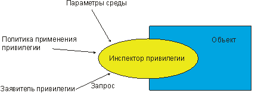
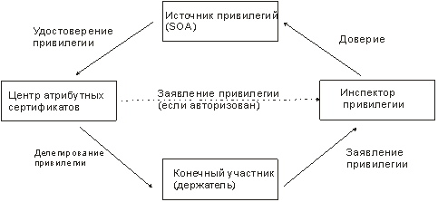
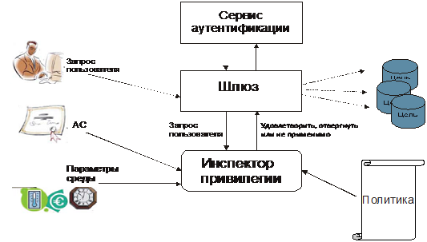
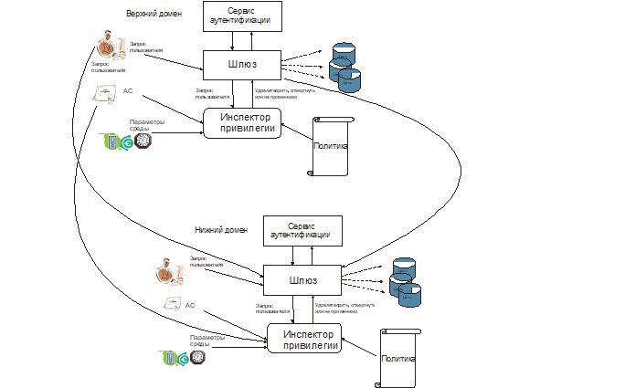

-------------------------------------------------------------------------------
**CТБ 34.101.67-2014**

**Информационные технологии и безопасность**

**ИНФРАСТРУКТУРА АТРИБУТНЫХ СЕРТИФИКАТОВ**

**Інфармацыйныя тэхналогіі і бяспека**

**IНФАСТРУКТУРА АТРЫБУТНЫХ СЕРТЫФIКАТАЎ**

**Information technology and security**

**Attribute certificate framework**

-------------------------------------------------------------------------------

# Содержание

[1 Область применения](#logo)

[2 Нормативные ссылки](#refs)

[3 Термины и определения](#terms)

[4 Обозначения и сокращения](#defs)

[5 Общие положения](#common)

[6 Атрибутные сертификаты](#attr)

[7 Отношения между центрами](#rbc)

[8 Модели инфраструктуры управления привилегиями](#models)

[9 Расширения сертификатов, связанные с управлением привилегиями](#ext)

[10 Процедуры обработки маршрутов атрибутных сертификатов](#proc)

[11 Схема директории инфраструктуры управления привилегиями](#schema)

[Приложение А (обязательное) Модуль АСН.1](#app1)

[Приложение Б (справочное) Пояснения к расширениям синтаксиса АСН.1](#app2)

[Приложение В (справочное) Пример атрибутного сертификата](#app3) 

[Библиография](#bib)

# 1 <a name="logo"></a>Область применения

Настоящий государственный стандарт  является частью группы стандартов,
представляющих инфраструктуру управления привилегиями, и определяет форматы
атрибутных сертификатов инфраструктуры управления привилегиями, а также
процедуры проверки их подлинности. В настоящем стандарте определяется версия 2
атрибутных сертификатов.

Настоящий стандарт применяется при разработке, испытаниях и эксплуатации систем
управления привилегиями.

# 2 <a name="refs"></a>Нормативные ссылки

В настоящем стандарте использованы ссылки на следующие технические нормативные
правовые акты в области технического нормирования и стандартизации (далее –
ТНПА):

СТБ 34.101.19-2012 Информационные технологии и безопасность. Форматы
сертификатов и списков отозванных сертификатов инфраструктуры открытых ключей

СТБ 34.101.31-2011 Информационные технологии. Защита информации.
Криптографические алгоритмы шифрования и контроля целостности

СТБ 34.101.45-2013 Информационные технологии и безопасность. Алгоритмы
электронной цифровой подписи и транспорта ключа на основе эллиптических кривых

СТБ 1176.1-99 Информационная технология. Защита информации. Функция хэширования

СТБ 1176.2-99 Информационная технология. Защита информации. Процедуры выработки
и проверки электронной цифровой подписи

ГОСТ 34.973-91 (ИСО 8824-87) Информационная технология. Взаимосвязь открытых
систем. Спецификация абстрактно-синтаксической нотации версии 1 (АСН.1)

ГОСТ 34.974-91 (ИСО 8825-87) Информационная технология. Взаимосвязь открытых
систем. Описание базовых правил кодирования для абстрактно-синтаксической
нотации версии 1 (АСН.1)

>Примечание – При пользовании настоящим стандартом целесообразно проверить
действие ТНПА по каталогу, составленному по состоянию на 1 января текущего года,
и по соответствующим информационным указателям, опубликованным в текущем году.
Если ссылочные ТНПА заменены (изменены), то при пользовании настоящим 
стандартом следует руководствоваться заменяющими (измененными) ТНПА. Если 
ссылочные ТНПА отменены без замены, то положение, в котором дана ссылка на 
них, применяется в части, не затрагивающей эту ссылку. 

# 3 <a name="terms"></a>Термины и определения

В настоящем стандарте применяют термины, установленные в СТБ 34.101.19, ГОСТ
34.973 и ГОСТ 34.974, а также следующие термины с соответствующими
определениями:

**3.1 атрибутный сертификат** (attribute certificate; АС): Структура данных с
цифровой подписью центра атрибутных сертификатов, связывающая определенные
значения атрибутов с идентификационной информацией о держателе.

**3.2 делегирование** (delegation): Передача привилегии от стороны, которая
имеет эту привилегию, другой стороне.

**3.3 держатель** (holder): Сторона, которой делегированы привилегии напрямую от
источника привилегий, либо косвенно через центр атрибутных сертификатов.

**3.4 заявитель привилегии** (privilege asserter): Держатель привилегии, который
предъявляет свой атрибутный сертификат или сертификат открытого ключа для
подтверждения факта владения привилегией.

**3.5 инспектор привилегии** (privilege verifier): Сторона, которая проверяет
сертификаты в соот-ветствии с политикой применения привилегии.

**3.6 инфраструктура управления привилегиями** (privilege management
infrastructure; PMI): Инфраструктура, которая позволяет управлять привилегиями
при поддержке сервиса надежной авторизации и во взаимодействии с инфраструктурой
открытых ключей.

**3.7 источник привилегий** (source of authority; SOA): Центр атрибутных
сертификатов, которому инспектор привилегии доверяет как основной стороне,
удостоверяющей привилегии.

**3.8 конечный участник** (end entity): Конечный пользователь; либо держатель
атрибутного сертификата, который использует привилегии сертификата для получения
доступа к ресурсу; либо проверяющая сторона.

**3.9 маршрут делегирования** (delegation path): Упорядоченная
последовательность (цепочка) атрибутных сертификатов или сертификатов открытых
ключей, которая позволяет провести аутентификацию заявителя привилегии и
проверить, что он действительно ее имеет.

**3.10 политика безопасности** (security policy): Набор правил, установленный
центром и регулирующий использование сервисов и средств безопасности.

**3.11 политика применения привилегии** (privilege policy): Набор условий, при
которых инспектор привилегии предоставляет доступ заявителю привилегии к
определенным сервисам или выполняет для него эти сервисы.

>Примечание – Политика касается как атрибутов сервисов, так и атрибутов, 
относящихся к заявителю. 

**3.12 политика применения сертификата** (certificate policy): Именованный набор
правил, который предписывает применение сертификата только в определенных
сообществах и (или) приложениях с общими требованиями безопасности.

>Примечание – Например, может предписываться применение сертификата 
определенного типа для организации аутентификации в системе электронной 
торговли товарами определенной ценовой категории. 

**3.13 привилегия** (privilege): Полномочие или свойство стороны, удостоверенное
центром.

**3.14 регламент удостоверяющего центра** (certification practice statement;
CPS): Набор инструкций, которым удостоверяющий центр следует при выпуске
сертификатов.

**3.15 самоизданный атрибутный сертификат** (self-issued AC): Атрибутный
сертификат, в котором эмитент и субъект являются одним и тем же центром
атрибутных сертификатов.

>Примечание – ЦАС может выпускать такие сертификаты, например, для 
публикации информации о привилегиях. 

**3.16 серийный номер сертификата** (certificate serial number): Целое число,
уникальное для центра, которое однозначно указывает на сертификат, выпущенный
этим центром.

**3.17 сертификат конечного участника** (end entity certificate): Сертификат
открытого ключа или атрибутный сертификат, выданный конечному участнику.

**3.18 сертификат назначения роли** (role assignment certificate): Сертификат,
который содержит атрибут, определяющий одну или несколько ролей
субъекта/держателя.

**3.19 сертификат спецификации роли** (role specification certificate):
Сертификат, который определяет привилегии роли.

**3.20 сертификат центра** (authority certificate): Сертификат, выданный центру.

**3.21 список отозванных атрибутных центров** (attribute authority revocation
list; AARL): Список отозванных сертификатов, которые были выпущены для центров
атрибутных сертификатов.

**3.22 список отозванных удостоверяющих центров** (certification authority
revocation list; CARL): Список отозванных сертификатов (атрибутных и
сертификатов открытых ключей), которые были выпущены для удостоверяющих центров.

**3.23 центр** (authority): Сторона, отвечающая за выпуск сертификатов. 

>Примечание – В настоящем стандарте рассматриваются только удостоверяющий 
центр и центр атрибутных сертификатов. 

**3.24 центр атрибутных сертификатов** (attribute authority; АА): Центр,
удостоверяющий привилегии путем выпуска атрибутных сертификатов либо
сертификатов открытых ключей, содержащих эти привилегии.

# 4 <a name="defs"></a>Обозначения и сокращения

В настоящем стандарте применяют следующие сокращения:

АС – атрибутный сертификат;

ИО – идентификатор объекта АСН.1;

ИОК – инфраструктура открытых ключей;

ИП – источник привилегий;

ИУП – инфраструктура управления привилегиями;

ОК – открытый ключ;

СОК – сертификат открытого ключа;

СОС – список отозванных сертификатов;

УЦ – удостоверяющий центр;

ЦАС – центр атрибутных сертификатов;

ЭЦП – электронная цифровая подпись.

Для определения типов АСН.1 применяются обозначения, заданные в ГОСТ 34.973. 

# 5 <a name="common"></a>Общие положения

Атрибутные сертификаты являются основой для построения инфраструктур управления
привилегиями. ИУП могут использоваться в приложениях, связанных с контролем
доступа.

В настоящем стандарте определено два механизма связывания привилегий с их
держателем: через сертификаты открытых ключей и через атрибутные сертификаты.
Сертификаты открытых ключей в целом предназначены для организации сервиса
идентификации, на основе которого могут быть построены другие сервисы
безопасности, такие как сервисы аутентификации, авторизации, проверки
целостности и конфиденциальности.

Сертификаты открытых ключей, используемые совместно с сервисом аутентификации,
могут обеспечить сервис авторизации, если привилегии предоставляются субъекту в
рамках регламента УЦ, выпускающего СОК. При этом сертификаты открытых ключей
могут содержать расширение `SubjectDirectoryAttributes` [см. СТБ 34.101.19
(пункт 6.2.1.8)], которое определяет привилегии субъекта. Данный механизм
применим в тех случаях, когда УЦ наделяется также полномочиями ЦАС, а период
действия привилегии совпадает с периодом действия СОК. Конечные участники не
могут выступать в роли ЦАС. Если какое-либо расширение, определенное ниже в
настоящем стандарте, включено в сертификат открытого ключа, то данное расширение
распространяется в равной степени на все привилегии, заданные в расширении
`SubjectDirectoryAttributes` данного сертификата.

В общем случае период действия привилегии может не совпадать с периодом действия
сертификата открытого ключа. Очень часто период действия привилегии намного
меньше. Бывают ситуации, когда ЦАС не является одновременно УЦ и различные
привилегии могут удостоверяться различными ЦАС. Кроме того, привилегии могут
удостоверяться «на лету», а моменты выпуска и отзыва атрибутного сертификата
могут быть не синхронизированы с периодом действия СОК или АС, выданными другими
ЦАС. Использование атрибутных сертификатов служит основой для построения гибкой
ИУП, которая может создаваться и управляться независимо от ИОК. Тем не менее
существует связь между этими инфраструктурами – ИОК используется для
аутентификации держателей атрибутных сертификатов и ЦАС, которые их выпустили.

Настоящий стандарт определяет формат атрибутных сертификатов, в том числе
механизм расширений и набор конкретных расширений атрибутных сертификатов,
соответствующих [[1]](#bib1). Отзыв атрибутных сертификатов может требоваться, а
может и не требоваться. Например, в некоторых системах срок действия атрибутных
сертификатов может быть очень коротким (несколько минут) и нет необходимости в
отзыве таких сертификатов. Если по какой-либо причине ЦАС отзывает
предварительно выданный атрибутный сертификат, то пользователи должны иметь
возможность узнать, что данный отзыв имел место, чтобы не использовать
сертификат, не заслуживающий доверия. Списки отозванных сертификатов являются
одной из форм уведомления пользователей об отзывах. Формат списков отозванных
сертификатов, в том числе механизм расширений и некоторые конкретные расширения
СОС, определены в СТБ 34.101.19 (раздел 7). В настоящем стандарте определяются
дополнительные расширения. Можно доопределять расширения как сертификатов, так и
списков отозванных сертификатов, если эти расширения необходимы в конкретных
случаях.

Структура атрибутных сертификатов включает в себя несколько необязательных
элементов, используемых только в некоторых системах. Например, существуют
системы, где не требуется отзыв атрибутных сертификатов. Также не всегда
используются роли и не всегда делегируются привилегии. Тем не менее
необязательные элементы определены в настоящем стандарте полностью и поэтому
могут быть поддержаны те системы, в которых они нужны.

В системе, использующей атрибутные сертификаты, необходимо проверять подлинность
сертификата до его использования в прикладной программе. В настоящем стандарте
определяются соответствующие процедуры, в том числе процедуры проверки
целостности сертификата, его статуса отзыва и допустимости планируемого
использования сертификата.

Настоящий стандарт не требует использования каких-либо определенных
криптографических алгоритмов. Правила кодирования открытого ключа и параметров
процедур выработки и проверки цифровой подписи согласно СТБ 1176.2 определены в
СТБ 34.101.19. АСН.1-модули криптографических алгоритмов СТБ 34.101.31 и СТБ
34.101.45 определены непосредственно в этих стандартах.

В приложении [A](#app1) приводится модуль ACH.1, содержащий типы и 
идентификаторы, определенные в настоящем стандарте. 

Для определения типов абстрактно-синтаксической нотации версии 1 (ACH.1) 
применяются обозначения, заданные в ГОСТ 34.973, а также обозначения 
расширенного синтаксиса АСН.1, который определен в [[2]](#bib2) и разъяснен в 
приложении [Б](#app2). 

# 6 <a name="attr"></a> Атрибутные сертификаты

## 6.1 <a name="attr1"></a> Формат атрибутных сертификатов

Атрибутный сертификат представляет собой отдельную структуру, отличающуюся 
от СОК. Субъект может обладать несколькими атрибутными сертификатами, 
связанными с каждым из его СОК. Один и тот же УЦ не обязан выпускать как 
СОК, так и АС. Наоборот, в большинстве случаев требуется разделение 
обязанностей. В системах, в которых разные центры несут ответственность за 
выпуск сертификатов открытых ключей и атрибутных сертификатов, сертификаты 
открытого ключа, выданные УЦ, и атрибутные сертификаты, выданные ЦАС, 
будут подписаны на различных личных ключах. В системах, где один центр 
является одновременно и УЦ и ЦАС, строго рекомендуется использовать 
различные личные ключи для подписи атрибутных сертификатов и сертификатов 
открытых ключей. Обмен информацией между центром, издающим сертификат, и 
субъектом, получающим сертификат, настоящим стандартом не 
регламентируется. 

Формат атрибутного сертификата определяется следующим образом:

    AttributeCertificate ::= SEQUENCE {
      attrCertInfo              AttributeCertificateInfo,
      signatureAlgorithm        AlgorithmIdentifier,
      signatureValue            BIT STRING }

    AttributeCertificateInfo ::= SEQUENCE {
      version                   AttCertVersion, -- версия v2 
      holder                    Holder, 
      issuer                    AttCertIssuer, 
      signature                 AlgorithmIdentifier, 
      serialNumber              CertificateSerialNumber, 
      attrCertValidityPeriod    AttCertValidityPeriod, 
      attributes                SEQUENCE OF Attribute, 
      issuerUniqueID            UniqueIdentifier  OPTIONAL, 
      extensions                Extensions  OPTIONAL }

    AttCertVersion ::= INTEGER { v2(1) } 

    Holder ::= SEQUENCE { 
      baseCertificateID  [0] IssuerSerial  OPTIONAL, 
      -- серийный номер СОК держателя и имя эмитента этого СОК
      entityName         [1] GeneralNames  OPTIONAL,  
      -- имя держателя или роль 
      objectDigestInfo   [2] ObjectDigestInfo  OPTIONAL 
      -- используется для прямой аутентификации держателя.
      -- по меньшей мере, один из компонентов baseCertificateID, entityName или
      -- objectDigestInfo должен присутствовать --} 

    ObjectDigestInfo ::= SEQUENCE { 
      digestedObjectType  ENUMERATED { 
      publicKey           (0), 
      publicKeyCert       (1), 
      otherObjectTypes    (2) }, 
      otherObjectTypeID   OBJECT IDENTIFIER  OPTIONAL, 
      digestAlgorithm     AlgorithmIdentifier, 
      objectDigest        BIT STRING } 

    AttCertIssuer ::= [0] SEQUENCE { 
      issuerName         GeneralNames  OPTIONAL, 
      baseCertificateID  [0] IssuerSerial  OPTIONAL, 
      objectDigestInfo   [1] ObjectDigestInfo  OPTIONAL  
      -- должен присутствовать, по меньшей мере, один из компонентов 
      -- issuerName, baseCertificateID или objectDigestInfo -- }

    IssuerSerial ::= SEQUENCE { 
      issuer     GeneralNames, 
      serial     CertificateSerialNumber, 
      issuerUID  UniqueIdentifier  OPTIONAL } 

    AttCertValidityPeriod ::= SEQUENCE { 
      notBeforeTime  GeneralizedTime, 
      notAfterTime   GeneralizedTime }

    Attribute ::= SEQUENCE {
      type    AttributeType,
      values  SET OF AttributeValue }

Компонент `attrCertInfo` типа `AttributeCertificateInfo` содержит данные 
АС, включающие информацию о держателе и ЦАС, серийный номер сертификата, 
срок действия, привилегии держателя и иную информацию. 

Компонент `signatureAlgorithm` содержит идентификатор криптографического 
алгоритма, который ЦАС использовал для подписи сертификата [см.  СТБ 
34.101.19 (пункт 6.1.1.2)]. В данном компоненте должен содержаться такой 
же идентификатор алгоритма, как и в компоненте `signature` типа 
`AttributeCertificateInfo`. 

Компонент `signatureValue` содержит значение ЭЦП, вычисленное от кодового 
представления компонента `attrCertInfo` [см. СТБ 34.101.19 (пункт 
6.1.1.3)]. 

Компонент `version` определяет версию атрибутного сертификата. Для 
сертификатов, выданных в соответствии с настоящим стандартом, значение 
`version` должно быть v2. 

Компонент `holder` описывает идентификационную информацию о держателе 
привилегий: 

- компонент `baseCertificateID`, если присутствует, описывает СОК, который 
должен использоваться для аутентификации держателя при проверке 
атрибутного сертификата; 

- компонент `entityName`, если присутствует, определяет одно или несколько 
имен держателя. Если `entityName` является единственным компонентом, 
содержащимся в `holder`, то любой сертификат открытого ключа, имя субъекта 
которого содержится в `entityName`, может использоваться для 
аутентификации держателя при проверке данного атрибутного сертификата. 
Если присутствуют как `baseCertificateID`, так и `entityName`, то можно 
использовать только сертификат, определенный `baseCertificateID`. В данном 
случае `entityName` включается только для помощи инспектору привилегии в 
определении местоположения СОК. 

>Примечание – Существует риск, что для определения держателя используется 
только его имя, представленное типом `GeneralNames`. Этого, как правило, 
недостаточно для аутентификации держателя при выдаче ему атрибутного 
сертификата. С другой стороны, использование имени эмитента и порядкового 
номера СОК позволяет эмитенту АС полагаться на аутентификацию, проведенную 
УЦ при выпуске данного СОК. Кроме этого, некоторые из возможных 
представлений `GeneralNames` (например, `IPAddress`) не подходят для 
именования держателя привилегии, особенно когда держатель является ролью, 
а не индивидуальным лицом. Еще одна проблема с `GeneralNames` как 
единственным идентификатором держателя заключается в том, что в конкретной 
инфраструктуре может быть много форм имен и назначение этих имен 
регистрационными центрами/процедурами строго не регламентируется; 

- компонент `objectDigestInfo`, если присутствует, используется напрямую для 
аутентификации держателя, в том числе исполняемого модуля (например, 
апплета). Инспектор привилегии аутентифицирует держателя путем сравнения 
значения компонента `objectDigest` с хэш-значением, вычисленным на основе 
информации, содержащейся в компонентах `digestedObjectType`, 
`otherObjectTypeID` и `digestAlgorithm`. Для вычисления хэш-значения должна 
использоваться функция хэширования, идентификатор которой задан в 
компоненте `digestAlgorithm`. Вход алгоритма хэширования определяется 
компонентами `digestedObjectType` и `otherObjectTypeID` следующим образом: 

a) если в компоненте `digestedObjectType` указано значение `publicKey`, то 
хэш-значение должно быть вычислено от кодового представления 
`SubjectPublicKeyInfo` [см. СТБ 34.101.19 (пункт 6.1.2.7)] открытого ключа 
держателя. При кодировании должны использоваться отличительные правила, 
заданные в СТБ 34.101.19 (приложение Б). 

>Примечание – Долговременные параметры алгоритмов, связанных с открытым 
ключом, могут быть заданы в `SubjectPublicKeyInfo` неявно, через ссылку на 
долговременные параметры эмитента. Поэтому хэшируемое описание открытого 
ключа может быть неполным; 

б) если в компоненте `digestedObjectType` указано значение `publicKeyCert`, то 
на вход функции хэширования должно подаваться кодовое представление СОК 
(включая ЭЦП) держателя. При кодировании должны использоваться 
отличительные правила;

в) если в компоненте `digestedObjectType` указано значение `otherObjectTypes`, 
то хэшируется некоторый объект (например, исполняемый модуль), отличный от 
открытых ключей или СОК держателя. Хэшируемый объект можно определить 
либо из явно установленного идентификатора типа, либо, если идентификатор 
не представлен, из контекста, в котором используется объект. 

Компонент `issuer` типа `AttCertIssuer` содержит идентификационную информацию 
ЦАС, выдавшего данный сертификат. Компоненты типа `AttCertIssuer` имеют 
следующее значение:

- компонент `issuerName`, при наличии, определяет одно или несколько имен ЦАС;
- компонент `baseCertificateID`, при наличии, определяет ЦАС путем обращения 
к определенному СОК, субъектом для которого является данный ЦАС; 
- компонент `objectDigestInfo`, при наличии, определяет ЦАС путем 
предоставления хэш-значения идентификационной информации ЦАС. 

Компонент `signature` определяет криптографический алгоритм, используемый 
для формирования цифровой подписи АС. В данном компоненте должен 
содержаться тот же идентификатор, что и в компоненте `signatureAlgorithm` 
типа `AttributeCertificate`. Может использоваться алгоритм выработки ЭЦП СТБ 
1176.2, СТБ 34.101.45 или другой алгоритм, определенный в ТНПА. 

Компонент `serialNumber` содержит серийный номер, который однозначно 
определяет данный атрибутный сертификат среди всех сертификатов, 
выпущенных ЦАС. 

Компонент `attrCertValidityPeriod`, представленный компонентами типа 
`GeneralizedTime`, содержит период времени, в течение которого атрибутный 
сертификат считается действительным.

Компонент `attributes` содержит атрибуты держателя, которые необходимо 
удостоверить (например, привилегии). Компоненты типа `Attribute` определены 
в СТБ 34.101.19 (пункт 6.1.2.4), а сам тип содержится в АСН.1-модуле СТБ 
34.101.19.

>Примечание – Список атрибутов будет пустым, если сертификат содержит 
описание атрибута (в расширении `AttributeDescriptor`). 

Компонент `issuerUniqueID` может использоваться для определения ЦАС, 
выпустившего данный АС, если данных, указанных в компоненте `issuer`, 
недостаточно. 

Компонент `extensions` позволяет дополнять АС различными расширениями. Если 
какой-то элемент расширения не удается распознать, а само расширение не 
помечено как критическое, то нераспознанный элемент должен игнорироваться 
[см. СТБ 34.101.19 (пункт 6.2)]. Некоторые важные расширения атрибутных 
сертификатов определены в разделе [9](#ext). Эти расширения могут также 
помещаться в СОК, который содержит расширение `SubjectDirectoryAttributes`. 

## 6.2 Класс атрибутов и правила соответствия

Тип `Attribute`, который описывает атрибуты, определен в СТБ 34.101.19 
следующим образом:

    Attribute ::= SEQUENCE {
      type    AttributeType,
      values  SET OF AttributeValue }
    
    AttributeType ::= OBJECT IDENTIFIER
    
    AttributeValue ::= ANY DEFINED BY AttributeType

ИО атрибутов, задаваемые в компоненте `type`, являются вершинами дерева 
идентификаторов АСН.1, подчиненными вершине `id-at` (см. СТБ 34.101.19). 

Тип `Attribute` является объектом следующего класса АСН.1:

    ATTRIBUTE ::= CLASS {
      &derivation            ATTRIBUTE  OPTIONAL,
      &Type                  OPTIONAL, 
      - или &Type, или &derivation должны быть определены
      &equality-match        MATCHING-RULE  OPTIONAL,
      &ordering-match        MATCHING-RULE  OPTIONAL,
      &substrings-match      MATCHING-RULE  OPTIONAL,
      &single-valued         BOOLEAN  DEFAULT FALSE,
      &collective            BOOLEAN  DEFAULT FALSE,
      &dummy                 BOOLEAN  DEFAULT FALSE,
      -- операции
      &no-user-modification  BOOLEAN  DEFAULT FALSE,
      &usage                 AttributeUsage  DEFAULT userApplications,
      &id                    OBJECT IDENTIFIER  UNIQUE }
    WITH SYNTAX {
      [SUBTYPE OF                &derivation]
      [WITH SYNTAX               &Type]
      [EQUALITY MATCHING RULE    &equality-match]
      [ORDENING MATCHING RULE    &ordering-match]
      [SUBSTRINGS MATCHING RULE  &substrings-match]
      [SINGLE VALUE              &single-valued]
      [COLLECTIVE                &collective]
      [DUMMY                     &dummy]
      [NO USER MODIFICATION      &no-user-modofication]
      [USAGE                     &usage]
      ID                         &id }

    AttributeUsage ::= ENUMERATED {
      userApplications      (0),
      directoryOperation    (1),
      distributedOperation  (2),
      dSAOperation          (3) }

Компоненты `derivation` и `Type` определяют значение атрибута, которое 
соответствует типу `AttributeValue`, в то время как компонент `id` задает 
идентификатор атрибута, т. е. его тип `AttributeType`. Остальные 
компоненты либо необязательные, либо имеют значения по умолчанию. 

Класс `MATCHING-RULE` описывает правила соответствия. Правила соответствия
используются для поиска в директории необходимых записей [[3]](#bib3). Для этого
формируется запрос, содержащий требуемые значения определенных компонентов, и,
используя правило соответствия, сравниваются значения записей директории с теми,
что в запросе. Чаще всего в качестве запроса выступает некоторый атрибут. При
этом правило соответствия для заданного типа атрибута может определять
эквивалентность компонентов, наличие/отсутствие определенных компонентов,
соотношение значений компонентов (включение/исключение, больше/меньше, является
ли данная строка подстрокой и т. п.), а также в определенных случаях давать
заключение о том, что запись приблизительно соответствует запросу. Правило
соответствия возвращает одно из значений: `TRUE` (истина, запись соответствует),
`FALSE` (ложь, запись не соответствует) или `UNDEFINED` (не определено, если 
атрибут имеет неизвестный тип или он отсутствует в записи директории). В 
настоящем стандарте определяются правила соответствия для некоторых типов и 
объектов директории.

Класс `MATCHING-RULE` определяется следующим образом:

    MATCHING-RULE ::= CLASS {
      &ParentMatchingRules   MATCHIG-RULE  OPTIONAL,
      &AssertionType         OPTIONAL,
      &uniqueMatchIndicator  ATTRIBUTE  OPTIONAL,
      &id                    OBJECT IDENTIFIER  UNIQUE }
    WITH SYNTAX {
      [PARENT                  &ParentMatchingRules]
      [SYNTAX                  &AssertionType]
      [UNIQUE-MATCH-INDICATOR  &uniqueMatchIndicator]
      ID                       &id }

Правила соответствия определяются своими ИО, заданными в компоненте `id`, 
которые являются вершинами дерева идентификаторов АСН.1, подчиненными 
вершине `id-mr`: 

    id-mr OBJECT IDENTIFIER ::= {joint-iso-itu-t(2) ds(5) 13}

Одним из важнейших правил соответствия является правило, которое проверяет 
эквивалентность идентификаторов: 

    id-mr-objectIdentifierMatch OBJECT IDENTIFIER ::= {id-mr 0}

    objectIdentifierMatch MATCHING-RULE ::= {
      SYNTAX  OBJECT IDENTIFIER
      ID      id-mr-objectIdentifierMatch }

## 6.3 Маршруты атрибутных сертификатов

Как и в случае с СОК [см. СТБ 34.101.19 (раздел 8)], может потребоваться 
передача маршрута атрибутного сертификата. Следующий тип данных АСН.1 
может использоваться для представления маршрута АС: 

    AttributeCertificationPath ::= SEQUENCE { 
      attributeCertificate  AttributeCertificate,  
      acPath                SEQUENCE OF ACPathData OPTIONAL } 

    ACPathData ::= SEQUENCE {  
      certificate           [0] Certificate  OPTIONAL, 
      attributeCertificate  [1] AttributeCertificate  OPTIONAL } 
 
# 7 <a name="rbc"></a> Отношения между центрами

## 7.1 Общие положения

ЦАС и УЦ являются логически (а во многих случаях и физически) полностью
независимыми объектами в различных инфраструктурах (ИУП и ИОК соответственно).
Полнофункциональная ИОК, включающая УЦ, может существовать и работать
самостоятельно без поддержки ИУП. Однако УЦ, хотя и является источником доверия
при аутентификации пользователей, не является автоматически источником доверия
для привилегий. УЦ не обязан выполнять функции ЦАС или выступать в роли ИП
(назначать привилегии ЦАС любой другой стороне). Поэтому помимо ИОК предлагается
организация ИУП, для функционирования которой по-прежнему необходим сервис
аутентификации. Этот сервис обеспечивает ИОК.

Источник привилегий (ИП) определяет полный перечень привилегий и наделяет
полномочиями ЦАС. ИП является аналогом корневого УЦ в ИОК, поэтому инспектор
привилегии доверяет АС, подписанным ИП. ИП могут быть специализированными,
например, по направлениям деятельности.

Во многих системах необходимо, чтобы УЦ осуществлял строгий контроль над
субъектами, которые могут действовать как ИП. В настоящем стандарте определяется
механизм поддержки данного требования. Если строгий контроль не требуется, то
механизмы назначения ИП находятся вне области действия настоящего стандарта.

Предлагаемые в настоящем стандарте способы взаимодействия ИУП удовлетворяют
требованиям различных типов систем:

- в некоторых системах привилегии всем держателям могут присваиваться
непосредственно источником привилегий;
- один и тот же субъект может быть одновременно УЦ и ЦАС (см. [5](#common)). В
этом случае он должен удостоверять привилегии только путем выпуска СОК. ЦАС, не
являющийся УЦ, не может выпускать СОК и, соответственно, удостоверяет привилегии
через АС;
- возможно делегирование привилегий (см. [8.3](#models3));
- можно назначить привилегии группе субъектов, которые обладают общей 
собственностью, на-пример нескольким веб-серверам. В такой ситуации можно 
воспользоваться моделью [8.4](#models4); 
- может использоваться ролевая модель (см. [8.5](#models5)), посредством которой 
субъектам выдаются АС, которые присваивают им различные роли. Таким 
субъектам неявно назначаются привилегии, связанные с ролью;
- возможна организация взаимодействия между различными ИУП (см. [8.6](#models6)).

СОК, указанный в АС, используется для аутентификации держателя (заявителя
привилегии) и проверки цифровых подписей эмитентов, в то время как сам АС – для
определения привилегий держателя.

## 7.2 Привилегии в атрибутных сертификатах

Субъект может получить привилегии двумя способами: 

- ЦАС может в одностороннем порядке назначить привилегии субъекту путем 
выпуска АС (по собственной инициативе или по запросу третьей стороны). 
Данный АС может храниться в общественно  доступном репозитории и 
использоваться инспекторами привилегий для принятия решения об 
авторизации. При этом сам субъект не хранит данный АС у себя; 

- в качестве альтернативы субъект может подать запрос в ЦАС на выпуск АС. 
После этого соответствующий АС передается субъекту и он сам предоставляет 
его при необходимости. 

В обоих случаях ЦАС должен проверить, можно ли присвоить субъекту 
определенные привилегии. При этом может потребоваться использование 
дополнительных механизмов. 

Управление привилегиями с использованием АС подходит для систем, в 
которых:
          
- сторона, ответственная за присвоение определенных привилегий держателю, 
отличается от стороны, ответственной за выдачу сертификатов тому же субъекту;

- существует несколько привилегий, которые должны быть присвоены держателю 
различными центрами; 

- срок действия привилегии отличается от периода действия сертификата 
открытого ключа держателя (как правило, продолжительность жизни привилегии 
намного меньше); 

- привилегии действуют только в течение определенных интервалов времени, 
не синхронизированных с периодом действия открытого ключа или периодом 
действия других привилегий.

# 7.3 Привилегии в сертификатах открытых ключей

Некоторые привилегии связаны с деятельностью субъекта в ИОК. Вместо того 
чтобы выпускать атрибутные сертификаты, такие привилегии могут быть 
назначены через сертификаты открытых ключей путем включения их в 
расширение `SubjectDirectoryAttributes` СОК. 

Управление привилегиями с использованием СОК подходит для систем, в 
которых: 

- УЦ выполняет функции ЦАС;

- срок действия привилегии совпадает со сроком действия открытого ключа; 

- делегирование привилегий запрещено; либо

- делегирование привилегий разрешено, но все привилегии в сертификате (в 
расширении `SubjectDirectoryAttributes`) имеют одинаковые параметры 
делегирования, и все расширения, связанные с делегированием, применяются 
в равной степени ко всем привилегиям в сертификате. 

# 8 <a name="models"></a>Модели инфраструктуры управления привилегиями

## 8.1 Общая модель

В общей модели управления привилегиями присутствует три стороны: объект, 
заявитель привилегии и инспектор привилегии.

Объектом может быть защищаемый ресурс, например ресурс, доступ к которому
контролируется. Над такими объектами могут выполняться только определенные
операции (например, над файлом могут выполняться операции чтения и записи).
Объектом могут быть также данные, подписанные электронной цифровой подписью.

Заявителем привилегий является сторона, обладающая определенными привилегиями,
которые она заявляет при осуществлении взаимодействия с объектом.

Инспектором привилегии является сторона, которая определяет, имеет ли заявитель
достаточные привилегии для запрашиваемого взаимодействия с объектом.

Принятие решения инспектором привилегии зависит от:

- привилегии заявителя;
- действующей политики применения привилегии;
- текущих параметров среды, которые связаны с объектом;
- критичности операции над объектом.

Привилегии держателя отражают степень доверия к нему со стороны ЦАС в отношении
того, насколько держатель будет придерживаться даже тех аспектов политики
применения привилегии, которые не были внедрены при помощи технических средств.
Такие привилегии включаются в атрибутный сертификат (или в расширение
`SubjectDirectoryAttributes` сертификата открытого ключа), который может быть
предъявлен инспектору привилегии или может быть распространен другим способом,
например через директорию.

Политика применения привилегии определяет набор условий, которые необходимы для
взаимодействия с объектом. Должна обеспечиваться целостность и подлинность
политики применения привилегии. Для ее распространения существует множество
способов. Политика применения привилегии может не передаваться, а просто быть
настроенной в среде инспектора привилегии. Некоторые политики применения
привилегии могут считаться общеизвестными и являться общедоступными. Структура
записей для хранения привилегий и политик применения привилегий в директории
описана в [11](#schema).

Синтаксис описания политики применения привилегии не определяется в 
настоящем стандарте. Для этой цели может использоваться любой синтаксис, 
например описание на обычном языке. Независимо от способа описания 
политики применения привилегии, она должна иметь уникальный 
идентификатор, который определяется следующим образом: 

    PrivilegePolicy ::= OBJECT IDENTIFIER

Инспектор привилегии при проверке сертификата заявителя (АС или СОК) 
использует параметры среды (например, дату и время), которые настроены у 
него локально и касаются политики применения привилегии. 

Критичность операции над объектом может учитывать свойства объекта. 
Например, если объектом является некоторый документ, то могут учитываться 
такие свойства, как сумма перевода или степень конфиденциальности 
содержания документа. Критичность операции может быть отражена с помощью 
некоторой метки безопасности в АС системы, взаимодействующей с объектом, 
либо может быть неявно включена в структуру и содержание соответствующего 
объекта. Метка безопасности может быть задана различными способами. 
Например, она может быть определена вне границ ИУП, в полях взаимного 
обмена EDIFACT (см. [[4]](#bib4)) или в приложении инспектора привилегий.

Инспектор привилегии не обязательно должен быть связан с каким-то 
определенным ЦАС. Так же, как и субъект, имеющий несколько АС, выданных 
ему различными ЦАС, инспектор привилегии может проверять сертификаты, 
выпущенные центрами атрибутных сертификатов, которые не обязаны 
иерархически подчиняться друг другу. 

Общая модель ИУП позволяет защищать объекты с минимальным воздействием на 
них. Инспектор привилегии тщательно проверяет все запросы, и только 
запросы авторизованных сторон удовлетворяются (они получают заявленные 
привилегии в отношении соответствующих объектов). 

## 8.2 Модель системы управления доступом

Модель управления доступом к объектам включает: заявителя привилегии (прав 
доступа), инспектора привилегии, объект, политику применения привилегии и 
параметры среды (см. рисунок [8.1](#fig1)). Заявитель привилегии обладает некоторым 
правом доступа к защищаемому объекту. В рамках рассматриваемой модели 
инспектор привилегии может разрешать доступ заявителю привилегии к объекту 
в соответствии с политикой применения привилегии. 
 


**Рисунок 8.1 <a name="fig1"></a> – Модель системы управления доступом**

Заявитель привилегии (права доступа) может быть стороной, которая
идентифицируется с помощью СОК, исполняемым программным модулем,
идентифицируемым своим хэш-значением и т. п.

## 8.3<a name="models3"></a> Модель делегирования привилегий

В некоторых системах может существовать необходимость делегирования привилегий.
Делегирование является дополнительным элементом ИУП и требуется не во всех
системах. Модель делегирования включает: инспектора привилегии, ИП, других ЦАС и
заявителя привилегии (см. рисунок [8.2](#fig2)).
 


**Рисунок 8.2 <a name="fig2"></a> – Модель делегирования**

ИП является стороной, выпускающей сертификаты, которые назначают привилегии
держателям привилегий. Однако в данной модели ИП дает право некоторым сторонам
действовать как ЦАС и делегировать права доступа далее другим субъектам путем
выпуска АС, содержащих эти привилегии или их подмножество. ИП может накладывать
ограничения на процесс делегирования, например, ограничить длину маршрута или
ограничить пространство имен, в пределах которого может выполняться
делегирование. Каждый ЦАС может предоставить право делегирования другим ЦАС. ЦАС
не может делегировать больше привилегий, чем те, которыми он обладает. ЦАС может
также накладывать ограничения на дальнейшее делегирование привилегий.

В настоящем стандарте описаны две модели делегирования. В первой модели
делегирования ЦАС является стороной, которая передает привилегии другим
субъектам путем выпуска АС. Во второй модели используются независимые сервисы
делегирования (СД), которые выпускают сертификаты от имени ЦАС. Данный СД не
может быть заявителем тех привилегий, делегирование которых ему предоставлено
ЦАС. Модель СД является особенно уместной в системах с централизованным
управлением. Например, совокупность из одного или нескольких выполняющих
делегирование СД дает возможность легко определить при помощи централизованных
средств общую совокупность привилегий, делегированных в пределах системы, а
также дает возможность гибко управлять политиками применения привилегий и
системой в целом.

В настоящем стандарте определяется две модели использования СД. В первой 
модели ИП назначает привилегии, в том числе право делегирования, центрам 
атрибутных сертификатов. В данной модели ЦАС не выпускают для СД 
сертификаты, которые содержат делегируемые привилегии, а предоставляют 
только право делегирования привилегий от своего имени. СД сам не обладает 
данными привилегиями и поэтому не может их заявлять. Тем не менее он 
уполномочен ИП выпускать атрибутные сертификаты от имени других ЦАС (см. 
[9.6.8](#ext68)). Вторая модель похожа на первую за одним исключением. СД фактически 
является стороной, которой предоставлены привилегии для последующего 
делегирования в форме АС, но он не может их заявлять. В данном случае в 
АС, выданном ИП для СД, должно быть установлено расширение `NoAssertion` 
(см. [9.6.9](#ext69)). Данный СД является косвенным эмитентом (см. [9.6.7](#ext67)). 

В обеих моделях ИП назначает привилегии ЦАС. Затем ЦАС поручает СД 
выпускать АС, содержащие подмножество данных привилегий. Во второй модели 
СД сам может проверить, что ЦАС пре-доставляет право делегировать 
привилегии, которыми он действительно обладает. В первой модели СД не 
может провести такую проверку, и проверяющая сторона сама должна убедиться 
в правильности выполнения делегирования. 

Инспектор привилегии доверяет ИП как стороне, удостоверяющей заданный 
набор привилегий относительно конкретного ресурса. Если сертификат 
заявителя привилегии не выдан данным ИП, то инспектор привилегии должен 
определить маршрут делегирования сертификатов от сертификата заявителя 
привилегии до сертификата, выданного ИП. Подлинность данного маршрута 
делегирования определяется путем проверки того, что каждый ЦАС обладает 
соответствующими привилегиями, в том числе правом делегирования данных 
привилегий. 

Когда привилегии делегируются при помощи атрибутных сертификатов, маршрут 
делегирования отличается от маршрута сертификации СОК субъектов, 
включенных в процесс делегирования. Тем не менее аутентификация, 
проводимая путем проверки подлинности СОК, должна соответствовать 
критичности операции над объектом. 

Маршрут делегирования должен состоять либо полностью из атрибутных 
сертификатов, либо полностью из сертификатов открытых ключей. Сторона, 
получившая право делегировать привилегии с помощью АС, может их 
делегировать только путем выпуска последующих АС. Аналогично, если сторона 
получила право делегировать привилегии с помощью СОК, она должна 
делегировать привилегии только путем выпуска СОК. Делегировать привилегии 
могут только ЦАС. Конечные участники делегировать привилегии не могут. 

## 8.4<a name="models4"></a> Модель назначения привилегий группе субъектов

ЦАС может назначить привилегии группе субъектов, которые обладают общей 
собственностью, например несколькими веб-серверами. Для этого он выпускает 
групповой АС для соответствующей группы субъектов (см. [9.2.8](#ext28)). 

Существует два способа идентификации членов группы, для которой выпущен 
групповой АС: прямое именование группы и ролевое именование группы. 

### 8.4.1 Прямое именование группы

При прямом именовании группы компонент `holder` группового АС должен 
содержать компонент `entityName`, в котором имя, заданное типом 
`GeneralNames`, должно представлять поддерево имен из директории. Каждый 
субъект, имя которого содержится в данном поддереве, обладает 
привилегиями, указанными в групповом АС. 

### 8.4.2 Ролевое именование группы

В случае ролевого именования группы члены группы идентифицируются с помощью
имеющихся у них привилегий, которые заданы в атрибутных сертификатах назначения
роли. При таком именовании компонент `holder` группового АС содержит компонент
`entityName`, в котором указаны имена ролей.

В этом случае последовательность имен `GeneralNames` в компоненте `entityName`
должна состоять лишь из одного `GeneralName`, который в свою очередь должен
содержать одно имя, представленное компонентом `directoryName`. Данное имя
должно быть задано единственным атрибутом типа `role`, который описан в [8.5.1](#models51).
Если компонент `roleAuthority` присутствует в `role`, то он определяет ЦАС,
выпустивший сертификаты назначения роли субъектам, которые и являются членами
данной группы. Если компонент `roleAuthority` отсутствует, то определение членов
группы осуществляется средствами, не рассматриваемыми в настоящем стандарте.
Компонент `roleName` определяет роль (роли) группы, которой были назначены
привилегии в групповом АС. Данный компонент должен содержаться в атрибуте `role`
сертификата назначения роли каждого члена группы. Член группы должен иметь
сертификат назначения роли для всех ролей, указанных в атрибуте `role`
группового АС.

>Примечание 1 – Ролевое именование группы позволяет организовывать 
иерархии ролей в рамках группы.

>Примечание 2 – Если в групповом АС компоненты `holder` и `attributes` 
содержат одну и ту же роль, то эмитентом данной роли (компонент 
`roleAuthority`) является эмитент группового АС. Однако наиболее простой 
путь достижения того же самого эффекта –  использование компонента 
`roleAuthority`. 

## 8.5<a name="models5"></a> Модель ролей

Роль является средством для непрямого назначения привилегий и представляет 
собой именованный набор привилегий. Субъектам выдаются сертификаты 
назначения ролей, в которых содержится атрибут типа `role` (см. [8.5.1](#models51)). 
Набор привилегий роли определяется посредством сертификата спецификации 
роли. Такая косвенная процедура делает возможным, например, обновление 
набора привилегий роли без изменения сертификатов назначения роли. 
Сертификаты назначения роли могут быть атрибутными сертификатами или 
сертификатами открытых ключей. Сертификаты спецификации роли могут быть 
только атрибутными сертификатами. Если сертификаты спецификации роли не 
используются, то определение набора привилегий роли может осуществляться с 
помощью других средств (например, локально настроено инспектором 
привилегии). 

Модель ролей обеспечивает следующие возможности:

- любое количество ролей может быть определено любым ЦАС; 
- роль целиком и любая привилегия из ее набора могут определяться и 
управляться раздельно разными ЦАС; 
- делегирование ролей; 
- роль может иметь любую продолжительность жизни, которая определяется в 
сертификате спецификации роли. Однако любой субъект может пользоваться 
привилегиями данной роли лишь в период времени, определенный в его 
сертификате назначения роли в рамках всего периода жизни данной роли (см. 
[9.2.3](#ext23)). 

Если сертификат назначения роли является атрибутным сертификатом, то 
атрибут `role` содержится в компоненте `attributes` атрибутного сертификата. 
Если сертификат назначения роли является сертификатом открытого ключа, то 
атрибут `role` содержится в расширении `SubjectDirectoryAttributes`. В 
последнем случае любые иные привилегии, содержащиеся в сертификате 
открытого ключа, представляют собой привилегии, непосредственно 
назначенные субъекту сертификата, но не имеют никакого отношения к роли. 

Таким образом, заявитель привилегии может предоставить сертификат 
назначения роли инспектору привилегии, чем он подтверждает свою 
принадлежность к роли (например, «администратор» или «пользователь»). 
Набор привилегий, определяемых ролью, либо должен быть известен инспектору 
привилегий, либо он должен быть получен посредством сертификата 
спецификации роли. 

Инспектор привилегии должен распознавать все привилегии, определенные 
ролью. Если привилегии роли определяются сертификатом спецификации роли, 
то способы связывания данного сертификата с соответствующим сертификатом 
назначения роли представлены в настоящем стандарте. Сертификат 
спецификации роли не может делегироваться. Эмитент, выпустивший сертификат 
назначения роли, может быть независимым от эмитента, выпустившего 
сертификат спецификации роли. Сертификат спецификации роли должен быть 
сертификатом, содержащим только набор привилегий роли. 

>Примечание – Использование ролей в инфраструктуре авторизации может 
усложнить обработку маршрутов, так как при этом может быть необходимым 
проверить другой маршрут делегирования. Маршрут делегирования сертификата 
назначения роли может включать различные ЦАС, которые не связаны с ЦАС, 
выпустившим сертификат спецификации роли. 

### 8.5.1<a name="models51"></a> Атрибут `role`

Определение типов атрибутов (привилегий) находится вне области действия 
настоящего стандарта. Единственным исключением является атрибут `role`, 
который описывает роль. При этом определение значений атрибута `role` также 
находится вне области действия настоящего стандарта. 

Атрибут `role` задается следующим типом ACH.1:

    role ATTRIBUTE ::= { 
      WITH SYNTAX  RoleSyntax
      ID           id-at-role } 
    
    RoleSyntax ::= SEQUENCE { 
      roleAuthority  [0] GeneralNames  OPTIONAL, 
      roleName       [1] GeneralName }

Данный атрибут может использоваться для определения роли в компоненте 
`attributes` сертификата назначения роли, или в компоненте `holder` 
сертификата спецификации роли, или в компонентах `holder` и/или `attributes` 
группового АС. 

Если сертификат назначения роли является сертификатом открытого ключа, то 
атрибут `role` указывается в расширении `SubjectDirectoryAttributes`. 

Если атрибут `role` содержится в компоненте `аttributes` сертификата 
назначения роли, то компонент `roleAuthority` (если он указан) определяет 
ЦАС, который выпустил сертификат спецификации роли. Все имена в компоненте 
`GeneralNames` должны соответсвовать одному и тому же ЦАС.

Если присутствует компонент `roleAuthority` и инспектор привилегии 
использует сертификат спецификации роли для определения привилегий роли, 
то по меньшей мере одно из имен компонента `roleAuthority` должно 
присутствовать в компоненте `issuer` данного сертификата спецификации роли. 
Если инспектор привилегии использует средства, отличные от сертификата 
спецификации роли, то определение им привилегий роли находится вне области 
действия настоящего стандарта. 

Если компонент `roleAuthority` отсутствует, то определение ЦАС, выпустившего 
сертификат спецификации роли, достигается при помощи иных средств. 
Расширение `RoleSpecCertIdentifier` (см. [9.5.2](#ext52)) в сертификате назначения 
роли представляет собой одно из таких средств определения ЦАС. 

Компонент `roleName` определяет имя роли. Если инспектор привилегии 
использует сертификат спецификации роли для определения привилегий роли, 
то данное имя роли также должно содержаться в компоненте `holder` 
сертификата спецификации роли. 

Если атрибут `role` используется одновременно в компонентах `holder` и 
`attributes`, но при этом их значения различны, то такой АС является 
сертификатом отображения ролей. 

## 8.6<a name="models6"></a> Модель взаимодействия доменов

Существует две модели взаимодействия доменов (локальной ИУП и удаленной 
ИУП): статическая модель и динамическая модель. В статической модели в 
политику локального домена заранее добавляются данные для последующего 
взаимодействия с удаленным доменом. Настоящий стандарт не описывает 
статическую модель. В динамической модели ИП локального и удаленного 
доменов для обеспечения взаимодействия обмениваются дополнительными 
политиками применения привилегий. 

На рисунке [8.3](#fig3) представлена модель управления одним доменом.

Политика применения привилегии содержит информацию, необходимую инспектору 
привилегии для принятия решения. Она обычно включает в себя данные об ИП, 
правила делегирования, общий перечень известных в домене привилегий и 
какие привилегии необходимы для получения доступа 

к объекту и т. д. Политика применения привилегии может быть локально 
настроена в инспекторе привилегии или может быть получена, например, 
путем передачи АС защищенной политики применения привилегии от ИП к 
инспектору привилегии. 

Одним из способов обеспечения взаимодействия между доменами является их 
объединение в один домен. Если же они не объединены, то держатель вынужден 
будет иметь два АС (один – для локального домена, второй – для удаленного 
домена) при заявлении одной и той же привилегии. Оба этих вида 
взаимодействия являются неэффективными. 

Модель взаимодействия доменов, рассматриваемая в данном разделе, 
обеспечивает эффективную интеграцию инфраструктур управления привилегиями 
из различных доменов в одну инфраструктуру. 
 


**Рисунок 8.3 <a name="fig3"></a> – Модель управления одним доменом**

На рисунке [8.4](#fig4) пользователь верхнего домена желает получить доступ к 
ресурсам нижнего домена. Он может связаться с нижним доменом как 
напрямую, так и путем отправки запроса через шлюз верхнего домена в нижний 
домен. С другой стороны, инспектор привилегии нижнего домена должен 
распознавать атрибутные сертификаты, выпущенные верхним доменом, и 
политика применения привилегии нижнего домена должна предоставлять 
достаточную информацию инспектору привилегии для принятия решения. 



**Рисунок 8.4 <a name="fig4"></a> – Модель взаимодействия доменов**

ИП нижнего домена нуждается в обновлении своей политики применения 
привилегии с целью распознавания верхнего домена и доверия к его ИП. 
Локальная политика применения привилегии нижнего домена может быть 
обновлена одним из двух способов: статически или динамически. 

Динамическое обновление локальной политики применения привилегии может 
обеспечиваться двумя способами: 

- ИП локального домена выпускает АС политики применения привилегии для ИП 
удаленного домена; 
- ИП локального домена выпускает АС назначения роли администратора для ИП 
удаленного до-мена, что позволяет последнему самому выпускать 
соответствующий АС политики применения привилегии. 

В первом случае АС политики применения привилегии должен содержать: 

- ИП удаленного домена в компоненте `holder`;
- ИП локального домена в компоненте `issuer`;
- перечень всех привилегий в компоненте `attributes`, которые ИП удаленного 
домена может удостоверять. Если какая-либо из привилегий перечня 
определяет роль, которая не известна в удаленном домене, то для нее должен 
быть выпущен соответствующий сертификат спецификации роли; 
- расширение `BasicAttConstraints` (см. [9.6.3](#ext63)), в котором комонент `authority` 
установлен в `TRUE`. Компонент `pathLenConstraint` должен содержать допустимую
длину маршрута делегирования в удаленном домене. 

Кроме того, такой АС может содержать:

- расширение `HolderNameConstraints` (см. [9.7.5](#ext75)) для указания форм и 
пространства имен держателей, для которых ИП удаленного домена может 
выпускать АС; 
- расширение `AllowedAttributeAssignments` (см. [9.7.3](#ext73)) для указания того, 
кому и какие привилегии ИП удаленного домена может удостоверять; 
- расширение `AttributeMappings` (см. [9.7.4](#ext74)) для задания соответствия между 
привилегиями, определенными в удаленном домене, и привилегиями локального 
домена; 
- расширения `CertificatePolicy`, `PolicyMappings` и `PolicyConstraints` [см. 
СТБ 34.101.19 (пункты 6.2.1.4, 6.2.1.5 и 6.2.1.11 соответственно)] для 
определения политик применения привилегий и налагаемых на них 
ограничений. Данные расширения также могут содержаться в 
кросс-сертификатах ИП локального и удаленного доменов. 

Во втором случае:

- ИП локального домена определяет роль администратора локального домена с 
помощью сертификата спецификации роли, в котором компонент `attributes` 
содержит атрибут `permission` (см. [8.8.1](#models81)). Перечень привилегий роли 
администратора называется областью применения этой роли. Эти привилегии 
могут быть также в составе других ролей локального домена. Выпуск 
сертификата спецификации роли администратора позволяет ИП удаленного 
домена определять пределы своих административных возможностей относительно 
локального домена; 
- ИП локального домена назначает роль администратора источнику привилегий 
удаленного до-мена путем выпуска атрибутного сертификата назначения роли. 
ИП удаленного домена может быть также разрешено делегировать роль 
администратора в своем домене, что определяется компонентом `authority` 
расширения `BasicAttConstraints` (см. [9.6.3](#ext63)); 
- ИП или любой ЦАС удаленного домена, наделенный ролью администратора, 
теперь распознаются ИП локального домена и могут выпускать два типа АС 
для взаимодействия с ним: либо специальный АС спецификации роли, либо АС 
отображения привилегий. Специальный АС спецификации роли позволяет в 
пределах привилегий роли администратора определять привилегии удаленного 
домена, которые локальный домен может распознать, а также политики 
применения этих привилегий. АС отображения привилегий напрямую определяет 
связь привилегий и политик их применения удаленного домена с привилегиями 
и политиками их применения локального домена. 
- для проверки того, что удаленный ИП (или ЦАС) не превышает назначенные 
ему привилегии роли администратора, система авторизации должна убедиться, 
что привилегии этого ИП (ЦАС), установленные локально или назначенные с 
помощью АС (специального АС спецификации роли или АС отображения 
привилегий), находятся в пределах области применения роли администратора. 
Если это так, то АС, выпущенный удаленным ИП (ЦАС), принимается, и 
политика применения привилегии из данного АС динамически включается в 
состав политики применения привилегии ИП локального домена. В противном 
случае данный АС не принимается и соответствующая политика применения 
привилегии игнорируется. 

Специальный АС спецификации роли содержит: 

- новую роль, определенную в удаленном домене, в компоненте `holder`;
- ИП (или ЦАС) удаленного домена в компоненте `issuer`;
- перечень привилегий удаленного домена в компоненте `attributes`, которые 
будет распознавать ИП локального домена. 

Специальный АС спецификации роли может содержать: 

- расширение `HolderNameConstraints`, которое ограничивает формы и 
пространство имен держателей, которым может быть назначена данная роль; 
- расширение `AllowedAttributeAssignments` для детализации того, кому и 
какие привилегии данной роли могут быть назначены; 
- расширения `CertificatePolicy`, `PolicyMappings` и `PolicyConstraints` для 
определения политик применения привилегий и налагаемых на них ограничений. 

АС отображения привилегий является самоизданным атрибутным сертификатом ИП 
или ЦАС удаленного домена, в котором компонент `attributes` пустой и 
содержится расширение `AttributeMappings`. Такой АС может содержать также 
расширения `HolderNameConstraints`, `AllowedAttributeAssignments`, 
`PolicyMappings`. 

Атрибуты в АС, выпущенном ИП удаленного домена для ИП локального домена, 
могут быть двух типов: `permission` или `role`. 

Если АС содержит роли, не распознаваемые инспектором привилегии локального 
домена, то он должен знать, как их обработать. Этого можно достичь по 
крайней мере четырьмя способами. Если ИП локального домена распознает эти 
роли, то он либо выпускает АС политики применения привилегии для ИП 
удаленного домена, который содержит расширение `AttributeMappings`, либо 
правила отображения привилегий должны быть добавлены в политику, 
используемую инспектором привилегии. 

В противном случае ИП удаленного домена может либо выпустить АС 
отображения привилегий, либо добавлять расширение `AttributeMappings` в 
выпускаемые им АС. 

>Примечание – АС спецификации роли с расширением `AttributeMappings` может 
выпускать только ИП локального домена. 

АС отображения привилегий должен быть доступен инспектору привилегии при 
принятии решений. Этого можно достичь либо путем хранения АС политики 
применения привилегии в записи дирек-тории ИП удаленного домена с 
возможностью предоставления инспектору привилегии локального домена 
доступа к ней по чтению, либо путем включения АС политики применения 
привилегии в множество АС, представляемых удаленным заявителем при 
обращении к локальному домену. 

## 8.7<a name="models7"></a> Атрибут `xmlPrivilegeInfo`

Описание привилегий находится вне области действия настоящего стандарта. 
Тем не менее в настоящем стандарте определяется атрибут, который может 
представлять информацию о привилегиях, описанных на языке XML. Данный 
атрибут представляется следующим типом ACH.1: 

    id-at-xMLPrivilegeInfo OBJECT IDENTIFIER ::= {id-at 75}

    xmlPrivilegeInfo ATTRIBUTE ::= { 
      WITH SYNTAX  UTF8String 
      – содержит информацию о привилегии, закодированную в формате XML 
      ID           id-at-xMLPrivilegeInfo }

Значение атрибута `xmlPrivilegeInfo`, представленное типом `UTF8String`, 
должно представлять собой самораспознаваемый XML-код. 

Рассмотрим описание атрибута `role` с помощью `xmlPrivilegeInfo`. Описание 
можно задать либо XML-схемой, либо с помощью АСН.1. В свою очередь, схему 
можно описать на языке XML либо на языке АСН.1.

Описание схемы на АСН.1:

    CERTIFICATE-ATTRIBUTE DEFINITIONS ::= 
    BEGIN 
    Role ::= [UNCAPITALIZED] SEQUENCE { 
      id           [ATTRIBUTE] XML-ID, 
      authorities  SEQUENCE (1..MAX) OF SEQUENCE {
        authority    UTF8String, 
        name      UTF8String } } 
      XML-ID ::= UTF8String 
    END

Описание схемы на языке XML:

    <schema xmlns="http://www.w3.org/2000/08/XMLSchema"> 
      <element name="role"> 
        <attribute name="id" type="ID"/> 
          <complexType> 
           <sequence> 
            <element name="authorities"> 
              <complexType> 
                <sequence> 
                  <element name="authority" type="string" minOccurs="1" maxOccurs="*"/> 
                </sequence> 
              </complexType> 
             </element> 
            <element name="name" type="string"/> 
          </sequence> 
        </complexType> 
      </element> 
    </schema> 

Пример значения атрибута `xMLPrivilegeInfo`: 

    <role id="123" xmlns="http://www.example.org/certificates/attribute"> 
      <authorities> 
          <authority>Fictitious Organization</authority> 
      </authorities> 
      <name>manager</name> 
    </role> 

## 8.8<a name="models8"></a> Атрибут `permission` и правило соответствия

### 8.8.1<a name="models81"></a> Атрибут `permission`

Данный атрибут описывает общие привилегии в отношении некоторого объекта, 
например доступ по чтению. Определение значений операций над объектами или 
самих объектов находится вне сферы действия настоящего стандарта. Имена 
операций и объектов чувствительны к регистру. 

Синтаксис атрибута `permission` и его ИО:

    id-at-permission OBJECT IDENTIFIER ::= {id-at 82}

    permission ATTRIBUTE ::= {
      WITH SYNTAX             DualStringSyntax
      EQUALITY MATCHING RULE  dualStringMatch
      ID                      id-at-permission }

    DualStringSyntax ::= SEQUENCE {
      operation  [0] UnboundedDirectoryString,
      object     [1] UnboundedDirectoryString }

    UnboundedDirectoryString ::= CHOICE {
      teletexString    TeletexString   (SIZE(1..MAX)),
      printableString  PrintableString (SIZE (1..MAX)),
      bmpString        BMPString       (SIZE (1..MAX)),
      universalString  UniversalString (SIZE (1..MAX)),
      uTF8String       UTF8String      (SIZE (1..MAX)) }

Атрибут `permission` может присутствовать только в компоненте `attributes` 
атрибутного сертификата и не должен храниться в директории. 

### 8.8.2<a name="models82"></a> Правило соответствия `dualStringMatch`

Правило соответствия `dualStringMatch` определяется следующим образом:

    id-mr-dualStringMatch OBJECT IDENTIFIER ::= {id-mr 69}
    
    dualStringMatch MATCHING-RULE ::= {
      SYNTAX  DualStringSyntax
      ID      id-mr-dualStringMatch }

Правило соответствия `dualStringMatch` выполняет чувствительное к регистру 
сравнение пары представленных строк со значением атрибута типа 
`DualStringSyntax`, где первая строка именует операцию, а вторая – объект. 

# 9 <a name="ext"></a> Расширения сертификатов, связанные с управлением привилегиями

## 9.1 <a name="ext1"></a> Общие положения

Расширения, рассматриваемые в настоящем разделе, могут быть включены в 
сертификаты (АС или СОК) для управления привилегиями. Помимо определений 
самих расширений указываются также правила их использования. 

За исключением расширения `SOAIdentifier`, СОК может содержать расширение, 
связанное с управлением привилегиями, только в том случае, если в нем 
присутствует расширение `SubjectDirectoryAttributes`. Расширение, связанное 
с управлением привилегиями, применяется ко всем привилегиям, 
присутствующим в расширении `SubjectDirectoryAttributes` сертификата 
открытого ключа. 

Списки отозванных атрибутных сертификатов и отозванных атрибутных центров 
могут содержать любые расширения СОС или записей СОС [см. СТБ 34.101.19 
(пункты 7.2, 7.3)]. 

В данном разделе расширения разделены на следующие группы: 

- основные расширения управления привилегиями: содержат информацию, 
связанную с привилегиями и политикой их применения; 
- статус отзыва привилегии: содержат данные о расположении информации об 
отзыве АС; 
- источник привилегий: содержат информацию, связанную с источником 
привилегий; 
- роли: содержат информацию о расположении сертификатов спецификации 
ролей; 
- делегирование: позволяют установить ограничения на последующее 
делегирование привилегий; 
- домены: позволяют различным ИУП быть интегрированными в общую систему.

ИО расширений, рассматриваемых в настоящем разделе, являются вершинами 
дерева идентификаторов АСН.1, подчиненными вершине `id-ce` [см. СТБ 
34.101.19 (пункт 6.2.1)]. Все расширения являются объектами следующего 
класса АСН.1: 

    EXTENSION ::= CLASS {
      &id  OBJECT IDENTIFIER UNIQUE,
      &ExtnType }
    WITH SYNTAX {
      SYNTAX         &ExtnType
      IDENTIFIED BY  &id }

## 9.2 <a name="ext2"></a> Основные расширения управления привилегиями

### 9.2.1 <a name="ext21"></a> Назначение

При управлении привилегиями может возникнуть необходимость в выполнении 
одного или нескольких требований из следующего списка: 

- эмитенты должны иметь возможность ограничивать время действия 
привилегии; 
- эмитенты должны иметь возможность определять область применения 
привилегий (указывать конкретные сервисы и системы, в которых данные 
привилегии могут использоваться); 
- эмитенты должны иметь возможность отразить в сертификате дополнительную 
информацию, используемую заявителем и/или инспектором привилегии; 
- эмитенты должны иметь возможность накладывать ограничения на политику 
использования привилегий; 
- эмитенты должны иметь возможность удостоверять одноразовые привилегии 
(такие привилегии могут быть заявлены всего лишь один раз); 
- эмитенты должны иметь возможность удостоверять привилегии группе 
субъектов, которые связаны общим правом владения этими привилегиями.

### 9.2.2 <a name="ext22"></a> Список основных расширений управления привилегиями

Определены следующие основные расширения: 

- `TimeSpecification` (детализация времени); 
- `TargetingInformation` (область применения); 
- `UserNotice` (уведомление пользователя); 
- `AcceptablePrivilegePolicies` (допустимые политики применения привилегии);
- `SingleUse` (одноразовое использование);
- `GroupAC` (групповые привилегии). 

### 9.2.3 <a name="ext23"></a> Расширение TimeSpecification

#### 9.2.3.1 <a name="ext231"></a> Определение расширения

Расширение `TimeSpecification` может использоваться ЦАС с целью указания 
периодов времени, в течение которых привилегии действуют (т. е. только в 
указанные периоды времени субъект сертификата, содержащего данные 
привилегии и расширение `TimeSpecification`, может ими пользоваться). 
Например, ЦАС может выпустить сертификат, содержащий привилегии, которые 
действуют только с понедельника по пятницу с 9 ч 00 мин до 17 ч 00 мин. 
Другой пример – руководитель делегирует право подписи подчиненному на 
время своего отъезда в отпуск. 

Данное расширение определяется следующим образом: 

    id-ce-timeSpecification OBJECT IDENTIFIER ::= {id-ce 43}

    timeSpecification EXTENSION  ::=  { 
      SYNTAX          TimeSpecification 
      IDENTIFIED BY   id-ce-timeSpecification } 
      
    TimeSpecification ::= SEQUENCE {
      time           CHOICE {
        absolute     SEQUENCE {
          startTime  [0] GeneralizedTime OPTIONAL,
          endTime    [1] GeneralizedTime OPTIONAL },
        periodic     SET SIZE (1..MAX) OF Period },
      notThisTime    BOOLEAN DEFAULT FALSE,
      timeZone       TimeZone OPTIONAL }
      
    Period ::= SEQUENCE {
      timesOfDay   [0] SET SIZE (1..MAX) OF DayTimeBand OPTIONAL,
      days         [1] CHOICE {
        intDay     SET OF INTEGER,
        bitDay     BIT STRING { sunday (0), monday (1), tuesday (2), 
                               wednesday (3), thursday (4), friday (5), 
                               saturday (6) },
        dayOf      XDayOf } OPTIONAL,
      weeks        [2] CHOICE {
        allWeeks   NULL,
        intWeek    SET OF INTEGER,
        bitWeek    BIT STRING { week1 (0), week2 (1), week3 (2), week4 (3), 
                               week5 (4) }} OPTIONAL,
      months       [3] CHOICE {
        allMonths  NULL,
        intMonth   SET OF INTEGER,
        bitMonth   BIT STRING { january (0), february (1), march (2), april (3), 
                                may (4), june (5), july (6), august (7), 
                                september (8), october (9), november (10), 
                                december (11) }} OPTIONAL,
      years        [4] SET OF INTEGER (1000 .. MAX) OPTIONAL }
      
    XDayOf ::= CHOICE {
      first   [1] NamedDay,
      second  [2] NamedDay,
      third   [3] NamedDay,
      fourth  [4] NamedDay,
      fifth   [5] NamedDay }

    NamedDay ::= CHOICE {
      intNamedDays  ENUMERATED {
        sunday      (1),
        monday      (2),
        tuesday     (3),
        wednesday   (4),
        thursday    (5),
        friday      (6),
        saturday    (7) },
      bitNamedDays  BIT STRING { sunday (0), monday (1) , tuesday (2), 
                                 wednesday (3), thursday (4), friday (5), 
                                 saturday (6) }}

    DayTimeBand ::= SEQUENCE {
      startDayTime  [0] DayTime DEFAULT { hour 0 },
      endDayTime    [1] DayTime DEFAULT { hour 23, minute 59, second 59 }}
      
    DayTime ::= SEQUENCE {
      hour    [0] INTEGER (0..23),
      minute  [1] INTEGER (0..59) DEFAULT 0,
      second  [2] INTEGER (0..59) DEFAULT 0 }
      
    TimeZone ::= INTEGER (-12..12)

Тип `TimeSpecification` взят из [[5]](#bib5), в то время как само расширение 
определено в [[1]](#bib1). 

Если значением компонента `time` является `absolute`, то тем самым указывается 
точное время или промежуток времени, в которое привилегия действует. При 
этом для указания точного времени необходимо задать одинаковые значения 
компонентов `startTime` и `endTime`. В противном случае значение компонента 
`startTime` должно определять время, предшествующее времени, указанному в 
компоненте `endTime`. Тем самым задается точный период времени действия 
привилегии. Если компонент `endTime` отсутствует, то привилегия будет 
действительной, начиная со времени, `указанного` в компоненте `startTime`. 

Выбор значения `periodic` компонента `time` позволяет задать один или 
несколько промежутков времени, в которые привилегия будет действительной. 
При этом все указанные промежутки времени действия привилегии объединяются 
логической операцией ИЛИ. 

Компоненты типа `Period` упорядочены в возрастающей последовательности, 
некоторые из них могут отсутствовать. При этом используется принцип 
вложенности: значение текущего компонента ограничивается значением 
следующих за ним компонентов. Например, если указан только компонент 
`timesOfDay`, то тем самым задаются интервалы времени суток и привилегия 
будет действительной в любой день только в заданные интервалы времени. 
Если дополнительно указать компонент `days`, то привилегия будет 
действительной только в указанные дни в заданные интервалы времени и т. п.
                                                                          
Компонент `timesOfDay` содержит интервалы времени в рамках одного дня, в 
течение которых привилегия будет действительной. Если следующий компонент 
`days` отсутствует, то привилегия будет действовать в заданные интервалы 
времени `timesOfDay` в любой день, содержащийся в рамках значений 
последующих компонентов. Если компонент `timesOfDay` отсутствует, то 
привилегия будет действительной в течение всех дней, указанных в следующих 
компонентах. В компоненте `periodic` можно задавать различные промежутки 
времени, используя множество различных компонентов типа `Period`. 

Компонент `days` определяет конкретные дни недели, месяца или года, в 
зависимости от наличия последующих компонентов. Если следующим компонентом 
является `weeks`, то в компоненте `days` указываются дни недели и значение 
компонента `intDay` является подмножеством множества {1, 2, …, 7}, где 
значение 1 соответствует воскресенью, 2 – понедельнику и т. д. Если 
следующим компонентом после `days` является компонент `months`, то тем самым 
задаются дни месяца и значение компонента `intDay` является подмножеством 
множества {1, 2, …, 31}. Если после компонента `days` следует компонент 
`years` или компоненты отсутствуют, то указываются дни года и значение 
компонента `intDay` является подмножеством множества {1, 2, …, 366}. 

Компонент `dayOf` используется для указания 1, 2, 3, 4-го или последнего 
(5-го) соответственно появления конкретного дня месяца. Например, первый 
понедельник месяца или второй четверг и суббота августа и т. п. Значение 
`fifth` всегда интерпретируется как последний день месяца (например, 
последнее воскресенье месяца). Если присутствует компонент `dayOf`, то 
наличие компонента `weeks` не требуется и, если он есть, он игнорируется. 

Компонент `weeks` определяет конкретные недели месяца или года в зависимости 
от наличия последующих компонентов. Если следующим компонентом после `weeks` 
является компонент `months`, то определяются конкретные недели месяца и 
значение компонента `intWeek` является подмножеством множества {1, 2, …, 5}. 
При этом первой неделей месяца считается первая неделя, содержащая, как 
минимум, 4 дня месяца. Значение 5 всегда означает последнюю неделю. Если 
компонент `months` отсутствует, то в компоненте weeks указываются недели 
года, и значение компонента `intWeek` является подмножеством множества {1, 
2, …, 53}. Первой неделей года считается первая неделя, содержащая не 
менее четырех дней текущего года. Значение 53 всегда означает последнюю 
неделю года. 
 
Если выбран `allWeeks`, то привилегия будет действительной в течение всех 
недель в рамках значений других компонентов. Задание `allWeeks` позволяет 
также указывать значения компонента `days` в рамках одной недели, а не 
месяца или года. 

Компонент `months` определяет конкретные месяцы года. Значение компонента 
`intMonth` является подмножеством множества {1, 2, …, 12}. Выбор `allMonths` 
означает действительность привилегии в течение любого месяца в рамках 
значений остальных компонентов и позволяет указывать значение компонента 
`weeks` в рамках одного месяца (см. перечисление г) в примерах ниже). 

Компонент `years` определяет годы, в течение которых будет действительной 
привилегия. Если он отсутствует, то привилегия действует неограниченное 
время в рамках промежутков времени, заданных остальными компонентами. 

Если значение компонента `notThisTime` установлено в `TRUE`, то привилегия 
будет действительной во все периоды времени, за исключением тех, что 
указанны в данном расширении. Иными словами, задание этого компонента 
позволяет указать промежутки времени, в которые привилегия будет 
недействительной. 

Компонент `timeZone` определяет часовой пояс (по Гринвичу, GMT). Если этот 
компонент отсутствует, то часовой пояс определяется в рамках действующей 
инфраструктуры, т. е. при обработке сертификата, содержащего данное 
расширение, будет использоваться текущий часовой пояс (часовой пояс 
обработчика). 

Приведем несколько примеров:

a) Время действия с 9.00 до 17.00 может быть задано следующим образом:

    periodic {
      timesOfDay {{
        startDayTime hour 9,
        endDayTime hour 17}}}

б) Каждый понедельник можно задать так:

    periodic { days intDay : {2}}

в) С 9.00 до 12.00 с понедельника по пятницу и все субботы января, а также все 
вторники февраля и марта: 

    periodic {
      { timesOfDay {{
        startDayTime hour 9,
        endDayTime hour 12}},
      days intDay : {2,3,4,5,6},
      weeks allWeeks : NULL,
      months intMonth : {1}},
      
      { days {7},
        weeks {1,2,3,4,5},
        months {1}},

      { days {3},
        weeks {1,2,3,4,5},
        months {2,3}}}

г) Первый день каждого месяца:

    periodic { 
      days {1},
      months NULL}

Расширение `TimeSpecification` может присутствовать в атрибутных 
сертификатах или сертификатах открытых ключей, выданных ЦАС (в том числе 
ИП) субъектам, которые могут действовать как заявители привилегий, включая 
другие ЦАС и конечных участников. Данное расширение не должно включаться в 
сертификаты, содержащие расширение `SOAIdentifier`, и в сертификаты, 
выданные центрам атрибутных сертификатов, которые не могут действовать как 
заявители привилегий. 

Если данное расширение присутствует в сертификате, выданном центру 
атрибутных сертификатов, то оно применяется только к привилегиям, 
содержащимся в сертификате. Расширение `TimeSpecification` не влияет на 
период времени, в течение которого ЦАС (держатель сертификата) может 
выпускать сертификаты. 

Так как расширение `TimeSpecification` детально определяет время действия 
содержащего его сертификата, то оно должно быть помечено как критическое. 
Сертификат должен быть признан недействительным, если данное расширение 
присутствует, но не распознается инспектором привилегий. 

#### 9.2.3.2 <a name="ext232"></a> Правило соответствия

Правило соответствия для расширения `TimeSpecification` сравнивает на 
предмет эквивалентности представленное значение и сохраненное значение 
атрибута типа `AttributeCertificate`. 

    id-mr-timeSpecMatch OBJECT IDENTIFIER ::= {id-mr 57}

    timeSpecificationMatch MATCHING-RULE  ::= { 
      SYNTAX  TimeSpecification 
      ID      id-mr-timeSpecMatch }

Данное правило соответствия возвращает `TRUE`, если сохраненный АС содержит 
расширение  `TimeSpecification` и оно совпадает с представленным для 
сравнения расширением. 

### 9.2.4 <a name="ext24"></a> Расширение `TargetingInformation`

Расширение `TargetingInformation` позволяет задать набор конкретных 
серверов/сервисов, в которых держатель АС может его использовать. Если 
сертификат содержит данное расширение, то он будет недействительным в 
системах и сервисах, не указанных в расширении `TargetingInformation`. 
Данное расширение определяется следующим образом: 

    id-ce-targetInformation OBJECT IDENTIFIER ::= {id-ce 55}

    targetingInformation EXTENSION ::= { 
      SYNTAX         SEQUENCE SIZE (1..MAX) OF Targets 
      IDENTIFIED BY  id-ce-targetInformation } 

    Targets ::= SEQUENCE SIZE (1..MAX) OF Target 

    Target ::= CHOICE { 
      targetName   [0] GeneralName, 
      targetGroup  [1] GeneralName, 
      targetCert   [2] TargetCert } 

    TargetCert ::= SEQUENCE { 
      targetCertificate  IssuerSerial, 
      targetName         GeneralName  OPTIONAL, 
      certDigestInfo     ObjectDigestInfo  OPTIONAL }

Компонент `targetName` определяет имя сервера/сервиса, в котором можно 
использовать сертификат. 

Компонент `targetGroup` определяет имя группы, которой разрешено 
использовать данный сертификат. 

Компонент `targetCert` определяет разрешенные серверы/сервисы путем задания 
ссылок на их сертификаты. 

Расширение `TargetingInformation` может присутствовать в атрибутных 
сертификатах, выданных ЦАС (в том числе ИП) субъектам, которые могут 
действовать как заявители привилегий, включая другие ЦАС и конечных 
участников. Данное расширение не должно включаться в сертификаты открытых 
ключей или атрибутные сертификаты, выданные центрам атрибутных 
сертификатов, которые не могут действовать как заявители привилегий. 

Если данное расширение присутствует в сертификате, выданном центру 
атрибутных сертификатов, то оно применяется только к привилегиям, 
содержащимся в сертификате. Расширение `TargetingInformation` не влияет на 
возможность ЦАС (держателя сертификата) выпускать сертификаты. 

Расширение `TargetingInformation` является критическим. Если данное 
расширение присутствует, но среди указанных в нем серверов/сервисов 
отсутствует инспектор привилегии, то сертификат должен быть признан 
недействительным. Если же сертификат не содержит расширение 
`TargetingInformation`, то он может быть принят любым сервером/сервисом. 

### 9.2.5 <a name="ext25"></a> Расширение `UserNotice`

Расширение `UserNotice` позволяет ЦАС включить в сертификат уведомление, 
которое должно отображаться субъекту сертификата при заявлении им 
привилегии и/или инспектору привилегии при проверке данного сертификата. 
Данное расширение определяется следующим образом: 
 
    id-ce-userNotice OBJECT IDENTIFIER ::= {id-ce 49}

    userNotice EXTENSION  ::= { 
      SYNTAX         SEQUENCE SIZE (1..MAX) OF UserNotice 
      IDENTIFIED BY  id-ce-userNotice }

Тип `UserNitice` определен в СТБ 34.101.19. Расширение `UserNotice` может
присутствовать в атрибутных сертификатах или сертификатах открытых ключей,
выданных ЦАС (в том числе ИП) субъектам, которые могут действовать как заявители
привилегий, включая другие ЦАС и конечных участников. Данное расширение не
должно включаться в сертификаты, содержащие расширение `SOAIdentifier`, и в
сертификаты, выданные центрам атрибутных сертификатов, которые не могут
действовать как заявители привилегий.

Если данное расширение присутствует в сертификате, выданном центру атрибутных
сертификатов, то оно применяется только к привилегиям, содержащимся в
сертификате. Расширение `UserNotice` не влияет на возможность ЦАС (держателя
сертификата) выпускать сертификаты.

Данное расширение может быть по усмотрению эмитента, выпустившего сертификат,
либо критическим, либо некритическим.

Если данное расширение помечено как критическое, то уведомление должно
отображаться инспектору привилегий при каждом заявлении привилегии. Если
заявитель привилегии предоставляет атрибутный сертификат инспектору привилегии
(т. е. инспектор привилегии не ищет его непосредственно в репозитории), то
уведомление должно также отображаться заявителю привилегии.

Если данное расширение помечено как некритическое, то привилегии, содержащиеся в
сертификате, могут быть проверены инспектором привилегий независимо от того,
отображались ли уведомления заявителю привилегии и/или инспектору привилегии.

### 9.2.6 <a name="ext26"></a> Расширение `AcceptablePrvilegePolicies`

Расширение `AcceptablePrvilegePolicies` позволяет задать перечень допустимых 
политик применения привилегии. Данное расширение определяется следующим 
образом: 

    id-ce-acceptablePrivilegePolicies OBJECT IDENTIFIER ::= {id-ce 57}
    
    acceptablePrivilegePolicies EXTENSION ::= { 
      SYNTAX         AcceptablePrivilegePoliciesSyntax 
      IDENTIFIED BY  id-ce-acceptablePrivilegePolicies } 
      
    AcceptablePrivilegePoliciesSyntax ::= SEQUENCE SIZE (1..MAX) OF PrivilegePolicy

Расширение `AcceptablePrvilegePolicies` может присутствовать в атрибутных 
сертификатах или сертификатах открытых ключей, выданных ЦАС (в том числе 
ИП) другим ЦАС и конечным участникам. Если данное расширение содержится в 
сертификате открытого ключа, то оно распространяется только на процесс 
заявления привилегий, содержащихся в расширении 
`SubjectDirectoryAttributes`. 

При наличии данного расширения оно должно быть помечено как критическое. 
Если инспектор привилегии распознает данное расширение, то он должен 
удостовериться, что политика применения привилегии, согласно которой он 
проверяет привилегии, является одной из политик, указанных в дан-ном 
расширении. Если инспектор привилегии не распознает данное расширение, то 
сертификат в этом случае должен быть признан недействительным. 

### 9.2.7  <a name="ext27"></a> Расширение `SingleUse`

В некоторых случаях ЦАС необходимо выпустить АС, который может быть 
использован только один раз в течение срока его действия. Для этого 
используется расширение `SingleUse`, которое определяется следующим 
образом: 

    id-ce-singleUse OBJECT IDENTIFIER ::= {id-ce 65}

    singleUse EXTENSION ::= {
      SYNTAX         NULL
      IDENTIFIED BY  id-ce-singleUse }

Расширение `SingleUse` может присутствовать в АС, выданных ЦАС (в том числе 
ИП) конечным участникам. Данное расширение не должно содержаться в СОК или 
АС, выданных центрам атрибутных сертификатов. 

Данное расширение является критическим. Чтобы убедиться, что держатель не 
сможет использовать АС повторно, проверяющая сторона, которая 
обрабатывает данный АС, должна хранить, как минимум, информацию об 
эмитенте и серийный номер АС до истечения срока его действия. В идеальном 
варианте все проверяющие стороны, для которых данный АС действителен, 
должны согласовывать свои действия с целью предотвращения повторного 
использования данного АС. В качестве альтернативы эмитент АС должен 
включить расширение `TargetingInformation` в АС с целью определения 
проверяющих сторон, которые могут принимать данный АС. 

### 9.2.8 <a name="ext28"></a> Расширение `GroupAC`

В некоторых случаях ЦАС необходимо выпустить АС для группы субъектов, 
которые имеют нечто общее, например несколько объединенных общей сетью 
вэб-серверов. Каждый групповой АС может быть отмечен путем добавления 
расширения `GroupAC` в АС, которое определяется следующим образом: 

    id-ce-groupAC OBJECT IDENTIFIER ::= {id-ce 66}

    groupAC EXTENSION ::= {
      SYNTAX         NULL
      IDENTIFIED BY  id-ce-groupAC }

Данное расширение может быть как критическим, так и некритическим. Оно 
может содержаться только в АС конечных участников, но не в сертификатах 
ЦАС. 

## 9.3 <a name="ext3"></a> Расширения, связанные с отзывом атрибутных сертификатов

### 9.3.1 <a name="ext31"></a> Назначение

При отзыве АС может возникнуть необходимость в выполнении следующих требований:

- с целью контроля размера СОС может быть необходимо разделение всего 
списка отозванных сертификатов, выданных одним ЦАС, на различные списки 
СОС; 
- эмитенты атрибутных сертификатов должны иметь возможность указывать в 
АС, что для данного сертификата нет информации об его отзыве. 

### 9.3.2 <a name="ext32"></a> Список расширений, связанных с отзывом АС

Определены следующие расширения: 

- `CRLDistributionPoints` (пункты распространения списка отозванных 
сертификатов); 
- `NoRevAvail` (информация об отзыве отсутствует). 

### 9.3.3 <a name="ext33"></a> Расширение `CRLDistributionPoints`

Расширение `CRLDistributionPoints` (пункты распространения списка отозванных 
сертификатов) определено в СТБ 34.101.19 (пункт 6.2.1.13) для 
использования в СОК. Данное расширение может быть включено и в АС. Оно 
может содержаться в сертификатах, выпущенных для ЦАС (в том числе ИП), а 
также в сертификатах, выданных конечным участникам. 

При наличии в сертификате данного расширения инспектор привилегии должен 
обработать его согласно СТБ 34.101.19. 

### 9.3.4 <a name="ext34"></a> Расширение `NoRevAvail`

В некоторых системах (например, где атрибутные сертификаты выдаются на 
очень короткий срок) может отсутствовать необходимость в отзыве 
сертификатов. ЦАС может использовать расширение `NoRevAvail` для указания 
того, что для атрибутного сертификата информация о статусе его отзыва не 
предоставляется. Данное расширение определяется следующим образом: 

    id-ce-noRevAvail OBJECT IDENTIFIER ::= {id-ce 56}

    noRevAvail EXTENSION ::= { 
      SYNTAX         NULL 
      IDENTIFIED BY  id-ce-noRevAvail }

Расширение `NoRevAvail` может присутствовать в атрибутных сертификатах, 
выданных ЦАС (в том числе ИП) конечным участникам. Данное расширение не 
должно включаться в сертификаты открытых ключей или атрибутные 
сертификаты, выпущенные для ЦАС. 

Расширение `NoRevAvail` является некритическим. Если данное расширение 
присутствует в атрибутном сертификате, то инспектор привилегии не должен 
искать информацию о статусе его отзыва. 

## 9.4 <a name="ext4"></a> Расширения, связанные с источником привилегий

### 9.4.1 <a name="ext41"></a> Назначение

При управлении привилегиями может возникнуть необходимость в выполнении 
следующих требований, связанных с источником привилегий: 

- в некоторых системах может потребоваться жесткий контроль со стороны УЦ 
субъектов, которые могут быть ИП; 
- существует необходимость задания синтаксисов и иерархии (зависимостей, 
правил подчинения и делегирования) привилегий, определяемых 
соответствующими ИП. 

### 9.4.2 <a name="ext42"></a> Список расширений, связанных с ИП

Определены следующие расширения: 

- `SOAIdentifier` (идентификатор ИП); 
- `AttributeDescriptor` (дескриптор атрибута). 

### 9.4.3 <a name="ext43"></a> Расширение `SOAIdentifier`

#### 9.4.3.1 <a name="ext431"></a> Определение расширения

Расширение `SOAIdentifier` (идентификатор ИП) указывает, что субъект 
сертификата может действовать как ИП в ИУП. В частности, субъект такого 
сертификата может определять привилегии, выпускать сертификаты, 
описывающие эти привилегии (`attribute descriptor certificates`, см. [9.4.4](#ext44)), 
и использовать свой личный ключ для выпуска сертификатов (АС или СОК), 
содержащих данные привилегии. 

В некоторых системах используются другие механизмы для определения того, 
что сторона является ИП. Использование расширения `SOAIdentifier` требуется 
лишь там, где необходим жесткий контроль со стороны УЦ для управления 
субъектами, действующими как ИП. 

Расширение `SOAIdentifier` определяется следующим образом: 
 
    id-ce-sOAIdentifier OBJECT IDENTIFIER ::= {id-ce 50}

    sOAIdentifier EXTENSION ::= { 
      SYNTAX         NULL 
      IDENTIFIED BY  id-ce-sOAIdentifier } 

Если данное расширение не присутствует в сертификате, то способность 
субъекта действовать как ИП должна определяться при помощи других 
механизмов. 

Расширение `SOAIdentifier` может присутствовать только в сертификате 
открытого ключа, выпущенного для ИП. Оно не должно включаться в 
атрибутные сертификаты и в сертификаты открытых ключей, выпущенные для 
других ЦАС или для конечных участников, которые являются держателями 
привилегий. 

Кросс-сертификация применяется только к сертификатам открытых ключей, но 
не к атрибутным сертификатам. Поэтому кросс-сертификат, выданный центру, 
который выпустил сертификат с расширением `SOAIdentifier`, не является 
гарантом доверия к ИП, указанному в данном расширении. 

Расширение `SOAIdentifier` является некритическим. 

#### 9.4.3.2 <a name="ext432"></a> Правило соответствия

Правило соответствия для расширения `SOAIdentifier` сравнивает представленное
для анализа значение с сохраненным значением атрибута типа `Certificate`.

    id-mr-sOAIdentifierMatch OBJECT IDENTIFIER ::= {id-mr 66}

    sOAIdentifierMatch MATCHING-RULE ::= { 
      SYNTAX  NULL 
      ID      id-mr-sOAIdentifierMatch }

Данное правило соответствия возвращает `TRUE`, если сохраненное значение 
содержит расширение `SOAIdentifier`. 

### 9.4.4 <a name="ext44"></a> Расширение `AttributeDescriptor`

#### 9.4.4.1 <a name="ext441"></a> Определение расширения

Знание синтаксиса привилегий и их иерархии необходимы инспекторам 
привилегий для проверки АС и СОК, содержащих привилегии. Эти данные могут 
предоставляться инспекторам привилегий различными способами, находящимися 
вне области применения настоящего стандарта (например, эти данные могут 
быть локально настроены инспектором привилегии). 

Расширение `AttributeDescriptor` предоставляет один из механизмов, который 
может использоваться ИП для предоставления инспектору привилегии 
информации о синтаксисе привилегий и их иерархии. Атрибутный сертификат, 
содержащий данное расширение, называется сертификатом дескриптора атрибута 
(attribute descriptor certificate). Такой сертификат также определяется 
типом `AttributeCertificate`, однако имеет следующие особенности: 

- компонент `attributes` содержит пустую последовательность; 
- является самоизданным атрибутным сертификатом;
- содержит расширение `AttributeDescriptor`. 

Расширение `AttributeDescriptor` определяется следующим образом: 

    id-ce-attributeDescriptor OBJECT IDENTIFIER ::= {id-ce 48}

    attributeDescriptor EXTENSION ::= { 
      SYNTAX         AttributeDescriptorSyntax 
      IDENTIFIED BY  id-ce-attributeDescriptor } 

    AttributeDescriptorSyntax ::= SEQUENCE { 
      identifier       AttributeIdentifier, 
      attributeSyntax  OCTET STRING (SIZE(1..MAX)), 
      name             [0] AttributeName  OPTIONAL, 
      description      [1] AttributeDescription  OPTIONAL, 
      dominationRule   PrivilegePolicyIdentifier } 
    
    AttributeIdentifier ::= ATTRIBUTE.&id 
    
    AttributeName ::= UTF8String(SIZE(1..MAX)) 
    
    AttributeDescription ::= UTF8String(SIZE(1..MAX)) 

    PrivilegePolicyIdentifier ::= SEQUENCE { 
      privilegePolicy  PrivilegePolicy, 
      privPolSyntax    InfoSyntax } 

    InfoSyntax ::= CHOICE {
      content  UnboundedDirectoryString,
      pointer  SEQUENCE { 
        name   GeneralNames,
        hash   SEQUENCE {
          algorithmIdentifier  AlgorithmIdentifier,
          hashedPolicyInfo     BIT STRING  
          -- содержит хэш-значение от DER-кодированного содержимого, указанного 
          -- по адресу name -- } OPTIONAL } }

Компонент `identifier` содержит идентификатор объекта, определяющий тип 
атрибута. 

Компонент `attributeSyntax` содержит определение синтаксиса атрибута в 
кодировке АСН.1, кото-рое задается согласно [[3]](#bib3). 

Компонент `name` содержит имя атрибута, по которому может быть распознан 
атрибут. 

Компонент `description` содержит пользовательское описание атрибута. 

Компонент `dominationRule` определяет отношение подчинения при делегировании 
данного атрибута, т. е. отличие привилегий держателя данного атрибута по 
сравнению со стороной, которой данный атрибут делегирован. Компонент 
`privilegePolicy` определяет идентификатор политики применения привилегии. 
Компонент `privPolSyntax` содержит либо саму политику применения привилегии, 
заданную компонентом `content`, либо указатель на ее местоположение в 
компоненте `pointer`. 

Компонент `name` последовательности `pointer` содержит один или несколько 
указателей на местоположение политики применения привилегии (одна и та же 
политика может быть размещена в нескольких местах). Необязательный 
компонент `hash` содержит идентификатор алгоритма хэшировния в компоненте 
`algorithmIdentifier` и хэш-значение `hashedPolicyInfo `кодированного согласно 
отличительным правилам кодирования (DER) содержимого политики, указанного 
по адресу `name`. Наличие компонента `hash` позволяет провести контроль 
целостности политики применения привилегии, расположенной по адресу `name`. 
Может использоваться хэш-функция СТБ 1176.1, СТБ 34.101.31 или другая 
хэш-функция, определенная в ТНПА. 

Расширение `AttributeDescriptor` может присутствовать только в сертификатах 
дескриптора атрибута. Данное расширение не должно присутствовать в СОК и 
АС, отличных от самоизданных атрибутных сертификатов ИП. 

Данное расширение является некритическим.

Сертификат дескриптора атрибута, созданный ИП для определения 
соответствующего атрибута, является средством, при помощи которого в ИУП 
понятным образом можно вводить атрибуты и правила их делегирования. 
Сертификаты дескриптора атрибута должны храниться в атрибуте 
`attributeDescriptorCertificate` записи директории ИП (см. [11.2.3](#schema23)). 

#### 9.4.4.2 <a name="ext442"></a> Правило соответствия

Правило соответствия расширения `AttributeDescriptor` сравнивает на предмет 
эквивалентности представленное значение и сохраненное значение атрибута 
типа `AttributeCertificate`. 

    id-mr-attDescriptorMatch OBJECT IDENTIFIER ::= {id-mr 58}

    attDescriptor MATCHING-RULE ::= { 
      SYNTAX  AttributeDescriptorSyntax
      ID      id-mr-attDescriptorMatch}

Данное правило соответствия возвращает `TRUE`, если сохраненное значение 
содержит расширение `AttributeDescriptor` и если компоненты, присутствующие 
в представленном значении, соответствуют компонентам сохраненного 
значения. 

## 9.5 <a name="ext5"></a> Расширения, связанные с ролями

### 9.5.1 <a name="ext51"></a> Назначение

Если сертификат является сертификатом назначения роли, инспектор 
привилегии должен получить доступ к соответствующему сертификату 
спецификации роли, содержащему привилегии, определяемые данной ролью. 

### 9.5.2 <a name="ext52"></a> Расширение `RoleSpecCertIdentifier`

#### 9.5.2.1 <a name="ext521"></a> Определение расширения

Расширение `RoleSpecCertIdentifier` может использоваться ЦАС для указания 
ссылки на сертификат спецификации роли. Данное расширение может 
присутствовать в сертификате назначения роли (т. е. сертификате, 
содержащем атрибут `role`). 

Инспектор привилегии для проверки сертификата назначения роли должен 
получить список привилегий, определяемых данной ролью. Если эти привилегии 
заданы в сертификате спецификации роли, то для определения местоположения 
данного сертификата может использоваться расширение 
`RoleSpecCertIdentifier`. 

Расширение `RoleSpecCertIdentifier` определяется следующим образом: 

    id-ce-roleSpecCertIdentifier OBJECT IDENTIFIER ::= {id-ce 39}

    roleSpecCertIdentifier EXTENSION ::= { 
      SYNTAX         RoleSpecCertIdentifierSyntax 
      IDENTIFIED BY  id-ce-roleSpecCertIdentifier }

    RoleSpecCertIdentifierSyntax ::= SEQUENCE SIZE (1..MAX) OF RoleSpecCertIdentifier 

    RoleSpecCertIdentifier ::= SEQUENCE { 
      roleName              [0] GeneralName, 
      roleCertIssuer        [1] GeneralName, 
      roleCertSerialNumber  [2] CertificateSerialNumber  OPTIONAL, 
      roleCertLocator       [3] GeneralNames  OPTIONAL }

Компонент `roleName` определяет имя роли. Оно должно совпадать с именем 
держателя сертификата спецификации роли, на который указывает данное 
расширение. 

Компонент `roleCertIssuer` определяет имя ЦАС, который выпустил сертификат 
спецификации роли. 

Компонент `roleCertSerialNumber`, при его наличии, содержит порядковый номер 
сертификата спецификации роли. 

Компонент `roleCertLocator`, при его наличии, содержит информацию, которая 
может использоваться для определения местоположения сертификата 
спецификации роли. 

Если определяемые ролью привилегии меняются, то для нее должен быть 
выпущен новый сертификат спецификации роли. Сертификаты, содержащие 
расширение `RoleSpecCertIdentifier`, в котором задан компонент 
`roleCertSerialNumber`, должны быть также заменены сертификатами с новым 
порядковым номером сертификата спецификации роли. Данный механизм 
требуется в некоторых системах, однако в большинстве случаев он не 
желателен. Поэтому, как правило, компонент `roleCertSerialNumber` 
отсутствует, делая возможным автоматическое обновление привилегий, 
определяемых ролью, без изменения сертификатов назначения роли. 

Расширение `RoleSpecCertIdentifier` может присутствовать в сертификатах 
назначения роли, являющихся атрибутными сертификатами или сертификатами 
открытых ключей, выданных ЦАС (в том числе ИП) другим ЦАС или конечным 
участникам. Данное расширение не должно включаться в сертификаты, 
содержащие расширение `SOAIdentifier`. 

Если расширение `RoleSpecCertIdentifier` отсутствует в сертификате 
назначения роли, то: 

- для определения местоположения сертификата спецификации роли 
используются другие средства; либо 
- механизмы, отличные от сертификата спецификации роли, были использованы 
для определения списка привилегий роли (например, спецификация роли была 
локально настроена инспектором привилегии). 

Расширение `RoleSpecCertIdentifier` является некритическим. 

#### 9.5.2.2 <a name="ext522"></a> Правило соответствия

Правило соответствия расширения `RoleSpecCertIdentifier` сравнивает на 
предмет эквивалентности представленное значение и сохраненное значение 
атрибута типа `AttributeCertificate`. 

    id-mr-roleSpecCertIdMatch OBJECT IDENTIFIER ::= {id-mr 54}

    roleSpecCertIdMatch MATCHING-RULE ::= { 
      SYNTAX  RoleSpecCertIdentifierSyntax 
      ID      id-mr-roleSpecCertIdMatch }

Данное правило соответствия возвращает `TRUE`, если сохраненное значение 
содержит расширение `RoleSpecCertIdentifier` и если компоненты 
представленного значения соответствуют компонентам сохраненного значения.

## 9.6 <a name="ext6"></a> Расширения, связанные с делегированием

### 9.6.1  <a name="ext61"></a>Назначение

При делегировании привилегий требуется: 

- сертификаты конечных участников должны отличаться от сертификатов ЦАС, 
чтобы конечные участники не могли выдать себя за ЦАС без авторизации. ЦАС 
также должен иметь возможность ограничивать длину маршрута делегирования; 
- ЦАС должен иметь возможность определять пространство имен, в пределах 
которого можно делегировать привилегии. Инспектор привилегии должен иметь 
возможность проверить соблюдение данных условий; 
- ЦАС должен иметь возможность определять политики применения сертификата, 
согласно кото-рым в дальнейшем заявитель привилегии, которому делегирована 
данная привилегия, будет проходить аутентификацию при заявлении этой 
привилегии; 
- инспектор привилегии должен иметь возможность определять местонахождение 
атрибутного сертификата эмитента для проверки того, что эмитент имел 
достаточные права для делегирования привилегий; 
- независимые сервисы делегирования, которые выпускают сертификаты, 
делегирующие привилегии, не должны быть заявителями данных привилегий;
- независимые сервисы делегирования должны иметь возможность указывать имя 
центра, от имени которого они делегируют привилегии. 

### 9.6.2 <a name="ext62"></a> Список расширений, связанных с делегированием

Определены следующие расширения: 

- `BasicAttConstraints` (основные ограничения); 
- `DelegatedNameConstraints` (пространство имен делегирования); 
- `AcceptableCertPolicies` (допустимые политики сертификата); 
- `AuthorityAttributeIdentifier` (идентификатор АС эмитента); 
- `IndirectIssuer` (косвенный эмитент, СД); 
- `IssuedOnBehalfOf` (информация об эмитенте);
- `NoAssertion` (нельзя быть заявителем).

### 9.6.3 <a name="ext63"></a> Расширение `BasicAttConstraints`

#### 9.6.3.1 <a name="ext631"></a> Определение расширения

Расширение `BasicAttConstraints` указывает, разрешено ли последующее 
делегирование привилегий, содержащихся в сертификате. Если делегирование 
разрешается, то в данном расширении можно также ограничить длину маршрута 
делегирования. 

Расширение `BasicAttConstraints` определяется следующим образом: 

    id-ce-basicAttConstraints OBJECT IDENTIFIER ::= {id-ce 41}

    basicAttConstraints EXTENSION ::= { 
      SYNTAX         BasicAttConstraintsSyntax 
      IDENTIFIED BY  id-ce-basicAttConstraints } 

    BasicAttConstraintsSyntax ::= SEQUENCE { 
      authority          BOOLEAN DEFAULT FALSE, 
      pathLenConstraint  INTEGER (0..MAX) OPTIONAL }

Компонент `authority` указывает, может ли держатель сертификата делегировать 
привилегии, содержащиеся в данном сертификате. Если компонент `authority` 
принимает значение `TRUE`, то держателем сертификата может быть только ЦАС 
и он может делегировать привилегии в рамках имеющихся ограничений. В 
противном случае держателем сертификата является конечный участник, 
который не может делегировать свои привилегии. 

Компонент `pathLenConstraint` имеет значение, только если компонент 
`authority` установлен в `TRUE`. Он содержит максимальное число сертификатов 
ЦАС, которые могут следовать за данным сертификатом в маршруте 
делегирования. Значение 0 указывает на то, что субъект данного сертификата 
может делегировать привилегии только конечным участникам. Если ни в одном 
сертификате маршрута делегирования не встречается компонент 
`pathLenConstraint`, то длина маршрута делегирования не ограничена. 
Ограничение вступает в действие, начиная со следующего сертификата в 
маршруте. Ограничение определяет максимально допустимое число сертификатов 
ЦАС между данным сертификатом и сертификатом конечного участника. Оно не 
влияет на количество сертификатов в маршруте делегирования между точкой 
доверия и данным сертификатом. Поэтому длина всего маршрута делегирования 
может превышать максимальную длину сегмента, ограниченного расширением 
`BasicAttConstraints`. 

Расширение `BasicAttConstraints` может присутствовать в атрибутных 
сертификатах и сертификатах открытых ключей, выданных ЦАС (в том числе ИП) 
другим ЦАС или конечным участникам. Данное расширение не должно включаться 
в сертификаты, содержащие расширение `SOAIdentifier`. 

Если расширение `BasicAttConstraints` присутствует в атрибутном сертификате 
и значение компонента `authority` установлено в `TRUE`, то держатель может 
делегировать привилегии посредством  атрибутных сертификатов, но не имеет 
право использовать для делегирования сертификаты открытых ключей. 

Если расширение `BasicAttConstraints` присутствует в сертификате открытого 
ключа и расширение `BasicConstraints` указывает на то, что субъектом 
сертификата является УЦ, то субъект может делегировать привилегии 
посредством сертификатов открытых ключей, но не с помощью атрибутных 
сертификатов. Если имеется ограничение длины маршрута делегирования, то 
субъект может делегировать привилегии только в пределах пересечения 
ограничений, определенных в расширении `BasicAttConstraints` и в расширении 
`BasicConstraints`. Субъект не может делегировать привилегии, если 
расширение `BasicConstraints` отсутствует или указывает на то, что субъект 
сертификата является конечным участником. 

Расширение `BasicAttConstraints` может по усмотрению эмитента быть либо 
критическим, либо некритическим. Рекомендуется, чтобы оно было помечено 
как критическое, иначе держатель сертификата, не имеющий права быть ЦАС, 
может выпустить сертификат, который инспектор привилегии может 
непреднамеренно использовать. 

Если расширение `BasicAttConstraints` присутствует и помечено как 
критическое, то: 

- если значение компонента `authority` установлено в `FALSE`, то привилегии 
нельзя больше делегировать; 
- если значение компонента `authority` установлено в `TRUE` и присутствует 
компонент `pathLen-Constraint`, то инспектор привилегии должен проверить, 
что длина маршрута делегирования совместима со значением компонента 
`pathLenConstraint`. 

Если расширение `BasicAttConstraints` присутствует, помечено как 
некритическое и не распознается инспектором привилегии, то он должен 
использовать другие способы для определения того, может ли субъект 
сертификата делегировать привилегии. 

Если расширение `BasicAttConstraints` отсутствует или присутствует с пустым 
значением последовательности `BasicAttConstraintsSyntax`, то субъект 
сертификата обязан быть только конечным участником и не имеет права 
делегировать привилегии. 

#### 9.6.3.2 <a name="ext632"></a> Правило соответствия

Правило соответствия расширения `BasicAttConstraints` сравнивает на предмет 
эквивалентности представленное значение и сохраненное значение атрибута 
типа `AttributeCertificate`. 

    id-mr-basicAttConstraintsMatch OBJECT IDENTIFIER ::= {id-mr 55}

    basicAttConstraintsMatch MATCHING-RULE ::= { 
      SYNTAX  BasicAttConstraintsSyntax 
      ID      id-mr-basicAttConstraintsMatch }

Данное правило соответствия возвращает `TRUE`, если сохраненное значение 
содержит расширение `BasicAttConstraints` и если компоненты представленного 
значения соответствуют компонентам сохраненного значения. 

### 9.6.4 <a name="ext64"></a> Расширение `DelegatedNameConstraints`

#### 9.6.4.1 <a name="ext641"></a> Определение расширения

Расширение `DelegatedNameConstraints` позволяет задать пространство имен, в 
котором должны содержаться имена субъектов сертификатов в маршруте 
делегирования. Данное расширение определяется следующим образом: 

    id-ce-delegatedNameConstraints OBJECT IDENTIFIER ::= {id-ce 42}

    delegatedNameConstraints EXTENSION ::= { 
      SYNTAX         NameConstraintsSyntax 
      IDENTIFIED BY  id-ce-delegatedNameConstraints } 

    NameConstraintsSyntax ::= SEQUENCE {
      permittedSubtrees  [0] GeneralSubtrees OPTIONAL,
      excludedSubtrees   [1] GeneralSubtrees OPTIONAL
      -- как минимум, один из компонентов должен присутствовать -- }

Данное расширение обрабатывается таким же образом, как и расширение
`NameConstraints` для сертификатов открытых ключей [см. СТБ 34.101.19 (пункт
6.2.1.10)]. Если присутствует компонент `permittedSubtrees`, то из всех
атрибутных сертификатов, выданных держателем данного сертификата и последующими
ЦАС в маршруте делегирования, приемлемыми являются только атрибутные сертификаты
с именами держателей, которые содержатся в этих поддеревьях. Если присутствует
компонент `excludedSubtrees`, то любой атрибутный сертификат, выданный
держателем данного сертификата или последующими ЦАС в маршруте делегирования
субъекту, имя которого содержится в этих поддеревьях, является неприемлемым.
Если присутствуют одновременно компоненты `permittedSubtrees` и
`excludedSubtrees`, а пространства имен пересекаются, то преимущество имеет
компонент `excludedSubtrees`.

Расширение `DelegatedNameConstraints` может присутствовать в атрибутных
сертификатах и сертификатах открытых ключей, выданных ЦАС (в том числе ИП)
другим ЦАС. Данное расширение не должно быть включено в сертификаты, выданные
конечным участникам, а также в сертификаты, содержащие расширение
`SOAIdentifier`.

Если в сертификате открытого ключа присутствуют расширения
`DelegatedNameConstraints` и `NameConstraints`, то субъект может делегировать
привилегии только сторонам, имена которых содержатся в пересечении пространств
имен, определенных в данных расширениях.

Данное расширение может по усмотрению эмитента быть либо критическим, либо 
некритическим. Рекомендуется, чтобы это расширение было помечено как 
критическое, так как в противном случае субъект сертификата может в 
дальнейшем не проверить принадлежность имени к разрешенному пространству 
имен и выдать сертификат запрещенной стороне. 

#### 9.6.4.2 <a name="ext642"></a> Правило соответствия

Правило соответствия расширения `DelegatedNameConstraints` сравнивает на 
предмет эквивалентности представленное значение и сохраненное значение 
атрибута типа `AttributeCertificate`. 

    id-mr-delegatedNameConstraintsMatch OBJECT IDENTIFIER ::= {id-mr 56}

    delegatedNameConstraintsMatch MATCHING-RULE ::= { 
      SYNTAX  NameConstraintsSyntax 
      ID      id-mr-delegatedNameConstraintsMatch }

Данное правило соответствия возвращает `TRUE`, если сохраненное значение 
содержит расширение `AttributeNameConstraints` и если компоненты, 
присутствующие в представленном значении, соответствуют компонентам 
сохраненного значения. 

### 9.6.5 <a name="ext65"></a> Расширение `AcceptableCertPolicies`

#### 9.6.5.1 <a name="ext651"></a> Определение расширения

Расширение `AcceptableCertPolicies` используется при делегировании 
привилегий для определения политик применения сертификатов, согласно 
которым должны быть выданы сертификаты открытых ключей субъектам в 
маршруте делегирования. Путем перечисления набора политик применения 
сертификатов в данном расширении ЦАС обязывает последующих эмитентов 
делегировать привилегии только субъектам, имеющим сертификаты открытых 
ключей, выданных согласно одной или нескольким из перечисленных политикам 
применения сертификатов. 

Расширение `AcceptableCertPolicies` определяется следующим образом: 

    id-ce-acceptableCertPolicies OBJECT IDENTIFIER ::= {id-ce 52}

    acceptableCertPolicies EXTENSION ::= { 
      SYNTAX         AcceptableCertPoliciesSyntax 
      IDENTIFIED BY  id-ce-acceptableCertPolicies }

    AcceptableCertPoliciesSyntax ::= SEQUENCE SIZE (1..MAX) OF CertPolicyId 

    CertPolicyId ::= OBJECT IDENTIFIER

Расширение `AcceptableCertPolicies` может присутствовать только в атрибутных 
сертификатах, выданных ЦАС (в том числе ИП) другим ЦАС. Данное расширение 
не должно включаться в атрибутные сертификаты конечных участников или в 
сертификаты открытых ключей. В случае делегирования привилегий с 
использованием сертификатов открытых ключей та же функциональная 
возможность предоставляется расширением `CertificatePolicies` [см. СТБ 
34.101.19 (пункт 6.2.1.4)] и другими связанными с ним расширениями. 

Расширение `AcceptableCertPolicies` должно быть помечено как критическое. 
Если инспектор привилегии распознает данное расширение, то он должен 
проверить, что все заявители привилегии в маршруте делегирования имеют 
сертификат открытого ключа, выданный согласно одной или нескольким 
политикам применения сертификата из заданного списка. Если расширение 
`AcceptableCertPolicies` присутствует, но не распознается инспектором 
привилегии, то сертификат должен быть признан недействительным. 

#### 9.6.5.2 <a name="ext652"></a> Правило соответствия

Правило соответствия расширения `AcceptableCertPolicies` сравнивает на 
предмет эквивалентности представленное значение и сохраненное значение 
атрибута типа `AttributeCertificate`. 

    id-mr-acceptableCertPoliciesMatch OBJECT IDENTIFIER ::= {id-mr 59}

    acceptableCertPoliciesMatch MATCHING-RULE ::= { 
      SYNTAX  AcceptableCertPoliciesSyntax 
      ID      id-mr-acceptableCertPoliciesMatch }

Данное правило соответствия возвращает `TRUE`, если сохраненное значение 
содержит расширение `AcceptableCertPolicies` и если компоненты, 
присутствующие в представленном значении, соответствуют компонентам 
сохраненного значения. 

### 9.6.6 <a name="ext66"></a> Расширение `AuthorityAttributeIdentifier`

#### 9.6.6.1 <a name="ext661"></a> Определение расширения

При делегировании привилегий ЦАС должен сам иметь по меньшей мере те 
привилегии, которые он делегирует. ЦАС, делегирующий привилегии другому 
ЦАС или конечному участнику, может использовать расширение 
`AuthorityAttributeIdentifier` для указания ссылки на сертификат, в котором 
ему были присвоены соответствующие привилегии. Инспектор привилегии может 
использовать данное расширение для проверки того, что эмитент сертификата 
владеет привилегией и имеет достаточные права на ее делегирование. 

Расширение `AuthorityAttributeIdentifier` определяется следующим образом: 

    id-ce-authorityAttributeIdentifier OBJECT IDENTIFIER ::= {id-ce 38}

    authorityAttributeIdentifier EXTENSION ::= { 
      SYNTAX         AuthorityAttributeIdentifierSyntax 
      IDENTIFIED BY  id-ce-authorityAttributeIdentifier } 

    AuthorityAttributeIdentifierSyntax ::=  SEQUENCE SIZE (1..MAX) OF AuthAttId 

    AuthAttId ::= IssuerSerial

Сертификат, содержащий расширение `AuthorityAttributeIdentifier`, может 
содержать несколько привилегий, делегированных субъекту сертификата. Если 
эмитент овладел этими привилегиями путем получения разных сертификатов, то 
данное расширение должно включать несколько указателей на соответствующие 
сертификаты. 

Расширение `AuthorityAttributeIdentifier` может присутствовать в атрибутных 
сертификатах или сертификатах открытых ключей, выданных ЦАС другим ЦАС или 
конечным участникам. Данное расширение не должно включаться в сертификаты, 
выданные источником привилегий, а также в СОК, содержащие расширение 
`SOAIdentifier`. 

Расширение `AuthorityAttributeIdentifier` является некритическим. 

#### 9.6.6.2 <a name="ext662"></a> Правило соответствия

Правило соответствия расширения `AuthorityAttributeIdentifier` сравнивает на 
предмет эквивалентности представленное значение и сохраненное значение 
атрибута типа `AttributeCertificate`. 

    id-mr-authAttIdMatch OBJECT IDENTIFIER ::= {id-mr 53}

    authAttIdMatch MATCHING-RULE ::= { 
      SYNTAX  AuthorityAttirbuteIdentifierSyntax 
      ID      id-mr-authAttIdMatch }

Данное правило соответствия возвращает `TRUE`, если сохраненное значение 
содержит расширение `AuthorityAttributeIdentifier` и если компоненты, 
присутствующие в представленном значении, соответствуют компонентам 
сохраненного значения. 

### 9.6.7 <a name="ext67"></a> Расширение `IndirectIssuer`

В некоторых системах привилегии могут делегироваться косвенно (через СД). 
В таких случаях делегирующая сторона наделяет сервисы делегирования правом 
выпускать сертификаты, делегирующие привилегии другим субъектам, от ее 
имени. Расширение `IndirectIssuer` должно присутствовать либо в атрибутном 
сертификате, либо в сертификате открытого ключа СД, выданного ИП. Наличие 
данного расширения означает, что субъект сертификата (СД) уполномочен 
источником привилегий выпускать сертификаты, которые делегируют 
привилегии от имени других сторон. Данное расширение определяется 
следующим образом: 

    id-ce-indirectIssuer OBJECT IDENTIFIER ::= {id-ce 61}

    indirectIssuer EXTENSION ::= { 
      SYNTAX         NULL 
      IDENTIFIED BY  id-ce-indirectIssuer }

Расширение `IndirectIssuer` является некритическим. 

Присутствие данного расширения в атрибутном сертификате может быть определено
применением правила соответствия `extensionPresenceMatch` (см. [11.3.5](#schema35)).

### 9.6.8 <a name="ext68"></a> Расширение `IssuedOnBehalfOf`

Расширение `IssuedOnBehalfOf` включается в АС, выданные сервисами 
делегирования. Оно указывает на ЦАС, от имени которого делегируются 
привилегии, и позволяет строить и проверять цепочки делегирования. 
Расширение `IssuedOnBehalfOf` определяется следующим образом: 

    id-ce-issuedOnBehalfOf OBJECT IDENTIFIER ::= {id-ce 64}

    issuedOnBehalfOf EXTENSION ::= { 
      SYNTAX  GeneralName 
      ID      id-ce-issuedOnBehalfOf }

Компонент `SYNTAX` содержит имя ЦАС, от лица которого СД делегирует 
привилегии. 

Эмитент, выпустивший данный AC, должен быть уполномочен источником 
привилегии выпускать АС от имени других ЦАС, т. е. он должен иметь 
сертификат, содержащий расширение `IndirectIssuer`. 

Данное расширение может быть как критическим, так и некритическим, в 
зависимости от необходимости проверки маршрута делегирования. 

### 9.6.9 <a name="ext69"></a> Расширение `NoAssertion`

Расширение `NoAssertion` указывает на то, что держатель АС не может 
выступать как заявитель привилегий, содержащихся в данном АС. Данное 
расширение может содержаться только в атрибутных сертификатах ЦАС, но не 
в АС конечных участников. 

Расширение `NoAssertion` является критическим и определяется следующим 
образом:
 
    id-ce-noAssertion OBJECT IDENTIFIER ::= {id-ce 62}

    noAssertion EXTENSION ::= {
      SYNTAX         NULL
      IDENTIFIED BY  id-ce-noAssertion }

## 9.7 <a name="ext7"></a> Расширения, связанные с управлением доменами

### 9.7.1 <a name="ext71"></a> Назначение

В системах с несколькими доменами требуется, чтобы:

- локальный ИП имел возможность определять, как заданные в удаленном 
домене привилегии должны быть отображены в ролях, известных проверяющим 
сторонам данного локального домена; 
- локальный ИП имел возможность определять, какие привилегии удаленный ИП 
может удостоверить и кому; 
- локальный ИП имел возможность определять именные формы и пространство 
имен, в рамках которых удаленный ИП может удостоверять привилегии. 

### 9.7.2 <a name="ext72"></a> Список расширений, связанных с управлением доменами

Определены следующие расширения:

- `AllowedAttributeAssignments` (допустимое удостоверение привилегий);
- `AttributeMappings` (отображение привилегий);
- `HolderNameConstraints` (ограничение имен).

### 9.7.3 <a name="ext73"></a> Расширение `AllowedAttributeAssignments`

Расширение `AllowedAttributeAssignments` определяет, кому и какие привилегии 
ИП удаленного домена может удостоверять. Данное расширение определяется 
следующим образом: 

    id-ce-allowedAttAss OBJECT IDENTIFIER ::= {id-ce 67}

    allowedAttributeAssignments EXTENSION ::= {
      SYNTAX         AllowedAttributeAssignments
      IDENTIFIED BY  id-ce-allowedAttAss }

    AllowedAttributeAssignments ::= SET OF SEQUENCE {
      attributes                [0] SET OF CHOICE {
        attributeType           [0] AttributeType,
        attributeTypeandValues  [1] Attribute },

      holderDomain              [1] GeneralName }

Расширение `AllowedAttributeAssignments` содержит набор типов атрибутов 
и/или значений атрибутов, а также пространство имен, которое определяет 
имя домена. Форма имени, которое является значением компонента 
`holderDomain`, должна иметь строгую иерархическую структуру, определяемую 
типом `GeneralName`. Имя, заданное в компоненте `holderDomain`, является 
корнем поддерева имен, пространство которых и формирует данный домен. 

Атрибуты, определенные в расширении `AllowedAttributeAssignments`, должны 
также содержаться в компоненте `attributes` АС. Если атрибут определен в 
данном расширении, но его нет в компоненте `attributes`, то в этом случае он 
игнорируется (т. е. субъект сертификата не владеет данным атрибутом и не 
может выпускать сертификаты, его содержащие). Если атрибут содержится в 
компоненте `attributes` АС, но его нет в расширении 
`AllowedAttributeAssignments`, то субъект сертификата в праве 
удостоверять/делегировать привилегии, определяемые данным атрибутом, любым 
другим субъектам из любого допустимого пространства имен (пространство 
имен может быть ограничено расширением `NameConstraints`). 

Расширение `AllowedAttributeAssignments` является критическим. 

### 9.7.4 <a name="ext74"></a> Расширение `AttributeMappings`

Расширение `AttributeMappings` позволяет задать соответствие между 
атрибутами, определенными в удаленном домене, и атрибутами локального 
домена. Данное расширение определяется следующим образом: 

    id-ce-attributeMappings OBJECT IDENTIFIER ::= {id-ce 68}

    attributeMappings EXTENSION ::= {
      SYNTAX         AttributeMappings
      IDENTIFIED BY  id-ce-attributeMappings }

    AttributeMappings ::= SET OF CHOICE {
      typeMappings       [0] SEQUENCE {
        local            [0] AttributeType,
        remote           [1] AttributeType},
      typeValueMappings  [1] SEQUENCE {
        local            [0] AttributeTypeAndValue,
        remote           [1] AttributeTypeAndValue } }

Расширение `AttributeMappings` задает соответствие либо через типы атрибутов 
(`typeMappings`), либо через их значения (`typeValueMappings`). 

Если используется `typeValueMappings`, то каждый атрибут в удаленном домене 
(задано в компоненте `remote`) отображается в эквивалентный атрибут в 
локальном домене (компонент `local`). При этом определяется как соответствие 
типов, так и значений атрибутов. 

>Примечание – Такой способ задания позволяет организовать соответствие 
«множество во множество». 

Если используется `typeMappings`, то все атрибуты удаленного домена должны 
быть понятны в локальном домене и иметь одинаковые соответствующие 
значения (т. е. в этом случае задается соответствие только на уровне 
типов). 

>Примечание – Такой способ задания определяет соответствие «один к одному». 

### 9.7.5 <a name="ext75"></a> Расширение `HolderNameConstraints`

Расширение `HolderNameConstraints` определяет формы имен и пространство 
имен, в рамках которого подчиненный ЦАС или удаленный ИП с подчиненными 
ему ЦАС могут выпускать атрибутные сертификаты. Данное расширение 
накладывает ограничения на все формы и пространство имен в атрибутных 
сертификатах, выданных субъектом сертификата и всеми последующими ЦАС в 
маршруте атрибутных сертификатов. Если расширение `HolderNameConstraints` 
отсутствует во всех АС в маршруте АС, то нет ограничений на пространство 
имен в этом маршруте. Если данное расширение присутствует хотя бы в одном 
атрибутном сертификате маршрута, то ограничения автоматически налагаются 
на пространства имен любой формы имени каждого последующего АС из 
маршрута, начиная с данного АС. При этом ограничения налагаются 
независимо от того, включена ли данная форма имени явно в расширение или 
нет. 

>Примечание – Поскольку может существовать неограниченный набор 
зарегистрированных форм имен, то новые формы имен обязаны содержаться в 
поддереве имен `permittedSubtrees` расширения `HolderNameConstraints`, иначе 
они будут запрещены в сертификатах, ограниченных данным расширением. 

Расширение `HolderNameConstraints` определяется следующим образом:
 
    id-ce-holderNameConstraints OBJECT IDENTIFIER ::= {id-ce 69}

    holderNameConstraints EXTENSION ::= {
      SYNTAX         HolderNameConstraintsSyntax
      IDENTIFIED BY  id-ce-holderNameConstraints }

    HolderNameConstraintsSyntax ::= SEQUENCE {
      permittedSubtrees  [0] GeneralSubtrees,
      excludedSubtrees   [1] GeneralSubtrees OPTIONAL}

Каждый из компонентов `permittedSubtrees` и `excludedSubtrees` содержит одно 
или более поддеревьев, определяющих одну или несколько форм имен. Каждое 
поддерево задается именем корня поддерева, т. е. компонентом `base` типа 
`GeneralSubtree` [см. СТБ 34.101.19 (пункт 6.2.1.10)], и, опционально, его 
верхним (`minimum`) и нижним (`maximum`) уровнями. 

Пустая последовательность имен означает, что все имена находятся в 
пределах соответствующего поддерева. 

Компонент `minimum` определяет верхний уровень пространства имен в пределах 
поддерева. Все имена, находящиеся выше данного уровня в поддереве, не 
входят в определяемое пространство имен. Значение `minimum`, равное нулю 
(значение по умолчанию), соответствует корню поддерева, указанному в 
компоненте `base`. Например, если `minimum` установлен в 1, то пространство 
имен исключает корень `base`, но содержит все подчиненные узлы. 

Компонент `maximum` определяет нижний уровень пространства имен в пределах 
поддерева. Все имена, находящиеся ниже данного уровня в поддереве, не 
входят в определяемое пространство имен. Нулевое значение компонента 
`maximum` соответствует корню поддерева, т. е. компоненту base. Отсутствие 
компонента `maximum` означает, что нижний уровень не определен и все узлы 
поддерева, начиная с уровня `minimum`, формируют пространство имен. 
Например, если компонент `maximum` установлен в 1, а `minimum` равен 0, то 
пространство имен содержит только корень поддерева и подчиненные ему узлы. 
Значение компонента `maximum` не может быть меньше значения компонента 
`minimum`. 

Компонент `permittedSubtrees` определяет разрешенное пространство имен, 
остальные формы имен автоматически запрещаются при появлении расширения 
`HolderNameConstraints` в сертификате ЦАС. Чтобы разрешить использовать 
пространство имен для некоторой формы имени, необходимо установить в 
компоненте `base` корень поддерева, определяющего данное пространство имен.

Необязательный компонент `excludedSubtrees` используется для исключения из 
определяемого пространства имен одного или более подчиненных поддеревьев, 
заданных в компоненте `permittedSubtrees`. Например, если в пространстве 
уникальных имен Х.500 [[6]](#bib6) поддерево C=GB разрешено, а поддеревья C=GB, 
O=XYZ и C=GB, O=ABC запрещены, то компонент `permittedSubtrees` будет 
содержать корень C=GB, а компонент `excludedSubtrees` будет содержать 
поддеревья C=GB, O=XYZ и C=GB, O=ABC. Если присутствует компонент 
`excludedSubtrees` и его пространство имен частично или полностью 
перекрывает пространство имен, указанное в компоненте `permittedSubtrees`, 
то компонент `excludedSubtrees` имеет приоритет, т. е. указанные в нем 
поддеревья обязательно будут запрещенными. 

Сертификат будет действительным тогда и только тогда, когда все имена 
субъектов сертификатов в маршруте будут содержаться в разрешенном 
пространстве имен. Если субъект сертификата имеет несколько имен одной и 
той же формы, то все эти имена должны быть расположены в разрешенном 
пространстве имен для данной формы имен. Если субъект сертификата имеет 
несколько имен различных форм, то каждое имя должно находиться в 
разрешенном пространстве имен для соответствующей формы имен. 

Формы имен, определяемые типом `GeneralName`, должны иметь строгую 
иерархическую структуру. Только такие формы имен можно использовать в 
расширении `HolderNameConstraints`. Этому требованию удовлетворяет форма 
`directoryName` [см. СТБ 34.101.19 (пункт 6.2.1.6)] типа `GeneralName`. Если 
используется данная форма имени, то поддерево имен соответствует поддереву 
директории. 

Распознавание всех именных форм не требуется. Если при обработке АС не 
распознается форма имени, которая используется в некоторых компонентах 
`base`, и– данная форма имени также используется в компоненте `holder` 
некоторого последующего АС в маршруте АС, то данный АС должен 
рассматриваться так, как будто в нем есть нераспознанное критическое 
расширение; или– данная форма имени не используется для именования 
держателей АС в маршруте АС, то такая форма имени игнорируется.
 
Если форма имени компонента `holder` некоторого АС в маршруте АС не 
распознается и она не содержится ни в одном компоненте `base` расширения 
`HolderNameConstraints`, то проверяемый АС, содержащий данное расширение, 
будет недействительным. 

Расширение `HolderNameContraints` является критическим. Система, 
использующая АС, должна проверять, что маршрут атрибутного сертификата 
удовлетворяет ограничениям, определяемым данным расширением. 

### 9.7.6 <a name="ext76"></a> Взаимосвязь расширений `DelegatedNameConstraints` и `HolderNameConstraints`

Расширение `DelegatedNameConstraints`, определенное в [9.6.4](#ext64), имеет ту же 
семантику, что и расширение `NameConstraints` сертификатов открытого ключа 
[см. СТБ 34.101.19 (пункт 6.2.1.10)], где каждая специально не 
ограниченная форма имени разрешена. С другой стороны, расширение 
`HolderNameConstraints`, имеющее тот же синтаксис, обладает противоположной 
семантикой. Если данное расширение присутствует, то разрешены только 
специально определенные формы имен. Если оба расширения 
`DelegatedNameConstraints` и `HolderNameConstraints` присутствуют в АС, то 
запрещенное пространство имен представляет собой объединение запрещенных 
пространств имен из обоих расширений, в то время как разрешенное 
пространство имен является пересечением разрешенных пространств имен из 
обоих расширений. 

# 10 <a name="proc"></a>Процедуры обработки маршрутов атрибутных сертификатов

## 10.1 <a name="proc1"></a> Общие положения

Обработка маршрута привилегии выполняется инспектором привилегии. Правила 
обработки маршрута для атрибутных сертификатов похожи на правила для 
сертификатов открытых ключей.

В настоящем разделе не рассматриваются некоторые отдельные процедуры 
обработки маршрута, такие как проверка ЭЦП сертификатов, проверка периодов 
действия сертификатов и т. п. 

Если маршрут состоит из одного АС (т. е. привилегии были присвоены ИП 
непосредственно конечному участнику), в котором отсутствуют атрибуты типа 
`role`, то применяется только основная процедура, описанная в 10.2. Если в 
АС присутствует атрибут типа `role`, то инспектору привилегии может 
потребоваться сертификат спецификации роли (см. [10.3](#proc3)). Если привилегии 
были делегированы заявителю привилегии промежуточным ЦАС, то применяется 
процедура проверки маршрута делегирования, описанная в [10.4](#proc4). Процедура 
обработки ролей и процедура проверки маршрута делегирования должны 
выполнятся перед основной процедурой.

## 10.2 <a name="proc2"></a> Основная процедура обработки

Подпись каждого сертификата в маршруте должна быть проверена. Процедуры, 
относящиеся к проверке подлинности подписей и СОК, в настоящем стандарте 
не рассматриваются. Инспектор привилегии должен проверить 
идентификационные данные каждого субъекта в маршруте, используя процедуры, 
заданные в СТБ 34.101.19 (раздел 8). Отметим, что проверка подписи АС 
обязательно связана с проверкой соответствующего СОК. Если привилегии 
назначаются путем выпуска АС, то обработка маршрута должна содержать 
элементы как ИУП, так и ИОК в ходе определения подлинности АС заявителя 
привилегии. Кроме действительности АС, инспектор привилегии должен 
удостовериться, что привилегии используются согласно действующей политике 
применения привилегии и их достаточно для доступа заявителя к объекту. 

Инспектор привилегии должен убедиться в том, что для доступа к объекту 
держатель АС действительно заявляет привилегии. Тем не менее способы 
определения необходимости предоставления АС для доступа к объекту 
находятся вне области применения настоящего стандарта. 

Для каждого АС, который не содержит расширение `NoRevAvail`, инспектор 
привилегии должен проверить, что АС не был отозван. 

Инспектор привилегии должен убедиться, что заявленная привилегия 
действительна в проверяемое время. После проверки подлинности маршрута 
инспектор привилегии должен убедиться, что время действия всех 
сертификатов в маршруте не истекло. Кроме того, инспектор привилегии 
обязан учитывать ограничения, указанные в расширении `TimeSpecification` 
любого сертификата маршрута, для принятия решения. 

Если в АС присутствует расширение `TargetingInformation`, то инспектор 
привилегии должен проверить, что объект, доступ к которому запрашивается, 
включен в указанный список. 

Если в АС содержится расширение `SingleUse`, то инспектор привилегии должен 
проверить, что данный сертификат ранее не был использован. 

Инспектор привилегии должен также определить, являются ли заявляемые 
привилегии достаточными для доступа к объекту. Политика применения 
привилегии устанавливает правила для совершения данной проверки и 
включает определение параметров среды, которые необходимо принимать во 
внимание. Заявляемые привилегии, включая делегированные и роли, а также 
соответствующие параметры среды (например, время дня или текущий платежный 
баланс) сравниваются с политикой применения привилегии для принятия 
решения. Если в АС присутствует расширение `AcceptablePrivilegePolicies`, 
то инспектор привилегии должен использовать только политику применения 
привилегии, содержащуюся в данном списке. 

Если сравнение прошло успешно, то инспектор привилегии может отобразить 
соответствующее уведомление `UserNotice` (см. [9.2.5](#ext25)). 

## 10.3 <a name="proc3"></a> Процедура обработки ролей

Если заявленный сертификат является сертификатом назначения роли, 
инспектор привилегии для принятия решения должен распознавать привилегии, 
назначенные данной ролью. Для этого инспектору привилегии может 
потребоваться сертификат спецификации роли. Для определения его 
местоположения может использоваться информация из атрибута `role` и из 
расширения `RoleSpecCertIdentifier`. 

Привилегии роли обрабатываются так же, как и другие – по основной 
процедуре (см. [10.2](#proc2)). 

## 10.4 <a name="proc4"></a> Процедура обработки маршрута делегирования

### 10.4.1 <a name="proc41"></a> Общая процедура

Если заявленные привилегии делегированы заявителю привилегии промежуточным 
ЦАС, инспектор привилегии должен убедиться, что маршрут является 
действительным маршрутом делегирования. При этом должно проверяться, что: 

- каждый ЦАС, выпустивший сертификат в маршруте делегирования, имел на это 
соответствующие привилегии;
- каждый сертификат в маршруте делегирования является действительным с учетом 
ограничений на длину маршрута и пространство имен;
- каждый субъект в маршруте делегирования прошел аутентификацию с 
использованием действительных СОК;
- каждый ЦАС в маршруте делегирует лишь те привилегии, которые ему назначены.

До начала проверки подлинности маршрута делегирования у инспектора привилегии должны быть: 

- СОК ИП, в котором содержится расширение `SOAIdentifier`, или иные средства 
подтверждения доверия к ИП; 
- привилегии, назначенные ему путем выпуска АС или в расширении его СОК;
- маршрут делегирования от заявителя привилегии к доверенному ИП; 
- описание привилегии и правила доминирования, которые могут быть получены 
из сертификата дескриптора атрибута, выпущенного ИП, или могут быть 
получены посредством сторонних средств; 
- политика применения привилегии, которая может быть получена из записи 
директории или посредством каких-либо иных сторонних средств; 
- параметры среды.

Любое из вышеперечисленного может быть предоставлено заявителем привилегии 
или получено инспектором привилегии из какого-либо другого источника 
(например, из директории). 

Реализации, соответствующие настоящему стандарту, не обязательно должны 
применять описанный в данном разделе алгоритм, но они должны обеспечить 
эквивалентную функциональность в результате выполнения данной процедуры. 
Отдельные реализации могут использовать любой алгоритм при условии, что 
он дает правильный результат. 

В случае, когда АС выпущен косвенным эмитентом (например, СД), проверяющая 
сторона должна полностью проверять подлинность маршрута делегирования 
следующим образом: 

а) Начиная с АС конечного участника, проверяющая сторона извлекает имя 
эмитента и имя, указанное в расширении `IssuedOnBehalfOf`; 

б) Проверяющая сторона ищет АС эмитента и проверяет, что этот ЦАС является 
косвенным эмитентом (т. е. АС содержит расширение `IndirectIssuer`); 

в) Проверяющая сторона ищет АС ЦАС с именем, указанным в расширении 
`IssuedOnBehalfOf`, и проверяет, что множество привилегий данного ЦАС 
включает множество привилегий конечного участника. Далее проверяющая 
сторона строит и проверят маршрут от данного эмитента к ИП по общей схеме. 

АС может дополнительно содержать расширения `AuthorityInfoAccessSyntax` [см. 
СТБ 34.101.19 (пункт 6.2.2.1)] и `AuthorityKeyIdentifier` [см. СТБ 34.101.19 
(пункт 6.2.1.1)] для определения эмитента. 

### 10.4.2 <a name="proc42"></a> Проверка целостности правила доминирования

Правило доминирования связано с делегируемой привилегией. Синтаксис и 
способ описания правила делегирования не рассматриваются в настоящем 
стандарте. Тем не менее целостность правила доминирования может быть 
проверена. Сертификат дескриптора атрибута (см. [9.4.4](#ext44)), выпущенный ИП, 
может содержать хэш-значение правила доминирования. Инспектор привилегии 
может пересчитать хэш-значение правила доминирования и сравнить его с тем, 
которое хранится в сертификате дескриптора атрибута. Если они идентичны, 
инспектор привилегии имеет верное правило доминирования. 

### 10.4.3 <a name="proc43"></a> Проверка действительности маршрута делегирования

Маршрут делегирования состоит из цепочки сертификатов от сертификата 
заявителя привилегий до сертификата ИП. Каждый промежуточный сертификат в 
маршруте делегирования должен содержать расширение `BasicAttConstraints` 
(см. [9.6.3](#ext63)), в котором компонент `authority` установлен в `TRUE`. Имя ЦАС, 
выпустившего сертификат, должно соответствовать имени субъекта предыдущего 
сертификата маршрута. Расширение `AuthorityAttributeIdentifier` (см. [9.6.6](#ext66)) 
используется для определения местоположения предыдущего сертификата в 
маршруте делегирования. Количество сертификатов в маршруте делегирования 
от каждого субъекта до заявителя привилегии (включительно) не должно 
превышать значение, указанное в компоненте `pathLenConstraint` расширения 
`BasicAttConstraints` сертификата данного субъекта более чем на 2. Это 
связано с тем, что `pathLenConstraint` ограничивает количество 
промежуточных сертификатов между двумя конечными точками (т. е. между 
сертификатом, содержащим данное расширение, и сертификатом конечного 
участника), поэтому максимальная длина маршрута делегирования равна 
значению данного компонента плюс сертификаты, являющиеся конечными точками 
маршрута. 

Если в каком-либо сертификате маршрута делегирования присутствует 
расширение `Delegated-NameConstraints`, то ограничения, налагаемые данным 
расширением, обрабатываются так же, как обрабатывается расширение 
`NameConstraints` в СТБ 34.101.19 (раздел 8). 

Если в каком-либо сертификате маршрута делегирования присутствует 
расширение `AcceptableCertPolicies`, то инспектор привилегии должен 
убедиться, что каждый субъект последующих сертификатов маршрута 
делегирования аутентифицирован с помощью СОК, содержащего как минимум одну 
из приемлемых политик. 

### 10.4.4 <a name="proc44"></a> Проверка соблюдения правила доминирования

Ни один ЦАС не может делегировать привилегии, которые доминируют над его 
привилегиями. Правило доминирования описано в сертификате дескриптора 
атрибута. 

Для каждого сертификата в маршруте делегирования, включая сертификат 
заявителя привилегии, инспектор привилегии должен проверить, что ЦАС 
уполномочен делегировать привилегию, которой он обладает, и что 
делегированная им привилегия не доминирует над привилегиями данного ЦАС. 

Для каждого из сертификатов маршрута делегирования инспектор привилегии 
должен сравнить делегированную привилегию с привилегией, которой обладает 
ЦАС, в соответствии с правилом доминирования для привилегий. 

### 10.4.5 <a name="proc45"></a> Определение достаточности привилегии

Если проверка правильности маршрута делегирования пройдена успешно, то 
привилегии, заявленные конечным участником, предоставляются как входные 
данные для определения соответствия их политике применения привилегии, как 
описано в [10.2](#proc2). После этого инспектор привилегии принимает решение о том, 
являются ли заявляемые привилегии достаточными для доступа к объекту. 

# 11 <a name="schema"></a> Схема директории инфраструктуры управления привилегиями

В данном разделе определяются элементы схемы директории, используемые для 
представления информации ИУП в директории. Он содержит описание классов 
объектов, атрибуты и правила их соответствия.

## 11.1 <a name="schema1"></a> Классы объектов ИУП

В данном подразделе определяются классы, используемые для представления 
объектов ИУП в директории. ИО объектов, рассматриваемых в настоящем 
подразделе, являются вершинами дерева идентификаторов АСН.1, подчиненными 
вершине `id-ос`: 

    id-oc OBJECT IDENTIFIER ::= {joint-iso-itu-t(2) ds(5) 6}

Все классы объектов настоящего подраздела являются наследниками класса 
`top`, определяемого следующим образом: 

    id-oc-top OBJECT IDENTIFIER ::= {id-oc 0}

    OBJECT-CLASS ::= CLASS {
      &Superclasses         OBLECT-CLASS  OPTIONAL,
      &kind                 ObjectClassKind  DEFAULT  structural,
      &MandatoryAttributes  ATTRIBUTE  OPTIONAL,
      &OptionalAttributes   ATTRIBUTE  OPTIONAL,
      &id                   OBJECT IDENTIFIER  UNIQUE }
    WITH SYNTAX {
      [SUBCLASS OF   &Superclasses]
      [KIND          &kind]
      [MUST CONTAIN  &MandatoryAttributes]
      [MAY CONTAIN   &OptionalAttributes]
      ID             &id }

    ObjectClassKind ::= ENUMERATED {
      abstract    (0),
      structural  (1),
      auxiliary   (2) }

    top OBJECT-CLASS ::= {
      KIND          abstract
      MUST CONTAIN  {objectClass}
      ID            id-oc-top }

    id-at-objectClass OBJECT IDENTIFIER ::= {id-at 0}

    objectClass ATTRIBUTE ::= {
      WITH SYNTAX             OBJECT IDENTIFIER
      EQUALITY MATCHING RULE  objectIdentifierMatch
      ID                      id-at-objectClass }

### 11.1.1 <a name="schema11"></a> Класс пользовательских объектов

Класс пользовательских объектов ИУП используется для определения записей 
субъектов, которые могут быть держателями атрибутных сертификатов. 

    id-oc-pmiUser OBJECT IDENTIFIER ::= {id-oc 24}

    pmiUser OBJECT-CLASS ::= { 
      SUBCLASS OF  {top} 
      KIND         auxiliary 
      MAY CONTAIN  {attributeCertificateAttribute} 
      ID           id-oc-pmiUser }

### 11.1.2 <a name="schema12"></a> Класс объектов ЦАС

Класс объектов ЦАС ИУП используется для определения записей ЦАС в 
директории

    id-oc-pmiAA OBJECT IDENTIFIER ::= {id-oc 25}

    pmiAA OBJECT-CLASS ::= { -- ЦАС ИУП 
      SUBCLASS OF {top} 
      KIND        auxiliary 
      MAY CONTAIN {aACertificate | attributeCertificateRevocationList |
                   attributeAuthorityRevocationList} 
      ID          id-oc-pmiAA }

### 11.1.3 <a name="schema13"></a> Класс объектов ИП

Класс объектов ИП ИУП используется для определения записей ИП в 
директории. Отметим, что если субъект получил право действовать как ИП 
путем выдачи ему сертификата открытого ключа, содержащего расширение 
`SOAIdentifier`, то запись в директории, представляющая данный субъект, 
также должна содержать класс `pkiCA` [[1]](#bib1), который относится к инфраструктуре 
СОК и в настоящем стандарте не определяется.

    id-oc-pmiSOA OBJECT IDENTIFIER ::= {id-oc 26}

    pmiSOA OBJECT-CLASS ::= {  -- ИП ИУП
      SUBCLASS OF  {top} 
      KIND         auxiliary 
      MAY CONTAIN  {attributeCertificateRevocationList | 
                    attributeAuthorityRevocationList | 
                    attributeDescriptorCertificate} 
      ID           id-oc-pmiSOA } 

### 11.1.4 <a name="schema14"></a> Класс объектов точки распределения СОС атрибутного сертификата

Класс объектов точки распределения СОС атрибутного сертификата 
используется для определения записи точки распределения СОС, которая 
содержит списки отозванных атрибутных сертификатов и/или списки 
отозванных атрибутных центров. Данный класс используется совместно с 
классом `crlDistributionPoint` [[1]](#bib1) при определении записи точки 
распределения СОС. Так как атрибуты `certificateRevocationList` и 
`authorityRevocationList` являются необязательными в классе 
`crlDistributionPoint`, то возможно создавать записи, содержащие, например, 
только список отозванных ЦАС, или записи, содержащие списки отозванных 
сертификатов различных типов, в зависимости от требований. 

    id-oc-attCertCRLDistributionPts OBJECT IDENTIFIER ::= {id-oc 27}

    attCertCRLDistributionPt  OBJECT-CLASS ::= { 
      SUBCLASS OF  {top} 
      KIND         auxiliary 
      MAY CONTAIN  {attributeCertificateRevocationList | 
                    attributeAuthorityRevocationList} 
      ID           id-oc-attCertCRLDistributionPts }

### 11.1.5 <a name="schema15"></a> Маршрут делегирования

Класс объектов маршрута делегирования ИУП используется для определения 
записей объектов, которые могут содержать маршруты делегирования. В общем 
случае он будет использоваться в сочетании с записями класса `pmiAA`. 

    id-oc-pmiDelegationPath OBJECT IDENTIFIER ::= {id-oc 33}

    pmiDelegationPath  OBJECT-CLASS ::= { 
      SUBCLASS OF  {top} 
      KIND         auxiliary 
      MAY CONTAIN  {delegationPath} 
      ID           id-oc-pmiDelegationPath }
 
### 11.1.6 <a name="schema16"></a> Класс объектов политики применения привилегии

Класс объектов политики применения привилегии используется для определения 
записей объектов, которые содержат политики применения привилегий. 

    id-oc-privilegePolicy OBJECT IDENTIFIER ::= {id-oc 32}

    privilegePolicy  OBJECT-CLASS ::= { 
      SUBCLASS OF  {top} 
      KIND         auxiliary 
      MAY CONTAIN  {privPolicy} 
      ID           id-oc-privilegePolicy }

### 11.1.7 <a name="schema17"></a> Класс объектов защищенной политики применения привилегии

Класс объектов защищенной политики применения привилегии используется для 
определения записей объектов, которые содержат политики применения 
привилегий, представленные в виде атрибутных сертификатов.

    id-oc-protectedPrivilegePolicy OBJECT IDENTIFIER ::= {id-oc 34}

    protectedPrivilegePolicy  OBJECT-CLASS ::= { 
      SUBCLASS OF   {top} 
      KIND          auxiliary 
      MAY CONTAIN   {protPrivPolicy } 
      ID            id-oc-protectedPrivilegePolicy }

## 11.2 <a name="schema2"></a> Атрибуты директории ИУП

В данном подразделе определяются атрибуты директории, используемые для 
хранения информации ИУП. 

### 11.2.1 <a name="schema21"></a> Атрибут АС

Данный атрибут содержит атрибутные сертификаты, выданные определенному 
держателю, и хранится в записи этого держателя. 

    id-at-attributeCertificate OBJECT IDENTIFIER ::= {id-at 58}

    attributeCertificateAttribute ATTRIBUTE  ::= { 
      WITH SYNTAX             AttributeCertificate 
      EQUALITY MATCHING RULE  attributeCertificateExactMatch 
      ID                      id-at-attributeCertificate }

### 11.2.2 <a name="schema22"></a> Атрибут сертификата ЦАС

Данный атрибут содержит атрибутные сертификаты, выданные центру атрибутных 
сертификатов, и хранится в записи этого ЦАС. 

    id-at-aACertificate OBJECT IDENTIFIER ::= {id-at 61}

    aACertificate   ATTRIBUTE ::= { 
      WITH SYNTAX             AttributeCertificate 
      EQUALITY MATCHING RULE  attributeCertificateExactMatch 
      ID                      id-at-aACertificate }

### 11.2.3 <a name="schema23"></a> Атрибут сертификата дескриптора атрибута

Данный атрибут содержит атрибутные сертификаты, выпущенные источником 
привилегий и имеющие расширение `AttributeDescriptor`. Данные атрибутные 
сертификаты являются сертификатами дескриптора атрибута (см. [9.4.4](#ext44)) и 
хранятся в записи их эмитента. 

    id-at-attributeDescriptorCertificate OBJECT IDENTIFIER ::= {id-at 62}

    attributeDescriptorCertificate ATTRIBUTE  ::= { 
      WITH SYNTAX             AttributeCertificate 
      EQUALITY MATCHING RULE  attributeCertificateExactMatch 
      ID                      id-at-attributeDescriptorCertificate }

### 11.2.4 <a name="schema24"></a> Атрибут списка отозванных атрибутных сертификатов

Данный атрибут содержит список отозванных атрибутных сертификатов. Списки 
могут храниться в записи эмитента сертификатов или в другой записи 
директории (например, в точке распределения). 

    id-at-attributeCertificateRevocationList OBJECT IDENTIFIER ::= {id-at 59}

    attributeCertificateRevocationList  ATTRIBUTE ::= { 
      WITH SYNTAX             CertificateList 
      EQUALITY MATCHING RULE  certificateListExactMatch 
      ID                      id-at-attributeCertificateRevocationList}

### 11.2.5 <a name="schema25"></a> Атрибут списка отозванных сертификатов ЦАС

Данный атрибут содержит список отозванных атрибутных сертификатов, 
выданных ЦАС. Данные списки могут храниться в записи (элементе) каталога 
выдающего органа или другой записи каталога (например, в точке 
распределения).

    id-at-attributeAuthorityRevocationList OBJECT IDENTIFIER ::= {id-at 63}

    attributeAuthorityRevocationList   ATTRIBUTE ::= { 
      WITH SYNTAX             CertificateList 
      EQUALITY MATCHING RULE  certificateListExactMatch 
      ID                      id-at-attributeAuthorityRevocationList }

### 11.2.6 <a name="schema26"></a> Атрибут маршрута делегирования

Атрибут маршрута делегирования содержит маршруты делегирования, каждый из 
которых состоит из последовательности атрибутных сертификатов. 

    id-at-delegationPath OBJECT IDENTIFIER ::= {id-at 73}
    
    delegationPath   ATTRIBUTE ::= { 
      WITH SYNTAX  AttCertPath 
      ID           id-at-delegationPath } 
      AttCertPath ::= SEQUENCE OF AttributeCertificate

Данный атрибут может храниться в записи ЦАС и может содержать некоторые 
маршруты делегирования от данного ЦАС к другим ЦАС. Он позволяет более 
эффективного организовать поиск атрибутных сертификатов, входящих в часто 
используемые маршруты делегирования. К данному атрибуту не предъявляется 
никаких требований, а множество значений, хранящихся в атрибуте, не 
обязательно представляет собой полный набор маршрутов делегирования для 
заданного ЦАС. 

### 11.2.7 <a name="schema27"></a> Атрибут политики применения привилегии

Атрибут политики применения привилегии содержит информацию о политиках 
применения привилегий.

    id-at-privPolicy OBJECT IDENTIFIER ::= {id-at 71}

    privPolicy ATTRIBUTE ::= { 
      WITH SYNTAX  PolicySyntax 
      ID           id-at-privPolicy } 

    PolicySyntax ::= SEQUENCE {
      policyIdentifier  PolicyID,
      policySyntax      InfoSyntax }
    
    PolicyID ::= CertPolicyId

Компонент `policyIdentifier` содержит идентификатор зарегистрированной 
политики применения привилегии. 

Тип `InfoSyntax` определен в [9.4.4](#ext44). Если выбран компонент `content`, то он 
содержит полное описание политики применения привилегии. Если же выбран 
компонент `pointer`, то компонент `name` содержит указатель на одно или 
несколько мест расположения копий политики применения привилегии. Если 
присутствует компонент `hash`, то он содержит хэш-значение от 
DER-кодированного содержимого политики применения привилегии, 
расположенной по адресу `name`. Данное хэш-значение может использоваться для 
проверки целостности политики применения привилегии. 

### 11.2.8 <a name="schema28"></a> Атрибут защищенной политики применения привилегии

Атрибут защищенной политики применения привилегии содержит политики 
применения привилегий, представленные в виде атрибутных сертификатов. 

    id-at-protPrivPolicy OBJECT IDENTIFIER ::= {id-at 74}

    protPrivPolicy  ATTRIBUTE  ::= { 
      WITH SYNTAX             AttributeCertificate 
      EQUALITY MATCHING RULE  attributeCertificateExactMatch 
      ID                      id-at-protPrivPolicy }

Отметим, что в отличие от обычных атрибутных сертификатов сертификаты с 
атрибутом `protPrivPolicy` содержат политики применения привилегий, а не 
сами привилегии. Такие сертификаты являются самоизданными. Компонент `WITH 
SYNTAX` может содержать только АС с атрибутами `privPolicy` либо 
атрибутами `xmlPrivPolicy`. 

### 11.2.9 <a name="schema29"></a> Атрибут защищенной с помощью XML политики применения привилегии

Атрибут защищенной с помощью XML политики применения привилегии содержит 
закодированную на языке XML информацию о политике применения привилегии. 

    id-at-xmlPrivPolicy OBJECT IDENTIFIER ::= {id-at 76}

    xmlPrivPolicy  ATTRIBUTE  ::= { 
      WITH SYNTAX   UTF8String 
      -- содержит закодированную на языке XML информацию о политике применения привилегии
      ID            id-at-xmlPrivPolicy }

## 11.3 <a name="schema3"></a> Общие правила соответствия директории ИУП

В данном подразделе определяются правила соответствия для атрибутов 
директории ИУП.

### 11.3.1 <a name="schema31"></a> Точное соответствие атрибутных сертификатов

Правило точного соответствия атрибутных сертификатов сравнивает на предмет 
эквивалентности представленное значение и сохраненное в записи директории 
значение атрибута типа `Attribute-Certificate`. 

    id-mr-attributeCertificateExactMatch OBJECT IDENTIFIER ::= {id-mr 45}

    attributeCertificateExactMatch MATCHING-RULE  ::= { 
      SYNTAX  AttributeCertificateExactAssertion 
      ID      id-mr-attributeCertificateExactMatch } 

    AttributeCertificateExactAssertion ::= SEQUENCE { 
      serialNumber  CertificateSerialNumber, 
      issuer        AttCertIssuer }

Данное правило соответствия возвращает `TRUE`, если компоненты сохраненного 
значения соответствуют компонентам в представленном значении.

### 11.3.2 <a name="schema32"></a> Соответствие атрибутных сертификатов

Правило соответствия АС сравнивает представленное значение и сохраненное в 
записи директории значение атрибута типа `AttributeCertificate`. Данное 
правило соответствия позволяет более детально сравнивать атрибуты, чем 
`certificateExactMatch`. 

    id-mr-attributeCertificateMatch OBJECT IDENTIFIER ::= {id-mr 42}

    attributeCertificateMatch  MATCHING-RULE ::= { 
      SYNTAX  AttributeCertificateAssertion 
      ID      id-mr-attributeCertificateMatch } 

    AttributeCertificateAssertion  ::=  SEQUENCE  { 
      holder           [0] CHOICE { 
         baseCertificateID  [0] IssuerSerial, 
         holderName         [1] GeneralNames} OPTIONAL, 
      issuer           [1] GeneralNames OPTIONAL, 
      attCertValidity  [2] GeneralizedTime OPTIONAL, 
      attType          [3] SET OF AttributeType OPTIONAL}

-- *Должен присутствовать по меньшей мере один из компонентов последовательности*.

Данное правило соответствия возвращает `TRUE`, если все компоненты, 
присутствующие в представленном значении, соответствуют компонентам 
сохраненного значения атрибута согласно следующим правилам: 

- компонент `baseCertificateID` совпадает с компонентом `IssuerSerial` 
сохраненного значения атрибута; 
- компонент `holderName` содержит хотя бы одно из имен, указанных в 
компоненте `entityName` сохраненного значения атрибута, или сохраненное 
значение атрибута содержит расширение с тем же типом имени, какое указано 
в компоненте `holderName`; 
- сохраненное значение атрибута содержит компонент `issuerName`, в котором 
используется тот же тип имени, какой указан в компоненте `issuer` 
представленного значения; 
- период действия сохраненного значения атрибута включает период времени, 
указанный в компоненте `attCertValidity` представленного значения; 
- компонент `attributes` сохраненного значения содержит атрибуты всех типов, 
указанных в компоненте `attType` представленного значения. 

### 11.3.3 <a name="schema33"></a> Соответствие эмитента/держателя

Правило соответствия эмитента и/или держателя атрибутного сертификата 
сравнивает на предмет эквивалентности компоненты `issuer/holder` 
представленного значения и сохраненное в записи директории значение 
атрибута типа `AttributeCertificate`. 

    id-mr-holderIssuerMatch OBJECT IDENTIFIER ::= {id-mr 46}

    holderIssuerMatch MATCHING-RULE  ::= { 
      SYNTAX  HolderIssuerAssertion 
      ID      id-mr-holderIssuerMatch } 

    HolderIssuerAssertion ::= SEQUENCE { 
      holder  [0] Holder OPTIONAL, 
      issuer  [1] AttCertIssuer OPTIONAL }

Данное правило соответствия возвращает `TRUE`, если все компоненты, 
присутствующие в представленном значении, соответствуют компонентам 
сохраненного значения атрибута.

### 11.3.4 <a name="schema34"></a> Соответствие маршрутов делегирования

Правило соответствия `delegationPathMatch` сравнивает на предмет 
эквивалентности представ-ленное значение и сохраненное в записи директории 
значение атрибута типа `delegationPath`. Инспектор привилегии может 
использовать данное правило соответствия для выбора маршрута, 
начинающегося с сертификата, выпущенного ИП, и заканчивающегося 
сертификатом эмитента проверяемого сертификата. 

    id-mr-delegationPathMatch OBJECT IDENTIFIER ::= {id-mr 61}
    
    delegationPathMatch MATCHING-RULE  ::= { 
      SYNTAX  DelMatchSyntax 
      ID      id-mr-delegationPathMatch } 

    DelMatchSyntax  ::=  SEQUENCE { 
      firstIssuer  AttCertIssuer, 
      lastHolder   Holder }

Данное правило соответствия возвращает `TRUE`, если в представленном 
значении компонент `firstIssuer` соответствует компоненту `issuer` первого 
сертификата в маршруте, указанном в сохраненном значении, а компонент 
`lastHolder` соответствует компоненту `holder` последнего сертификата в этом 
маршруте. Правило соответствия возвращает `FALSE`, если любая из указанных 
проверок дает отрицательный результат. 

### 11.3.5 <a name="schema35"></a> Соответствие наличия расширения

Правило соответствия наличия расширения определяет наличие расширения, 
представленного ОИ, в компоненте `extensions` сертификата. 

    id-mr-extensionPresenceMatch OBJECT IDENTIFIER ::= {id-mr 67}

    extensionPresenceMatch MATCHING-RULE  ::= { 
      SYNTAX  EXTENSION.&id
      ID      id-mr-extensionPresenceMatch }

Данное правило соответствия возвращает `TRUE`, если сертификат содержит 
расширение с представленным ОИ. 

# Приложение А <a name="app1"></a>(обязательное)
# Модуль АСН.1

Модуль АСН.1, представленный в настоящем приложении, является компиляцией
нескольких модулей, определенных в международных стандартах серии X.500. В
модуле определяются объекты, введенные в настоящем стандарте. Дополнительно
импортируются объекты из модулей, определенных в СТБ 34.101.19.

```
  AttributeCertificateDefinitions {iso(1) member-body(2) by(112) 0 2 0 34 101
                                     67 module(1) ver1(1)} 
  DEFINITIONS IMPLICIT TAGS ::=
  BEGIN

    -- EXPORTS ALL

    IMPORTS
      id-at, AlgorithmIdentifier, Attribute, AttributeTypeAndValue,
        AttributeType, Certificate, CertificateList, CertificateSerialNumber,
        CommonName, Extensions, Name, ORAddress, RelativeDistinguishedName, Time, 
        UniqueIdentifier 
        FROM PKIX1Explicit88 { iso(1) identified-organization(3) dod(6) 
            internet(1) security(5) mechanisms(5) pkix(7) id-mod(0) 
            id-pkix1-explicit(18) }

     id-ce, CertPolicyId, DistributionPointName, GeneralName, GeneralNames, 
        GeneralSubtrees, KeyUsage, UserNotice
        FROM PKIX1Implicit88 { iso(1) identified-organization(3) dod(6) 
            internet(1) security(5) mechanisms(5) pkix(7) id-mod(0) 
            id-pkix1-implicit(19) }

    -- если не указано явно, то порядок следования 
    -- компонентов типа SEQUENCE OF не существенен.

    -- Атрибутный сертификат 
    AttributeCertificate ::= SEQUENCE {
      attrCertInfo        AttributeCertificateInfo,
      signatureAlgorithm  AlgorithmIdentifier,
      signatureValue      BIT STRING }

    AttributeCertificateInfo ::= SEQUENCE {
      version                 AttCertVersion, -- версия должна быть v2
      holder                  Holder,
      issuer                  AttCertIssuer,
      signature               AlgorithmIdentifier,
      serialNumber            CertificateSerialNumber,
      attrCertValidityPeriod  AttCertValidityPeriod,
      attributes              SEQUENCE OF Attribute,
      issuerUniqueID          UniqueIdentifier OPTIONAL,
      extensions              Extensions OPTIONAL }

    AttCertVersion ::= INTEGER {v2(1)}

    Holder ::= SEQUENCE {
      baseCertificateID  [0] IssuerSerial OPTIONAL,
      -- серийный номер СОК держателя и имя эмитента этого СОК
      entityName         [1] GeneralNames OPTIONAL,
      -- имя держателя или роль
      objectDigestInfo   [2] ObjectDigestInfo OPTIONAL
      -- используется для прямой аутентификации держателя

      -- по меньшей мере один из компонентов baseCertificateID, entityName или 
      -- objectDigestInfo должен присутствовать -- } 

    ObjectDigestInfo ::= SEQUENCE {
      digestedObjectType ENUMERATED {
        publicKey         (0), 
        publicKeyCert     (1), 
        otherObjectTypes  (2)},
      otherObjectTypeID  OBJECT IDENTIFIER OPTIONAL,
      digestAlgorithm    AlgorithmIdentifier,
      objectDigest       BIT STRING }

    AttCertIssuer ::= [0] SEQUENCE {
      issuerName             GeneralNames OPTIONAL,
      baseCertificateID  [0] IssuerSerial OPTIONAL,
      objectDigestInfo   [1] ObjectDigestInfo OPTIONAL
      -- по меньшей мере один из компонентов issuerName, baseCertificateUD или 
      -- objectDigestInfo должен присутствовать -- }

    IssuerSerial ::= SEQUENCE {
      issuer     GeneralNames,
      serial     CertificateSerialNumber,
      issuerUID  UniqueIdentifier OPTIONAL
    }

    AttCertValidityPeriod ::= SEQUENCE {
      notBeforeTime  GeneralizedTime,
      notAfterTime   GeneralizedTime
    }

    AttributeCertificationPath ::= SEQUENCE {
      attributeCertificate  AttributeCertificate,
      acPath                SEQUENCE OF ACPathData OPTIONAL
    }

    ACPathData ::= SEQUENCE {
      certificate           [0] Certificate OPTIONAL,
      attributeCertificate  [1] AttributeCertificate OPTIONAL
    }

    PrivilegePolicy ::= OBJECT IDENTIFIER

    -- классы и их производные

    OBJECT-CLASS ::= CLASS {
      &Superclasses         OBJECT-CLASS  OPTIONAL,
      &kind                 ObjectClassKind  DEFAULT  structural,
      &MandatoryAttributes  ATTRIBUTE  OPTIONAL,
      &OptionalAttributes   ATTRIBUTE  OPTIONAL,
      &id                   OBJECT IDENTIFIER  UNIQUE }
    WITH SYNTAX {
      [SUBCLASS OF   &Superclasses]
      [KIND          &kind]
      [MUST CONTAIN  &MandatoryAttributes]
      [MAY CONTAIN   &OptionalAttributes]
      ID             &id }

    ObjectClassKind ::= ENUMERATED {
      abstract    (0),
      structural  (1),
      auxiliary   (2) }

    top OBJECT-CLASS ::= {
      KIND          abstract
      MUST CONTAIN  {objectClass}
      ID            id-oc-top }

    objectClass ATTRIBUTE ::= {
      WITH SYNTAX             OBJECT IDENTIFIER
      EQUALITY MATCHING RULE  objectIdentifierMatch
      ID                      id-at-objectClass }

    ATTRIBUTE ::= CLASS {
      &derivation            ATTRIBUTE  OPTIONAL,
      &Type                  OPTIONAL, 
      -- или &Type, или &derivation должны быть определены
      &equality-match        MATCHING-RULE  OPTIONAL,
      &ordering-match        MATCHING-RULE  OPTIONAL,
      &substrings-match      MATCHING-RULE  OPTIONAL,
      &single-valued         BOOLEAN  DEFAULT FALSE,
      &collective            BOOLEAN  DEFAULT FALSE,
      &dummy                 BOOLEAN DEFAULT FALSE,
      -- операции
      &no-user-modification  BOOLEAN DEFAULT FALSE,
      &usage                 AttributeUsage DEFAULT userApplications,
      &id                    OBJECT IDENTIFIER UNIQUE }
    WITH SYNTAX {
      [SUBTYPE OF                &derivation]
      [WITH SYNTAX               &Type]
      [EQUALITY MATCHING RULE    &equality-match]
      [ORDENING MATCHING RULE    &ordering-match]
      [SUBSTRINGS MATCHING RULE  &substrings-match]
      [SINGLE VALUE              &single-valued]
      [COLLECTIVE                &collective]
      [DUMMY                     &dummy]
      [NO USER MODIFICATION      &no-user-modification]
      [USAGE                     &usage]
      ID                         &id }

    AttributeUsage ::= ENUMERATED {
      userApplications      (0),
      directoryOperation    (1),
      distributedOperation  (2),
      dSAOperation          (3) }

    MATCHING-RULE ::= CLASS {
      &ParentMatchingRules   MATCHIG-RULE  OPTIONAL,
      &AssertionType         OPTIONAL,
      &uniqueMatchIndicator  ATTRIBUTE  OPTIONAL,
      &id                    OBJECT IDENTIFIER  UNIQUE }
    WITH SYNTAX {
      [PARENT                  &ParentMatchingRules]
      [SYNTAX                  &AssertionType]
      [UNIQUE-MATCH-INDICATOR  &uniqueMatchIndicator]
      ID                       &id }
    objectIdentifierMatch MATCHING-RULE ::= {
      SYNTAX  OBJECT IDENTIFIER
      ID      id-mr-objectIdentifierMatch }

    EXTENSION ::= CLASS {
      &id   OBJECT IDENTIFIER  UNIQUE,
      &ExtnType }
    WITH SYNTAX {
      SYNTAX         &ExtnType
      IDENTIFIED BY  &id }

    -- атрибуты 
    role ATTRIBUTE ::= {
      WITH SYNTAX  RoleSyntax
      ID           id-at-role }

    RoleSyntax ::= SEQUENCE {
      roleAuthority  [0] GeneralNames OPTIONAL,
      roleName       [1] GeneralName }

    xmlPrivilegeInfo ATTRIBUTE ::= {
    WITH SYNTAX  UTF8String  
    --содержит информацию о привилегии,
    -- закодированную в формате XML -  -
    ID  id-at-xMLPrivilegeInfo }

    permission ATTRIBUTE ::= {
      WITH SYNTAX             DualStringSyntax
      EQUALITY MATCHING RULE  dualStringMatch
      ID                      id-at-permission }

    DualStringSyntax ::= SEQUENCE {
      operation  [0] UnboundedDirectoryString,
      object     [1] UnboundedDirectoryString }

    UnboundedDirectoryString ::= CHOICE {
      teletexString    TeletexString   (SIZE(1..MAX)),
      printableString  PrintableString (SIZE (1..MAX)),
      bmpString        BMPString       (SIZE (1..MAX)),
      universalString  UniversalString (SIZE (1..MAX)),
      uTF8String       UTF8String      (SIZE (1..MAX)) }

    dualStringMatch MATCHING-RULE ::= {
      SYNTAX  DualStringSyntax
      ID      id-mr-dualStringMatch }

    timeSpecification EXTENSION ::= {
      SYNTAX          TimeSpecification
      IDENTIFIED BY   id-ce-timeSpecification }

    TimeSpecification ::= SEQUENCE {
      time         CHOICE {
        absolute   SEQUENCE {
          startTime  [0] GeneralizedTime OPTIONAL,
          endTime    [1] GeneralizedTime OPTIONAL },
        periodic   SET SIZE (1..MAX) OF Period },
      notThisTime  BOOLEAN DEFAULT FALSE,
      timeZone     TimeZone OPTIONAL }

    Period ::= SEQUENCE {
      timesOfDay  [0] SET SIZE (1..MAX) OF DayTimeBand OPTIONAL,
      days        [1] CHOICE {
        intDay  SET OF INTEGER,
        bitDay  BIT STRING { sunday (0), monday (1), tuesday (2), 
                             wednesday (3), thursday (4), friday (5),
                             saturday (6) },
        dayOf   XDayOf } OPTIONAL,
      weeks       [2] CHOICE {
        allWeeks  NULL,
        intWeek   SET OF INTEGER,
        bitWeek   BIT STRING { week1 (0), week2 (1), week3 (2), 
                               week4 (3), week5 (4) } } OPTIONAL,
      months      [3] CHOICE {
        allMonths  NULL,
        intMonth   SET OF INTEGER,
        bitMonth   BIT STRING { january (0), february (1), march (2), 
                                april (3), may (4), june (5), july (6), 
                                august (7), september (8), october (9), 
                                november (10), december (11) }
      } OPTIONAL,
      years       [4] SET OF INTEGER (1000 .. MAX) OPTIONAL }

    XDayOf ::= CHOICE {
      first   [1] NamedDay,
      second  [2] NamedDay,
      third   [3] NamedDay,
      fourth  [4] NamedDay,
      fifth   [5] NamedDay }

    NamedDay ::= CHOICE {
      intNamedDays  ENUMERATED {
          sunday     (1),
          monday     (2),
          tuesday    (3),
          wednesday  (4),
          thursday   (5),
          friday     (6),
          saturday   (7) },
      bitNamedDays  BIT STRING { sunday (0), monday (1) , tuesday (2),
                                 wednesday (3), thursday (4), friday (5),
                                 saturday (6) }}

    DayTimeBand ::= SEQUENCE {
      startDayTime  [0] DayTime DEFAULT { hour 0 },
      endDayTime    [1] DayTime DEFAULT { hour 23, minute 59, second 59 }}

    DayTime ::= SEQUENCE {
      hour     [0]  INTEGER (0..23),
      minute   [1]  INTEGER (0..59) DEFAULT 0,
      second   [2]  INTEGER (0..59) DEFAULT 0 }

    TimeZone ::= INTEGER (-12..12)

    timeSpecificationMatch MATCHING-RULE ::= {
      SYNTAX  TimeSpecification
      ID      id-mr-timeSpecMatch }

    targetingInformation EXTENSION ::= {
      SYNTAX         SEQUENCE SIZE (1..MAX) OF Targets
      IDENTIFIED BY  id-ce-targetInformation }

    Targets ::= SEQUENCE SIZE (1..MAX) OF Target

    Target ::= CHOICE {
      targetName   [0] GeneralName,
      targetGroup  [1] GeneralName,
      targetCert   [2] TargetCert }

    TargetCert ::= SEQUENCE {
      targetCertificate  IssuerSerial,
      targetName         GeneralName OPTIONAL,
      certDigestInfo     ObjectDigestInfo OPTIONAL }

    userNotice EXTENSION ::= {
      SYNTAX         SEQUENCE SIZE (1..MAX) OF UserNotice
      IDENTIFIED BY  id-ce-userNotice }

    acceptablePrivilegePolicies EXTENSION ::= {
      SYNTAX         AcceptablePrivilegePoliciesSyntax
      IDENTIFIED BY  id-ce-acceptablePrivilegePolicies }

    AcceptablePrivilegePoliciesSyntax ::= SEQUENCE SIZE (1..MAX) OF PrivilegePolicy

    singleUse EXTENSION ::= {
      SYNTAX         NULL
      IDENTIFIED BY  id-ce-singleUse }

    groupAC EXTENSION ::= {
      SYNTAX         NULL
      IDENTIFIED BY  id-ce-groupAC }

    noRevAvail EXTENSION ::= {
      SYNTAX         NULL
      IDENTIFIED BY  id-ce-noRevAvail }

    sOAIdentifier EXTENSION ::= {
      SYNTAX         NULL
      IDENTIFIED BY  id-ce-sOAIdentifier }

    sOAIdentifierMatch MATCHING-RULE ::= {
      SYNTAX   NULL
      ID       id-mr-sOAIdentifierMatch }

    attributeDescriptor EXTENSION ::= {
      SYNTAX           AttributeDescriptorSyntax
      IDENTIFIED BY    id-ce-attributeDescriptor }

    AttributeDescriptorSyntax ::= SEQUENCE {
      identifier        AttributeIdentifier,
      attributeSyntax   OCTET STRING(SIZE (1..MAX)),
      name              [0] AttributeName OPTIONAL,
      description       [1] AttributeDescription OPTIONAL,
      dominationRule    PrivilegePolicyIdentifier }

    AttributeIdentifier ::= ATTRIBUTE.&id
    AttributeName ::= UTF8String(SIZE (1..MAX))

    AttributeDescription ::= UTF8String(SIZE (1..MAX))

    PrivilegePolicyIdentifier ::= SEQUENCE {
      privilegePolicy  PrivilegePolicy,
      privPolSyntax    InfoSyntax }

    InfoSyntax ::= CHOICE {
      content   UnboundedDirectoryString,
      pointer   SEQUENCE { 
        name      GeneralNames,
        hash      SEQUENCE {
          algorithmIdentifier  AlgorithmIdentifier,
          hashedPolicyInfo     BIT STRING 
          -- содержит хэш-значение от DER-кодированного содержимого, указанного 
          -- по адресу name -- } OPTIONAL } }

    attDescriptor MATCHING-RULE ::= {
      SYNTAX  AttributeDescriptorSyntax
      ID      id-mr-attDescriptorMatch }

    roleSpecCertIdentifier EXTENSION ::= {
      SYNTAX         RoleSpecCertIdentifierSyntax
      IDENTIFIED BY  id-ce-roleSpecCertIdentifier }

    RoleSpecCertIdentifierSyntax ::= SEQUENCE SIZE (1..MAX) OF RoleSpecCertIdentifi-er

    RoleSpecCertIdentifier ::= SEQUENCE {
      roleName              [0]  GeneralName,
      roleCertIssuer        [1]  GeneralName,
      roleCertSerialNumber  [2] CertificateSerialNumber OPTIONAL,
      roleCertLocator       [3] GeneralNames OPTIONAL }

    roleSpecCertIdMatch MATCHING-RULE ::= {
      SYNTAX  RoleSpecCertIdentifierSyntax
      ID      id-mr-roleSpecCertIdMatch }

    basicAttConstraints EXTENSION ::= {
      SYNTAX          BasicAttConstraintsSyntax
      IDENTIFIED BY   id-ce-basicAttConstraints }

    BasicAttConstraintsSyntax ::= SEQUENCE {
      authority          BOOLEAN DEFAULT FALSE,
      pathLenConstraint  INTEGER(0..MAX) OPTIONAL }

    basicAttConstraintsMatch MATCHING-RULE ::= {
      SYNTAX  BasicAttConstraintsSyntax
      ID      id-mr-basicAttConstraintsMatch }

    delegatedNameConstraints EXTENSION ::= {
      SYNTAX          NameConstraintsSyntax
      IDENTIFIED BY   id-ce-delegatedNameConstraints }

    delegatedNameConstraintsMatch MATCHING-RULE ::= {
      SYNTAX  NameConstraintsSyntax
      ID      id-mr-delegatedNameConstraintsMatch }
    NameConstraintsSyntax ::= SEQUENCE {
      permittedSubtrees  [0] GeneralSubtrees OPTIONAL,
      excludedSubtrees   [1] GeneralSubtrees OPTIONAL
      -- как минимум один из компонентов должен присутствовать -- }

    acceptableCertPolicies EXTENSION ::= {
      SYNTAX         AcceptableCertPoliciesSyntax
      IDENTIFIED BY  id-ce-acceptableCertPolicies }

    AcceptableCertPoliciesSyntax ::= SEQUENCE SIZE (1..MAX) OF CertPolicyId

    acceptableCertPoliciesMatch MATCHING-RULE ::= {
      SYNTAX  AcceptableCertPoliciesSyntax
      ID      id-mr-acceptableCertPoliciesMatch }

    authorityAttributeIdentifier EXTENSION ::= {
      SYNTAX         AuthorityAttributeIdentifierSyntax
      IDENTIFIED BY  id-ce-authorityAttributeIdentifier }

    AuthorityAttributeIdentifierSyntax ::= SEQUENCE SIZE (1..MAX) OF AuthAttId

    AuthAttId ::= IssuerSerial

    authAttIdMatch MATCHING-RULE ::= {
      SYNTAX  AuthorityAttributeIdentifierSyntax
      ID      id-mr-authAttIdMatch }

    indirectIssuer EXTENSION ::= {
      SYNTAX         NULL
      IDENTIFIED BY  id-ce-indirectIssuer }

    issuedOnBehalfOf EXTENSION ::= {
      SYNTAX         GeneralName
      IDENTIFIED BY  id-ce-issuedOnBehalfOf }

    noAssertion EXTENSION ::= {
      SYNTAX         NULL
      IDENTIFIED BY  id-ce-noAssertion }

    allowedAttributeAssignments EXTENSION ::= {
      SYNTAX         AllowedAttributeAssignments
      IDENTIFIED BY  id-ce-allowedAttAss }

    AllowedAttributeAssignments ::= SET OF SEQUENCE {
      attributes      [0] SET OF CHOICE {
        attributeType           [0] AttributeType,
        attributeTypeandValues  [1] Attribute },
      holderDomain    [1] GeneralName }

    attributeMappings EXTENSION ::= {
      SYNTAX         AttributeMappings
      IDENTIFIED BY  id-ce-attributeMappings }

    AttributeMappings ::= SET OF CHOICE {
      typeMappings      [0] SEQUENCE {
        local   [0] AttributeType,
        remote  [1] AttributeType},
      typeValueMappings [1] SEQUENCE {
        local   [0] AttributeTypeAndValue,
        remote  [1] AttributeTypeAndValue }}

    holderNameConstraints EXTENSION ::= {
      SYNTAX         HolderNameConstraintsSyntax
      IDENTIFIED BY  id-ce-holderNameConstraints }

    HolderNameConstraintsSyntax ::= SEQUENCE {
      permittedSubtrees  [0] GeneralSubtrees,
      excludedSubtrees   [1] GeneralSubtrees OPTIONAL }

    -- типы ИУП 
    pmiUser OBJECT-CLASS ::= {
      SUBCLASS OF  {top}
      KIND         auxiliary
      MAY CONTAIN  {attributeCertificateAttribute}
      ID           id-oc-pmiUser }

    pmiAA OBJECT-CLASS ::= { -- ЦАС для ИУП
      SUBCLASS OF  {top}
      KIND         auxiliary
      MAY CONTAIN  {aACertificate | attributeCertificateRevocationList |
                    attributeAuthorityRevocationList}
      ID           id-oc-pmiAA }

    pmiSOA OBJECT-CLASS ::= { -- источник привилегий
      SUBCLASS OF  {top}
      KIND         auxiliary
      MAY CONTAIN  {attributeCertificateRevocationList |
                    attributeAuthorityRevocationList |
                    attributeDescriptorCertificate}
      ID           id-oc-pmiSOA }

    attCertCRLDistributionPt OBJECT-CLASS ::= {
      SUBCLASS OF  {top}
      KIND         auxiliary
      MAY CONTAIN  {attributeCertificateRevocationList |
                    attributeAuthorityRevocationList}
      ID            id-oc-attCertCRLDistributionPts }

    pmiDelegationPath OBJECT-CLASS ::= {
      SUBCLASS OF  {top}
      KIND         auxiliary
      MAY CONTAIN  {delegationPath}
      ID           id-oc-pmiDelegationPath }

    privilegePolicy OBJECT-CLASS ::= {
      SUBCLASS OF  {top}
      KIND         auxiliary
      MAY CONTAIN  {privPolicy}
      ID           id-oc-privilegePolicy }

    protectedPrivilegePolicy OBJECT-CLASS ::= {
      SUBCLASS OF  {top}
      KIND         auxiliary
      MAY CONTAIN  {protPrivPolicy}
      ID           id-oc-protectedPrivilegePolicy }

    -- атрибуты справочника ИУП 

    attributeCertificateAttribute ATTRIBUTE ::= {
      WITH SYNTAX             AttributeCertificate
      EQUALITY MATCHING RULE  attributeCertificateExactMatch
      ID                      id-at-attributeCertificate }

    aACertificate ATTRIBUTE ::= {
      WITH SYNTAX             AttributeCertificate
      EQUALITY MATCHING RULE  attributeCertificateExactMatch
      ID                      id-at-aACertificate }

    attributeDescriptorCertificate ATTRIBUTE ::= {
      WITH SYNTAX             AttributeCertificate
      EQUALITY MATCHING RULE  attributeCertificateExactMatch
      ID                      id-at-attributeDescriptorCertificate }

    attributeCertificateRevocationList ATTRIBUTE ::= {
      WITH SYNTAX             CertificateList
      EQUALITY MATCHING RULE  certificateListExactMatch
      ID                      id-at-attributeCertificateRevocationList }

    attributeAuthorityRevocationList ATTRIBUTE ::= {
      WITH SYNTAX             CertificateList
      EQUALITY MATCHING RULE  certificateListExactMatch
      ID                      id-at-attributeAuthorityRevocationList }

    delegationPath ATTRIBUTE ::= {
      WITH SYNTAX  AttCertPath
      ID           id-at-delegationPath }

    AttCertPath ::= SEQUENCE OF AttributeCertificate

    privPolicy ATTRIBUTE ::= {
      WITH SYNTAX  PolicySyntax
      ID           id-at-privPolicy }

    PolicySyntax ::= SEQUENCE {
      policyIdentifier  PolicyID,
      policySyntax      InfoSyntax }

    PolicyID ::= CertPolicyId

    protPrivPolicy ATTRIBUTE ::= {
      WITH SYNTAX             AttributeCertificate
      EQUALITY MATCHING RULE  attributeCertificateExactMatch
      ID                      id-at-protPrivPolicy
    }

    xmlPrivPolicy ATTRIBUTE ::= {
      WITH SYNTAX      UTF8String 
      -- содержит информацию о политике применения привилегии в формате XML
      ID               id-at-xmlPrivPolicy }

    -- правила соответствия 

    certificateListExactMatch MATCHING-RULE ::= {
      SYNTAX   CertificateListExactAssertion
      ID       id-mr-certificateListExactMatch }
   
    CertificateListExactAssertion ::= SEQUENCE {
      issuer             Name,
      thisUpdate         Time,
      distributionPoint  DistributionPointName OPTIONAL }

    attributeCertificateExactMatch MATCHING-RULE ::= {
      SYNTAX  AttributeCertificateExactAssertion
      ID      id-mr-attributeCertificateExactMatch }

    AttributeCertificateExactAssertion ::= SEQUENCE {
      serialNumber  CertificateSerialNumber,
      issuer        AttCertIssuer }

    attributeCertificateMatch MATCHING-RULE ::= {
      SYNTAX  AttributeCertificateAssertion
      ID      id-mr-attributeCertificateMatch }

    AttributeCertificateAssertion ::= SEQUENCE {
      holder           [0]  CHOICE {
        baseCertificateID  [0] IssuerSerial,
        holderName         [1] GeneralNames} OPTIONAL,
      issuer           [1]  GeneralNames OPTIONAL,
      attCertValidity  [2]  GeneralizedTime OPTIONAL,
      attType          [3]  SET OF AttributeType OPTIONAL 
      -- как минимум один из компонентов holder, issuer, attCertValidity 
      -- или attType должен присутствовать --}

    holderIssuerMatch MATCHING-RULE ::= {
      SYNTAX  HolderIssuerAssertion
      ID      id-mr-holderIssuerMatch }

    HolderIssuerAssertion ::= SEQUENCE {
      holder  [0] Holder OPTIONAL,
      issuer  [1] AttCertIssuer OPTIONAL }

    delegationPathMatch MATCHING-RULE ::= {
      SYNTAX  DelMatchSyntax
      ID      id-mr-delegationPathMatch }

    DelMatchSyntax ::= SEQUENCE {
      firstIssuer  AttCertIssuer,
      lastHolder   Holder }

    extensionPresenceMatch MATCHING-RULE ::= {
      SYNTAX  EXTENSION.&id
      ID      id-mr-extensionPresenceMatch }

    -- идентификаторы 

    id-mr OBJECT IDENTIFIER ::= {joint-iso-itu-t(2) ds(5) 13}
    id-oc OBJECT IDENTIFIER ::= {joint-iso-itu-t(2) ds(5) 6}

    -- классы объектов

    id-oc-top OBJECT IDENTIFIER ::= {id-oc 0}
    id-oc-pmiUser OBJECT IDENTIFIER ::= {id-oc 24}
    id-oc-pmiAA OBJECT IDENTIFIER ::= {id-oc 25}
    id-oc-pmiSOA OBJECT IDENTIFIER ::= {id-oc 26}
    id-oc-attCertCRLDistributionPts OBJECT IDENTIFIER ::= {id-oc 27}
    id-oc-privilegePolicy OBJECT IDENTIFIER ::= {id-oc 32}
    id-oc-pmiDelegationPath OBJECT IDENTIFIER ::= {id-oc 33}
    id-oc-protectedPrivilegePolicy OBJECT IDENTIFIER ::= {id-oc 34}

    -- атрибуты 

    id-at-objectClass OBJECT IDENTIFIER ::= {id-at 0}
    id-at-attributeCertificate OBJECT IDENTIFIER ::= {id-at 58}
    id-at-attributeCertificateRevocationList OBJECT IDENTIFIER ::= {id-at 59}
    id-at-aACertificate OBJECT IDENTIFIER ::= {id-at 61}
    id-at-attributeDescriptorCertificate OBJECT IDENTIFIER ::= {id-at 62}
    id-at-attributeAuthorityRevocationList OBJECT IDENTIFIER ::= {id-at 63}
    id-at-privPolicy OBJECT IDENTIFIER ::= {id-at 71}
    id-at-role OBJECT IDENTIFIER ::= {id-at 72}
    id-at-delegationPath OBJECT IDENTIFIER ::= {id-at 73}
    id-at-protPrivPolicy OBJECT IDENTIFIER ::= {id-at 74}
    id-at-xMLPrivilegeInfo OBJECT IDENTIFIER ::= {id-at 75}
    id-at-xmlPrivPolicy OBJECT IDENTIFIER ::= {id-at 76}
    id-at-permission OBJECT IDENTIFIER ::= {id-at 82}

    -- расширения атрибутных сертификатов 

    id-ce-authorityAttributeIdentifier OBJECT IDENTIFIER ::= {id-ce 38}
    id-ce-roleSpecCertIdentifier OBJECT IDENTIFIER ::= {id-ce 39}
    id-ce-basicAttConstraints OBJECT IDENTIFIER ::= {id-ce 41}
    id-ce-delegatedNameConstraints OBJECT IDENTIFIER ::= {id-ce 42}
    id-ce-timeSpecification OBJECT IDENTIFIER ::= {id-ce 43}
    id-ce-attributeDescriptor OBJECT IDENTIFIER ::= {id-ce 48}
    id-ce-userNotice OBJECT IDENTIFIER ::= {id-ce 49}
    id-ce-sOAIdentifier OBJECT IDENTIFIER ::= {id-ce 50}
    id-ce-acceptableCertPolicies OBJECT IDENTIFIER ::= {id-ce 52}
    id-ce-targetInformation OBJECT IDENTIFIER ::= {id-ce 55}
    id-ce-noRevAvail OBJECT IDENTIFIER ::= {id-ce 56}
    id-ce-acceptablePrivilegePolicies OBJECT IDENTIFIER ::= {id-ce 57}
    id-ce-indirectIssuer OBJECT IDENTIFIER ::= {id-ce 61}
    id-ce-noAssertion OBJECT IDENTIFIER ::= {id-ce 62}
    id-ce-issuedOnBehalfOf OBJECT IDENTIFIER ::= {id-ce 64}
    id-ce-singleUse OBJECT IDENTIFIER ::= {id-ce 65}
    id-ce-groupAC OBJECT IDENTIFIER ::= {id-ce 66}
    id-ce-allowedAttAss OBJECT IDENTIFIER ::= {id-ce 67}
    id-ce-attributeMappings OBJECT IDENTIFIER ::= {id-ce 68}
    id-ce-holderNameConstraints OBJECT IDENTIFIER ::= {id-ce 69}

    -- правила соответствия

    id-mr-objectIdentifierMatch OBJECT IDENTIFIER ::= {id-mr 0}
    id-mr-certificateListExactMatch OBJECT IDENTIFIER ::= {id-mr 38}
    id-mr-attributeCertificateMatch OBJECT IDENTIFIER ::= {id-mr 42}
    id-mr-attributeCertificateExactMatch OBJECT IDENTIFIER ::= {id-mr 45}
    id-mr-holderIssuerMatch OBJECT IDENTIFIER ::= {id-mr 46}
    id-mr-authAttIdMatch OBJECT IDENTIFIER ::= {id-mr 53}
    id-mr-roleSpecCertIdMatch OBJECT IDENTIFIER ::= {id-mr 54}
    id-mr-basicAttConstraintsMatch OBJECT IDENTIFIER ::= {id-mr 55}
    id-mr-delegatedNameConstraintsMatch OBJECT IDENTIFIER ::= {id-mr 56}
    id-mr-timeSpecMatch OBJECT IDENTIFIER ::= {id-mr 57}
    id-mr-attDescriptorMatch OBJECT IDENTIFIER ::= {id-mr 58}
    id-mr-acceptableCertPoliciesMatch OBJECT IDENTIFIER ::= {id-mr 59}
    id-mr-delegationPathMatch OBJECT IDENTIFIER ::= {id-mr 61}
    id-mr-sOAIdentifierMatch OBJECT IDENTIFIER ::= {id-mr 66}
    id-mr-extensionPresenceMatch OBJECT IDENTIFIER ::= {id-mr 67}
    id-mr-dualStringMatch OBJECT IDENTIFIER ::= {id-mr 69}

  END 
```

# <a name="app2"></a>Приложение Б (справочное)
# Пояснения к расширениям синтаксиса АСН.1

## Б.1 Общие положения

В расширениях синтаксиса АСН.1, введенных в 2002 году [[2]](#bib2), появилась 
возможность описывать абстрактные конструктивные типы (классы). Для этого 
используется ключевое слово `CLASS`, задается имя абстрактного типа и 
перечисляются все компоненты, которые он может включать. Компоненты класса 
имеют префикс – знак амперсанда &. Компонентами класса могут быть 
объявления конкретного типа, открытого типа или типа, который 
определяется некоторым классом. 

Объявление класса выглядит следующим образом:

    TypeName ::= CLASS {
      &component1  Type1 KEYWORDS,
      &Type2       KEYWORDS,
      &component3  Class3 KEYWORDS
      …
    }

Здесь `Type1` – конкретный тип АСН.1, объявленный в АСН.1-модуле; `Type2` – 
открытый тип, который будет объявлен позже в объектах класса `TypeName`; 
`Class3` – конкретный класс. Соответственно, `component1` и `component1` – 
компоненты типа `Type1` и типа, определяемого объектом класса `Class3`. В 
качестве `Class3` может выступать исходный класс TypeName, а в качестве 
`Type1` может использоваться `&Type2`. Через `KEYWORDS` обозначены ключевые 
слова, используемые при объявлении типов компонент: `OPTIONAL`, `DEFAULT`, 
`UNIQUE` и т. п. Их наличие не является обязательным. 

Объект класса (конкретный тип) объявляется следующим образом:

    MyName  TypeName  ::= {
      &component1  Value1
      &Type2       Value2
      &component3  {Value3}
      …
    }

Здесь через `ValueX` обозначено значение, которое присваивается компоненту. Оно
должно быть согласовано с `TypeName`. Для компонента `component1` значением
является некоторое фиксированное значение типа `Type1`. Для компонента `Type2`
значением является конкретный тип АСН.1. Для компонента `component3` значением
является некоторый объект класса `Class3`. Этот объект может быть определен
отдельно в модуле АСН.1 либо указан явно (см. примеры ниже). Значения
компонентов, тип которых определяется классом, указываются в фигурных скобках.
Объект класса может содержать не все его компоненты, а лишь часть из них, но
обязательные компоненты должны присутствовать.

Класс может дополняться списком, озаглавленным ключевым словом `WITH SYNTAX`. В
нем компонентам класса присваиваются псевдонимы и при последующем определении
объектов класса можно задать значение любого компонента по его псевдониму.
Псевдонимы необязательных компонент (которых у объектов класса может не быть
либо которые будут иметь значение по умолчанию) задаются в квадратных скобках, а
обязательных – без них. В качестве псевдонимов могут использоваться любые слова,
в том числе и ключевые. Порядок следования псевдонимов не важен, однако
псевдонимы обязательных компонентов должны следовать после псевдонимов
необязательных компонентов.

Любой тип АСН.1 также может быть определен с использованием компонент классов.
При определении типа разрешается использовать только компоненты конкретного типа
или открытого типа. В новом синтаксисе АСН.1 допускается также определять
объекты не только классов, но и любых типов АСН.1. Эти варианты использования
будут пояснены на примерах.

## Б.2 Примеры

Определяются два класса: класс операций (`OPERATION`) и класс ошибок (`ERROR`):

    OPERATION :: = CLASS {
      &ArgumentType    OPTIONAL, -- необязательный компонент открытого типа
      &ResultType      OPTIONAL,
      &Errors          ERROR  OPTIONAL, -- тип, определяемый классом
      &Linked          OPERATION  OPTIONAL,
      &resultReturned  BOOLEAN  DEFAULT TRUE,
      &operationCode   INTEGER  UNIQUE -- обязательный компонент конкретного типа
    }
    WITH SYNTAX {
      [ARGUMENT       &ArgumentType] -- псевдоним необязательного компонента
      [RESULT         &ResultType]
      [RETURN RESULT  &resultReturned]
      [ERRORS         &Errors]
      [LINKED         &Linked]
      CODE            &operationCode -- псевдоним обязательного компонента
    }
    ERROR :: =CLASS {
      &ParameterType  OPTIONAL,
      &errorCode      INTEGER  UNIQUE
    }
    WITH SYNTAX {
      [PARAMETER  &ParameterType] 
      CODE        &errorCode 
    }

Далее определяются объекты классов. Вводится следующий объект, содержащий 
один из двух возможных объектов класса `OPERATION`: 

    My-Operations  OPERATION ::= { operationA | operationB }
    operationA  OPERATION ::= {
      ARGUMENT  INTEGER -- значением компонента является конкретный тип
      ERRORS    {{ PARAMETER INTEGER  CODE 1000 } | { CODE 1001 }}
                -- явное задание объекта: значением является один из двух 
                -- представленных объектов - - 
      CODE        1 -- фиксированное значение компонента конкретного типа
    }
    operationB  OPERATION ::= {
      ARGUMENT  IA5String
      RESULT    BOOLEAN
      ERRORS    {{ CODE 1002 } | { PARAMETER IA5String  CODE 1003 }}
      CODE      2
    }

Если требуется создать объект класса `ERROR`, содержащий любую из возможных
ошибок при операциях, введенных выше, то это можно сделать следующим способом:

    My-OperationErrors  ERROR ::= { My-Operations.&Errors }
    
Данное определение объекта класса `ERROR` эквивалентно следующему:

    My-OperationErrors  ERROR ::= {
      { PARAMETER INTEGER  CODE 1000 } | { CODE 1001 } | { CODE 1002 } |
      { PARAMETER IA5String  CODE 1003 }}
    }
    
Аналогично можно получить все коды ошибок, определяя объект не класса, а 
типа `INTEGER`: 

    My-OperationErrorCodes  INTEGER ::= { My-Operations.&Errors.&errorCode }

Далее рассмотрим пример использования компонент класса при объявлении 
других типов АСН.1. Определим класс `EXAMPLE-CLASS`. 

    EXAMPLE-CLASS ::= CLASS {
      &TypeField                   OPTIONAL,
      &fixedTypeValueField        INTEGER  OPTIONAL,
      &variableTypeValueField     &TypeField  OPTIONAL,
      &FixedTypeValueSetField     INTEGER  OPTIONAL,
      &VariableTypeValueSetField  &TypeField  OPTIONAL,
      &objectFiel                 SIMPLE-CLASS  OPTIONAL,
      &ObjectSetField             SIMPLE-CLASS  OPTIONAL
    }
    WITH SYNTAX {
      [TYPE-FIELD                     &TypeField]
      [FIXED-TYPE-VALUE-FIELD         &fixedTypeValueField]
      [VARIABLE-TYPE-VALUE-FIELD      &variableTypeValueField]
      [FIXED-TYPE-VALUE-SET-FIELD     &FixedTypeValueSetField]
      [VARIABLE-TYPE-VALUE-SET-FIELD  &VariableTypeValueSetField]
      [OBJECT-FIELD                   &objectField]
      [OBJECT-SET-FIELD               &ObjectSetField]
    }
    SIMPLE-CLASS ::= CLASS {
      &value  INTEGER
    }
    WITH SYNTAX {
      &value
    }

Определим тип `ExampleType` с использованием компонент класса `EXAMPLE-CLASS`, 
а также определим конкретный объект данного типа. 

    ExampleType ::= SEQUENCE {
      openTypeComponent1  EXAMPLE-CLASS.&TypeField,
      integerComponent1   EXAMPLE-CLASS.&fixedTypeValueField,
      openTypeComponent2  EXAMPLE-CLASS.&variableTypeValueField,
      integerComponent2   EXAMPLE-CLASS.&FixedTypeValueSetField,
      openTypeComponent3  EXAMPLE-CLASS.&VariableTypeValueSetField
    }
    exampleValue  ExampleType ::= {
      openTypeComponent1  BOOLEAN : TRUE,
      integerComponent1   123,
      openTypeComponent2  IA5String : "abcdef",
      integerComponent2   456,
      openTypeComponent3  BIT STRING : '0101010101'B
    }

Как видим, при задании значений открытых типов необходимо указать имя типа 
и через двоеточие указать конкретное значение. При этом тип, заданный в 
компоненте `openTypeComponent1`, не распространяется на компонент 
`openTypeComponent2`, так как компоненты типа `ExampleType` не зависят друг от 
друга. 

Определим также несколько объектов, иллюстрирующих использование класса 
`EXAMPLE-CLASS`. 

    objectA  EXAMPLE-CLASS ::= {
      FIXED-TYPE-VALUE-FIELD      123
      FIXED-TYPE-VALUE-SET-FIELD  { 1 | 2 | 3 }
      OBJECT-FIELD                { 1 }
      OBJECT-SET-FIELD            { {2} | {3} }
    }
    objectB EXAMPLE-CLASS ::= {
      TYPE-FIELD                 IA5String
      FIXED-TYPE-VALUE-FIELD     456
      VARIABLE-TYPE-VALUE-FIELD  "abc"
      VARIABLE-TYPE-VALUE-SET-FIELD    { "d" | "e" | "f" }
    }
    ObjectSet EXAMPLE-CLASS ::= { objectA | objectB |
      {
        TYPE-FIELD                     INTEGER
        FIXED-TYPE-VALUE-FIELD         789
        VARIABLE-TYPE-VALUE-SET-FIELD  { 4 | 5 | 6 }
      }
    }
    integerValue INTEGER ::= objectA.&fixedTypeValueField
    stringValue IA5String ::= objectB.&variableTypeValueField
    IntegerValueSetFromObjectA INTEGER ::= { objectA.&FixedTypeValueSetField }
    StringType ::= objectB.&TypeField
    objectFromObjectA SIMPLE-CLASS ::= objectA.&objectField
    ObjectSetFromObjectA SIMPLE-CLASS ::= { objectA.&ObjectSetField }
    SetOfValuesInObjectSet INTEGER ::= { ObjectSet.&fixedTypeValueField }
    SetOfValueSetsInObjectSet INTEGER ::= { ObjectSet.&FixedTypeValueSetField }
    SetOfObjectsInObjectSet SIMPLE-CLASS ::= { ObjectSet.&objectField }
    SetOfObjectSetsInObjectSet SIMPLE-CLASS ::= { ObjectSet.&ObjectSetField }

# Приложение В <a name="app3"></a>(справочное)
# Пример атрибутного сертификата

В настоящем приложении представлено два сертификата: сертификат открытого ключа
источника привилегий и атрибутный сертификат, выданный им конечному участнику.
Оба сертификата подписаны личными ключами СТБ 34.101.45.

Источник привилегий может наделять держателя АС привилегиями, набор и количество
которых предусмотрено политиками и регламентом инфраструктуры открытых ключей. В
рассматриваемом примере АС содержит атрибут `EmailAddress` («адрес электронной
почты»). Этот атрибут определен в СТБ 34.101.19 и имеет идентификатор
'1.2.840.113549.1.9.1'.

# В.1 Сертификат открытого ключа источника привилегий

В настоящем подразделе определен СОК источника привилегий, на что 
указывает наличие в СОК расширения `SOAIdentifier` (см. пункт 9.4.3). Данный 
СОК не является самоподписанным, он издан корневым УЦ. Сертификат содержит 
следующую информацию: 

а) версия сертификата – 3;
б) серийный номер – 40E458AE6AC4A36A00000027 (в шестнадцатеричном виде);
в) сертификат подписан с помощью СТБ 34.101.45;
г) имя эмитента: 
   - `commonName` (2.5.4.3) = `Trent`;
   - `countryName` (2.5.4.6) = `BY`;
   - `emailAddress` (1.2.840.113549.1.9.1) = `info@mail.by`;
д) имя субъекта:
   - `commonName` (2.5.4.3)=`Sofia`;
   - `countryName` (2.5.4.6)=`BY`;
е) сертификат выпущен 30 января 2014 года, и срок его действия закончится 
30 января 2024 года; 
ж) сертификат содержит открытый ключ СТБ 34.101.45;
з) сертификат содержит расширения `SubjectKeyIdentifier`, 
`AuthorityKeyIdentifier`, `KeyUsage`, `BasicConstraints` и `SOAIdentifier`. 

    0000 30  1B9: SEQUENCE {
    0004 30  173:   SEQUENCE {
    0008 A0    3:     [0] {
    000A 02    1:       INTEGER 2
                :       }
    000D 02    C:     INTEGER
                :       40 E4 58 AE 6A C4 A3 6A 00 00 00 27
    001B 30    D:     SEQUENCE {
    001D 06    9:       OBJECT IDENTIFIER '1 2 112 0 2 0 34 101 45 12'
    0028 05    0:       NULL
                :       }
    002A 30   3F:     SEQUENCE {
    002C 31   13:       SET {
    002E 30   11:         SEQUENCE {
    0030 06    3:           OBJECT IDENTIFIER commonName (2.5.4.3)
    0035 1E    A:           BMPString 'Trent'
                :           }
                :         }
    0041 31    B:       SET {
    0043 30    9:         SEQUENCE {
    0045 06    3:           OBJECT IDENTIFIER countryName (2.5.4.6)
    004A 13    2:           PrintableString 'BY'
                :           }
                :         }
    004E 31   1B:       SET {
    0050 30   19:         SEQUENCE {
    0052 06    9:           OBJECT IDENTIFIER emailAddress (1.2.840.113549.1.9.1)
    005D 16    C:           IA5String 'info@mail.by'
                :           }
                :         }
                :       }
    006B 30   1E:     SEQUENCE {
    006D 17    D:       UTCTime '140130074904Z'
    007C 17    D:       UTCTime '240130205959Z'
                :       }
    008B 30   22:     SEQUENCE {
    008D 31   13:       SET {
    008F 30   11:         SEQUENCE {
    0091 06    3:           OBJECT IDENTIFIER commonName (2.5.4.3)
    0096 1E    A:           BMPString 'Sofia'
                :           }
                :         }
    00A2 31    B:       SET {
    00A4 30    9:         SEQUENCE {
    00A6 06    3:           OBJECT IDENTIFIER countryName (2.5.4.6)
    00AB 13    2:           PrintableString 'BY'
                :           }
                :         }
                :       }
    00AF 30   5D:     SEQUENCE {
    00B1 30   18:       SEQUENCE {
    00B3 06    A:         OBJECT IDENTIFIER '1 2 112 0 2 0 34 101 45 2 1'
    00BF 06    A:         OBJECT IDENTIFIER '1 2 112 0 2 0 34 101 45 3 1'
                :         }
    00CB 03   41:       BIT STRING 0 unused bits
                :         5C 60 84 83 70 5A C8 7B BE 45 9C B2 6C 03 7D 91
                :         A5 5A A0 A0 CE 30 74 92 94 18 BA EA 6F 7D 70 B2
                :         97 8D 38 B4 E3 48 F5 3F EC FB 1F 7C D3 E3 8F EC
                :         BD 4D AD 2A E2 95 32 34 52 25 5F BB 80 30 CC 72
                :       }
    010E A3   6B:     [3] {
    0110 30   69:       SEQUENCE {
    0112 30    E:         SEQUENCE {
    0114 06    3:           OBJECT IDENTIFIER keyUsage (2.5.29.15)
    0119 01    1:           BOOLEAN TRUE
    011C 04    4:           OCTET STRING, encapsulates {
    011E 03    2:               BIT STRING 1 unused bits
                :                 '1000001'B
                :               }
                :           }
    0122 30   1D:         SEQUENCE {
    0124 06    3:           OBJECT IDENTIFIER subjectKeyIdentifier (2.5.29.14)
    0129 04   16:           OCTET STRING, encapsulates {
    012B 04   14:               OCTET STRING
                :                 DA 8D 60 FE E0 48 92 35 84 A7 AA 32 F9 A7 75 1A
                :                 BF F0 E3 7B
                :               }
                :           }
    0141 30    9:         SEQUENCE {
    0143 06    3:           OBJECT IDENTIFIER '2 5 29 50'
    0148 04    2:           OCTET STRING, encapsulates {
    014A 05    0:               NULL
                :               }
                :           }
    014C 30   1F:         SEQUENCE {
    014E 06    3:           OBJECT IDENTIFIER authorityKeyIdentifier (2.5.29.35)
    0153 04   18:           OCTET STRING, encapsulates {
    0155 30   16:               SEQUENCE {
    0157 80   14:                 [0]
                :                 ED D4 B4 44 2C 2F 68 00 30 01 4E 55 CC 49 1A 48
                :                 69 8B 9C 65
                :                 }
                :               }
                :           }
    016D 30    C:         SEQUENCE {
    016F 06    3:           OBJECT IDENTIFIER basicConstraints (2.5.29.19)
    0174 04    5:           OCTET STRING, encapsulates {
    0176 30    3:               SEQUENCE {
    0178 01    1:                 BOOLEAN FALSE
                :                 }
                :               }
                :           }
                :         }
                :       }
                :     }
    017B 30    D:   SEQUENCE {
    017D 06    9:     OBJECT IDENTIFIER '1 2 112 0 2 0 34 101 45 12'
    0188 05    0:     NULL
                :     }
    018A 03   31:   BIT STRING 0 unused bits
                :     DB 85 78 CC D6 D6 BA F7 BF 63 C9 3B CC 9D 22 28
                :     65 E2 BD 39 24 8F 81 B7 A1 63 37 91 6F E6 60 2B
                :     D8 45 9F A2 7B BB 77 09 FA 6E 39 06 BD FD CF 1A
                :   } 
                
## В.2 Атрибутный сертификат

В настоящем подразделе определен атрибутный сертификат конечного 
участника. Сертификат содержит следующую информацию: 

а) версия сертификата – 2;
б) идентификационная информация о держателе привилегий, которая в 
данном случае представлена в виде `entityName`:
   - `commonName` (2.5.4.3)= `Alice`;
   - `countryName` (2.5.4.6)= `BY`;
в) идентификационная информация ЦАС, выдавшего данный сертификат, которая в 
данном случае представлена в виде `issuerName`: 
   - `commonName` (2.5.4.3)= `Sofia`;
   - `countryName` (2.5.4.6)= `BY`;
г) серийный номер — 40E458AE825A024300000001 (в шестнадцатеричном виде);
д) период времени, в течение которого атрибутный сертификат считается 
действительным, представленный последовательностью типа `GeneralizedTime`. 
Сертификат выпущен 30 января 2014 г., и срок его действия закончится 30 января 
2016 г.;
е) атрибут, в данном случае `EmailAddress` – alice@sofiamail.by;
ж) расширения атрибутного сертификата. В данном случае их два: 
`subjectKeyIdentifier`, `authorityKeyIdentifier`; 
з) идентификатор криптографического алгоритма, который центр атрибутных 
сертификатов использовал для подписи сертификата. В данном случае СТБ 34.101.45 
(1.2.112.0.2.0.34.101.45.12); 
и)    компонент `signatureValue` содержит значение ЭЦП, вычисленное от кодового 
представления компонента `attrCertInfo`. 

    0000 30  140: SEQUENCE {
    0004 30   FB:   SEQUENCE {
    0007 02    1:     INTEGER 1
    000A 30   28:     SEQUENCE {
    000C A1   26:       [1] {
    000E A4   24:         [4] {
    0010 30   22:           SEQUENCE {
    0012 31   13:             SET {
    0014 30   11:               SEQUENCE {
    0016 06    3:                 OBJECT IDENTIFIER commonName (2.5.4.3)
    001B 1E    A:                 BMPString 'Alice'
                :                 }
                :               }
    0027 31    B:             SET {
    0029 30    9:               SEQUENCE {
    002B 06    3:                 OBJECT IDENTIFIER countryName (2.5.4.6)
    0030 13    2:                 PrintableString 'BY'
                :                 }
                :               }
                :             }
                :           }
                :         }
                :       }
    0034 A0   28:     [0] {
    0036 30   26:       SEQUENCE {
    0038 A4   24:         [4] {
    003A 30   22:           SEQUENCE {
    003C 31   13:             SET {
    003E 30   11:               SEQUENCE {
    0040 06    3:                 OBJECT IDENTIFIER commonName (2.5.4.3)
    0045 1E    A:                 BMPString 'Sofia'
                :                 }
                :               }
    0051 31    B:             SET {
    0053 30    9:               SEQUENCE {
    0055 06    3:                 OBJECT IDENTIFIER countryName (2.5.4.6)
    005A 13    2:                 PrintableString 'BY'
                :                 }
                :               }
                :             }
                :           }
                :         }
                :       }
    005E 30    D:     SEQUENCE {
    0060 06    9:       OBJECT IDENTIFIER '1 2 112 0 2 0 34 101 45 12'
    006B 05    0:       NULL
                :       }
    006D 02    C:     INTEGER
                :       40 E4 58 AE 82 5A 02 43 00 00 00 01
    007B 30   1E:     SEQUENCE {
    007D 17    D:       UTCTime '140130075252Z'
    008C 17    D:       UTCTime '160130205959Z'
                :       }
    009B 30   23:     SEQUENCE {
    009D 30   21:       SEQUENCE {
        009F 06    9:         OBJECT IDENTIFIER emailAddress (1.2.840.113549.1.9.1)
    00AA 31   14:         SET {
    00AC 16   12:           IA5String 'alice@sofiamail.by'
                :           }
                :         }
                :       }
    00C0 30   40:     SEQUENCE {
    00C2 30   1D:       SEQUENCE {
    00C4 06    3:         OBJECT IDENTIFIER subjectKeyIdentifier (2.5.29.14)
    00C9 04   16:         OCTET STRING, encapsulates {
    00CB 04   14:             OCTET STRING
                :               42 71 FD EE 49 3B 49 73 E9 CE 51 00 7C 1A 69 1A
                :               75 34 9E 56
                :             }
                :         }
    00E1 30   1F:       SEQUENCE {
    00E3 06    3:         OBJECT IDENTIFIER authorityKeyIdentifier (2.5.29.35)
    00E8 04   18:         OCTET STRING, encapsulates {
    00EA 30   16:             SEQUENCE {
    00EC 80   14:               [0]
                :                 DA 8D 60 FE E0 48 92 35 84 A7 AA 32 F9 A7 75 1A
                :                 BF F0 E3 7B
                :               }
                :             }
                :         }
                :       }
                :     }
    0102 30    D:   SEQUENCE {
    0104 06    9:     OBJECT IDENTIFIER '1 2 112 0 2 0 34 101 45 12'
    010F 05    0:     NULL
                :     }
    0111 03   31:   BIT STRING 0 unused bits
                :     90 FA 78 AD 54 7F 4C 4B B5 C7 C7 1E 58 07 5A 20
                :     B2 38 6A FE 56 3F DB 1E 0A EC 88 15 75 A4 CE FF
                :     6C F7 4B C3 40 95 C2 9B B2 0E F0 DD 76 03 85 4E
                :   }

# <a name="bib"></a>Библиография

[1] <a name="bib1"></a>
ITU-T X.509 (2008) | ISO/IEC 9594-8:2008 Information technology – 
Open Systems Interconnection – The Directory: Public-key and attribute 
certificate frameworks 
(Информационные технологии. Взаимосвязь открытых систем. Директория: 
инфраструктуры открытых ключей и атрибутных сертификатов) 

[2] <a name="bib2"></a>
ITU-T X.680 (2002) | ISO/IEC 8824-1:2002 Information Technology – 
Abstract Syntax Notation One
(Информационные технологии. Абстрактно-синтаксическая нотация версии 1)

[3] <a name="bib3"></a>
ITU-T X.501 (2008) | ISO/IEC 9594-2:2008 Information Technology – Open 
Systems Interconnection – The Directory: Models 
(Информационные технологии. Взаимосвязь открытых систем. Директория: 
Модели) 

[4] <a name="bib4"></a>
ISO 8735:1988 Electronic Data Interchange For Administration, Com-merce 
and Transport (EDIFACT) – Application level syntax rules 
(Электронный обмен данными для администрирования, коммерции и транспорта. 
Правила синтаксиса для приложений) 

[5] <a name="bib5"></a>
ITU-T X.520 (2008) | ISO/IEC 9594-6:2008 Information Technology – 
Open Systems Interconnection – The Directory: Selected Attribute Types 
(Информационные технологии. Взаимосвязь открытых систем. Директория: 
Избранные типы атрибутов) 

[6] <a name="bib6"></a>
ITU-T X.500 (2008) | ISO/IEC 9594-1:2008 Information Technology – Open 
Systems Interconnection – The Directory: Overview of concepts, models and 
services 
(Информационные технологии. Взаимосвязь открытых систем. Директория: Обзор 
концепций, моделей и сервисов) 

